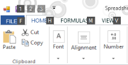
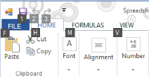

# How to set the SuperAccelerator Alignment?

You can set the accelerator position of the SuperAccelerator by using its Alignment property.

### Alignment settings

You can align the position of SuperAccelerator according to your requirement by using its following properties.

<table>
<tr>
<th>
SuperAccelerator Property</th><th>
Description</th></tr>
<tr>
<td>
Alignment</td><td>
Determines the alignment of the SuperAccelerator. The options include are given below* Default* TopCenter* TopLeft* TopRight* MiddleLeft* MiddleCenter* MiddleRight* BottomLeft* BottomCenter* BottomRight</td></tr>
</table>

This support enables SuperAccelerator to be displayed based on your requirement.

## Default

It allows to set the SuperAccelerator alignment on default position of the control.

## Top Left

To display SuperAccelerator at the TopLeft position of Ribbon items.

## Top Center

It enables to set the SuperAccelerator alignment on TopCenter of the control.

## Top Right

It enables to set the SuperAccelerator alignment on TopRight of the control.

## Middle Left

It enables to set the SuperAccelerator alignment on MiddleLeft of the control.

## Middle Center

It enables to set the SuperAccelerator alignment on MiddleCenter of the control

## Middle Right

It enables to set the SuperAccelerator alignment on MiddleRight of the control

## Bottom Left

It enables to set the SuperAccelerator alignment on BottomLeft of the control

## Bottom Center

It enables to set the SuperAccelerator alignment on BottomCenter of the control

## Bottom Right 

It enables to set the SuperAccelerator alignment on BottomRight of the control

The following code example illustrates how to set the alignment property for SuperAccelerator.



//Set the default SuperAccelerator alignment

this.superAccelerator1.Alignment = Syncfusion.Windows.Forms.Tools.AcceleratorAlignment.Default;

//Set the SuperAccelerator alignment on Topleft of the control

this.superAccelerator1.Alignment = Syncfusion.Windows.Forms.Tools.AcceleratorAlignment.TopLeft;

//Set the SuperAccelerator alignment on TopCenter of the control

this.superAccelerator1.Alignment = Syncfusion.Windows.Forms.Tools.AcceleratorAlignment.TopCenter;

//Set the SuperAccelerator alignment on TopRight of the control

this.superAccelerator1.Alignment = Syncfusion.Windows.Forms.Tools.AcceleratorAlignment.TopRight;

//Set the SuperAccelerator alignment on MiddleLeft of the control

this.superAccelerator1.Alignment = Syncfusion.Windows.Forms.Tools.AcceleratorAlignment.MiddleLeft;

//Set the SuperAccelerator alignment on MiddleCenter of the control

this.superAccelerator1.Alignment = Syncfusion.Windows.Forms.Tools.AcceleratorAlignment.MiddleCenter;

//Set the SuperAccelerator alignment on MiddleRight of the control

this.superAccelerator1.Alignment = Syncfusion.Windows.Forms.Tools.AcceleratorAlignment.MiddleRight;

//Set the SuperAccelerator alignment on BottomLeft of the control

this.superAccelerator1.Alignment = Syncfusion.Windows.Forms.Tools.AcceleratorAlignment.BottomLeft;

//Set the SuperAccelerator alignment on BottomCenter of the control

this.superAccelerator1.Alignment = Syncfusion.Windows.Forms.Tools.AcceleratorAlignment.BottomCenter;

//Set the SuperAccelerator alignment on BottomRight of the control

this.superAccelerator1.Alignment = Syncfusion.Windows.Forms.Tools.AcceleratorAlignment.BottomRight;





'Set the default SuperAccelerator alignment

Me.superAccelerator1.Alignment = Syncfusion.Windows.Forms.Tools.AcceleratorAlignment.Default
'Set the SuperAccelerator alignment on Topleft of the control

Me.superAccelerator1.Alignment = Syncfusion.Windows.Forms.Tools.AcceleratorAlignment.TopLeft

'Set the SuperAccelerator alignment on TopCenter of the control
Me.superAccelerator1.Alignment = Syncfusion.Windows.Forms.Tools.AcceleratorAlignment.TopCenter

'Set the SuperAccelerator alignment on TopRight of the control
Me.superAccelerator1.Alignment = Syncfusion.Windows.Forms.Tools.AcceleratorAlignment.TopRight

'Set the SuperAccelerator alignment on MiddleLeft of the control

Me.superAccelerator1.Alignment = Syncfusion.Windows.Forms.Tools.AcceleratorAlignment.MiddleLeft

'Set the SuperAccelerator alignment on MiddleCenter of the control

Me.superAccelerator1.Alignment = Syncfusion.Windows.Forms.Tools.AcceleratorAlignment.MiddleCenter

'Set the SuperAccelerator alignment on MiddleRight of the control
Me.superAccelerator1.Alignment = Syncfusion.Windows.Forms.Tools.AcceleratorAlignment.MiddleRight

'Set the SuperAccelerator alignment on BottomLeft of the control
Me.superAccelerator1.Alignment = Syncfusion.Windows.Forms.Tools.AcceleratorAlignment.BottomLeft

'Set the SuperAccelerator alignment on BottomCenter of the control
Me.superAccelerator1.Alignment = Syncfusion.Windows.Forms.Tools.AcceleratorAlignment.BottomCenter

'Set the SuperAccelerator alignment on BottomRight of the control
Me.superAccelerator1.Alignment = Syncfusion.Windows.Forms.Tools.AcceleratorAlignment.BottomRight

