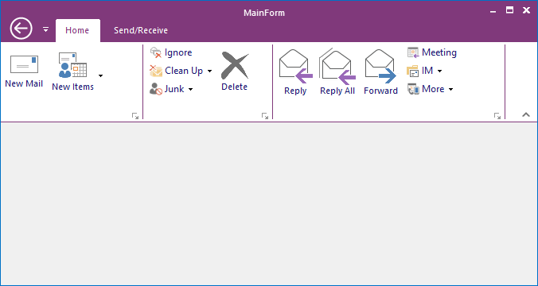
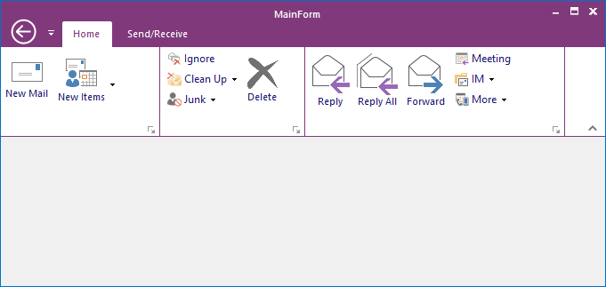

# How to adjust the height of the ToolStripEx splitter?

The ToolStripEx splitter height can be changed using function named ApplyTouchStyleColorTable and the following code example illustrates the same.

N> This has been applicable only for TouchStyle in RibbonControlAdv



//Specifies the ToolStripEx border which fits the Ribbon Panel

this.ribbonControlAdv1.ApplyTouchStyleColorTable(touch, ToolStripExSplitterStyle.Advanced);

//Specifies the default ToolStripEx border like in outlook 

this.ribbonControlAdv1.ApplyTouchStyleColorTable(touch, ToolStripExSplitterStyle.Default);





'Specifies the ToolStripEx border which fits the Ribbon Panel

Me.ribbonControlAdv1.ApplyTouchStyleColorTable(touch, ToolStripExSplitterStyle.Advanced)

'Specifies the default ToolStripEx border like in outlook 

Me.ribbonControlAdv1.ApplyTouchStyleColorTable(touch, ToolStripExSplitterStyle.Default)



* Default

* Advanced

