# Getting Started

This section explains how to implement a similar UI as Microsoft Outlook using Ribbon.

## Add RibbonControlAdv

To create a control using Visual Studio:

* Drag and drop the Ribbon control from toolbox to designer. It will generate the Ribbon as shown below:

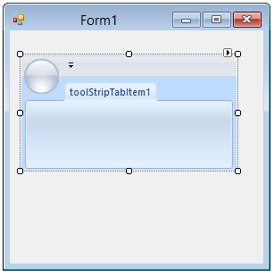

* Most commonly used settings of the **RibbonControlAdv** are configured either through Designer using the **Smart** **tag** or through the Properties window or through code.

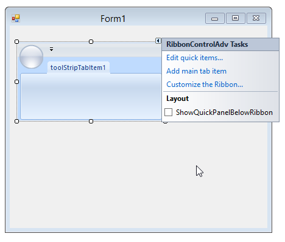

## Configuring Ribbon

### Ribbon Form

EssentialStudio now gives a similar look and feel of Microsoft Office, to its Office controls, using RibbonControlAdv. This section will guide you in creating a Ribbon form using RibbonControlAdv. 

**Creating** **Ribbon** **Form**

Drag and drop the RibbonControlAdv on to the form.

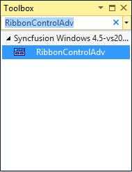

The forms in the application by default will extend to the Form class. Add the respective namespace and programmatically change it as RibbonForm class.





using Syncfusion.Windows.Forms.Tools;

public partial class Form1 : RibbonForm 





Imports Syncfusion.Windows.Forms.Tools

Partial Public Class Form1

Inherits RibbonForm





N> RibbonForm is specifically implemented to hold the RibbonControlAdv over it. So, it cannot be used separately without RibbonControlAdv. Use of standard Form as parent may cause inappropriate view to the BackStage. 

## Set Visual Styles

RibbonControlAdv appearance can be enhanced by using the Style property of the Ribbon Control.

The following styles are supported by the Ribbon control.

* Office2007
* Office2010
* Office2013
* TouchStyle

The following code example illustrates how to set style for the RibbonControlAdv.





this.ribbonControlAdv1.RibbonStyle = RibbonStyle.Office2013;





Me.RibbonControlAdv1.RibbonStyle =RibbonStyle.Office2013





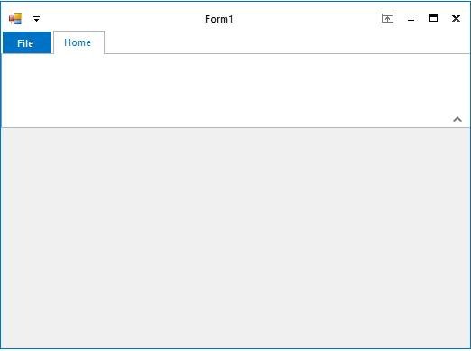

## Add ToolStripTabItem

RibbonControlAdv lets you to create ToolStripTabItems easily using the smart tag. It also adds a RibbonPanel to which ToolStripItems can be added.

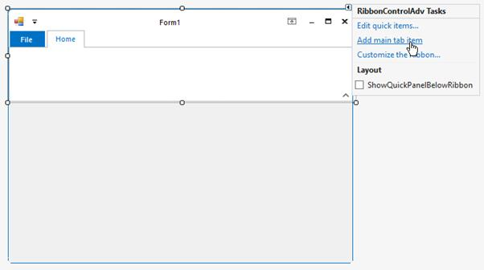

A new TabItem can be added to the RibbonControlAdv programmatically using the **AddMainItem** method. Create a ToolStripTabItem and then add it to the RibbonControlAdv using the below method.





// Adding a new Tab Item

private Syncfusion.Windows.Forms.Tools.ToolStripTabItem toolStripTabItem1;

//Declare and initialize a ToolStripTabItem

this.toolStripTabItem1 = new Syncfusion.Windows.Forms.Tools.ToolStripTabItem();

//Add the tab item to the RibbonControlAdv

this.ribbonControlAdv1.Header.AddMainItem(this.toolStripTabItem1);





'Adding a new Tab Item

Private toolStripTabItem1 As Syncfusion.Windows.Forms.Tools.ToolStripTabItem

'Declare and initialize a ToolStripTabItem

Me.toolStripTabItem1 = New Syncfusion.Windows.Forms.Tools.ToolStripTabItem
 
'Add the tab item to the RibbonControlAdv

Me.ribbonControlAdv1.Header.AddMainItem(Me.toolStripTabItem1)





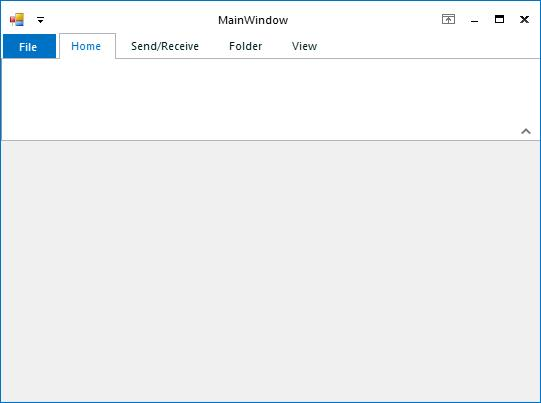

## Add ToolStripEx

A ribbon panel is automatically added when you add a ToolStripTabItem. ToolStripEx can be added to the Ribbon panel using its smart tag or using "Add ToolStrip" verb in the property grid.

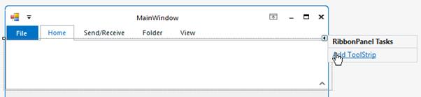

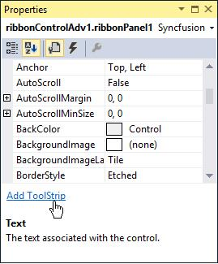

The ToolStrip family of controls provides common interfaces for producing user interface elements for Windows Forms. Essential Tools has come up with ToolStripEx which, exhibits advanced features.

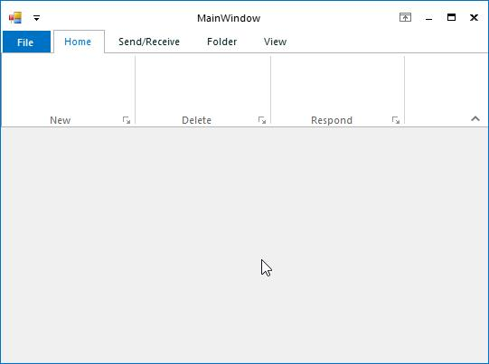

N> It is also possible to add ToolStripEx directly from the toolbox as it is also an individual control.

### Adding Controls to ToolStripEx

To add controls to the ToolStripEx, click the icon in it, as in the image below.

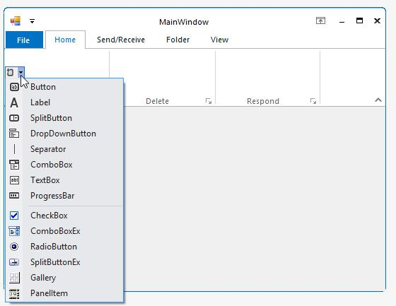

You can also add the items through Items Collection Editor using the Edit Items verb in the properties grid or in the context menu of the control at design time or using Items Property.

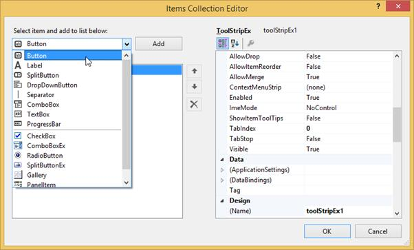

The ToolStripEx allows you to add standard ToolStripItems and other user interface elements such as labels, split button, dropdown button, separator, combobox, textbox, progressbar and PanelItem.

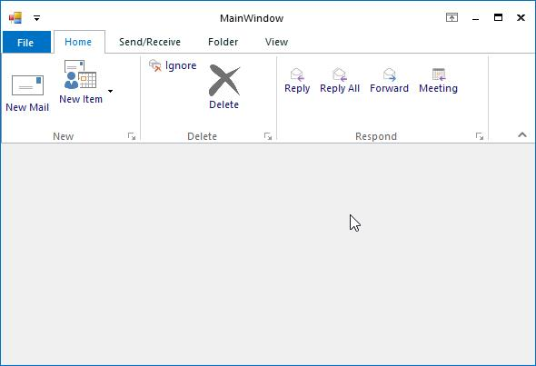

### Adding Standard Items

ToolStripEx comes with standard tool strip items that can be added to the control through "Insert Standard Items" option in the smart tag. You can even add the items through context menu at design time.

We can insert the standard items through the following ways.

1) Inserting Standard Items Through Context Menu

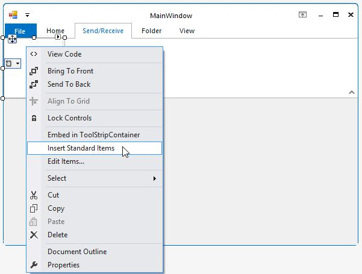

2) Inserting Standard Items through Smart Tag.

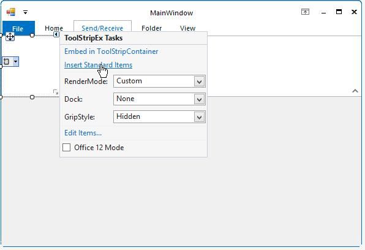

ToolStripEx with Standard items

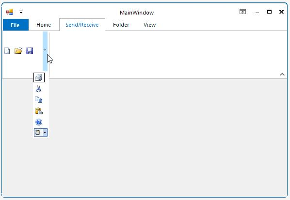

### Add Panel Item

ToolStripPanelItem provides support for aligning the controls in multiple lines. It supports nesting of panels without any limitation on the level of nesting. Not only controls but, any number of panels can be added to a panel.

Using the **RowCount** property of ToolStripPanelItem, controls can be arranged in any number of rows inside a ToolStripPanelItem.

**Adding** **Controls** **to** **Panel** **Item**

Accessing ToolStripPanelItem.Items property, Items Collection Editor dialog pops-up. The item can be added and customized using this dialog.

A simple code snippet which adds ToolStripItems in PanelItem.





this.toolStripPanelItem1.Items.AddRange(new System.Windows.Forms.ToolStripItem[] {
	
this.toolStripButton1,

this.toolStripDropDownButton1,

this.toolStripDropDownButton2});

this.toolStripPanelItem1.RowCount = 1;





Dim System.Windows.Forms.ToolStripItem() As Me.toolStripPanelItem1.Items.AddRange(New{
	
Me. toolStripButton1,

Me.toolStripDropDownButton1,

Me.toolStripDropDownButton2})

Me.toolStripPanelItem1.RowCount = 1





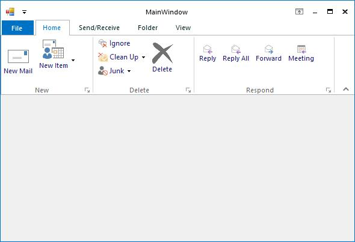

### Add Gallery Items

Essential Tools RibbonControlAdv provides options to add a collection of items and store them into a gallery. A gallery can be added to a ToolStripTabItem using Items Collection Editor. Select the Gallery item in the dropdown and add it to the control.

Using the **Gallery Item** property, Items Collection Editor opens, which lets you add items to the gallery.





this.toolStripGallery1.Items.Add(toolStripGalleryItem1);

this.toolStripGallery1.Items.Add(toolStripGalleryItem2);

this.toolStripGallery1.Items.Add(toolStripGalleryItem3);





Me.toolStripGallery1.Items.Add(toolStripGalleryItem1)

Me.toolStripGallery1.Items.Add(toolStripGalleryItem2)

Me.toolStripGallery1.Items.Add(toolStripGalleryItem3)





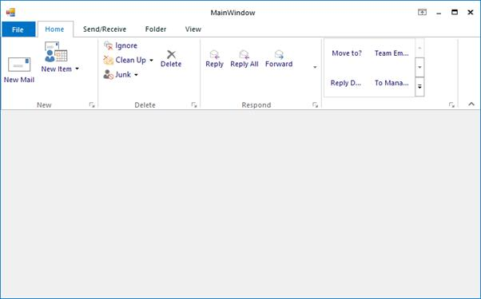

### Add Quick Access Toolbar

The quick access toolbar provides easy access to the controls that are used in the Office 2007 controls. The visibility of this toolbar can be controlled using **QuickPanelVisible** property. 





this.ribbonControlAdv1.QuickPanelVisible = true;





Me.ribbonControlAdv1.QuickPanelVisible = True





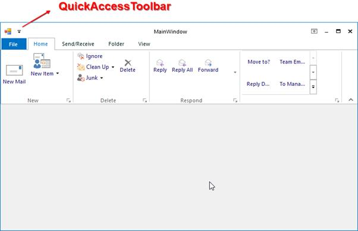

####  Add Items to the Quick Access ToolBar

Items / controls can be added to the QuickAccessToolbar by clicking on the Edit quick items Button link in the smart tag of the RibbonControlAdv control. This opens Customize Quick Access Tool bar Dialog which displays the existing tool strip items. You can add the required items to the Quick Access Toolbar. 

The dialog comes with Office2007 look and feel.

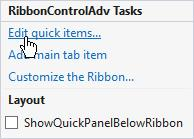

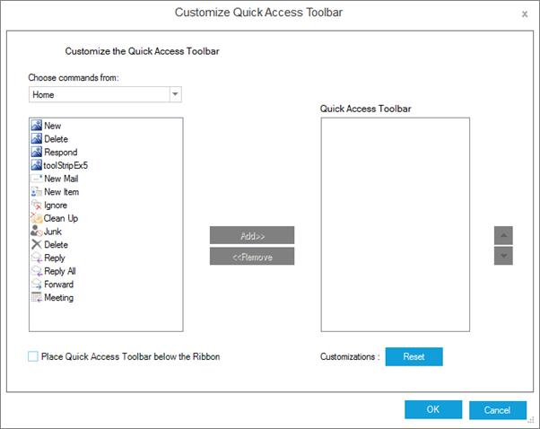

N> You can also add items to the Quick Access Toolbar by enabling the UseInQuickAccessMenu On RibbonControl1 extended property for any control in the designer.

A sample code snippet which adds a ToolStripButton named "File" to the QuickAccessToolbar through code. 





// Declare and initialize the ToolStripButton.

private System.Windows.Forms.ToolStripButton toolStripButton1;

this.toolStripButton1 = new System.Windows.Forms.ToolStripButton();

// Set the text and DisplayStyle property.

this.toolStripButton1.Text = "File";

this.toolStripButton1.DisplayStyle = System.Windows.Forms.ToolStripItemDisplayStyle.Text;

// Add the ToolStripButton in the header of the RibbonControlAdv.

this.ribbonControlAdv1.Header.AddQuickItem(this.toolStripButton1);





' Declare and initialize the ToolStripButton.

Private toolStripButton1 As System.Windows.Forms.ToolStripButton

Me.toolStripButton1 = New System.Windows.Forms.ToolStripButton()

' Set the text and DisplayStyle property.

Me.toolStripButton1.Text = "ReplyAll"

Me.toolStripButton1.DisplayStyle = System.Windows.Forms.ToolStripItemDisplayStyle.Text

' Add the ToolStripButton in the header of the RibbonControlAdv.

Me.ribbonControlAdv1.Header.AddQuickItem (Me.toolStripButton1)





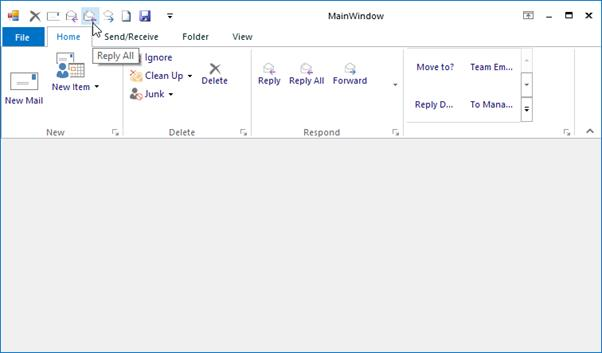

## Add BackStage

Ribbon enables you to work in the document and Backstage enables you to work with the document. Using this you can alter contents and provide end-user options that are related to specific solution requirements.

N> Backstage view can not be accessed when Ribbon style is set to Office2007.

The following are steps to create a BackStageView:

1) Drag and drop the **BackStageView** from the **Toolbox**.

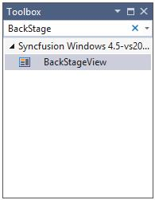

2) In the Property grid, click the ShowBackstage.

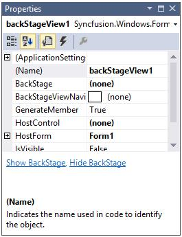

3) Set BackStageView to RibbonControlAdv

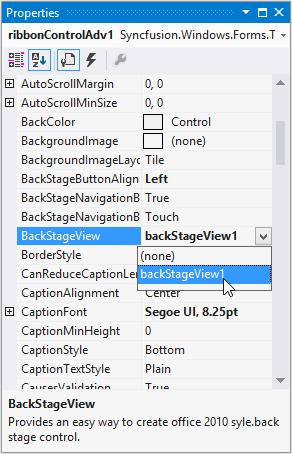

4) An Empty BackStage will be created. By clicking the File menu button, BackStage will be shown.

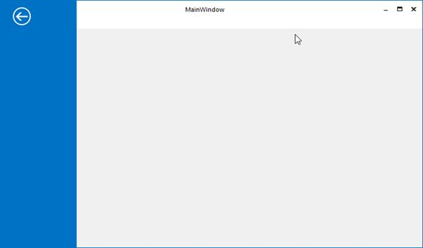

### Add Backstage Button

BackStage Button can be added in two ways.

1) Through property grid.

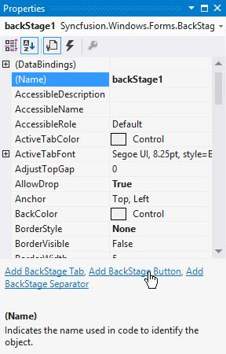

2) Through Smart tag

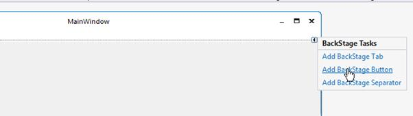

BackStage Buttons can be added programmatically, by using the following code snippet.





Syncfusion.Windows.Forms.BackStageButton backStageButton1= new Syncfusion.Windows.Forms.BackStageButton();

this.backStageButton1.Text = "Save";

this.backStage1.Controls.Add(this.backStageButton1);

Syncfusion.Windows.Forms.BackStageButton backStageButton2= new Syncfusion.Windows.Forms.BackStageButton();

this.backStageButton2.Text = "Save Attachments";

this.backStage1.Controls.Add(this.backStageButton2);

Syncfusion.Windows.Forms.BackStageButton backStageButton3= new Syncfusion.Windows.Forms.BackStageButton();

this.backStageButton3.Text = "Options";

this.backStage1.Controls.Add(this.backStageButton3);

Syncfusion.Windows.Forms.BackStageButton backStageButton4= new Syncfusion.Windows.Forms.BackStageButton();

this.backStageButton4.Text = "Exit";

this.backStage1.Controls.Add(this.backStageButton4);





Public BackStageButton1 As Syncfusion.Windows.Forms.BackStageButton

Me.BackStageButton1 = New Syncfusion.Windows.Forms.BackStageButton()

Me.BackStageButton1.Text = "Save"

Me.BackStage1.Controls.Add(Me.BackStageButton1)

Public BackStageButton2 As Syncfusion.Windows.Forms.BackStageButton

Me.BackStageButton2 = New Syncfusion.Windows.Forms.BackStageButton()

Me.BackStageButton2.Text = "Save Attachments"

Me.BackStage1.Controls.Add(Me.BackStageButton2)

Public BackStageButton3 As Syncfusion.Windows.Forms.BackStageButton

Me.BackStageButton3 = New Syncfusion.Windows.Forms.BackStageButton()

Me.BackStageButton3.Text = "Options"

Me.BackStage1.Controls.Add(Me.BackStageButton3)

Public BackStageButton4 As Syncfusion.Windows.Forms.BackStageButton

Me.BackStageButton4 = New Syncfusion.Windows.Forms.BackStageButton()

Me.BackStageButton5.Text = "Exit"

Me.BackStage1.Controls.Add(Me.BackStageButton4)





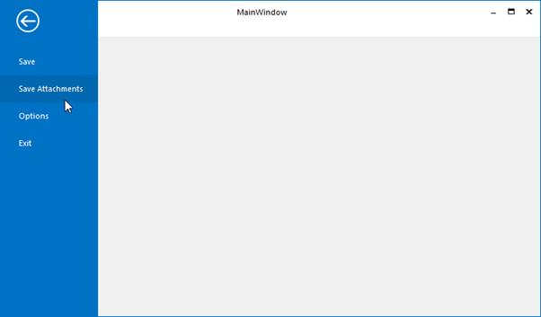

### Add BackStage Tab

BackStage Tab can be added through Property grid and Smart tag as explained for BackStageButton and it can be added programmatically by using following code snippet.





Syncfusion.Windows.Forms.BackStageTab backStageTab1 new Syncfusion.Windows.Forms.BackStageTab();

this.backStageTab1.Text = "Info";

this.backStage1.Controls.Add(this.backStageTab1);

Syncfusion.Windows.Forms.BackStageTab backStageTab2 new Syncfusion.Windows.Forms.BackStageTab();

this.backStageTab1.Text = "Open";

this.backStage1.Controls.Add(this.backStageTab2);

Syncfusion.Windows.Forms.BackStageTab backStageTab3 new Syncfusion.Windows.Forms.BackStageTab();

this.backStageTab1.Text = "Print";

this.backStage1.Controls.Add(this.backStageTab3);

Syncfusion.Windows.Forms.BackStageTab backStageTab4 new Syncfusion.Windows.Forms.BackStageTab();

this.backStageTab1.Text = "Office Accounts";

this.backStage1.Controls.Add(this.backStageTab4);





Private BackStageTab1 As Syncfusion.Windows.Forms.BackStageTab

Me.BackStageTab1 = New Syncfusion.Windows.Forms.BackStageTab()

Me.BackStageTab1.Text = "Info" 

Me.BackStage1.Controls.Add(Me.BackStageTab1)

Private BackStageTab2 As Syncfusion.Windows.Forms.BackStageTab

Me.BackStageTab2 = New Syncfusion.Windows.Forms.BackStageTab() Me.BackStageTab2.Text = "Open" 

Me.BackStage1.Controls.Add(Me.BackStageTab2)

Private BackStageTab3 As Syncfusion.Windows.Forms.BackStageTab

Me.BackStageTab3 = New Syncfusion.Windows.Forms.BackStageTab() Me.BackStageTab3.Text = "Print" 

Me.BackStage1.Controls.Add(Me.BackStageTab3)

Private BackStageTab4 As Syncfusion.Windows.Forms.BackStageTab

Me.BackStageTab4 = New Syncfusion.Windows.Forms.BackStageTab()

Me.BackStageTab4.Text = " Office Account " 

Me.BackStage1.Controls.Add(Me.BackStageTab4)





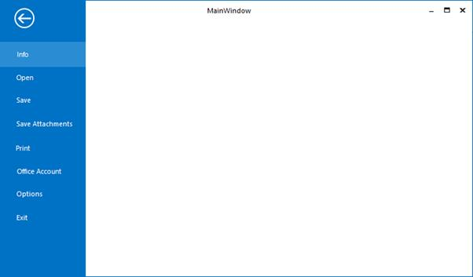

### Add Separators 

BackStage Separators can be added through Property grid and Smart tag as explained for BackStageButton and it can be added programmatically by using following code snippet.





private Syncfusion.Windows.Forms.BackStageSeparator backStageSeparator1;

this.backStageSeparator1 = new Syncfusion.Windows.Forms.BackStageSeparator();

this.backStage1.Controls.Add(this.backStageSeparator1);





Private BackStageSeparator1 As Syncfusion.Windows.Forms.BackStageSeparator

Me.BackStageSeparator1 = New Syncfusion.Windows.Forms.BackStageSeparator ()

Me.BackStage1.Controls.Add(Me.BackStageTab4)





## Office Menu Button

The RibbonControlAdv has the office menu button at the top left corner of the form. Controls can be added to the panels of the office menu button dropdown through designer without a single piece of code.

### MenuButton Drop Down

When the OfficeMenuButton is clicked, ToolStripDropDown is displayed. This dropdown can be customized through designer as well as through code. 

**Through** **Designer** **Using** **Menu** **Panels**

RibbonControlAdv lets you add customized ToolStrip items in the OfficeMenu button dropdown with the help of the menu panels. 

The panels are:

* Aux Panel
* Main Panel
* System Panel

**Adding** **ToolStrip** **Items** **to** **the** **Panels**

Each Panel has Items property which invokes the Items Collection Editor. Using this editor you can add the tool strip items easily.

<table>
<tr>
<th>
Property  </th><th>
Description  </th></tr>
<tr>
<td>
Items  </td><td>
Lets you open Items Collection Editor using which you can add items to the panel.  </td></tr>
</table>

### Adding Items to the Dropdown

The ToolStrip Items which can be added to the Menu Panels, using the Panel's Items Collection Editor dialog are as follows.

* Button – Adds button to the panel.
* Label – Adds label to the panel.
* SplitButton – Adds a button with a split appearance.
* DropDownButton – Adds drop down button.
* Separator – Adds a line separator in the panel.
* ComboBox – Adds a combo box.
* Textbox – Adds a textbox.
* ProgressBar – Adds a progress bar to the panel.
* CheckBox – Added a checkbox.
* RadioButton – Adds a radio button.
* OfficeButton – Adds an office button.
* OfficeDropDownButton – Adds a office dropdown button.
* OfficeSplitButton – Adds a Office split button.
* SplitButtonEx – Adds SplitButtonEx control item.
* PanelItem - Adds panel items.
* Gallery – Add Gallery item.

**Programmatically** **Adding** **a** **ToolStripDropDown**

ToolStripDropDown can be added programmatically using **ToolStripDropDown** class and then assigning it to the **RibbonControlAdv**. **MenuDropDownButton** property as follows.

Property Table

<table>
<tr>
<th>
Property  </th><th>
Description  </th></tr>
<tr>
<td>
MenuButtonDropDown  </td><td>
Gets / Sets ToolStripDropDown to be displayed, when the OfficeMenuButton is clicked.  </td></tr>
</table>





// Initialize a ToolStripDropDown button.

ToolStripDropDown dropDown = new ToolStripDropDown();

//Initialize the controls that are to be added in the panel.

ToolStripButton newBtn = new ToolStripButton("&New");

ToolStripButton openBtn = new ToolStripButton("&Open");

ToolStripButton saveBtn = new ToolStripButton("&Save");

ToolStripButton closeBtn = new ToolStripButton("&Close");

// Initialize a new panel (Panel 1)

ToolStripPanelItem panel1 = new ToolStripPanelItem();

panel1.Items.Add(newBtn);

panel1.Items.Add(openBtn);

panel1.Items.Add(saveBtn);

panel1.Items.Add(closeBtn);

// Set the row count.

panel1.RowCount = 9;

//Settings for the buttons

foreach (ToolStripButton btn in panel1.Items)

{

btn.AutoSize = false;

btn.Size = new Size(170, 35);

btn.ImageAlign = ContentAlignment.MiddleLeft;

btn.TextAlign = ContentAlignment.MiddleLeft;

btn.ImageScaling = ToolStripItemImageScaling.None;

}

// Add the panel into the items of the ToolStripDropDown.

dropDown.Items.Add(panel1);

// Set the MenuButtonDropDown property of the RibbonControlAdv.

this.ribbonControlAdv1.MenuButtonDropDown = dropDown;





' Initialize a ToolStripDropDown button. 

Dim dropDown As New ToolStripDropDown()

'Initialize the controls that are to be added in the panel. 

Dim newBtn As New ToolStripButton("&New")

Dim openBtn As New ToolStripButton("&Open")

Dim saveBtn As New ToolStripButton("&Save")

Dim closeBtn As New ToolStripButton("&Close")

' Initialize a new panel (Panel 1) 

Dim panel1 As New ToolStripPanelItem()

panel1.Items.Add(newBtn) 

panel1.Items.Add(openBtn) 

panel1.Items.Add(saveBtn) 

panel1.Items.Add(closeBtn) 

' Set the row count. 

panel1.RowCount = 9 

'Settings for the buttons 

For Each btn As ToolStripButton In panel1.Items 

btn.AutoSize = False 

btn.Size = New Size(170, 35) 

btn.ImageAlign = ContentAlignment.MiddleLeft 

btn.TextAlign = ContentAlignment.MiddleLeft 

btn.ImageScaling = ToolStripItemImageScaling.None 

Next 

' Add the panel into the items of the ToolStripDropDown. 

dropDown.Items.Add(panel1) 

' Set the MenuButtonDropDown property of the RibbonControlAdv. 

Me.ribbonControlAdv1.MenuButtonDropDown = dropDown





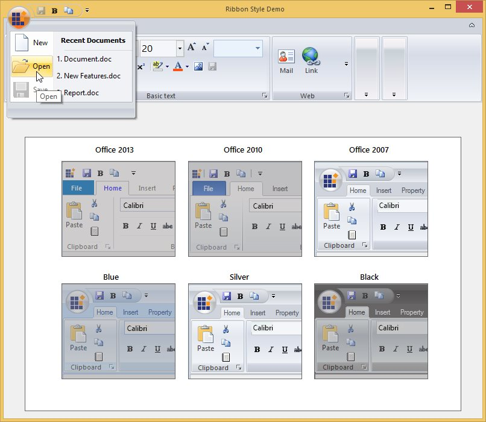

**Adding** **ContextMenuStripEx** **as** **OfficeMenuDropDown**

You can also display a ContextMenuStrip in the OfficeMenu button dropdown. This can be done by assigning a custom ContextMenuStrip to the RibbonControlAdv.MenuButtonDropDown property.





this.ribbonControlAdv1.MenuButtonDropDown = this.contextMenuStripEx1;





Me.ribbonControlAdv1.MenuButtonDropDown = Me.contextMenuStripEx1





