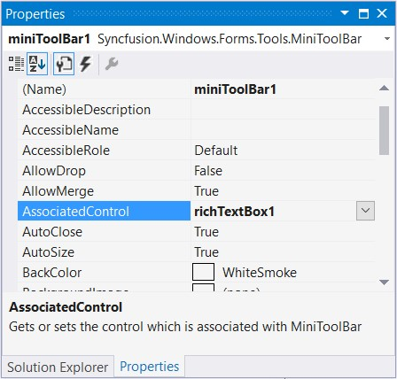

# Mini ToolBar

Essential Tools comes with MiniToolBar control with similar look and feel of Microsoft Office 2007. It appears when the user selects and right clicks on the text. It gives options to customize the selected text. It will look blurred in the beginning, but once the mouse is focused on it, it will be prominent to the users.

## Adding MiniToolBar

Drag and drop a MiniToolBar from the toolbox.

## Assigning to the Control

Set the MiniToolBar’s AssociatedControl property to the control to which this is to be associated.





//Adds richTextBox1 as associated control to the mini tool bar
this.miniToolBar1.AssociatedControl = this.richTextBox1;





Me.miniToolBar1.AssociatedControl = Me.richTextBox1





## Adding Item through Designer

Open the Items Collection Editor of the MiniToolBar and add the required items into the MiniToolBar and click OK.

## Adding Item through Code

This section guides you with the steps to add a MiniToolbar and associating with a RichTextBox control programmatically.

*	Add the given namespaces.





using Syncfusion.Windows.Forms;  

using Syncfusion.Windows.Forms.Tools;





Imports Syncfusion.Windows.Forms

Imports Syncfusion.Windows.Forms.Tools





*	Declare and initialize the MiniToolBar control. Also declare the controls to be added to the MiniToolBar, and the control, in this case RichTextBow, to which MiniToolBar is to be associated.





//Create all the controls required for mini toolbar
private MiniToolBar miniToolBar1;
private ToolStripPanelItem minitoolbarPanelItem;
private ToolStripPanelItem minitoolbarPanelItem1;
private ToolStripButton increasefontButton;
private ToolStripButton decreasefontButton;
private ToolStripPanelItem minitoolbarPanelItem2;
private ToolStripButton boldButton;
private ToolStripButton italicButton;
private ToolStripButton underlineButton;
private ToolStripSplitButton highlightSplitButton;
private ToolStripSplitButton fontcolorSplitButton;
private ToolStripSplitButton bulletsSplitButton;
private ToolStripSplitButton numbersSplitButton;
private ToolStripComboBoxEx fontstyleComboBox;
private ToolStripComboBoxEx fontsizeComboBox;

this.miniToolBar1 = new Syncfusion.Windows.Forms.Tools.MiniToolBar();
this.minitoolbarPanelItem = new Syncfusion.Windows.Forms.Tools.ToolStripPanelItem();
this.minitoolbarPanelItem1 = new Syncfusion.Windows.Forms.Tools.ToolStripPanelItem();
this.fontstyleComboBox = new Syncfusion.Windows.Forms.Tools.ToolStripComboBoxEx();
this.fontsizeComboBox = new Syncfusion.Windows.Forms.Tools.ToolStripComboBoxEx();
this.increasefontButton = new System.Windows.Forms.ToolStripButton();
this.decreasefontButton = new System.Windows.Forms.ToolStripButton();
this.minitoolbarPanelItem2 = new Syncfusion.Windows.Forms.Tools.ToolStripPanelItem();
this.boldButton = new System.Windows.Forms.ToolStripButton();
this.italicButton = new System.Windows.Forms.ToolStripButton();
this.underlineButton = new System.Windows.Forms.ToolStripButton();
this.highlightSplitButton = new System.Windows.Forms.ToolStripSplitButton();
this.fontcolorSplitButton = new System.Windows.Forms.ToolStripSplitButton();
this.bulletsSplitButton = new System.Windows.Forms.ToolStripSplitButton();
this.numbersSplitButton = new System.Windows.Forms.ToolStripSplitButton();





    Private miniToolBar1 As MiniToolBar
    Private minitoolbarPanelItem As ToolStripPanelItem
    Private minitoolbarPanelItem1 As ToolStripPanelItem
    Private increasefontButton As ToolStripButton
    Private decreasefontButton As ToolStripButton
    Private minitoolbarPanelItem2 As ToolStripPanelItem
    Private boldButton As ToolStripButton
    Private italicButton As ToolStripButton
    Private underlineButton As ToolStripButton
    Private highlightSplitButton As ToolStripSplitButton
    Private fontcolorSplitButton As ToolStripSplitButton
    Private bulletsSplitButton As ToolStripSplitButton
    Private numbersSplitButton As ToolStripSplitButton
    Private fontstyleComboBox As ToolStripComboBoxEx
    Private fontsizeComboBox As ToolStripComboBoxEx

    Me.miniToolBar1 = New Syncfusion.Windows.Forms.Tools.MiniToolBar()
    Me.minitoolbarPanelItem = New Syncfusion.Windows.Forms.Tools.ToolStripPanelItem()
    Me.minitoolbarPanelItem1 = New Syncfusion.Windows.Forms.Tools.ToolStripPanelItem()
    Me.fontstyleComboBox = New Syncfusion.Windows.Forms.Tools.ToolStripComboBoxEx()
    Me.fontsizeComboBox = New Syncfusion.Windows.Forms.Tools.ToolStripComboBoxEx()
    Me.increasefontButton = New System.Windows.Forms.ToolStripButton()
    Me.decreasefontButton = New System.Windows.Forms.ToolStripButton()
    Me.minitoolbarPanelItem2 = New Syncfusion.Windows.Forms.Tools.ToolStripPanelItem()
    Me.boldButton = New System.Windows.Forms.ToolStripButton()
    Me.italicButton = New System.Windows.Forms.ToolStripButton()
    Me.underlineButton = New System.Windows.Forms.ToolStripButton()
    Me.highlightSplitButton = New System.Windows.Forms.ToolStripSplitButton()
    Me.fontcolorSplitButton = New System.Windows.Forms.ToolStripSplitButton()
    Me.bulletsSplitButton = New System.Windows.Forms.ToolStripSplitButton()
    Me.numbersSplitButton = New System.Windows.Forms.ToolStripSplitButton()





*	Add the required items into the MiniToolBar





this.minitoolbarPanelItem2.Items.AddRange(new System.Windows.Forms.ToolStripItem[] {
this.boldButton,
this.italicButton,
this.underlineButton,
this.highlightSplitButton,
this.fontcolorSplitButton,
this.bulletsSplitButton,
this.numbersSplitButton});

this.minitoolbarPanelItem1.Items.AddRange(new System.Windows.Forms.ToolStripItem[] {
this.fontstyleComboBox,
this.fontsizeComboBox,
this.increasefontButton,
this.decreasefontButton});

this.minitoolbarPanelItem.Items.AddRange(new System.Windows.Forms.ToolStripItem[] {
this.minitoolbarPanelItem1,
this.minitoolbarPanelItem2});

this.miniToolBar1.Items.AddRange(new System.Windows.Forms.ToolStripItem[] {
this.minitoolbarPanelItem});





Me.minitoolbarPanelItem2.Items.AddRange(New System.Windows.Forms.ToolStripItem() {Me.boldButton, Me.italicButton, Me.underlineButton, Me.highlightSplitButton, Me.fontcolorSplitButton, Me.bulletsSplitButton, Me.numbersSplitButton})
Me.minitoolbarPanelItem1.Items.AddRange(New System.Windows.Forms.ToolStripItem() {Me.fontstyleComboBox, Me.fontsizeComboBox, Me.increasefontButton, Me.decreasefontButton})
Me.minitoolbarPanelItem.Items.AddRange(New System.Windows.Forms.ToolStripItem() {Me.minitoolbarPanelItem1, Me.minitoolbarPanelItem2})
Me.miniToolBar1.Items.AddRange(New System.Windows.Forms.ToolStripItem() {Me.minitoolbarPanelItem})





*	Set the MiniToolBar’s AssociatedControl property to the RichTextBox to which this is to be associated.





//Associates the MiniToolBar with the RichTextBox
this.miniToolBar1.AssociatedControl = this.richTextBox1;





Me.miniToolBar1.AssociatedControl = Me.richTextBox1





## Visual Style

MiniToolbar supports visual style such as Office2016White, Office2016Black, Office2016DarkGray, Office2016Colorful, Default and Metro.

This style can be set using `Style` property





this.miniToolBar1.Style = ToolStripExStyle.Office2016Colorful;





Me.miniToolBar1.Style = ToolStripExStyle.Office2016Colorful





## Color Scheme

MiniToolbar supports all the three ColorSchemes of Office2007, which can be set using the `ColorScheme` property.





this.miniToolBar1.ColorScheme = ToolStripEx.ColorScheme.Blue;





Me.miniToolBar1.ColorScheme = ToolStripEx.ColorScheme.Blue





## MiniToolBar Events

This section discusses about various events that can be handled for the MiniToolBar control. Following are the events covered.

### ItemAdded Event

This event is handled when a ToolStripItem has been added to the ToolStrip's Item collection.

**Event** **Data**

The ToolStripItemEventHandler receives an argument of type ToolStripItemEventArgs containing data related to this event. The following type ToolStripItemEventArgs member provide information specific to this event.

<table>
<tr>
<th>
Property  </th><th>
Description  </th></tr>
<tr>
<td>
Item  </td><td>
Gets a System.Windows.Forms.ToolStripItem for which to handle events.  </td></tr>
</table>




this.miniToolBar1.ItemAdded += MiniToolBar1_ItemAdded;

private void MiniToolBar1_ItemAdded(object sender, ToolStripItemEventArgs e)

{
// You can see the below line in output window during runtime.

Console.WriteLine("ItemAdded event is raised");

//Display the ToolStripItem

Console.WriteLine("ToolStrip Item Name : " + e.Item.ToString());
}





Default Private Property Item(ByVal  As miniToolBar1.ItemAdded, ByVal  As MiniToolBar1_ItemAdded) As

 Private Sub MiniToolBar1_ItemAdded(ByVal sender As Object, ByVal e As ToolStripItemEventArgs)

    Console.WriteLine("ItemAdded event is raised")
    Console.WriteLine("ToolStrip Item Name : " & e.Item.ToString())

End Sub





### ItemClicked Event

This event is handled when a ToolStripItem has been added to the ToolStrip's Item collection.

**Event** **Data**

The ToolStripItemClickedEventHandler receives an argument of type ToolStripItemEventArgs containing data related to this event. The following type ToolStripItemEventArgs member provide information specific to this event.

<table>
<tr>
<th>
Property  </th><th>
Description  </th></tr>

<tr>
<td>
ClickedItem  </td><td>
Gets the item that is clicked on System.Windows.Forms.ToolStrip.  </td></tr>
</table>




this.miniToolBar1.ItemClicked += MiniToolBar1_ItemClicked;

private void MiniToolBar1_ItemClicked(object sender, ToolStripItemClickedEventArgs e)
{

Console.WriteLine("ItemClicked event is raised");

//Display the ToolStripItem that is clicked

Console.WriteLine("ToolStrip Item Name : " + e.ClickedItem.ToString());

}





Default Private Property Item(ByVal  As miniToolBar1.ItemClicked, ByVal  As MiniToolBar1_ItemClicked) As

 Private Sub MiniToolBar1_ItemClicked(ByVal sender As Object, ByVal e As ToolStripItemClickedEventArgs)

    Console.WriteLine("ItemClicked event is raised")
    Console.WriteLine("ToolStrip Item Name : " & e.ClickedItem.ToString())

End Sub





### ItemRemoved Event

This event is handled when a ToolStripItem has been removed from the ToolStrip's Item collection.

**Event** **Data**

The ToolStripItemEventHandler receives an argument of type ToolStripItemEventArgs containing data related to this event. The following ToolStripItemEventArgs member provide information specific to this event.

<table>
<tr>
<th>
Property  </th><th>
Description  </th></tr>
<tr>
<td>
Item  </td><td>
Gets a System.Windows.Forms.ToolStripItem for which to handle events.  </td></tr>
</table>




this.miniToolBar1.ItemRemoved += MiniToolBar1_ItemRemoved;

private void MiniToolBar1_ItemRemoved(object sender, ToolStripItemEventArgs e)

{
//Display the ToolStripItem

Console.WriteLine("ToolStrip Item Name : " + e.Item.ToString());
}





Default Private Property Item(ByVal  As miniToolBar1.ItemRemoved, ByVal  As MiniToolBar1_ItemRemoved) As

 Private Sub MiniToolBar1_ItemRemoved(ByVal sender As Object, ByVal e As ToolStripItemEventArgs)

    Console.WriteLine("ToolStrip Item Name : " & e.Item.ToString())

End Sub





### BeginDrag Event

This event is handled when the tool strip has started to move with a ToolStripPanel.





this.miniToolBar1.BeginDrag += MiniToolBar1_BeginDrag;

private void MiniToolBar1_BeginDrag(object sender, EventArgs e)
{
//You can see the below line in output window during runtime.

Console.Write("BeginDrag Event is raised");
}





Default Private Property Item(ByVal  As miniToolBar1.BeginDrag, ByVal  As MiniToolBar1_BeginDrag) As

Private Sub MiniToolBar1_BeginDrag(ByVal sender As Object, ByVal e As EventArgs)

Console.Write("BeginDrag Event is raised")

End Sub





### Opening Event

This event occurs when the drop down is opening.

**Event** **Data**

The CancelEventHandler receives an argument of type CancelEventArgs containing data related to this event. The following CancelEventArgs members provide information specific to this event.

<table>
<tr>
<th>
Property  </th><th>
Description  </th></tr>
<tr>
<td>
Cancel  </td><td>
Gets or Sets a value indicating whether the event should be canceled.  </td></tr>
</table>




this.miniToolBar1.Opening += MiniToolBar1_Opening;

private void MiniToolBar1_Opening(object sender, CancelEventArgs e)

{
//EventArgs can give the options to Allow or Cancel the event by this method.

//Cancel is the boolean property which can prevent docking event when it is true.
e.Cancel = true;
}





Default Private Property Item(ByVal  As miniToolBar1.Opening, ByVal  As MiniToolBar1_Opening) As

 Private Sub MiniToolBar1_Opening(ByVal sender As Object, ByVal e As CancelEventArgs)

    e.Cancel = True

End Sub





### Opened Event

This event occurs when the drop down has opened.





this.miniToolBar1.Opened += MiniToolBar1_Opened;

private void MiniToolBar1_Opened(object sender, EventArgs e)

{
// You can see the below line in output window during runtime.

Console.Write(" Opened Event is raised");
}





Default Private Property Item(ByVal  As miniToolBar1.Opened, ByVal  As MiniToolBar1_Opened) As

 Private Sub MiniToolBar1_Opened(ByVal sender As Object, ByVal e As EventArgs)

    Console.Write(" Opened Event is raised")
    
End Sub





