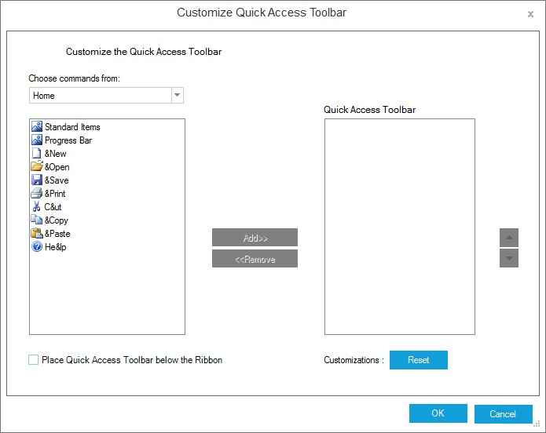
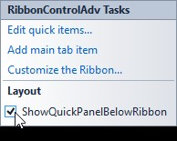
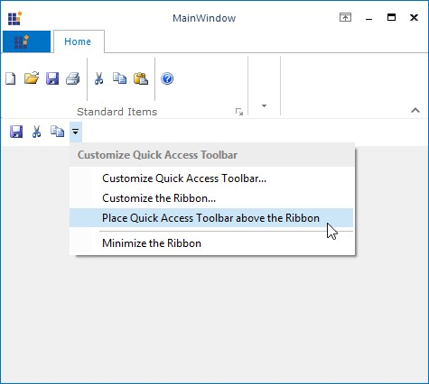

# Quick Access Toolbar

The quick access toolbar provides easy access to the controls that are used frequently. The visibility of this toolbar can be controlled using `QuickPanelVisible` property. 





this.ribbonControlAdv1.QuickPanelVisible = true;





Me.ribbonControlAdv1.QuickPanelVisible = True





## Adding Controls to QuickAccessToolbar

Items / controls can be added to the QuickAccessToolbar by clicking on the Edit quick items in the smart tag of the RibbonControlAdv. This opens Customize Quick Access Toolbar Dialog which displays the existing tool strip items. You can add the required items to the Quick Access Toolbar.

N> You can also add items to the Quick Access Toolbar by enabling the UseInQuickAccessMenu On RibbonControl1 extended property for any control in the designer.

N> Ribbon provides option to edit the items at run time also. See [RunTime Customization](/windowsforms/ribboncontroladv/ribbon-customization#adding-item-to-qat-using-customized-window)  for more details. 

The following code snippet allows us to add ToolStripButton to Quick Access Toolbar.





// Declare and initialize the ToolStripButton.

private System.Windows.Forms.ToolStripButton toolStripButton1;

this.toolStripButton1 = new System.Windows.Forms.ToolStripButton();

// Set the text and DisplayStyle property.

this.toolStripButton1.Text = "File";

this.toolStripButton1.DisplayStyle = System.Windows.Forms.ToolStripItemDisplayStyle.Text;

// Add the ToolStripButton in the header of the RibbonControlAdv.

this.ribbonControlAdv1.Header.AddQuickItem(this.toolStripButton1);





' Declare and initialize the ToolStripButton.

Private toolStripButton1 As System.Windows.Forms.ToolStripButton

Me.toolStripButton1 = New System.Windows.Forms.ToolStripButton()

' Set the text and DisplayStyle property.

Me.toolStripButton1.Text = "File"

Me.toolStripButton1.DisplayStyle = System.Windows.Forms.ToolStripItemDisplayStyle.Text

' Add the ToolStripButton in the header of the RibbonControlAdv.

Me.ribbonControlAdv1.Header.AddQuickItem (Me.toolStripButton1)





## Placing QAT

By default Quick panel is placed at the top of the control. QAT can be placed above or below the Ribbon both at Runtime and Design Time.

### Design Time

QAT can also be placed below the ribbon by enabling the `ShowQuickPanelBelowRibbon` property. This property can also be enabled by using the smart tag of Ribbon.





this.ribbonControlAdv1.QuickPanelVisible = true;

this.ribbonControlAdv1.ShowQuickPanelBelowRibbon = true;





Me.ribbonControlAdv1.QuickPanelVisible = True

Me.ribbonControlAdv1.ShowQuickPanelBelowRibbon = True





### Run Time 

We can also align the QAT, above or below the ribbon using the context menu of the RibbonControlAdv at run time.

## Localization

In the Quick Access Toolbar, the labels present in a customized Quick Access Toolbar and Customize the Ribbon dialog boxes can be localized to a user-defined language. These labels can be localized by using the appropriate localizer keywords. In the below code snippets the return value of the switch case is the localized text for the labels.

N> The following changes must be done within a localizer class used for the application which is inherited from the ILocalizationProvider.

Labels for Customized Quick Access Toolbar dialog box:





case ToolsResourceIdentifiers.CustomizeQuickAccessLabel:

return "Customize QuickAccess Label text";

case ToolsResourceIdentifiers.QuickAccessToolBarLabel:

return "QuickAccess ToolBar Label text";

case ToolsResourceIdentifiers.CustomizationLabel:

return "Customization Label text";





case ToolsResourceIdentifiers.CustomizeQuickAccessLabel:

return "Customize QuickAccess Label text"

case ToolsResourceIdentifiers.QuickAccessToolBarLabel:

return "QuickAccess ToolBar Label text"

case ToolsResourceIdentifiers.CustomizationLabel:

return "Customization Label text"





Labels for Customize the Ribbon dialog box: 





 class localization : ILocalizationProvider
    {
        public string GetLocalizedString(System.Globalization.CultureInfo culture, string stringname, object obj)
        {
            switch (stringname)
            {  

                case ToolsResourceIdentifiers.CustomizeRibbonDialogButtonAdd:
                    return "Customize Ribbon Dialog Add Button Text";

                case ToolsResourceIdentifiers.CustomizeRibbonDialogButtonRemove:
                    return "Customize Ribbon Dialog Remove Button Text ";

                case ToolsResourceIdentifiers.CustomizeRibbonDialogButtonCancel:
                    return "Customize Ribbon Dialog Cancel Button Text";

                case ToolsResourceIdentifiers.CustomizeRibbonDialogButtonOk:
                    return "Customize Ribbon Dialog OK Button Text";

                case ToolsResourceIdentifiers.CustomizeRibbonDialogButtonReset:
                    return "Customize Ribbon Dialog Reset Button Text";               

                case ToolsResourceIdentifiers.CustomizeRibbonDialogLable:
                    return "Customize Ribbon Dialog Lable Text";

                case ToolsResourceIdentifiers.CustomizeRibbonDialogChooseCommands:
                    return "Customize Ribbon Dialog Choose Commands Text ";
               

                default:
                    return string.Empty;

            }
        }
    }





Class localization Implements ILocalizationProvider

	Public Function GetLocalizedString(culture As System.Globalization.CultureInfo, stringname As String, obj As Object) As String

		Select Case stringname

			Case ToolsResourceIdentifiers.CustomizeRibbonDialogButtonAdd
				Return "Customize Ribbon Dialog Add Button Text"

			Case ToolsResourceIdentifiers.CustomizeRibbonDialogButtonRemove
				Return "Customize Ribbon Dialog Remove Button Text "

			Case ToolsResourceIdentifiers.CustomizeRibbonDialogButtonCancel
				Return "Customize Ribbon Dialog Cancel Button Text"

			Case ToolsResourceIdentifiers.CustomizeRibbonDialogButtonOk
				Return "Customize Ribbon Dialog OK Button Text"

			Case ToolsResourceIdentifiers.CustomizeRibbonDialogButtonReset
				Return "Customize Ribbon Dialog Reset Button Text"

			Case ToolsResourceIdentifiers.CustomizeRibbonDialogLable
				Return "Customize Ribbon Dialog Lable Text"

			Case ToolsResourceIdentifiers.CustomizeRibbonDialogChooseCommands
				Return "Customize Ribbon Dialog Choose Commands Text "
				
			Case Else
				Return String.Empty

		End Select
	End Function
End Class





## Events

### BeforeAddItem and BeforeRemoveItem Events

**BeforeAddItem** event is handled, just before the item gets added to the Quick Access Toolbar. **BeforeRemoveItem** event is handled, just before an item is removed from the Quick Access Toolbar.





private void QuickItems_BeforeAddItem(object sender, RibbonItemEventArgs e)

{

//Gets the item that is going to be added

MessageBox.Show(e.Item.Text.ToString() + " Item is Added");

}

private void QuickItems_BeforeRemoveItem(object sender, RibbonItemEventArgs e)

{

//Gets the item that is going to be Removed

MessageBox.Show(e.Item.Text.ToString() + " Item is Removed");

}





Private Sub QuickItems_BeforeAddItem(ByVal sender As Object, ByVal e As RibbonItemEventArgs)

'Gets the item that is going to be added 

MessageBox.Show(e.Item.Text.ToString() + " Item is Added")

End Sub

Private Sub QuickItems_BeforeRemoveItem(ByVal sender As Object, ByVal e As RibbonItemEventArgs)

'Gets the item that is going to be Removed 

MessageBox.Show(e.Item.Text.ToString() + " Item is Removed")

End Sub





### QuickItemAdded and QuickItemRemoved Events

When the QuickAccessToolBar items are added, RibbonControlAdv.Header.**QuickItemAdded** event will be handled. Similarly when the QuickAccessToolBar items are removed, RibbonControlAdv.Header.**QuickItemRemoved** event will be handled. 





this.ribbonControlAdv1.Header.QuickItemAdded += new ToolStripItemEventHandler(Header_QuickItemAdded);

this.ribbonControlAdv1.Header.QuickItemRemoved += new ToolStripItemEventHandler(Header_QuickItemRemoved); 

private void Header_QuickItemAdded(object sender, ToolStripItemEventArgs e)

{

MessageBox.Show(e.Item.Text);

}

private void Header_QuickItemRemoved(object sender, ToolStripItemEventArgs e)

{

MessageBox.Show(e.Item.Text);

}





AddHandler ribbonControlAdv1.Header.QuickItemAdded, AddressOf Header_QuickItemAdded 

AddHandler ribbonControlAdv1.Header.QuickItemRemoved, AddressOf Header_QuickItemRemoved 

Private Sub Header_QuickItemAdded(ByVal sender As Object, ByVal e As ToolStripItemEventArgs)

MessageBox.Show(e.Item.Text)

End Sub

Private Sub Header_QuickItemRemoved(ByVal sender As Object, ByVal e As ToolStripItemEventArgs)

MessageBox.Show(e.Item.Text)

End Sub





