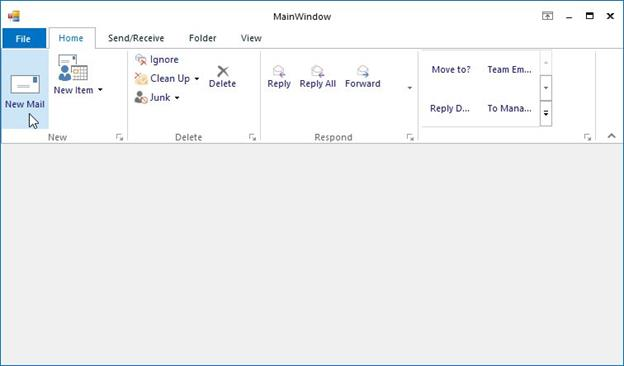

# Ribbon Button

ToolStripButton can be added to a ToolStripEx directly or through a panel. 

The below properties controls the appearance and behavior of the ToolStripButton.

## Foreground Settings

<table>
<tr>
<th>
Property</th><th>
Description</th></tr>
<tr>
<td>
Text</td><td>
Sets the Text for the ToolStripButton. This text will be displayed, only if the DisplayStyle is Text or ImageAndText.</td></tr>
<tr>
<td>
Font</td><td>
Sets the font style for the display text.</td></tr>
<tr>
<td>
ForeColor</td><td>
Sets the fore color for the display text</td></tr>
<tr>
<td>
TextAlign</td><td>
Specifies the alignment of the text in the item. The options are:

TopLeft  
TopCenter 
TopRight  
MiddleLeft 
MiddleCenter 
MiddleRight 
BottomLeft  
BottomCenter  
BottomRight.</td></tr>
<tr>
<td>
TextDirection</td><td>
Specifies the direction of drawing the text. The direction are

{{'__Horizontal__ '| markdownify }}- Text is placed horizontally

{{'__Vertical90__ '| markdownify }}- Text is placed vertically 

{{'__Vertical270__ '| markdownify }}- Text is placed vertically at 270 degrees.</td></tr>
<tr>
<td>
TextImageRelation

</td><td>
Specifies the relative location of the image to the text on the item. The options are,

{{'__Overlay__ '| markdownify }}- Image and text shares the same space in the control
{{'__ImageAboveText__ '| markdownify }}- Image will be placed above the text

{{'__TextAboveImage__ '| markdownify }}- Text will be placed above the image

{{'__ImageBeforeText__ '| markdownify }}- Image will be placed before the text

{{'__TextBeforeImage__ '| markdownify }}- Text will be placed before the image.</td></tr>
</table>

## Image Settings

<table>
<tr>
<th>
Property</th><th>
Description</th></tr>
<tr>
<td>
Image</td><td>
Sets the image for the item.</td></tr>
<tr>
<td>
ImageAlign</td><td>
Specifies the alignment of the image. The options are,TopLeft
TopCenter 
TopRight
MiddleLeft
MiddleCenter
MiddleRight
BottomLeft
BottomCenter
BottomRight.</td></tr>
<tr>
<td>
ImageScaling</td><td>
Specifies whether the image on the item will size to fit on the ToolStrip.</td></tr>
<tr>
<td>
ImageTransparentColor</td><td>
Sets the transparent color on the image, that supports transparency.</td></tr>
</table>

## Style Settings

<table>
<tr>
<th>
Property</th><th>
Description</th></tr>
<tr>
<td>
DisplayStyle</td><td>
Specifies how the image and text are rendered. The styles are

{{'__Text__ '| markdownify }}- Displays only text

{{'__Image__ '| markdownify }}- Displays only image

{{'__ImageAndText__ '| markdownify }}- Displays image and text.
</td></tr>
<tr>
<td>
Checked</td><td>
Indicates whether button is checked when the application loads.</td></tr>
<tr>
<td>
CheckState</td><td>
Specifies the check state. The different check states are,
Checked
Unchecked 
Indeterminate.
</td></tr>
<tr>
<td>
CheckOnClick</td><td>
Indicates whether the item should change its selected state when clicked.</td></tr>
<tr>
<td>
Enabled</td><td>
Specifies whether the item is enabled</td></tr>
<tr>
<td>
Visible</td><td>
Specifies whether the item is visible</td></tr>
<tr>
<td>
Alignment</td><td>
Sets the alignment of the item within the ToolStripEx. They can be set to beginning (Left) or end (Right) of the ToolStripEx control.</td></tr>
<tr>
<td>
AutoSize</td><td>
Specifies whether the item should size itself based on its image and text.</td></tr>
</table>

## ToolTip Settings

<table>
<tr>
<th>
Property</th><th>
Description</th></tr>
<tr>
<td>
AutoToolTip</td><td>
When set to true, will display the text set in the Text property as the item's tooltip.When set to false, will display the text set in the ToolTipText property.</td></tr>
<tr>
<td>
ToolTipText</td><td>
Sets the text for the tooltip when AutoToolTip is set to false.</td></tr>
</table>

## RTL Support

<table>
<tr>
<th>
Property</th><th>
Description</th></tr>
<tr>
<td>
RightToLeft</td><td>
Indicates whether the item should draw right to left for RTL languages.</td></tr>
<tr>
<td>
RightToLeftAutoMirrorImage</td><td>
Specifies whether image should mirror when RightToLeft is enabled for the item.</td></tr>
</table>
