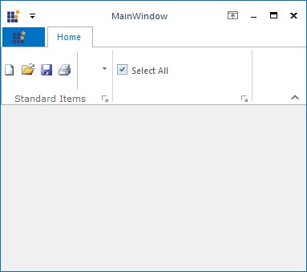

# Ribbon CheckBox

ToolStripCheckBox is used to select or unselect options. It provides similar set of functionalities like normal CheckBox control in Ribbon.It can be added to a ToolStripEx directly or through a panel. 

The below properties controls the appearance and behavior of the ToolStripCheckBox item.

### Foreground Settings

<table>
<tr>
<td>
**Property**  </td><td>
**Description**  </td></tr>
<tr>
<td>
Font  </td><td>
Sets the font style for the display text.  </td></tr>
<tr>
<td>
Text  </td><td>
Sets the Text for the ToolStrip item.  </td></tr>
<tr>
<td>
TextAlign  </td><td>
Specifies the alignment of the text in the item. The options are,  TopLeft,   TopCenter,   TopRight,  MiddleLeft,   MiddleCenter,   MiddleRight,  BottomLeft,   BottomCenter and  BottomRight.  </td></tr>
</table>

### Style Settings

<table>
<tr>
<td>
**Property**  </td><td>
**Description**  </td></tr>
<tr>
<td>
Checked  </td><td>
Indicates whether button is checked when the application loads.  </td></tr>
<tr>
<td>
CheckAlign  </td><td>
Gets or sets the horizontal and vertical alignment of the check mark on a ToolStripCheckBox item. The options are,  TopLeft,   TopCenter,   TopRight,  MiddleLeft,   MiddleCenter,   MiddleRight,  BottomLeft,   BottomCenter and  BottomRight.  </td></tr>
<tr>
<td>
CheckState  </td><td>
Specifies the check state. The different check states are,  Checked,  Unchecked and   Indeterminate.  </td></tr>
<tr>
<td>
ThreeState  </td><td>
Indicates whether the check box can display all the three check states. i.e, Checked, Unchecked and Indeterminate.  </td></tr>
<tr>
<td>
Enabled  </td><td>
Specifies whether the item is enabled.  </td></tr>
<tr>
<td>
Visible  </td><td>
Specifies whether the item is visible.  </td></tr>
<tr>
<td>
Alignment  </td><td>
Sets the alignment of the item within the ToolStripEx. They can be set to beginning (Left) or end (Right) of the ToolStripEx control.  </td></tr>
<tr>
<td>
AutoSize  </td><td>
Specifies whether the item should size itself based on its image and text.  </td></tr>
</table>

### ToolTip Settings

<table>
<tr>
<td>
**Property**  </td><td>
**Description**  </td></tr>
<tr>
<td>
AutoToolTip  </td><td>
When set to true, will display the text set in the Text property as the item's tooltip.  When set to false, will display the text set in the ToolTipText property.  </td></tr>
<tr>
<td>
ToolTipText  </td><td>
Sets the text for the tooltip when AutoToolTip is set to false.  </td></tr>
</table>

### RTL Support

<table>
<tr>
<td>
**Property**  </td><td>
**Description**  </td></tr>
<tr>
<td>
RightToLeft  </td><td>
Indicates whether the item should draw right to left for RTL languages.  </td></tr>
</table>
