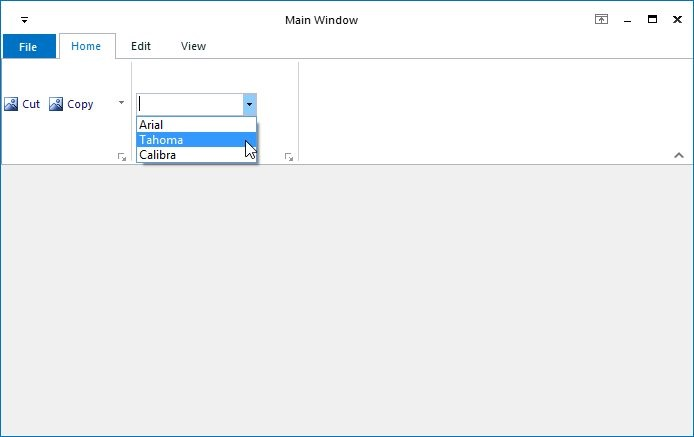

# Ribbon ComboBox

ToolStripComboBox control is used to display the list of items, as ComboBox. It can be added to a ToolStripEx directly or through a panel. 

The below properties controls the appearance and behavior of the ToolStripComboBox.

## Foreground Settings

<table>
<tr>
<th>
Property  </th><th>
Description  </th></tr>
<tr>
<td>
BackColor  </td><td>
Sets the back color for the combo box item.  </td></tr>
<tr>
<td>
Font  </td><td>
Sets the font style for the display text.  </td></tr>
<tr>
<td>
ForeColor  </td><td>
Sets the fore color for the display text.  </td></tr>
<tr>
<td>
Text  </td><td>
Sets the text for the ComboBox item.  </td></tr>
</table>

## Style Settings

<table>
<tr>
<th>
Property  </th><th>
Description  </th></tr>
<tr>
<td>
Enabled  </td><td>
Specifies whether the item is enabled.  </td></tr>
<tr>
<td>
Visible  </td><td>
Specifies whether the item is visible.  </td></tr>
<tr>
<td>
Alignment  </td><td>
Sets the alignment of the item within the ToolStrip. They can be set to beginning (Left) or end (Right) of the ToolStripEx control.  </td></tr>
<tr>
<td>
AutoSize  </td><td>
Specifies whether the item should size itself based on its image and text.  </td></tr>
<tr>
<td>
DropDownStyle  </td><td>
Specifies the dropdown style. The styles are,  Simple,  DropDown and   DropDownList.  </td></tr>
<tr>
<td>
FlatStyle  </td><td>
Sets the display style of the combobox. The styles are,  Flat,  Popup,  Standard and   System.  </td></tr>
</table>

## ToolTip Settings

<table>
<tr>
<th>
Property  </th><th>
Description  </th></tr>
<tr>
<td>
AutoToolTip  </td><td>
When set to true, will display the text set in the Text property as the item's tooltip.  When set to false, will display the text set in the ToolTipText property.  </td></tr>
<tr>
<td>
ToolTipText  </td><td>
Sets the text for the tooltip when AutoToolTip is set to false.  </td></tr>
</table>

## RTL Support

<table>
<tr>
<th>
Property  </th><th>
Description  </th></tr>
<tr>
<td>
RightToLeft  </td><td>
Indicates whether the item should draw right to left for RTL languages.  </td></tr>
</table>

## DropDown settings

<table>
<tr>
<th>
Property  </th><th>
Description  </th></tr>
<tr>
<td>
Items  </td><td>
Invokes String Collection Editor which lets you add strings list to be displayed in the combobox.  </td></tr>
<tr>
<td>
MaxDropDownItems  </td><td>
Sets the maximum number of strings that should be displayed in the dropdown.  </td></tr>
<tr>
<td>
MaxLength  </td><td>
Specifies the maximum characters that can be entered into the combobox.  </td></tr>
<tr>
<td>
DropDownHeight  </td><td>
Sets the height for the DropDown.  </td></tr>
<tr>
<td>
DropDownWidth  </td><td>
Sets the width for the DropDown.  </td></tr>
<tr>
<td>
IntegralHeight  </td><td>
Indicate whether the combobox should resize to avoid showing partial items.  </td></tr>
<tr>
<td>
Sorted  </td><td>
Specifies whether the dropdown list should be sorted.  </td></tr>
<tr>
<td>
AutoCompleteCustomSource  </td><td>
Represents the custom source of string collection for the autocomplete feature, when AutoCompleteSource property is set to CustomSource.  </td></tr>
<tr>
<td>
AutoCompleteSource  </td><td>
Represents the source of strings used for autocompletion. The sources can be,  FileSystem,  AllSystemSources, (Default)  AllUrl,  CustomSource,  FileSystemDirectories,  HistoryList,  ListItems,  RecentlyUsedList and   None.  </td></tr>
<tr>
<td>
AutoCompleteMode  </td><td>
Indicates text completion behavior of the combo box. The modes are,  {{'__Suggest__ '| markdownify }}- Displays the drop down list associated with the EditControl. This dropdown list is populated with one or more suggested completion strings,  {{'__Append__ '| markdownify }}- Appends the reminder of the most likely candidate string to the existing character, highlighting the appended character, and   {{'__SuggestAppend__ '| markdownify }}- Displays the drop down, also appends the highlighted string.  </td></tr>
<tr>
<td>
ShortCut on Form1  </td><td>
Specifies the Keyboard shortcut to be used at run time to access this combobox.  </td></tr>
</table>
N> We can set banner text for the ComboBox control. Refer [BannerTextProvider Component](http://help.syncfusion.com/windowsforms/bannertextprovider/overview#overview) topic for more details.
