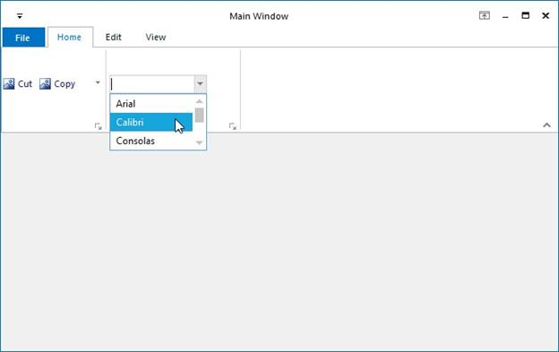

# Ribbon ComboBoxEx

ToolStripComboBoxEx control is used to display the list of items, as ComboBox. It can be added to a ToolStripEx directly or through a panel. 

Programmatically adding ToolStripComboBoxEx,





private ToolStripComboBoxEx toolStripComboBoxEx1;

this.toolStripComboBoxEx1 = new Syncfusion.Windows.Forms.Tools.ToolStripComboBoxEx();

this.toolStripComboBoxEx2.Items.AddRange(new object[] {"ComboBoxEx", "PanelItem", "SplitButton", "Gallery", 

"Label"});

this.toolStripEx2.Items.AddRange(new System.Windows.Forms.ToolStripItem[] {

this.toolStripComboBoxEx2});





Private toolStripComboBoxEx1 As ToolStripComboBoxEx 

Me.toolStripComboBoxEx1 = New Syncfusion.Windows.Forms.Tools.ToolStripComboBoxEx() 

Me.toolStripComboBoxEx2.Items.AddRange(New Object() {"ComboBoxEx", "PanelItem", "SplitButton", "Gallery", "Label"}) 

Me.toolStripEx2.Items.AddRange(New System.Windows.Forms.ToolStripItem() {Me.toolStripComboBoxEx2})





 N> We can set banner text for the ComboBoxEx control. Refer [BannerTextProvider Component](http://docs.syncfusion.com/windowsforms/bannertextprovider/overview#overview)  topic for more details.

