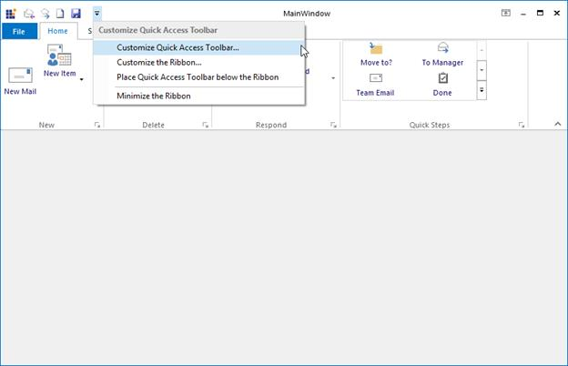
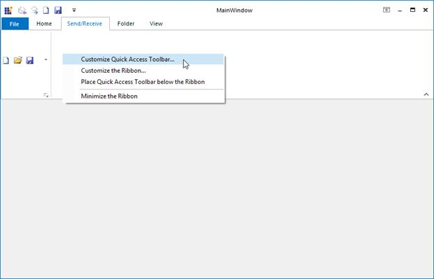
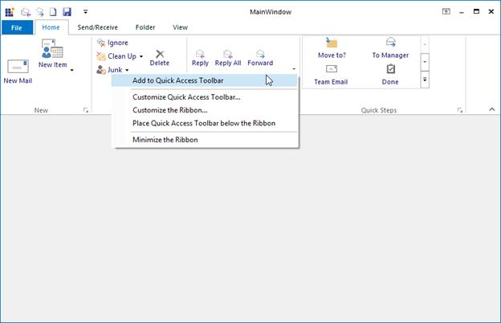
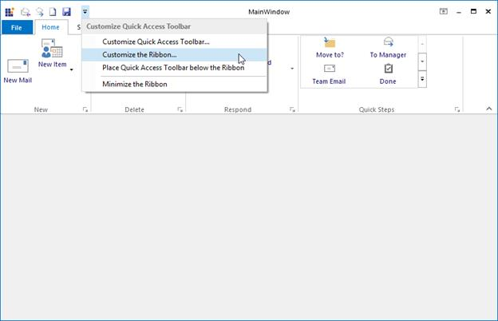
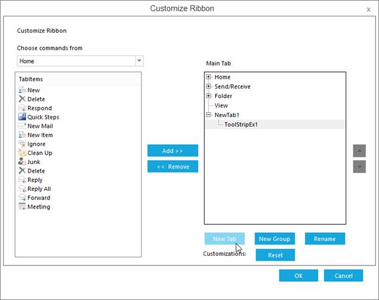
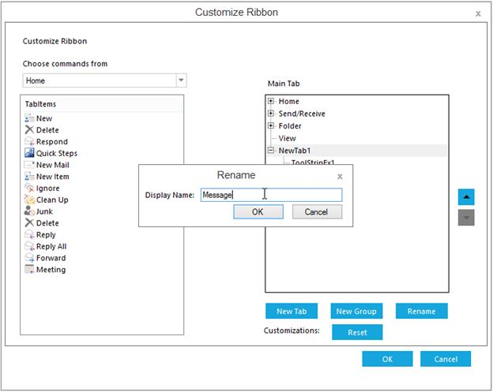
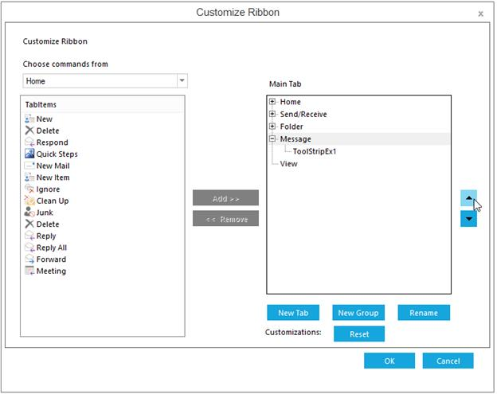
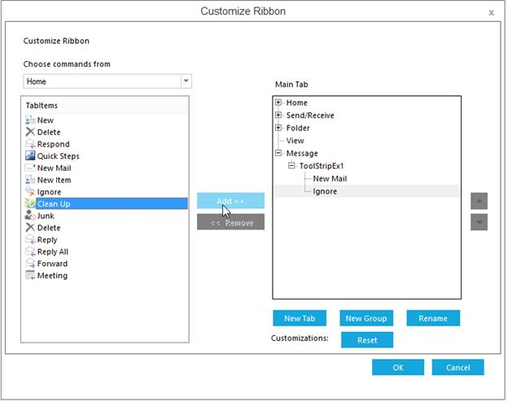
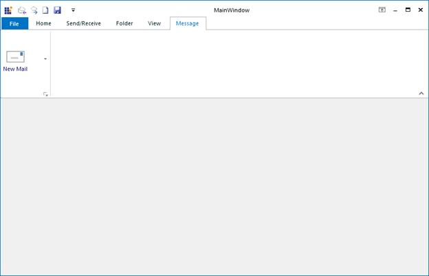

# Ribbon Customization

RibbonContextMenu allows to customize the Ribbon with the Right Click and it displays different functions for Ribbon and RibbonItems.

## Adding item to QAT using Customized Window

At run time, when you click the drop-down button of the Quick Access Toolbar, **"Customize Quick Access Toolbar"** option will be displayed. 

Clicking the option will open the Customize Quick Access Toolbar Editor dialog which lets you do the following.

* Add new items, 

* Remove the existing items or 

* Change the order of the items.

Customize Quick Access Toolbar can also be opened with the Right click on the Ribbon.

## Adding Items to QAT through Context Menu

QAT can also customized by adding the items from the Ribbon ContextMenu. Select Add to Quick Access Toolbar by right clicking the Ribbon item required to add to the QAT. Then, the respective item gets added as one of the items in the QAT.

## Show/Hide ToolStrip Items from Custom Quick Access Toolbar Dialog

The user can now show/hide ToolStrip Items on Quick Access Toolbar dialog. This can be achieved by setting RibbonControlAdv.SetUseInCustomQuickAccessDialog which allows user to show or hide the ToolStrip Item. It also allows show/hide Ribbon component from the Quick Access Toolbar dialog. By default, all the item values are set to true and will be displayed in the dialog.

The following code snippet illustrates the same.





this.ribbonControlAdv1.SetUseInCustomQuickAccessDialog(this.toolStripTabItem1, false);





Me.ribbonControlAdv1.SetUseInCustomQuickAccessDialog(Me.toolStripTabItem1, False)





## Adding items Tab and TabItems to the Ribbon using Customized Window

RibbonControlAdv Tab and TabItems can customized while running using Ribbon Customization window. Ribbon Customization window can be customized by right clicking on the Ribbon, or by clicking the drop-down button of the Quick Access Toolbar. 

Clicking the option will open the Customize Ribbon Editor dialog which lets you do the following.

* Add new ToolStripTabItem to the Ribbon.

* Rename existing ToolStripTabItem.

* Reordering of the ToolStripTabItem.

* Adding panel items to the ToolStripTabItem.

The Changes are reflected in the output window.

## Events

### QATCustomizationMenuClicked

This event will be triggered when the Customize Quick Access Toolbar is clicked from the Ribbon Context Menu.





this.ribbonControlAdv1.QATCustomizationMenuClicked += ribbonControlAdv1_QATCustomizationMenuClicked;

void ribbonControlAdv1_QATCustomizationMenuClicked(object sender, BeforeQATEventArgs e)

{

MessageBox.Show("Customize Quick Access Toolbar context menu is clicked");

}





AddHandler Me.ribbonControlAdv1.QATCustomizationMenuClicked, AddressOf ribbonControlAdv1_QATCustomizationMenuClicked

Private Sub ribbonControlAdv1_QATCustomizationMenuClicked(ByVal sender As Object, ByVal e As BeforeQATEventArgs)

MessageBox.Show("Customize Quick Access Toolbar context menu is clicked")

End Sub





### RibbonCustomizationMenuClicked

This event will be triggered when the Customize the Ribbon is clicked from the Ribbon Context Menu.





this.ribbonControlAdv1.RibbonCustomizationMenuClicked += ribbonControlAdv1_RibbonCustomizationMenuClicked;

void ribbonControlAdv1_RibbonCustomizationMenuClicked(object sender, BeforeCustomizeRibbonEventArgs e)

{

MessageBox.Show("Customize Ribbon context menu is clicked");

}





AddHandler Me.ribbonControlAdv1.RibbonCustomizationMenuClicked, AddressOf ribbonControlAdv1_RibbonCustomizationMenuClicked

Private Sub ribbonControlAdv1_RibbonCustomizationMenuClicked(ByVal sender As Object, ByVal e As BeforeCustomizeRibbonEventArgs)

MessageBox.Show("Customize Ribbon context menu is clicked")

End Sub





