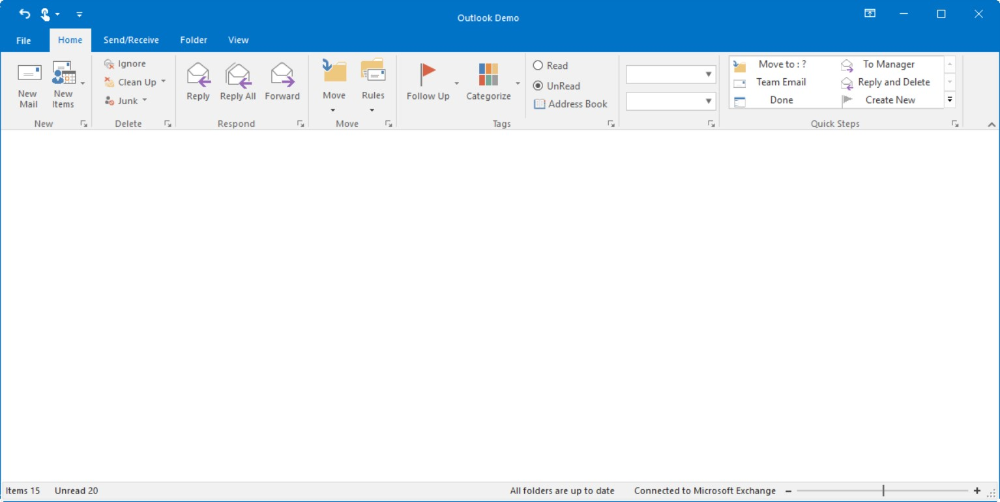

# Ribbon Form

`RibbonForm` is an extension that replaces the default form to enable different Visual styles to the ribbon. This RibbonForm now gives similar look and feel of Microsoft office, to its controls.

## Appearance Settings

<table>
<tr>
<th>
Property</th><th>
Description</th></tr>
<tr>
<td>
Appearance</td><td>
Sets the appearance of the form. The values are,Normal andOffice2007 (Default)Office 2010</td></tr>
<tr>
<td>
ColorScheme</td><td>
Specifies the office color scheme of the Ribbon form. The color schemes are, Blue, Black, Silver and Managed (Default).</td></tr>
<tr>
<td>
EnableAeroTheme</td><td>
Specifies the Aero theme of the Ribbon form. </td></tr>
<tr>
<td>
EnableHighContrastTheme</td><td>
Specifies whether to use default High Contrast theme color</td></tr>
<tr>
<td>
Font</td><td>
Gets or sets the RibbonControlAdv Font.</td></tr>
</table>





//Specifies the appearance of the form
this.Appearance = AppearanceType.Office2007;

//Specifies the color scheme for the form
this.ColorScheme = ColorSchemeType.Blue;

//Specifies the Aero theme
this.EnableAeroTheme = true;





Me.Appearance = AppearanceType.Office2007

Me.ColorScheme = ColorSchemeType.Blue

Me.EnableAeroTheme = True





`IsFormManager` property can be used to remove the form title bar and replace it with the RibbonControlAdv build in system buttons.

*	Default Theme

*	Aero Theme

## Customization

The property which lets you set borders for the Office2007Style form is as follows.

<table>
<tr>
<th>
Property</th><th>
Description</th></tr>
<tr>
<td>
Borders</td><td>
Gets/sets the border values of an Office 2007 style form. Sets borders for Left, Top, Right and Bottom sides of the form.</td></tr>
</table>



this.Borders = new System.Windows.Forms.Padding(10);





Me.Borders = New System.Windows.Forms.Padding(10)



### Customizing the Top Left Edge

This TopLeftRadius property gets/sets the curved radius of the top left edge of the form. Default is 8.



this.TopLeftRadius = 20;





Me.TopLeftRadius = 20


