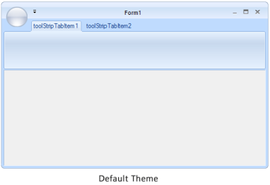
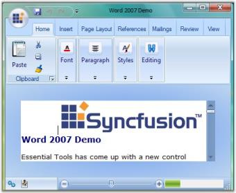

# Ribbon Form

## Appearance Settings

EssentialStudio now gives a similar look and feel of MS Office, to its Office controls, using RibbonControlAdv. This section discusses various appearance and behavior settings of the Ribbon form.

<table>
<tr>
<th>
Property</th><th>
Description</th></tr>
<tr>
<td>
Appearance</td><td>
Sets the appearance of the form. The values are,Normal andOffice2007 (Default)Office 2010</td></tr>
<tr>
<td>
ColorScheme</td><td>
Specifies the office color scheme of the Ribbon form. The color schemes are, Blue, Black, Silver and Managed (Default).</td></tr>
<tr>
<td>
EnableAeroTheme</td><td>
Specifies the Aero theme of the Ribbon form. </td></tr>
<tr>
<td>
EnableHighContrastTheme</td><td>
Specifies whether to use default High Contrast theme color</td></tr>
<tr>
<td>
Font</td><td>
Gets or sets the RibbonControlAdv Font.</td></tr>
</table>



//Specifies the appearance of the form.

this.Appearance = AppearanceType.Office2007;

//Specifies the office color scheme of the Ribbon Form.

this.ColorScheme = ColorSchemeType.Blue;

//To disable the Aerotheme

this.EnableAeroTheme = false;

//To enable the default High Contrast theme color

this.ribbonControlAdv1.EnableHighContrastTheme = true;





'Specifies the appearance of the form.
Me.Appearance = AppearanceType.Office2007

'Specifies the office color scheme of the Ribbon Form.
Me.ColorScheme = ColorSchemeType.Blue

'To disable the Aerotheme
Me.EnableAeroTheme = false

'To enable the default High Contrast theme color

Me.ribbonControlAdv1.EnableHighContrastTheme = true



### Vista Aero Theme

Vista Aero theme support is available for Ribbon Form when used in Vista machine.

## Customization

The property which lets you set borders for the Office2007Style form is as follows.

<table>
<tr>
<th>
Property</th><th>
Description</th></tr>
<tr>
<td>
Borders</td><td>
Gets/sets the border values of an Office 2007 style form. Sets borders for Left, Top, Right and Bottom sides of the form.</td></tr>
</table>



this.Borders = new System.Windows.Forms.Padding(10);





Me.Borders = New System.Windows.Forms.Padding(10)



### Customizing the Top Left Edge

This TopLeftRadius property gets/sets the curved radius of the top left edge of the form. Default is 8.



this.TopLeftRadius = 20;





Me.TopLeftRadius = 20



