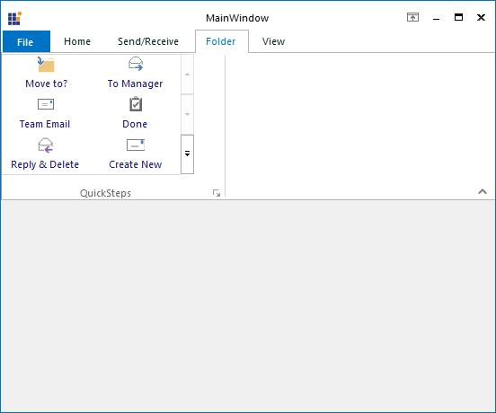
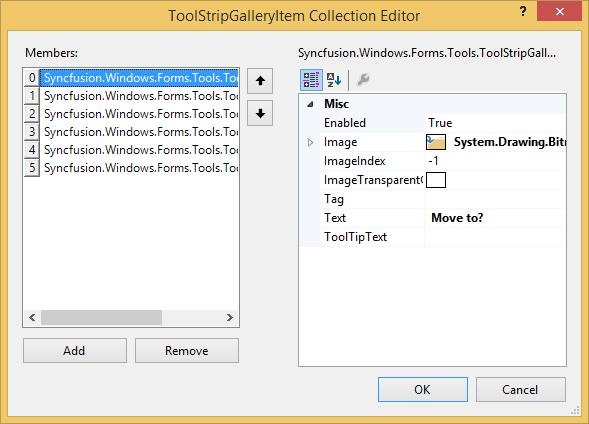
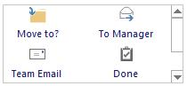
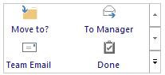
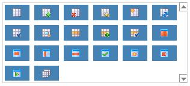

# Ribbon Gallery

Essential Tools RibbonControlAdv provides options to add a collection of items and store them into a gallery. A gallery can be added to a ToolStripTabItem using Items Collection Editor.

## Adding Controls to the Gallery

Using the `Item` property, Items Collection Editor opens, which lets you add items to the gallery.

## Appearance

The ToolStripItems can be aligned to right or left using Alignment property.













### Border Settings

<table>
<tr>
<td>
**Property**  </td><td>
**Description**  </td></tr>
<tr>
<td>
BorderStyle  </td><td>
Sets the border style for the ToolStripGallery. The options are,  None (default) and  Single.  </td></tr>
</table>
### Foreground Settings

<table>
<tr>
<td>
**Property**  </td><td>
**Description**  </td></tr>
<tr>
<td>
Font  </td><td>
Sets the font style for the display text.  </td></tr>
<tr>
<td>
ForeColor  </td><td>
Sets the fore color for the display text.  </td></tr>
</table>
### Scroller Settings

<table>
<tr>
<td>
**Property**  </td><td>
**Description**  </td></tr>
<tr>
<td>
ScrollerType  </td><td>
Sets the scroller type for the Gallery. The types available are,  StandardType and  CompactType.  </td></tr>
</table>

### RTL Support

<table>
<tr>
<td>
**Property**  </td><td>
**Description**  </td></tr>
<tr>
<td>
RightToLeft  </td><td>
Indicates whether the item should right to left for RTL languages.  </td></tr>
<tr>
<td>
RightToLeftAutoMirrorImage  </td><td>
Specifies whether image should mirror when RightToLeft is enabled for the item.  </td></tr>
</table>
## Caption Settings

Caption for a ToolStripGallery can be visible by settings the `ShowCaption` property to true.

<table>
<tr>
<td>
**Property**  </td><td>
**Description**  </td></tr>
<tr>
<td>
ShowCaption  </td><td>
Sets the visibility of the caption.  </td></tr>
<tr>
<td>
CaptionText  </td><td>
Sets the caption text.  </td></tr>
</table>




this.toolStripGallery1.CaptionText = "Quick Steps";

this.toolStripGallery1.ShowCaption = true;





Me.toolStripGallery1.CaptionText = "Quick Steps" 

Me.toolStripGallery1.ShowCaption = True





## Item Customization

ToolStripGallery lets you customize the ToolStrip items added to the Gallery using the below properties. 

### Appearance Settings

<table>
<tr>
<td>
**Property**  </td><td>
**Description**  </td></tr>
<tr>
<td>
ItemBackColor  </td><td>
Sets the back color for the items.  </td></tr>
</table>
### Style Settings

<table>
<tr>
<td>
**Property**  </td><td>
**Description**  </td></tr>
<tr>
<td>
ItemDisplayStyle  </td><td>
Sets the display style of the items. The options are,  Text,   Image and   ImageAndText.  </td></tr>
<tr>
<td>
ItemTextImageRelation  </td><td>
Sets the text image relation of the items. The options are,  {{'____'| markdownify }}Overlay,   ImageAboveText,   TextAboveImage,   ImageBeforeText and  TextBeforeImage.  </td></tr>
<tr>
<td>
ItemImageSize  </td><td>
Sets the image size for the items.  </td></tr>
<tr>
<td>
ItemMargin  </td><td>
Sets margin for the items.  </td></tr>
<tr>
<td>
ItemPadding  </td><td>
Sets padding between the items.  </td></tr>
<tr>
<td>
ItemSize  </td><td>
Sets the Item size.  </td></tr>
</table>




this.toolStripGallery1.ItemBackColor = System.Drawing.Color.SteelBlue;

this.toolStripGallery1.ItemDisplayStyle = System.Windows.Forms.ToolStripItemDisplayStyle.Image;

this.toolStripGallery1.ItemImageSize = new System.Drawing.Size(16, 16);

this.toolStripGallery1.ItemMargin = new System.Windows.Forms.Padding(2);

this.toolStripGallery1.ItemPadding = new System.Windows.Forms.Padding(2);

this.toolStripGallery1.ItemSize = new System.Drawing.Size(40, 46);





Me.toolStripGallery1.ItemBackColor = System.Drawing.Color.SteelBlue

Me.toolStripGallery1.ItemDisplayStyle = System.Windows.Forms.ToolStripItemDisplayStyle.Image 

Me.toolStripGallery1.ItemImageSize = New System.Drawing.Size(16, 16) 

Me.toolStripGallery1.ItemMargin = New System.Windows.Forms.Padding(2) 

Me.toolStripGallery1.ItemPadding = New System.Windows.Forms.Padding(2) 

Me.toolStripGallery1.ItemSize = New System.Drawing.Size(40, 46)





## ToolTips 

The Gallery can display a tooltip when the mouse is moved over the Gallery at runtime. This is enabled through `AutoToolTip` property. A default text will be displayed, which can be modified by providing the text in `ToolTipText` property. 





//Enabling and setting the tooltip

this.toolStripGallery1.AutoToolTip = true;

this.toolStripGallery1.ToolTipText = "New ToolStrip text";





'Enabling and setting the tooltip

Me.toolStripGallery1.AutoToolTip = True

Me.toolStripGallery1.ToolTipText = "New ToolStrip text"





### Show ToolTips for individual Gallery Items 

RibbonControlAdv now supports showing ToolTips for individual Gallery Item when moving the mouse over them. Earlier ToolTips were not supported for individual gallery items. Now you can specify the ToolTipText for individual Gallery Items on the ToolTipText property of the respective toolStripGallery Item.





//Add tooltip.

this.toolStripGallery1.Items[0].ToolTipText = "No spacing";

this.toolStripGallery1.Items[1].ToolTipText = "Heading 1";





'Add tooltip.

Me.toolStripGallery1.Items(0).ToolTipText = "No spacing"

Me.toolStripGallery1.Items(1).ToolTipText = "Heading 1"





