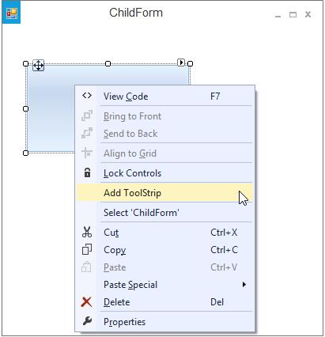
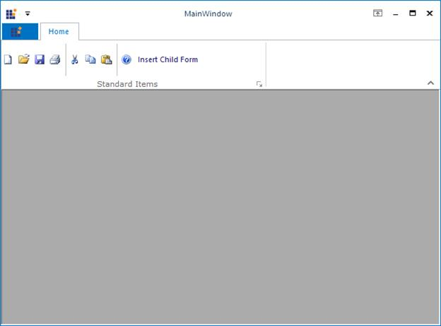
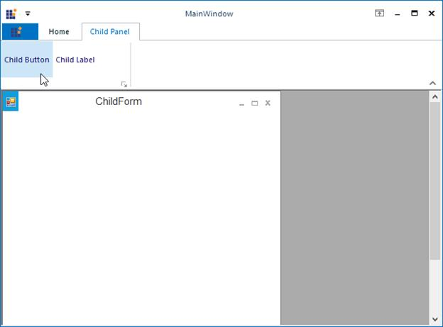

# Ribbon Merging

RibbonControlAdv allows merging of RibbonPanel in a child form to the RibbonPanel of the parent form. 

To merge the RibbonPanel in the ChildForm with the RibbonPanel in the parent form, follow the below given steps.

* In a Ribbon form, add a RibbonControlAdv control and the required ToolStripTabItems and the ToolStripEx items.

* From the ToolBox, add a RibbonPanelMergeContainer to the ChildForm. ToolStripEx can be added into this by right Clicking on it. 

Now add this ChildForm to the RibbonForm that is the MDIParent of the ChildForm in the default manner.





ChildForm frm = new ChildForm(); 

frm.MdiParent = this; 

frm.Show();            



 

Dim frm As ChildForm = New ChildForm()

frm.MdiParent = Me

frm.Show()





N> To use RibbonMerging feature, the Host form should inherit from RibbonForm otherwise form throws message "Use Form inherits from RibbonForm to use RibbonMerging feature" while merging. Also, the host form's `IsMDIContainer` property must be set as true and it should contain a RibbonControlAdv to get the ChildForm’s panels to be merged.

Run the sample to view the ChildForm and the RibbonPanel merged with the RibbonControlAdv in the ParentForm.

