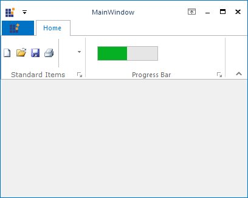

---
layout: post
title: Ribbon-ProgressBar| WindowsForms | Syncfusion
description:  ribbon progressbar
platform: WindowsForms
control: RibbonControlAdv 
documentation: ug
--

# Ribbon ProgressBar

ToolStripProgressBar can be used to provide a visual cue that the application is indeed working and the task is being completed.item. It can be added to a ToolStripEx directly or through a panel. 

The below properties controls the appearance and behavior of the ToolStripProgressBar Item.

### Foreground Settings

<table>
<tr>
<th>
Property  </th><th>
Description  </th></tr>
<tr>
<td>
Font  </td><td>
Sets the font style for the display text.  </td></tr>
<tr>
<td>
ForeColor  </td><td>
Sets the fore color for the display text.  </td></tr>
</table>

### Style Settings

<table>
<tr>
<th>
Property  </th><th>
Description  </th></tr>
<tr>
<td>
Style  </td><td>
Specifies the style for ProgressBar. The style are,  Blocks - Indicates the progress, by increasing the number of segmented blocks in a ProgressBar,  Continuous - Indicates the progress, by increasing the size of a smooth continuous bar,  Marquee - Indicates the progress, by continuously scrolling a block across the ProgressBar in a Marque fashion.  </td></tr>
<tr>
<td>
Enabled  </td><td>
Specifies whether the item is enabled.  </td></tr>
<tr>
<td>
Visible  </td><td>
Specifies whether the item is visible.  </td></tr>
<tr>
<td>
Alignment  </td><td>
Sets the alignment of the item within the ToolStripEx. They can be set to beginning (Left) or end (Right) of the ToolStripEx control.  </td></tr>
<tr>
<td>
AutoSize  </td><td>
Specifies whether the item should size itself based on its image and text.  </td></tr>
<tr>
<td>
MarqueeAnimationSpeed  </td><td>
Specifies the speed of the marquee animation in milliseconds. The default value is 100 Milliseconds.  </td></tr>
<tr>
<td>
Maximum  </td><td>
UpperBound Range of the ProgressBar. Default value is 100.  </td></tr>
<tr>
<td>
Minimum  </td><td>
LowerBound Range of the ProgressBar. Default value is 0.  </td></tr>
<tr>
<td>
Step  </td><td>
The amount to increment the current value of the control when PerformStep() method is called. Default value is 10.  </td></tr>
<tr>
<td>
Value  </td><td>
The current value for the ProgressBar, in the range specified by the minimum and maximum properties. Default value is 0.  </td></tr>
</table>

<table>
<tr>
<th>
Property  </th><th>
Description  </th></tr>
<tr>
<td>
PerformStep()  </td><td>
Advances the current position of the progressbar by the value specified in ToolStripProgressBar.Step property.  </td></tr>
</table>

### ToolTip Settings

<table>
<tr>
<th>
Property  </th><th>
Description  </th></tr>
<tr>
<td>
AutoToolTip  </td><td>
When set to true, will display the text set in the Text property as the item's tooltip.  When set to false, will display the text set in the ToolTipText property.  </td></tr>
<tr>
<td>
ToolTipText  </td><td>
Sets the text for the tooltip when AutoToolTip is set to false.  </td></tr>
</table>

### RTL Support

<table>
<tr>
<th>
Property  </th><th>
Description  </th></tr>
<tr>
<td>
RightToLeft  </td><td>
Indicates whether the item should draw right to left for RTL languages.  </td></tr>
<tr>
<td>
RightToLeftLayout  </td><td>
Indicates whether the control layout is right to left.  </td></tr>
</table>
