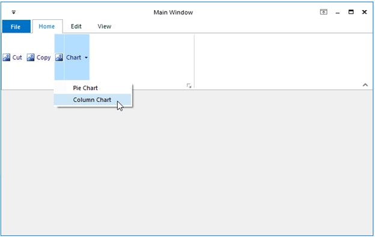

# Ribbon SplitButtonEx

ToolStripSplitButtonEx can be added to a ToolStripEx directly or through a panel. 

Programmatically, ToolStripSplitButtonEx can be added as follows.





private ToolStripSplitButtonEx toolStripSplitButtonEx1;

this.toolStripSplitButtonEx1 = new Syncfusion.Windows.Forms.Tools.ToolStripSplitButtonEx();

this.toolStripEx1.Items.AddRange(new System.Windows.Forms.ToolStripItem[] {

this.toolStripSplitButtonEx1});





Private toolStripSplitButtonEx1 As ToolStripSplitButtonEx

Me.toolStripSplitButtonEx1 = New Syncfusion.Windows.Forms.Tools.ToolStripSplitButtonEx() 

Me.toolStripEx1.Items.AddRange(New System.Windows.Forms.ToolStripItem() {Me.toolStripSplitButtonEx1})





The properties of SplitButtonEx is similar to SplitButton except `DropDownButtonWidth` property which is not available for SplitButtonEx control.

