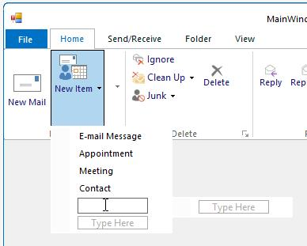
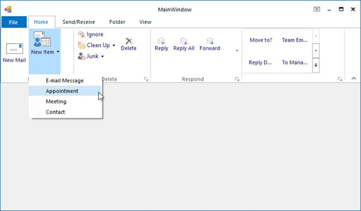

# Ribbon ToolStripDropDownButton

DropDownButton appears like normal button that contains a drop arrow. It displays some items, while click on it. It accepts DropDownMenuItem as its children.

## Add ToolStripMenuItems

DropDownMenuItems can be directly added to the DropDownButton button by clicking on the button.

It can also be added programmatically by using the following code snippets.





private System.Windows.Forms.ToolStripMenuItem emailMessageToolStripMenuItem;

this.emailMessageToolStripMenuItem = new System.Windows.Forms.ToolStripMenuItem();

private System.Windows.Forms.ToolStripMenuItem appointmentToolStripMenuItem;

this.appointmentToolStripMenuItem = new System.Windows.Forms.ToolStripMenuItem();

private System.Windows.Forms.ToolStripMenuItem meetingToolStripMenuItem;

this.meetingToolStripMenuItem = new System.Windows.Forms.ToolStripMenuItem();

private System.Windows.Forms.ToolStripMenuItem contactToolStripMenuItem;

this.contactToolStripMenuItem = new System.Windows.Forms.ToolStripMenuItem();

this.emailMessageToolStripMenuItem.Text = "E-mail Message";

this.appointmentToolStripMenuItem.Text = "Appointment";

this.meetingToolStripMenuItem.Text = "Meeting";

this.contactToolStripMenuItem.Text = "Contact";

this.toolStripDropDownButton1.DropDownItems.AddRange(new System.Windows.Forms.ToolStripItem[] {

this.emailMessageToolStripMenuItem,

this.appointmentToolStripMenuItem,

this.meetingToolStripMenuItem,

this.contactToolStripMenuItem});





Private emailMessageToolStripMenuItem As System.Windows.Forms.ToolStripMenuItem

Me.emailMessageToolStripMenuItem = New System.Windows.Forms.ToolStripMenuItem()

private System.Windows.Forms.ToolStripMenuItem appointmentToolStripMenuItem

Me.appointmentToolStripMenuItem = New System.Windows.Forms.ToolStripMenuItem()

private System.Windows.Forms.ToolStripMenuItem meetingToolStripMenuItem

Me.meetingToolStripMenuItem = New System.Windows.Forms.ToolStripMenuItem()

private System.Windows.Forms.ToolStripMenuItem contactToolStripMenuItem

Me.contactToolStripMenuItem = New System.Windows.Forms.ToolStripMenuItem()

Me.emailMessageToolStripMenuItem.Text = "E-mail Message"

Me.appointmentToolStripMenuItem.Text = "Appointment"

Me.meetingToolStripMenuItem.Text = "Meeting"

Me.contactToolStripMenuItem.Text = "Contact"

Me.toolStripDropDownButton1.DropDownItems.AddRange(New System.Windows.Forms.ToolStripItem() { 
	
Me.emailMessageToolStripMenuItem, 

Me.appointmentToolStripMenuItem,

Me.meetingToolStripMenuItem, 

Me.contactToolStripMenuItem})





## Properties of ToolStripDropDownButton

The below properties controls the appearance and behavior of the ToolStripDropDownButton.

### Foreground Settings

<table>
<tr>
<th>
Property  </th><th>
Description  </th></tr>
<tr>
<td>
Text  </td><td>
Sets the Text for the ToolStripDropDownButton. This text will be displayed, only if the DisplayStyle is Text or ImageAndText.  </td></tr>
<tr>
<td>
Font  </td><td>
Sets the font style for the display text.  </td></tr>
<tr>
<td>
ForeColor  </td><td>
Sets the fore color for the display text.  </td></tr>
<tr>
<td>
TextAlign  </td><td>
Specifies the alignment of the text in the item. The options are,  TopLeft,   TopCenter,   TopRight,  MiddleLeft,   MiddleCenter,   MiddleRight,  BottomLeft,   BottomCenter and  BottomRight.  </td></tr>
<tr>
<td>
TextDirection  </td><td>
Specifies the direction of drawing the text. The direction are,  {{ '__Horizontal__ ' | markdownify }} - Text is placed horizontally,  {{ '__Vertical90__ ' | markdownify }} - Text is placed vertically and   {{ '__Vertical270__ ' | markdownify }} - Text is placed vertically at 270 degrees.  </td></tr>
<tr>
<td>
TextImageRelation  </td><td>
Specifies the relative location of the image to the text on the item. The options are,  {{ '__Overlay__ ' | markdownify }} - Image and text shares the same space in the control,  {{ '__ImageAboveText__ ' | markdownify }} - Image will be placed above the text,  {{ '__TextAboveImage__ ' | markdownify }} - Text will be placed above the image,  {{ '__ImageBeforeText__ ' | markdownify }} - Image will be placed before the text and   {{ '__TextBeforeImage__ ' | markdownify }} - Text will be placed before the image.  </td></tr>
</table>

### Image Settings

<table>
<tr>
<th>
Property  </th><th>
Description  </th></tr>
<tr>
<td>
Image  </td><td>
Sets the image for the item.  </td></tr>
<tr>
<td>
ImageAlign  </td><td>
Specifies the alignment of the image. The options are,  TopLeft,   TopCenter,   TopRight,  MiddleLeft,   MiddleCenter,   MiddleRight,  BottomLeft,   BottomCenter and  BottomRight.  </td></tr>
<tr>
<td>
ImageScaling  </td><td>
Specifies whether the image on the item will size to fit on the ToolStrip.  </td></tr>
<tr>
<td>
ImageTransparentColor  </td><td>
Sets the transparent color on the image, that supports transparency.  </td></tr>
</table>

### Style Settings

<table>
<tr>
<th>
Property  </th><th>
Description  </th></tr>
<tr>
<td>
DisplayStyle  </td><td>
Specifies how the image and text are rendered. The styles are,  {{ '__Text__ ' | markdownify }} - Displays only text,  {{ '__Image__ ' | markdownify }} - Displays only image,  {{ '__ImageAndText__ ' | markdownify }} - Displays image and text.  </td></tr>
<tr>
<td>
Enabled  </td><td>
Specifies whether the item is enabled.  </td></tr>
<tr>
<td>
Visible  </td><td>
Specifies whether the item is visible.  </td></tr>
<tr>
<td>
Alignment  </td><td>
Sets the alignment of the item within the ToolStrip. They can be set to beginning (Left) or end (Right) of the ToolStripEx control.  </td></tr>
<tr>
<td>
AutoSize  </td><td>
Specifies whether the item should size itself based on its image and text.  </td></tr>
</table>

### ToolTip Settings

<table>
<tr>
<th>
Property  </th><th>
Description  </th></tr>
<tr>
<td>
AutoToolTip  </td><td>
When set to true, will display the text set in the Text property as the item's tooltip.  When set to false, will display the text set in the ToolTipText property.  </td></tr>
<tr>
<td>
ToolTipText  </td><td>
Sets the text for the tooltip when AutoToolTip is set to false.  </td></tr>
</table>

### RTL Support

<table>
<tr>
<th>
Property  </th><th>
Description  </th></tr>
<tr>
<td>
RightToLeft  </td><td>
Indicates whether the item should draw right to left for RTL languages.  </td></tr>
<tr>
<td>
RightToLeftAutoMirrorImage  </td><td>
Specifies whether image should mirror when RightToLeft is enabled for the item.  </td></tr>
</table>

### DropDown settings

<table>
<tr>
<th>
Property  </th><th>
Description  </th></tr>
<tr>
<td>
DropDown  </td><td>
Specifies the ToolStripDropDown to be shown when the item is clicked.  </td></tr>
<tr>
<td>
DropDownItems  </td><td>
Invokes the Items Collection Editor and lets you add ToolStripItems to be displayed when the item is clicked.  </td></tr>
<tr>
<td>
ShowDropDownArrow  </td><td>
Specifies whether or not to show the drop down arrow on the ToolStripDropDown button.  </td></tr>
</table>
