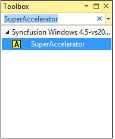
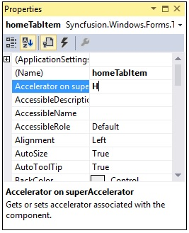
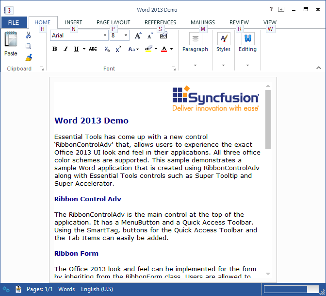
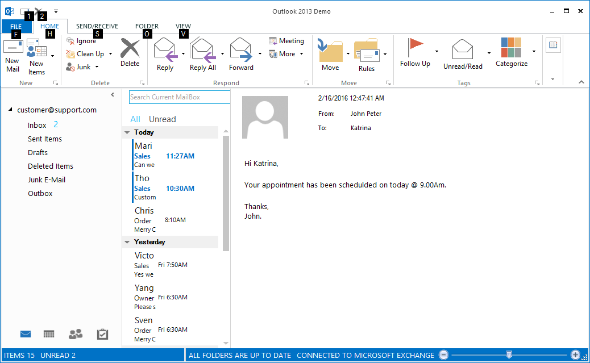

# Super Accelerator

To invoke any command using KeyBoard, RibbonControlAdv provides KeyTip support through Super Accelerator. On pressing Alt key, KeyTips for the corresponding RibbonItem gets displayed.

1. Drag-and-drop the SuperAccelerator on your form.

   

2. When the SuperAccelerator component is added to a form, an extended property will be added to the properties of every item in the toolstrip or tabitem in the RibbonControlAdv.

   

3. In the appropriate item, use the Accelerator on SuperAccelerator property to set the string value.

   

4. To accelerate the item's click event at run time, Press the ALT key. All the specified accelerator strings will be displayed below the items. 

5. Press the string in the keyboard and the corresponding item's click event will be triggered. (Eg. If the accelerator string of Cut is X key, Press ALT key. Once all the accelerator strings are displayed, press X key the Cut item event will be triggered.)

N> We can make the Accelerator feature to be active or inactive using SuperAccelerator.Active property.



[How to get or set an accelerator key programmatically](/windowsforms/ribboncontroladv/faq/super-accelerator/how-to-get-or-set-an-accelerator-key-programmatica.html)



## Super Accelerator Appearance

This section discusses the appearance settings of a Super Accelerator.

<table>
<tr>
<th>
Property</th><th>
Description</th></tr>
<tr>
<td>
BackColor</td><td>
Gets / sets the backcolor for the accelerator key.</td></tr>
<tr>
<td>
Font</td><td>
Sets the Font Style for the accelerator key.</td></tr>
<tr>
<td>
ForeColor</td><td>
Sets the ForeColor for the accelerator key.</td></tr>
</table>



this.superAccelerator.BackColor = System.Drawing.SystemColors.AliceBlue;

this.superAccelerator.Font = new System.Drawing.Font("Arial", 8F, System.Drawing.FontStyle.Regular)

this.superAccelerator.ForeColor = System.Drawing.Color.Maroon;





Me.superAccelerator.BackColor = System.Drawing.SystemColors.AliceBlue

Me.superAccelerator.Font = New System.Drawing.Font("Arial", 8F, System.Drawing.FontStyle.Bold)

Me.superAccelerator.ForeColor = System.Drawing.Color.Maroon



 

## Style

SuperAccelerator supports visual styles such as Default, Metro. The style can be set using Style property. 

* Default
* Metro

The following code example allows you to set the style for the superAccelerator.



this.superAccelerator.Style = Syncfusion.Windows.Forms.Tools.ToolStripExStyle.Metro;





Me.superAccelerator.Style = Syncfusion.Windows.Forms.Tools.ToolStripExStyle.Metro



