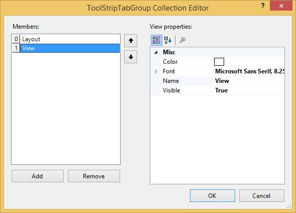
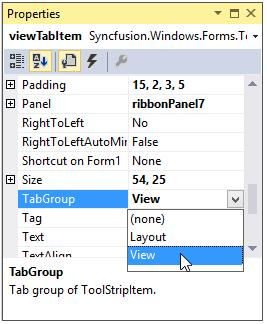
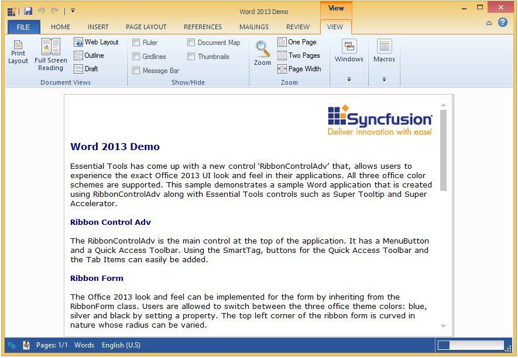

# Tab Groups

RibbonControlAdv allows to create TabGroups using the **TabGroups** property available for the RibbonControlAdv.

## Creating TabGroup

### Through Designer

* Click the TabGroup property of the RibbonControlAdv, TabGroup collection editor is opened. Add the tabgroup using the editor

 
 
* Now create a ToolStripTabItem using the smart tag of the Ribbon.

* Click the TabGroup property in the ToolStripTabItem and select the tabgroup from the available list.

   

* This will display the tab items in the RibbonControlAdv as shown in the image below.

   

### Through Code



this.ribbonControlAdv1.TabGroups.Add(toolStripTabGroup3);

Syncfusion.Windows.Forms.Tools.ToolStripTabGroup toolStripTabGroup3 = new Syncfusion.Windows.Forms.Tools.ToolStripTabGroup();

this.ribbonControlAdv1.TabGroups.Add(toolStripTabGroup3);

this.ribbonControlAdv1.TabGroups.SetTabGroup(pageLayoutTabItem, toolStripTabGroup1);





Me.ribbonControlAdv1.TabGroups.Add(toolStripTabGroup3)

Dim toolStripTabGroup3 As Syncfusion.Windows.Forms.Tools.ToolStripTabGroup = New Syncfusion.Windows.Forms.Tools.ToolStripTabGroup

Me.ribbonControlAdv1.TabGroups.Add(toolStripTabGroup3)

Me.ribbonControlAdv1.TabGroups.SetTabGroup(pageLayoutTabItem, toolStripTabGroup1)



## Customization

Using the Color property, the color for the tabs can be set. Text for the tabs can be specified through Name property and the tabs can be shown or hidden using Visible property.

Programmatically these properties can be set using the below code snippets.



toolStripTabGroup3.Color = System.Drawing.Color.DarkBlue;

toolStripTabGroup3.Name = "New Group";

toolStripTabGroup3.Visible = true;





toolStripTabGroup3.Color = System.Drawing.Color.DarkBlue

toolStripTabGroup3.Name = "New Group"

toolStripTabGroup3.Visible = True

