# ToolStripEx

The ToolStrip family of controls provides common interfaces for producing user interface elements for Windows Forms. Essential Tools has come up with ToolStripEx which, exhibits advanced features.

N> It is also possible to add ToolStripEx directly from the toolbox as it is also an individual control.

## Style Settings

This section will discuss the style settings available for the ToolStripEx.

### Border Settings

<table>
<tr>
<th>
Property</th><th>
Description</th></tr>
<tr>
<td>
BorderStyle</td><td>
Sets the border style for the control. The options are,None,

Etched 

StaticEdge.

</td></tr>
</table>





this.toolStripEx1.BorderStyle = ToolStripBorderStyle.Etched;





Me.toolStripEx1.BorderStyle = ToolStripBorderStyle.Etched





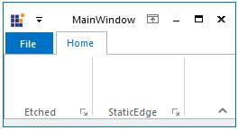

### LauncherStyle

The below properties deals with the launcher settings.

<table>
<tr>
<th>
Property</th><th>
Description

</th></tr>
<tr>
<td>
ShowLauncher</td><td>
Specifies the visibility of the Launcher in the control.</td></tr>
<tr>
<td>
LauncherStyle</td><td>
Sets the Style for the launcher. The styles are,

{{ '____' | markdownify }} Office12,Office2007</td></tr>
</table>





this.toolStripEx1.ShowLauncher = true;

this.toolStripEx1.LauncherStyle = LauncherStyle.Office2007;





Me.toolStripEx1.ShowLauncher = True

Me.toolStripEx1.LauncherStyle = LauncherStyle.Office2007





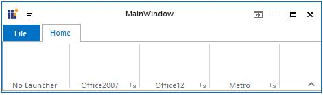

### Grip Style

The tool strip can hold a grip, which can be visible by setting the GripStyle property. We can enable GripStyle easily, using the smart tag of the ToolStripEx control.

<table>
<tr>
<th>
Property</th><th>
Description</th></tr>
<tr>
<td>
GripStyle</td><td>
Specifies whether or not to show the Gripper for the control. It can be hidden (default) or visible.</td></tr>
<tr>
<td>
GripMargin</td><td>
Specifies the margin for the Gripper. 

Default is 2.</td></tr>
</table>





this.toolStripEx1.GripStyle = System.Windows.Forms.ToolStripGripStyle.Visible;

this.toolStripEx1.GripMargin = new System.Windows.Forms.Padding(5);





Me.toolStripEx1.GripStyle = System.Windows.Forms.ToolStripGripStyle.Visible

Me.toolStripEx1.GripMargin = new System.Windows.Forms.Padding(5)





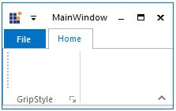

## Appearance Settings 

### Office12Mode

ToolStripEx now supports Office12 modes in Ribbon. The properties which applies this mode are as follows.

<table>
<tr>
<th>
Property</th><th>
Description</th></tr>
<tr>
<td>
Office12Mode</td><td>
When set to true, Office12Mode will be applied to the control.When set to false, Office2007 mode will be applied to the control. (Default)</td></tr>
<tr>
<td>

RenderMode

</td><td>
Specifies the painting style of the ToolStripEx. Options are,

System,

Professional

ManagerRenderMode.(Default)

</td></tr>
</table>

N> These properties can be easily set through Smart tag of the ToolStripEx. See SmartTag Options in DesignTime Features.





this.toolStripEx1.Office12Mode = true;

this.toolStripEx1.RenderMode = System.Windows.Forms.ToolStripRenderMode.ManagerRenderMode;





Me.toolStripEx1.Office12Mode = True

Me.toolStripEx1.RenderMode = System.Windows.Forms.ToolStripRenderMode.ManagerRenderMode





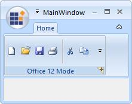

### Office2007 Mode

Disabling the Office12Mode property will automatically give the Ribbon control, Office2007 look and feel.

<table>
<tr>
<th>
Property</th><th>
Description</th></tr>
<tr>
<td>
OfficeColorScheme</td><td>
Sets the office color schemes for the control. Blue, Black and Silver schemes can be applied. </td></tr>
</table>

N> This settings will overwrite the Panel.OfficeColorScheme property.





this.toolStripEx1.OfficeColorScheme = Syncfusion.Windows.Forms.Tools.ToolStripEx.ColorScheme.Silver;





Me.toolStripEx1.OfficeColorScheme = Syncfusion.Windows.Forms.Tools.ToolStripEx.ColorScheme.Silver





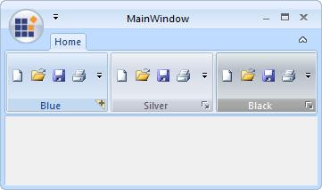

## AutoSizing of ToolStripEx

By enabling the **AutoSize** property of ToolStripEx, the tool strip width will be resized automatically while adding controls to the tool strip in the designer.

<table>
<tr>
<th>
Property</th><th>
Description</th></tr>
<tr>
<td>
AutoSize

</td><td>
Setting this to true, will automatically resize the tool strip as the controls gets added.

</td></tr>
</table>





this.toolStripEx1.AutoSize = true;





Me.toolStripEx1.AutoSize = True





## ToolStripEx Alignment

The **ToolStripLayoutStyle** property is used to specify the alignment for the ToolStripEx items. The following table lists the alignments of ToolStripEx.

<table>
<tr>
<th>
Constraint</th><th>
Description</th></tr>
<tr>
<td>
Flow

</td><td>
Specifies that items flow horizontally or vertically as necessary.

 The Alignment property is ignored under this Layout Style.
 
 </td></tr>
<tr>
<td>
HorizontalStackWithOverflow

</td><td>
Specifies that items are laid out horizontally and overflow as necessary.

</td></tr>
<tr>
<td>
StackOverflow

</td><td>
Specifies that items are laid out automatically.

</td></tr>
<tr>
<td>
Table

</td><td>
Specifies that items are laid out flush left.

Note: The Alignment property is ignored under this Layout Style.

</td></tr>
<tr>
<td>
VerticalStackWithOverflow

</td><td>
Specifies that items are laid out vertically, are centered within the control, and overflow as necessary.</td></tr>
</table>

The default value for ToolStripLayoutStyle property is HorizontalStackWithOverflow.

The following code sample illustrates how to use the ToolStripLayoutStyle property.





this.toolStripEx1.LayoutStyle = System.Windows.Forms.ToolStripLayoutStyle.HorizontalStackWithOverflow;





Me.toolStripEx1.LayoutStyle = System.Windows.Forms.ToolStripLayoutStyle.HorizontalStackWithOverflow





## ToolTips 

We can show tooltips over the ToolStrip items, by enabling the **ShowItemToolTips** property.





this.toolStripEx2.ShowItemToolTips = true;





Me.toolStripEx2.ShowItemToolTips = True





N> ToolTip text for the ToolStrip items can be specified using the respective <Control>.TooltipText properties. Ex, toolStripGallery1.ToolTipText property sets the tooltip for gallery item. 

## DesignTime Features 

### Smart Tag

Smart Tag of the ToolStripEx opens the Task Windows which lets you to set some important properties easily.

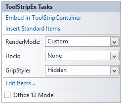

* Embed in ToolStripContainer - Lets you embed the ToolStrip in the ToolStripContainer.
* Insert Standard Items - Inserts standard items into the control.
* RenderMode - Lets you set the rendering mode. 
* Dock - Docks the control.
* GripStyle - Sets the grip style for the control.
* EditItems - Opens the Items Collection Editor.
* Office12Mode - Enables or Disables the Office12Mode.

### Context Menu

The context menu on a tool strip item provides advanced options which minimizes your time in customizing the ToolStrip container.

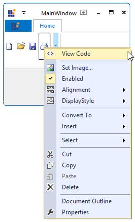

* Set Image - This options lets you to modify the image for the particular tool strip item.
* Enabled - Specifies whether the item is enabled or not.
* Alignment - Aligns the item to Left or Right.
* DisplayStyle - Specifies the display style, whether None, Image, Text or ImageAndText.
* ConvertTo - Provides options to convert the select item to another item.

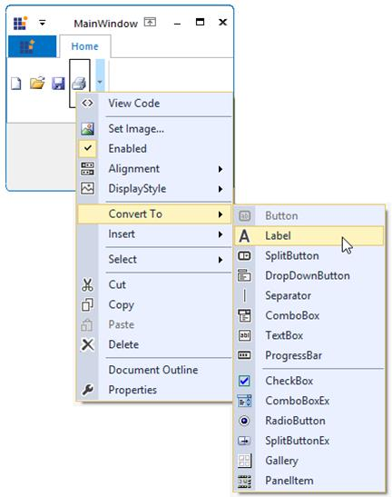

* Insert - Lets you to insert ToolStripItems.
* Select - Facilitates you to select a particular control.

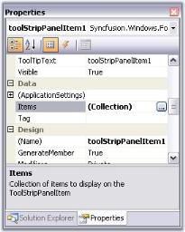

## Caption Settings 

Caption for a ToolStripEx can be enabled using **ShowCaption** property. Text for the Caption is set using **Text** property.





this.toolStripEx1.ShowCaption = true;

this.toolStripEx1.Text = "Standard Items";





Me.toolStripEx1.ShowCaption = True

Me.toolStripEx1.Text = "Standard Items"





### Customizing the Caption

The below properties lets you customize caption for the control.

<table>
<tr>
<th>
Property</th><th>
Description</th></tr>
<tr>
<td>
CaptionFont</td><td>
Sets the FontStyle for the caption.  </td></tr>
<tr>
<td>
CaptionTextStyle</td><td>
Sets the text style for the caption. The options are, 
{{ '____' | markdownify }} 

Plain,

Etched 

Shadow.
</td></tr>
<tr>
<td>

CaptionAlignment

</td><td>
Sets the alignment of the caption. The Alignment can be,

Near

Center

Far.

</td></tr>
<tr>
<td>
CaptionStyle

</td><td>
Specifies whether to align the caption text to the top or bottom of the ToolStripEx

Default alignment is Top.

</td></tr>
<tr>
<td>
CaptionMinHeight

</td><td>
Sets the minimum height for the caption.

</td></tr>
</table>





this.toolStripEx1.CaptionFont = new Font("Verdana", 8);

this.toolStripEx1.CaptionTextStyle = CaptionTextStyle.Shadow;

this.toolStripEx1.CaptionAlignment = CaptionAlignment.Near;

this.toolStripEx1.CaptionStyle = CaptionStyle.Top;

this.ribbonControlAdv1.CaptionMinHeight = 20;





Me.toolStripEx1.CaptionFont = New Font("Verdana", 8)

Me.toolStripEx1.CaptionTextStyle = CaptionTextStyle.Shadow

Me.toolStripEx1.CaptionAlignment = CaptionAlignment.Near

Me.toolStripEx1.CaptionStyle = CaptionStyle.Top

Me.ribbonControlAdv1.CaptionMinHeight = 20





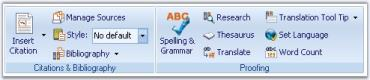

## Grouping Items

ToolStripItems can be grouped inside a ToolStripEx using the **GroupedButtons** property.





this.toolStripEx1.GroupedButtons = true;





Me.toolStripEx1.GroupedButtons = True





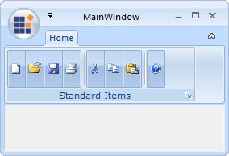

## Collapsed State Settings 

When the ToolStripEx is collapsed at run time, it will collapse all the items and display a dropdown button like the image given below.

Instead of showing a blank ToolStripEx when collapsed, we can display a text and an image using the below properties.

<table>
<tr>
<th>
Property</th><th>
Description</th></tr>
<tr>
<td>
CollapsedDropDownButtonImage</td><td>
Gets/sets the image of the collapsed state drop down button.</td></tr>
<tr>
<td>
CollapsedDropDownButtonText</td><td>
Gets/sets the text of the collapsed state drop down button.</td></tr>
</table>





this.toolStripEx1.CollapsedDropDownButtonImage = img;

this.toolStripEx1.CollapsedDropDownButtonText = "New";





Me.toolStripEx1.CollapsedDropDownButtonImage = img

Me.toolStripEx1.CollapsedDropDownButtonText = "New"





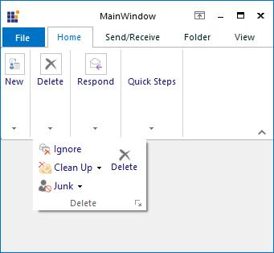

## KeyBoard Shortcut 

We can set keyboard shortcut keys for RibbonControl components using **SetShortcut** method. To get the keyboard shortcut for a particular component, use **GetShortcut** method.

<table>
<tr>
<th>
Property</th><th>
Description</th></tr>
<tr>
<td>
SetShortcut</td><td>
Sets shortcut key. The parameters are

{{ '__Component__ ' | markdownify }} - Component of the RibbonForm.

{{ '__Value__ ' | markdownify }} - Represents the shortcut key for the component specified.

</td></tr>
<tr>
<td>
GetShortcut

</td><td>
Gets shortcut key. The parameter is,

{{ '__Component__ ' | markdownify }} - Component of the RibbonForm.

</td></tr>
</table>





//Sets shortcut for toolstriptabitem1

this.SetShortcut(this.toolStripTabItem1, Keys.T);

//Gets shortcut for toolstriptabitem1

this.GetShortcut(this.toolStripTabItem1);





'Sets shortcut for toolstriptabitem1

Me.SetShortcut(Me.toolStripTabItem1, Keys.T)

'Gets shortcut for toolstriptabitem1

Me.GetShortcut(Me.toolStripTabItem1)





## Events

**LauncherClick**

This event is raised when the launcher button is clicked.





private void toolStripEx1_LauncherClick(object sender, EventArgs e)

{

Form fontDialog = new Form2();

fontDialog.ShowDialog();

}





Private Sub toolStripEx1_LauncherClick(ByVal sender As Object, ByVal e As EventArgs)

Dim fontDialog As Form = New Form2() 

fontDialog.ShowDialog()

End Sub





