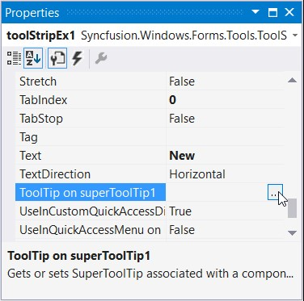
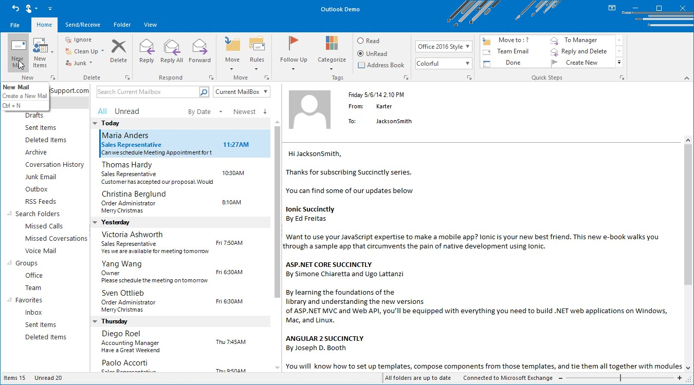

# ToolTip Support

ToolTip is a small popup box that appears when the user moves the pointer over an element.

## Adding ToolTip for Ribbon controls

ToolTip can be added to all the ribbon controls through that control property `ToolTipText`, this text will appear in a popup when hovered.   

Through coding





this.pasteButton.ToolTipText = "Add content on your clipboard to your document";





Me.pasteButton.ToolTipText = "Add content on your clipboard to your document"





## SuperToolTip

Essential Tools has come up with a new control known as the SuperToolTip which, enables the user to give tooltip information.

*	Header - The Header is used to display text which is used as a header for the tooltip.
*	Body - This is the description part.
*	Footer - If additional information is needed, it can be entered in the footer part.

### Creating SuperToolTip through designer

1.	Drag and drop the SuperToolTip on your form.
2.	When the SuperToolTip component is added to a form, an extended property will be added to the properties of every item in the RibbonControlAdv.

3.	Clicking the … ellipse button will show the ToolTip Editor Dialog Box. This editor lets you customize the ToolTip items.

Through code





using Syncfusion.Windows.Forms.Tools;

private SuperToolTip superToolTip1;
this.superToolTip1 = new Syncfusion.Windows.Forms.Tools.SuperToolTip(this);

Syncfusion.Windows.Forms.Tools.ToolTipInfo toolTipInfo1 = new Syncfusion.Windows.Forms.Tools.ToolTipInfo();

//Adding ToolTip to the Item
toolTipInfo1.Header.Text = "New Mail";
toolTipInfo1.Body.Text = "Create a new mail";
toolTipInfo1.Footer.Text = "Ctrl + N";

//Associating SuperToolTip for ToolStripButton
this.superToolTip1.SetToolTip(this.newmailButton, toolTipInfo1);





Imports Syncfusion.Windows.Forms.Tools
Private superToolTip1 As SuperToolTip
Me.superToolTip1 = New Syncfusion.Windows.Forms.Tools.SuperToolTip(Me)

Dim toolTipInfo1 As Syncfusion.Windows.Forms.Tools.ToolTipInfo = New Syncfusion.Windows.Forms.Tools.ToolTipInfo()

toolTipInfo1.Header.Text = "New Mail"
toolTipInfo1.Body.Text = "Create a new mail"
toolTipInfo1.Footer.Text = "Ctrl + N"

Me.superToolTip1.SetToolTip(Me.newmailButton, toolTipInfo1)





### Appearance settings

The appearance of the Super ToolTip can be customized using the below properties. These properties can be edited during design time using ToolTip Editor.

<table>
<tr>
<th>
Property</th><th>
Description</th></tr>
<tr>
<td>
BackColor</td><td>
Sets the background gradient color.</td></tr>
<tr>
<td>
BorderColor</td><td>
Sets the border color for the control.</td></tr>
<tr>
<td>
ForeColor</td><td>
Sets the fore color for the control.</td></tr>
<tr>
<td>
Separator</td><td>
Shows or hides a separator between the Body and the Footer tooltip items.</td></tr>
</table>





toolTipInfo1.BackColor = System.Drawing.SystemColors.MenuHighlight;
toolTipInfo1.BorderColor = System.Drawing.Color.CadetBlue;
toolTipInfo1.ForeColor = System.Drawing.SystemColors.ControlText;
toolTipInfo1.Separator = true;





toolTipInfo1.BackColor = System.Drawing.SystemColors.MenuHighlight
toolTipInfo1.BorderColor = System.Drawing.Color.CadetBlue
toolTipInfo1.ForeColor = System.Drawing.SystemColors.ControlText
toolTipInfo1.Separator = True





### Visual style

SuperToolTip control supports Visual styles such as Default, Metro, Office2016Colorful, Office2016White, Office2016Black and Office2016DarkGray.





this.superToolTip1.VisualStyle = Syncfusion.Windows.Forms.Tools.SuperToolTip.Appearance.Office2016Colorful;





Me.superToolTip1.VisualStyle = Syncfusion.Windows.Forms.Tools.SuperToolTip.Appearance.Office2016Colorful



