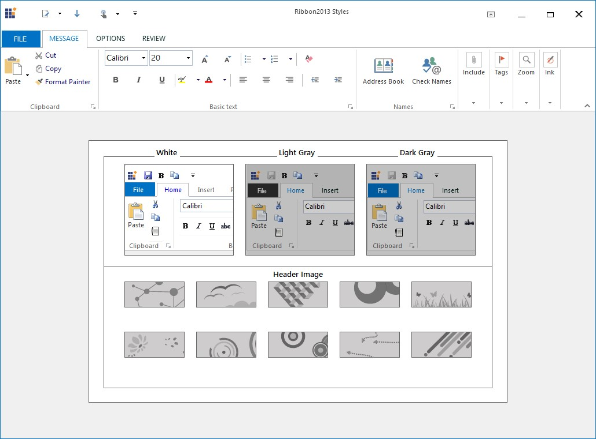

# Touch Support

Ribbon control have touch support and it provides Touch UI which is easy to access the element in Ribbon.

### Enabling Touch Mode 

You can control touch mode settings of RibbonControlAdv control using the following property.

<table>
<tr>
<th>
Property  </th><th>
Type  </th><th>
Description  </th></tr>
<tr>
<td>
RibbonTouchModeEnabled  </td><td>
Boolean  </td><td>
Enabling the RibbonTouchModeEnabled property in RibbonContolAdv, increases the size according to Microsoft touch mode size. Disabling the property retains its original size.  </td></tr>
</table>





//Enables touch mode for the RibbonControlAdv control

this.ribbonControlAdv1. RibbonTouchModeEnabled = true;





'Enables touch mode for the RibbonControlAdv control

Me.ribbonControlAdv1. RibbonTouchModeEnabled = True





