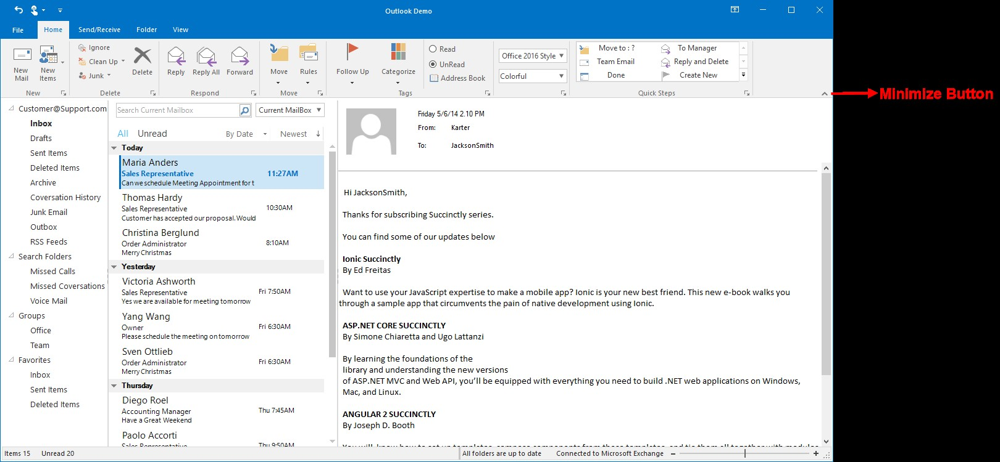
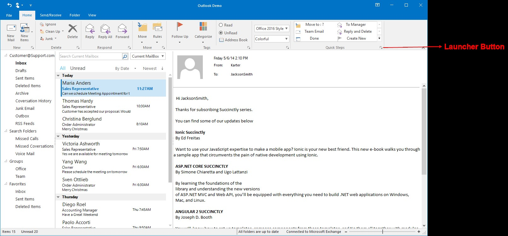
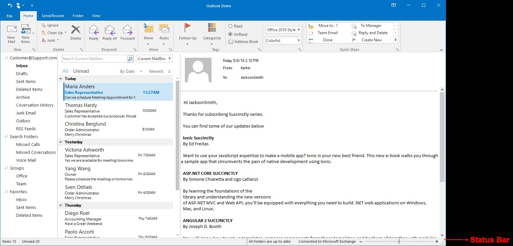

# Working with Ribbon

## Ribbon State

Ribbon state specifies whether the ribbon is in maximized or in minimized state, minimized state collapses the ribbon and provides more space and only tab names will appear.
Auto hide is a state in ribbon in which the ribbon waits for a click, ribbon won’t minimize if the click happens inside the ribbon, if the click happens outside, the ribbon will minimize automatically.

*	Maximized State

*  	Minimized State

### State change through display option button

Ribbon state can be changed by using the Ribbon display option button, which is present at the right top of the window.

The visibility of this option button can be changed by using a Boolean property `ShowRibbonDisplayOptionButton`.





this.ribbonControlAdv1.ShowRibbonDisplayOptionButton = true;





Me.ribbonControlAdv1.ShowRibbonDisplayOptionButton = True





### State change in double click

Ribbon state can be changed by double clicking on any of the ToolStripTabItem, this will minimize the ribbon if ribbon is in maximized state and vice versa.
If single click on the Tab item, the ribbon will enter Auto Hide state.

### State change through minimize button

Ribbon can be minimized by clicking on the minimize button at the right end of the ribbon and visibility of the minimize button can be changed by using the property `ShowMinimizeButton`.





this.ribbonControlAdv1.ShowMinimizeButton = true;





Me.ribbonControlAdv1.ShowMinimizeButton = True





### State change through ContextMenu

Ribbon state can also be changed through an option in context menu.
Open the context menu with right click on toolstripitem or toolstriptabitem and select the option `Collapse the Ribbon` which minimizes the ribbon.

## Options Available in Ribbon ContextMenu

ContextMenu can be opened with right click on the toolstripitem or toolstriptabitem.

1.	**Add to Quick Access Toolbar** (This option will be available only with right click on toolstripitem) – Adds that respective item to the Quick Access Toolbar.

2.	**Customize Quick Access ToolBar** – Clicking the option will open the Customize Quick Access Toolbar Editor dialog which lets you do the following.

*	Add new items,
*	Remove the existing items or
*	Change the order of the items

3.	**Show Quick Access Toolbar Below the Ribbon** (or) **Show Quick Access Toolbar Above the Ribbon** – Allows to change the location of QAT.

4.	**Customize the Ribbon** – RibbonControlAdv Tab and TabItems can be customized in run time using Ribbon Customization window.

Clicking the option will open the Customize Ribbon Editor dialog which lets you do the following.

*	Add new ToolStripTabItem to the Ribbon.
*	Rename existing ToolStripTabItem.
*	Reordering of the ToolStripTabItem.
*	Adding panel items to the ToolStripTabItem.

5. **Collapse the Ribbon** – If the ribbon is in maximized state this option will minimize the ribbon.

## Ribbon Items size

*	`Size` property can be used to set the height and width of the item.
*	`AutoSize` property (please refer `AutoSize` property of ToolStripDropDownButton), when this property value is true, changing the item size manually will not work.
*	`Margin` property is used to set the space around the control that keeps other controls a specified distance from the control's borders.
*	`Padding` property is used to set the space in the interior of a control that keeps the control's content (for example, the value of its Text property) a specified distance from the control's borders.

## Ribbon Resize behavior

By default, the ribbon control dynamically resizes as width of the window decreases, when the windows border touches the last placed ToolStripEx, the total ToolStripEx will be converted into a dropdownbutton and the items can be accessed by clicking on that dropdown arrow.
Same behavior will be continued to every ToolStripEx while minimized continuously. 
Again, the ToolStripEx will be visible if the spacing between window border and ToolStripEx has enough space to allocate all the items in that ToolStripEx.

This behavior can be changed with the ribbon property `CollapseBehavior` change the property to 2010, while minimizing, the items in the toolstrip will be converted into small buttons and will be converted to extra small buttons and then finally the toolstrip will be converted to dropdownbutton.





this.ribbonControlAdv1.CollapseBehavior = CollapseBehavior.Office2010 ;





Me.ribbonControlAdv1.CollapseBehavior = CollapseBehavior.Office2010





## Launcher Button

### Access Launcher Button

Set the property `ShowLauncher` of that ToolStripEx as true to access the launcher button at the corner of the ToolStripEx.

### Hide Launcher Button

Launcher button for ToolStripEx can be hidden by changing the value of the property `ShowLauncher` as false.





//This will hide the launcher
this.ribbonControlAdv1.ShowLauncher = false;





Me.ribbonControlAdv1.ShowLauncher = False





## Status Bar

Essential Tools has come up with `StatusStripEx` control which can be added to the bottom of the Ribbon. It can hold controls like TrackBarEx, ProgressBar, StatusStripButtons, and so on.

## Ribbon default Shortcut

A default shortcut key is available to change the state of the ribbon. Press (Ctrl + F1) to minimize or maximize the ribbon.

This Shortcut key can be disabled by changing the `EnableRibbonStateAccelerator` property as false.





this.ribbonControlAdv1.EnableRibbonStateAccelerator = false;





Me.ribbonControlAdv1.EnableRibbonStateAccelerator = False





## Enable Classic Style

Aero theme is used for classic style and appearance to the Ribbon form. It can be enabled by making the property `EnableAeroTheme` of the form as true.





//Enables Aero theme
this.EnableAeroTheme = true;





Me.EnableAeroTheme = True





