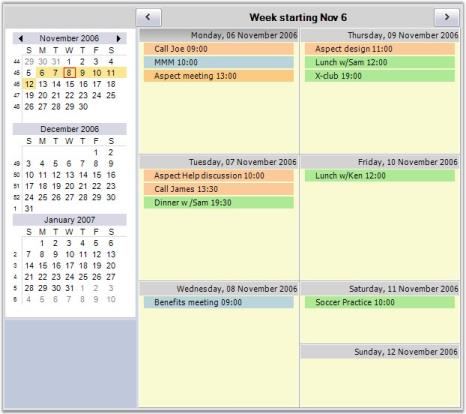
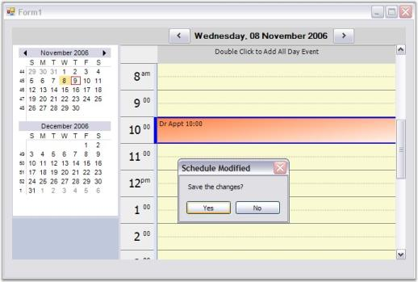
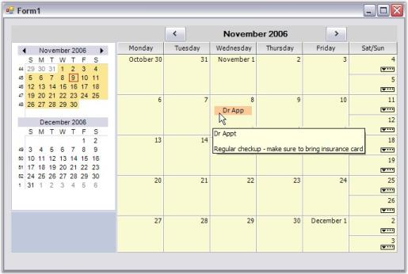

# Getting Started

This section guides you on getting started with Windows application, controls etc.

## Control Structure

The following screen shot shows the structure of the ScheduleControl.

Essential Schedule primarily consists of a UserControl derived class named _ScheduleControl_.

This section discusses the main properties of the ScheduleControl. The data for the ScheduleControl comes from any object that implements IScheduleDataProvider. The following discussions elaborate on the concrete implementation of the IScheduleDataProvider, based on an ArrayList-derived object that serializes to a disk file.

The above screen shot shows a ScheduleControl displaying a Month view. The four marked areas are actually Control-derived objects (two Panels and two GridControls). These controls have been added to the ScheduleControl.Controls collection. Any of the four controls except the ScheduleGrid can be hidden through the property settings. Here is a short description of each of the 4 labeled areas:

CaptionPanel: This is a Panel that displays a caption at the top of the ScheduleControl. There are also two button objects on this panel that will navigate the Schedule forward and backward. You can hide this panel by using the ScheduleControl.Appearance.ShowCaption property. This panel is docked at the top of the ScheduleControl client area.

NavigationPanel: This is a Panel where you can place additional controls and make them appear adjacent to the ScheduleControl. This can be optionally docked to the left or right side of the ScheduleControl. You can also hide this panel. The ScheduleControl.Calendar which is a NavigationCalendar object is docked at the top of this panel. There is also a Splitter docked under the NavigationCalendar that allows you to display more or fewer calendars in the NavigationCalendar. The default setting displays two such calendars. The picture below displays three. You can easily put your own controls under the NavigationCalendar using code similar to these snippets.  



Panel p = new Panel();

p.BackColor = Color.Blue;

p.Dock = DockStyle.Fill;

p.BackgroundImage = Image.FromFile("..\\..\\sync.png");

p.BackgroundImageLayout = ImageLayout.Tile;

this.ScheduleControl1.AddControlToNavigationPanel(p);



NavigationCalendar: This is a GridControl-derived object that displays multiple calendars allowing you to select the dates displayed in the ScheduleControl. The NavigationCalendar is docked at the top of the NavigationPanel. The number of calendars displayed in the NavigationCalendar is determined by its client height. Enlarging the height of the NavigationCalendar, will display more calendars. This can be facilitated by using the Splitter docked under the NavigationCalendar.

ScheduleGrid: This is a GridControl-derived object that displays the actual schedule content, i.e., the appointments for the various dates. The actual look of this GridControl is determined by the ScheduleViewType which is set by using the ScheduleControl.ScheduleType property.

Here is a Day view that shows a panel added under the NavigationCalendar by using the ScheduleControl1.AddControlToNavigationPanel code mentioned above. 

You can dock any control under the NavigationCalendar by using this method.

In addition to the Month view, the ScheduleControl can also display Day, WorkWeek, Week and Custom views. 

A Custom view is one where you can display up to eight individual days in the ScheduleGrid. You can easily switch views by using theScheduleControl.PerformSwitchToScheduleViewTypeClick method. 

Here are a series of screen shots illustrating these different views.

Notice in the WorkWeek view snapshot below, there is a Vacation entry at the top of 10/31/2006. 

This entry is an All-Day entry which has no specific time assigned to it. It is simply associated with the particular date. For the Day, WorkWeek and Custom views, All-Day entries are displayed in a frozen row at the top of the ScheduleGrid. For Week and Month views, All-Day entries are listed with the time entries.

Here is a Week view snapshot.

Notice in the NavigationCalendar on the left, week numbers appear on the left side of each week in the NavigationCalendar. You can optionally turn these numbers off using the ScheduleControl.Calendar.ShowWeekNumbers property.

The snapshot below shows a Schedule Control displaying three days. You can select any combination of up to either dates (either contiguous or not) to be displayed in this manner in a Custom view. 

## Class Diagram

Essential Schedule primarily consists of a UserControl-derived class named ScheduleControl, which in turn is constructed with the help of four control derived objects, namely, CaptionPanel, NavigationPanel, NavigationCalendar and ScheduleGrid.

## Tutorial

What You Will Learn

This tutorial will show you how easy it is to get started using Essential Schedule. It will give you a basic introduction to the concepts you need to know as well as some tips and ideas on how to use Essential Schedule in your projects. This tutorial uses step-by-step procedures to introduce you to Essential Schedule.

Windows Application using ScheduleControl and the SimpleScheduleDataProvider Class

In this lesson, you will create a Windows Application that simple displays a ScheduleControl on a form and uses the SimpleScheduleDataProvider class to provide a data store for the application. The SimpleScheduleDataProvider class is an implementation of the IScheduleDataProvider interface that ScheduleControl requires for its data source.  SimpleScheduleDataProvider.cs and SimpleScheduleDataProvider.vb are files that ship in our ScheduleSample sample. As part of this tutorial, you need to copy this file to your tutorial project location.

### Lesson 1: Using ScheduleControl and SimpleScheduleDataProvider

In this lesson, you will create a sample Windows Forms application, drop a ScheduleControl onto a form and then hook it up to a SimpleScheduleDataProvider object to serialize schedule items (appointments) to a disk file. Along the way, you will see how to change properties of the ScheduleControl and also serialize these changed settings to a disk file as well. Other tasks discussed in this tutorial are how to use the built-in functionality to add new schedule items, modify existing schedule items and other common tasks.

The following section explains in detail:

#### Lesson: Using ScheduleControl

1.  From Visual Studio, go to the File menu, select New and then click Project, to create a new Windows Application named ScheduleSample. 

    
   
2.  When the Visual Studio Designer opens, drag the Schedule Control from the Syncfusion Tab onto the Form.

    

3.  The ScheduleControl will show on the design surface. Below is a typical display of this. Notice the Appearance property in the property grid. This is the object that has many properties that affect the appearance of the ScheduleControl.

    

4.  Add a Form1_Load handler to the Form1.cs file by double-clicking on the Form that is not covered by the ScheduleControl. This should display a code window showing code like this.

    

5.  Now add an existing file to this project, SimpleScheduleDataProvider.cs (or impleScheduleDataProvider.vb if you are using VB.NET). 

    This file defines several classes that implement the interfaces that the ScheduleControl needs to manage the data associated with the appointments that will appear in the calendar. 

    These interfaces are discussed in detail later in this UserGuide. 

    For now, just use the implementation provided in the SimpleScheduleDataProvider.cs file. This file ships as part of the \Syncfusion\Essential Studio\5.x.x.x\Windows\Schedule.Windows\ Samples\2.0\ScheduleSample sample. 

    Drill down to this folder, and add this file to your project by using the Solution Explorer window as shown here.

    

6.  Here, you can find the SimpleScheduleDataProvider.cs file in the _\Syncfusion\Essential Studio\5.x.x.x\Windows\Schedule.Windows\ Samples\ 2.0\ScheduleSample\CS_ folder. Drill down to this folder and add this file to our project.

    

7.  After adding the file containing our SimpleScheduleDataProvider.cs code, add some code to your Form.cs to provide data support to your ScheduleControl. 

    The first thing to do is to add a using statement to allow us to reference the class names in the SimpleScheduleDataProvider.cs file without adding the Namespace used in that file. 

    The other is added in the Form_Load code to hook up the data support. 

    In the Form_Load, create an instance of the DataProvider and a MasterList to hold the data. 

    Then set some properties to provide a filename, the ScheduleViewType for the initial display and the DataSource property for your ScheduleControl. 

    Copy this code to your Form1.cs file. (If you are not using the 2.0 FrameWork, remove the partial keyword.)

    ~~~ cs

		 using System;

		 using System.Collections.Generic;

		 using System.ComponentModel;

		 using System.Data;

		 using System.Drawing;

		 using System.Text;

		 using System.Windows.Forms;

		 using Syncfusion.Windows.Forms.Schedule;
 
		 using GridScheduleSample;

		 namespace ScheduleSample

		 {

		 	public partial class Form1 : Form

			 {

			 	public Form1()

			 	{

					InitializeComponent();

				}

				private void Form1_Load(object sender, EventArgs e)

				{

					SimpleScheduleDataProvider data = new SimpleScheduleDataProvider();

					data.MasterList = new SimpleScheduleItemList();

					data.FileName = "default.schedule";

					this.scheduleControl1.ScheduleType = ScheduleViewType.Month;

					this.scheduleControl1.DataSource = data;

				}

			 }

		 }

    ~~~
	{:.prettyprint }

8.  Now press F5 key to compile and run your application. A screen similar to this one should appear.

    
 
9.  To change the Month view to a Day view, right-click the ScheduleGrid area of the ScheduleControl to display a ContextMenu and select Day.

    
   
10. Here is the Day view that appears after the execution of the ContextMenu selection done in step 9.

    

11. Double-click one of the time slots on the ScheduleGrid in the ScheduleControl. This action will display a new appointment screen where you can enter a new schedule item as shown below.

    

12. Clicking the Save and Close button on the Appointment screen will re-display the Day view ScheduleControl with the new appointment displayed. If you hover over the appointment in the ScheduleGrid, a tooltip will display as shown below.

    

13. Click the Close button on the form system menu on the upper-right corner of the form. Since the data has been modified in this ScheduleControl, a dialog will appear as below, asking whether you want to save these changes to a disk file. Click Yes to save the changes.

    
	
14. Next modify our Form_Load code to conditionally reload the saved data if the file is present on the disk. Here is the new code. Copy this code to your Form1.cs file. Notice that you have added a "using" statement to reference the System.IO namespace in addition to the new code in the Form1_Load. (If you are not using the 2.0 FrameWork, remove the partial keyword)

    ~~~ cs

			using System;

			using System.Collections.Generic;

			using System.ComponentModel;

			using System.Data;

			using System.Drawing;

			using System.Text;

			using System.Windows.Forms;

			using Syncfusion.Windows.Forms.Schedule;

			using GridScheduleSample;

			using System.IO;

			namespace ScheduleSample

			{

				public partial class Form1 : Form

				{

					public Form1()

					{

						InitializeComponent();

					}

				private void Form1_Load(object sender, EventArgs e)

				{

					SimpleScheduleDataProvider data;

					if (File.Exists("default.schedule"))

					{

						data = SimpleScheduleDataProvider.LoadBinary("default.schedule");

						data.FileName = "default.schedule";

					}

					else

					{

						data = new SimpleScheduleDataProvider();

						data.MasterList = new SimpleScheduleItemList();

						data.FileName = "default.schedule";

					}

					this.scheduleControl1.ScheduleType = ScheduleViewType.Month;

					this.scheduleControl1.DataSource = data;

				}

				}

			}

    ~~~
	{:.prettyprint }

15. As our last step, compile and run the application again. The Month view should reappear but, this time the appointment you added earlier should appear.

    

## Data used by ScheduleControl

There are generally two types of data required by ScheduleControl. Most of the data is what we described as Appointments data. This data includes the time, subject, body, and so on. of each of the actual appointments. 

The second type of data we refer to as the _DropLists data_. This data consists of the several option lists that go into describing the actual appointment data. For example, each appointment may have a marker associated with it that indicates something of the nature of the appointment like whether it is business, personal, a must-attend, etc. This second type of data is more like schema data, as it suggests the content options of the actual Appointments data.

The Schedule Control does all its data access through interfaces. To support custom data objects, you would have your data objects implement these particular interfaces that are discussed in the following sections. In addition, included in the Essential Schedule library are base classes that implement these required interfaces. So, you can also create data sources for the ScheduleControl by deriving these base classes. The SimpleScheduleDataProvider classes that were used in the Tutorial are derived from these base classes.

### Base Classes

ScheduleDataProvider Class: provides an empty implementation of the IscheduleDataProvider. The implementation is done through virtual methods. You can then derive this class and through its overrides, set up an IScheduleDataProvider. See the SimpleScheduleDataProvider class in the ScheduleSample sample.

ScheduleAppointmentList Class: provides an implementation of IScheduleAppointmentList and is essentially a wrapper class for an ArrayList that holds ScheduleAppointments

ScheduleAppointment Class: provides an implementation of IScheduleAppointment and defines the objects that represent appointments in the ScheduleControl.

LookUpObjectList Class: strongly typed ArrayList that holds list option values that are used in the new appointment form.

LookUpObject Class: wrapper class for list choices that can have a valueMember, displayMember and colorMember associated with them.

The lists for the ShowTime and Label options on the Appointment forms use these objects.

### Interfaces

IScheduleDataProvider Interface: provides the framework for providing schedule item data to the ScheduleControl.

IScheduleAppointmentList Interface: serves as a collection of ISchedule objects.

IScheduleAppointment Interface: defines individual schedule items.

ILookUpObjectList Interface: serves as a collection of IlookUpObjects.

ILookUpObject Interface: enables Choice lists within the ScheduleControl, that are used to provide possible schedule item information (like location or a reminder), to have a ValueMember / DisplayMember associated with them, as well as a color that will be used in drop-downs showing these lists.

Value members are normally the values serialized to data stores.

### ScheduleData Base Classes

The ScheduleControl gets its data through its DataSource property, an IScheduleDataProvider object. So, it is this IScheduleDataProvider interface (and several other associated interfaces) that gives you the ability and facility to provide data to the ScheduleControl. To simplify this process of providing data, Essential Schedule also exposes these interfaces as base classes that include some pre-determine droplist settings that allow you to use the ScheduleControl with less coding work. But, you do have the option of working directly through the interfaces to construct your own data provider for the ScheduleControl.

The Essential Schedule library contains several base classes that implement the various data interfaces required by the ScheduleControl. These base classes use virtual methods which, you can override to provide a concrete data implementation. The classes in the SimpleScheduleDataProvider file that is shipped with the samples and used in the Tutorial section of this User Guide are derived from the ScheduleData base classes. Check out the shipped sample that uses the SimpleScheduleDataProvider as a data source for ScheduleControl.

The following sections discuss these ScheduleData base classes in more detail.

#### The Appointments Data

Here are the ScheduleData base classes that provide the Appointments data used by ScheduleControl. For code details of deriving these ScheduleData base classes to implement a data provider for the ScheduleControl, please see the SimpleScheduleDataProvider code file that ships as part of the ScheduleSample sample.

#### ScheduleAppointment Class

ScheduleAppointment is the class that defines the objects that represent appointments in the Schedule Control. This class implements IScheduleAppointment to provide an object to hold the concrete data associated with appointments. You can either derive this class or implement IScheduleAppointment yourself to extend or modify the information managed by the ScheduleAppointment class. Here are the properties exposed in ScheduleAppointment.

UniqueID: gets or sets a unique integer associated with this item

Owner: gets or sets an integer that can be used to identify the owner (if any) of this item

StartTime: gets or sets the start time for this item

EndTime: gets or sets the end time for this item

Subject: gets or sets a text string identifying the topic of this item

Content: gets or sets a text string holding the details or comments for this appointment item

AllDay: gets or sets whether this appointment is an all-day appointment

LabelValue: gets or sets an integer categorizer value for this item

MarkerValue: gets or sets an integer categorizer value for this item

Reminder: gets or sets whether you want a reminder event raised when the StartTime of this item gets close

ReminderValue: gets or sets the type of reminder event raised when the StartTime of this item gets close

LocationValue: gets or sets a string associated with this item

Version: gets in integer format the version number (used to support data format versioning)

Tag: gets or sets an arbitrary object associated with this item

Dirty: gets or sets whether this item has been modified

IgnoreChanges: gets or sets whether changes to this item affect the Dirty property

#### ScheduleAppointmentList Class

ScheduleAppointmentList is a collection of IScheduleAppointments that serves as the data for the Schedule Control. This class is a wrapper class for an ArrayList and implements IComparer to order this list by the item's StartTime. If two items start at the same time, then the EndTime is used as well to determine the order. Longer appointments rank higher. Here are the properties and methods exposed in ScheduleAppointmentList.



/// Gets or sets the i-th IScheduleAppointment in this list.

public virtual IScheduleAppointment this[int i];

/// Gets the number of IScheduleAppointments in this list.

public virtual int Count

/// Sorts this list on the IScheduleAppointment.StartTime property.

public virtual void SortStartTime()

/// Adds an IScheduleAppointment to this list.

/// item - The IScheduleAppointment to be added.

public virtual void Add(IScheduleAppointment item)

/// Inserts an IScheduleAppointment into this list.

/// index - The position in the list where the item is to be inserted. 

/// item - The IScheduleAppointment to be inserted. 

public virtual void Insert(int index, IScheduleAppointment item)

/// Removes an IScheduleAppointment from this list.

/// item - The IScheduleAppointment to be removed. 

public virtual void Remove(IScheduleAppointment item)

/// Removes an IScheduleAppointment from this list.

/// index - The position of the item to be removed.

public virtual void RemoveAt(int index)

/// Returns the position of the specified item within this list.

/// item - The search item. 

public virtual int IndexOf(IScheduleAppointment item)

/// Returns a new ScheduleAppointment populated with default values.

public virtual IScheduleAppointment NewScheduleAppointment() 



#### ScheduleDataProvider Class

ScheduleDataProvider has two functional roles. 

One is to implement IScheduleDataProvider in a virtual manner so that derived classes can provide concrete implementations through virtual overrides. The IScheduleDataProvider virtual methods exposed in ScheduleDataProvider have empty implementations, so you are required to derive this class to use it. 

The second role is to provide the DropList data. For this second role, the ScheduleDataProvider does provide concrete implementations for the virtual methods it exposes. So, in your derived class, you would have populated droplists without doing further work, though you can choose to customize these droplists through virtual overrides. Here is a list of the stub methods exposed by ScheduleDataProvider in its first role.



/// Return an IScheduleAppointmentList holding the schedule items for the given date. 

public virtual IScheduleAppointmentList GetScheduleForDay(DateTime day)

//// Return an IScheduleAppointmentList holding the schedule items between the given dates.

public virtual IScheduleAppointmentList GetSchedule(DateTime startDate, DateTime endDate)

/// Return an IScheduleAppointmentList holding the schedule items for a particular owner on the given date. 

public virtual IScheduleAppointmentList GetScheduleForDay(DateTime day, int owner)

/// Return an IScheduleAppointmentList holding the schedule items for a particular owner between the given dates.

public virtual IScheduleAppointmentList GetSchedule(DateTime startDate, DateTime endDate, int owner)

/// Saves any modified ScheduleAppointments.

public virtual void CommitChanges()

/// Gets or sets whether CommitChanges is called when the ScheduleControl is disposed.

public SaveOnCloseBehavior SaveOnCloseBehaviorAction

/// Gets or sets whether data source is modified or not.

public virtual bool IsDirty

/// Returns a new ScheduleAppointment populated with default values.

public virtual IScheduleAppointment NewScheduleAppointment()

/// Adds a ScheduleAppointment to the list.

public virtual void AddItem(IScheduleAppointment item)

/// Removes a ScheduleAppointment from the list. 

public virtual void RemoveItem(IScheduleAppointment item)



Here are the methods and properties used as part of the ScheduleDataProvider's second role, providing the DropList data. The following is the actual implementation code which gives an indication of the exposed functionality.



/// Provides default droplists for entering IScheduleAppointment data. 

/// You can override this method to provide customized droplists.

public virtual void InitLists()

{

labelList = new ListObjectList();

labelList.Add(new ListObject(0,"None", Color.White)); 

labelList.Add(new ListObject(1,"Important", Color.FromArgb(255,128,64)));

labelList.Add(new ListObject(2,"Business",  Color.FromArgb(86,152,233)));

labelList.Add(new ListObject(3,"Personal",  Color.FromArgb(57,210,53)));

labelList.Add(new ListObject(4,"Vacation",  Color.FromArgb(199,198,182)));

labelList.Add(new ListObject(5,"Must Attend",  Color.FromArgb(255,128,0)));

labelList.Add(new ListObject(6,"Travel Required",  Color.FromArgb(0,255,255)));

labelList.Add(new ListObject(7,"Needs Preparation",  Color.FromArgb(171,171,88)));

labelList.Add(new ListObject(8,"Birthday",  Color.FromArgb(186,117,255)));

labelList.Add(new ListObject(9,"Anniversary",  Color.FromArgb(255,128,64)));

labelList.Add(new ListObject(10,"Phone Call",  Color.FromArgb(255,128,64)));

markerList = new ListObjectList();

//same as no Mark Color

markerList.Add(new ListObject(0,"Free", Color.FromArgb(50, Color.RoyalBlue)));

markerList.Add(new ListObject(1,"Tentative", Color.FromArgb(255, 206, 206)));

markerList.Add(new ListObject(2,"Busy",  Color.FromArgb(0,0,242)));

markerList.Add(new ListObject(3,"Out of Office",  Color.FromArgb(128, 0 ,64)));

reminderList = new ListObjectList();

reminderList.Add(new ListObject(0,"0 minutes", Color.White)); 

reminderList.Add(new ListObject(1,"5 minutes", Color.White)); 

reminderList.Add(new ListObject(2,"10 minutes", Color.White)); 

reminderList.Add(new ListObject(3,"15 minutes", Color.White)); 

reminderList.Add(new ListObject(4,"30 minutes", Color.White)); 

reminderList.Add(new ListObject(5,"1 hour", Color.White)); 

reminderList.Add(new ListObject(6,"2 hours", Color.White)); 

reminderList.Add(new ListObject(7,"3 hours", Color.White)); 

reminderList.Add(new ListObject(8,"4 hours", Color.White)); 

this.locationList = new ListObjectList();

locationList.Add(new ListObject(0,"", Color.White)); 

locationList.Add(new ListObject(1,"RoomB", Color.White)); 

locationList.Add(new ListObject(2,"RoomC", Color.White)); 

locationList.Add(new ListObject(3,"RoomD", Color.White)); 

locationList.Add(new ListObject(4,"RoomE", Color.White)); 

}

/// Returns the list for the LabelValue options.

public virtual ILookUpObjectList GetLabels()

{

   return LabelList;

}

/// Gets or sets the list for the LabelList options.

protected ListObjectList LabelList

{

   get{return labelList;}

   set{labelList = value;}

}

/// Returns the list for the ReminderValue options.

public virtual ILookUpObjectList GetReminders()

{

   return ReminderList;

}

/// Gets or sets the list for the ReminderValue options.

protected ListObjectList ReminderList

{

   get{return reminderList;}

   set{reminderList = value;}

}

/// Returns the list for the MarkerValue options.

public virtual ILookUpObjectList GetMarkers()

{

   return MarkerList;

}

/// Gets or sets the list for the MarkerValue options.

protected ListObjectList MarkerList

{

   get{return markerList;}

   set{markerList = value;}

}

/// Returns the list for the LocationValue options.

public virtual ILookUpObjectList GetLocations()

{

   return LocationList;

}

/// Gets or sets the list for the LocationValue options.

protected ListObjectList LocationList

{

   get{return locationList;}

   set{locationList = value;}

}

/// Returns the list for the Owner options.

public virtual ILookUpObjectList GetOwners()

{

return OwnerList;

}

/// Gets or sets the list for the Owner options.

protected ListObjectList OwnerList

{

   get{return ownerList;}

   set{ownerList = value;}

}



### The DropLists

The second type of data required of the ScheduleControl is the DropList data. You have seen a concrete implementation of providing this DropList data in the The Appointments Data discussion. Two classes that can provide such data are listed below.

ListObjectClass - The ListObject is a wrapper class for list choices that can have a ValueMember, DisplayMember and ColorMember associated with them. The class is an implementation of the IListObject that exposes the IListObject functionality as virtual members. This allows you to implement the IListObject by deriving the ListObject and overriding virtual properties. Here are the properties exposed by this class.



/// An integer that is stored in the data objects to represent this object.

public virtual int ValueMember

/// A string that is used when this object is displayed.

public virtual string DisplayMember

/// A color associated with this object.

public virtual Color ColorMember



ListObjectList - The ListObjectList is a strongly-typed ArrayList that holds a collection of ListObjects. The class is derived from ArrayList and implements both ITypedList and IlistListObjectList. Here are the properties and methods exposed in this class.



/// Returns the property descriptors for each property in ListObject.</returns>

public PropertyDescriptorCollection GetItemProperties(PropertyDescriptor[] listAccessors)

/// Returns a list name</returns>

public string GetListName(PropertyDescriptor[] listAccessors)

/// Gets or sets the i-th item in the list.

public new ILookUpObject this[int i]



### IScheduleData Interfaces

The ScheduleControl gets its data through its DataSource property, an IScheduleDataProvider object. 

So, it is this IScheduleDataProvider interface (and several other associated interfaces) that gives you the ability and facility to provide data to the ScheduleControl. 

This section discusses the actual interfaces required to provide data to the ScheduleControl. If you need the access your own custom datastore, then you can create objects that implement these interfaces on which the ScheduleControl relies to provide data from your custom datastore.

 If you just need a local disk file datastore, then using the implementation provided by the classes in the SimpleScheduleDataProvider file that is shipped with the samples, may serve your purpose.

 You also have the option of deriving the ScheduleData base classes to provide custom data to the ScheduleControl. But, implementing the required interfaces directly will give you the most flexibility.

There are five interfaces that you can use to provide data for a ScheduleControl. There are two 'object' interfaces, IScheduleAppointment and ILookUpObject. These interfaces are primarily wrappers for a collection of properties.

IScheduleAppointment wraps individual appointment data. ILookUpObject wraps the items you can see in droplists. 

There are two 'list' interfaces, IScheduleAppointmentList and ILookUpObjectList. As their names suggest, these two interfaces are essentially lists of IScheduleAppointments and ILookUpItems respectively. 

The last interface, IScheduleDataProvider, is a wrapper that holds multiple ILookUpObjectLists and one IScheduleAppointmentList. It is through this interface that the ScheduleControl interacts with the source of data, and in fact, ScheduleControl.DataSource is an IScheduleDataProvider object.

The IScheduleDataProvider object exposes methods of interacting with the data like retrieving lookup lists and providing appointments for specified time periods. The Essential Schedule source code file ScheduleAppointment.cs provides a base class implementation of these interfaces, exposing a partially abstract set of classes (the ScheduleData classes) that you can use to indirectly implement these interfaces. 

The SimpleScheduleDataProvider classes that were used in the Tutorial are derived from these base classes.

The following sections discuss these required data interfaces in more detail.

#### The Appointments Data

Three of the five data interfaces work directly with the Appointment data. Here are the three interfaces.

IScheduleAppointmentInterface - IScheduleAppointment defines the objects that represent appointments in the ScheduleControl.  



public interface IScheduleAppointment : IComparable, ICloneable 

{

/// A unique identifier for this schedule item.

int UniqueID {get; set;}

/// Identifies the owner of this schedule item.

int Owner {get; set;}

/// The start time of this item.

DateTime StartTime {get; set;}

/// The end time for this item.

DateTime EndTime {get; set;}

/// The subject or topic title for this schedule item.

string Subject {get; set;}

/// The text displayed as the main content of this schedule item.

string Content {get; set;}

/// Whether or not this item is to appear as an all day item.

bool AllDay {get; set;}

/// A categorizer value for this item. 

int LabelValue {get; set;}

/// A categorizer value for this item. 

int MarkerValue {get; set;}

/// Whether or not some reminder action should be taken as this item becomes current. 

bool Reminder {get; set;}

/// Indicates when the reminder action should be taken.

int ReminderValue {get; set;}

/// Some item dependent string-like the location of a meeting.

string LocationValue {get; set;}

/// Whether or not this item has been modified.

bool Dirty {get; set;}

/// Whether or not changes to this item should be ignored.

bool IgnoreChanges {get; set;}

/// An arbitrary object associated with this item.

object Tag {get; set;}

/// A version associated with the data schema for this item.

int Version {get;}

}



IScheduleAppointmentListInterface - IScheduleAppointmentList represents a collection of IScheduleAppointments that serve as the data for the ScheduleControl. 



/// A collection of ISchedule objects.

public interface IScheduleAppointmentList

{

/// An IScheduleAppointment referenced through an indexer.

IScheduleAppointment this[int i]{get; set;}

/// The number of IScheduleAppointments in this list.

int Count {get;}

/// Arranges the IScheduleAppointments in this list according to IScheduleAppointment.StartTime.

void SortStartTime();

/// Adds an IScheduleAppointment at the end of this collection.

void Add(IScheduleAppointment item);

/// Inserts the given IScheduleAppointment at a particular position in this collection.

void Insert(int index, IScheduleAppointment item);

/// Removes a given IScheduleAppointment from this collection.

void Remove(IScheduleAppointment item);

/// Removes an IScheduleAppointment at the given index from this collection.

void RemoveAt(int index);

/// Locates the index of a particular IScheduleAppointment in this collection.

int IndexOf(IScheduleAppointment item);

/// Finds an IScheduleAppointment in the collection using its IScheduleAppointment.UniqueID.

IScheduleAppointment Find(object uniqueID);

/// Returns an instance of a new schedule item. 

IScheduleAppointment NewScheduleAppointment();

/// Returns an IEnumerator that iterates through this list.

IEnumerator GetEnumerator();

}



IScheduleDataProvider Interface - IScheduleDataProvider has two functional roles. One is to manage the list of Appointment data needed by the ScheduleControl. The second role is to provide the DropList data.



public interface IScheduleDataProvider

{

/// Provides a list of schedule items for a particular day.

IScheduleAppointmentList GetScheduleForDay(DateTime day);

/// Provides a list of schedule items for a range of dates.

IScheduleAppointmentList GetSchedule(DateTime startDate, DateTime endDate);

/// Provides a list of schedule items for a particular day and owner.

IScheduleAppointmentList GetScheduleForDay(DateTime day, int owner);

/// Provides a list of schedule items for a range of dates and a specified owner.

IScheduleAppointmentList GetSchedule(DateTime startDate, DateTime endDate, int owner);

/// Called when the ScheduleControl needs to save modifications to the schedule items back to the data store.

void CommitChanges();

/// Determines whether CommitChanges is called when the top-level Form holding the ScheduleControl is closed.

SaveOnCloseBehavior SaveOnCloseBehaviorAction

/// Gets or sets whether the data store is modified.

bool IsDirty

/// Returns an instance of a new schedule item. 

IScheduleAppointment NewScheduleAppointment();

/// Adds a schedule item to this list.

void AddItem(IScheduleAppointment item);

/// Removes a schedule item from this list.

void RemoveItem(IScheduleAppointment item);

/// Initializes the contents of the ILookUpObjectList lists.

void InitLists();

/// Returns a list holding the possible values for the <see cref="IScheduleAppointment.LocationValue"/> property.

ILookUpObjectList GetLocations();

/// Returns a list holding the possible values for the <see cref="IScheduleAppointment.MarkerValue"/> property.

ILookUpObjectList GetMarkers();

/// Returns a list holding the possible values for the <see cref="IScheduleAppointment.LabelValue"/> property.

ILookUpObjectList GetLabels();

/// Returns a list holding the possible values for the <see cref="IScheduleAppointment.ReminderValue"/> property.

/// 

ILookUpObjectList GetReminders();

/// Returns a list holding the possible values for the <see cref="IScheduleAppointment.Owner"/> property.

/// 

ILookUpObjectList GetOwners();

}



#### The DropLists

Two of the five data interfaces work directly with the DropList data. Here are the two interfaces.

ILookUpObject Interface - ILookUpObject is part of the data support to provide the DropList data. This interface defines the object that may appear in a droplist.



/// Defines items that can be included in a ILookUpObjectList.

/// Choice lists within the ScheduleControl are used to provide possible 

/// schedule item information like location or a reminder. ILookUpObject 

/// allows such list items to have a ValueMember / DisplayMember associated with 

/// the choices as well as a color that will be used in drop-downs showing these

/// lists. Value members are normally the values serialized to data stores.

public interface ILookUpObject 

{

/// The value member associated with this item.

int ValueMember {get; set;}

/// The display member associated with this item.

string DisplayMember {get; set;}

/// A color associated with this item.

Color ColorMember {get; set;}

}



ILookUpObjectListInterface - ILookUpObjectList is the wrapper for this list of objects that may appear in a droplist.



/// Collection of <see cref="ILookUpObject"/> items.

public interface ILookUpObjectList

{

/// Indexer that returns a ILookUpObject object.

ILookUpObject this[int i] {get; set;}

}

