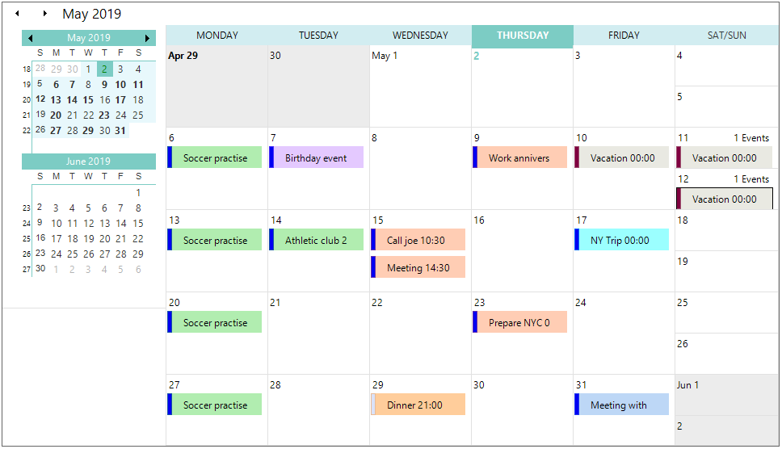

# Metro Theme for Essential Schedule

This feature enables you to apply new Metro styles to the Schedule control. 

### Use Case Scenario

The Metro theme support is useful for commercial applications in order to attract end users with inspiring UI look and feel.

### Properties

<table>
<tr>
<th>
Property</th><th>
Description</th></tr>
<tr>
<td>
VisualStyle</td><td>
This is an enumeration type property. It is used to get or set the visual styles (skins) such as Office2010, Office2007, Office2003, Metro, etc.</td></tr>
</table>

### Events

<table>
<tr>
<th>
Event</th><th>
Parameters</th><th>
Description</th></tr>
<tr>
<td>
ThemeChanged</td><td>
Object sender, EventArgs e</td><td>
Occurs when the ThemesEnabled property is changed.</td></tr>
</table>

## Applying Metro Theme to the Schedule Control

You can apply the Metro theme to the Schedule control by setting the GridVisualStyles property as Metro. The following code example illustrates this.



this.scheduleControl1.GetScheduleHost().Schedule.Appearance.VisualStyle = Syncfusion.Windows.Forms.GridVisualStyles.Metro;





Me.scheduleControl1.GetScheduleHost().Schedule.Appearance.VisualStyle = Syncfusion.Windows.Forms.GridVisualStyles.Metro



The following screenshot is a sample output for the previous code.

