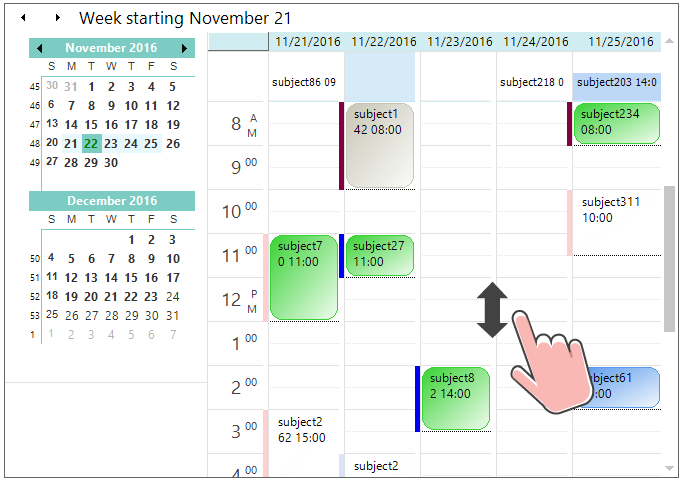

---
layout: post
title: Touch Support in ScheduleControl for Syncfusion Essential Windows Forms
description: This section explains about the touch support in ScheduleControl
platform: WindowsForms
control: Schedule
documentation: ug
--- 

# Touch Support
ScheduleControl provides the swipe scrolling, zooming touch support as like Outlook calendar. The touch support for schedule control can be enabled by setting the [EnableTouchMode](https://help.syncfusion.com/cr/cref_files/windowsforms/Syncfusion.Schedule.Windows~Syncfusion.Windows.Forms.Schedule.ScheduleControl~EnableTouchMode.html#) property to `true`. This will enable the grid to support the swiping, panning and zooming. The default value of `EnableTouchMode` property is `false`.


//Enable the touch mode
scheduleControl1.EnableTouchMode = true;


'Enable the touch mode
scheduleControl1.EnableTouchMode = True


## Touch Swiping
ScheduleControl allows to perform the vertical swipe scrolling in Day, `WorkWeek` and custom views. The previous or next values can be viewed by perform the horizontal swipe scrolling in left to right or right to left direction as like MS Outlook.

## Touch Zooming
The ScheduleControl view can be changed when perform the zooming operation as like MS Outlook calendar. 

