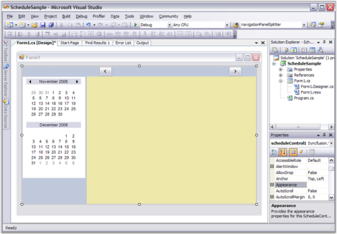
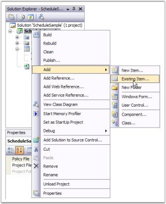
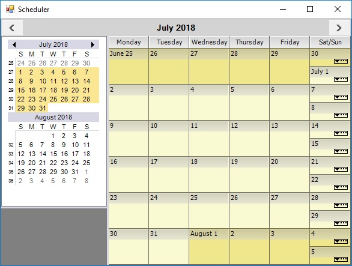
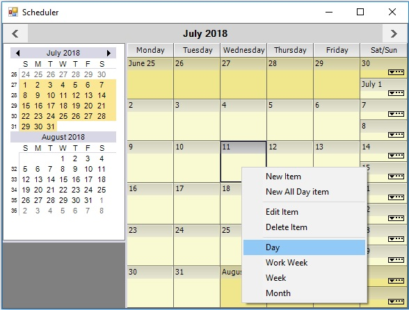
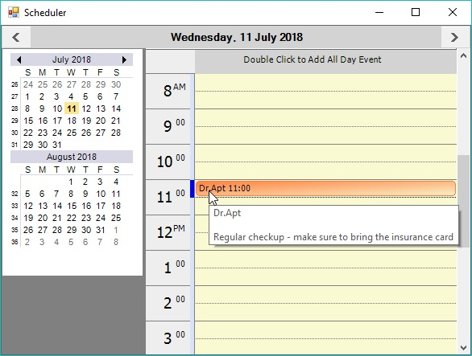
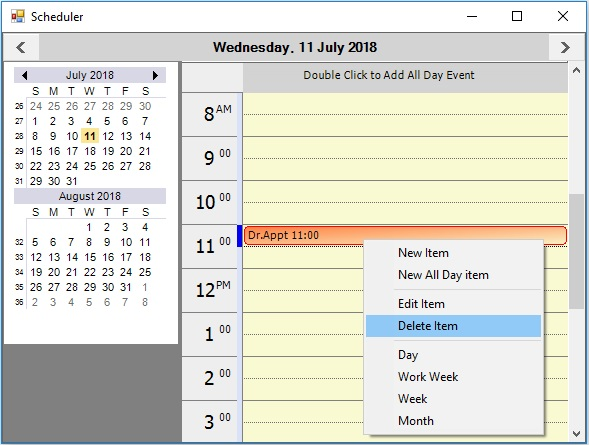
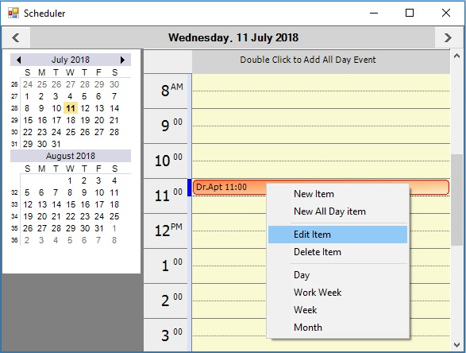
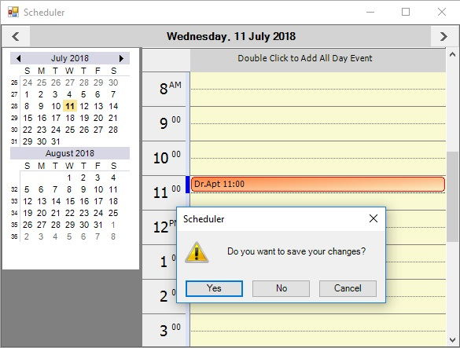

# Getting Started with Windows Forms Scheduler (Schedule)

This section guides getting started with Windows application, controls, etc.

## Assembly deployment

Refer to [control dependencies](https://help.syncfusion.com/windowsforms/control-dependencies#schedule) section to get the list of assemblies or [NuGet package](https://help.syncfusion.com/windowsforms/installation/install-nuget-packages) that should be added as reference to use the control in any application. 

## Creating application with the ScheduleControl

In this walkthrough, user will create a WinForms application that contains the [Windows Forms Scheduler](https://www.syncfusion.com/winforms-ui-controls/scheduler) (Schedule) control.

### Creating the project

Create a new Windows Forms project in Visual Studio to display the Windows Forms Scheduler (Schedule) control with data objects.

### Adding control via designer

1. The Schedule control can be added to the application by dragging it from the Toolbox and dropping it in designer. The required assembly references will be added automatically.

   

2. The ScheduleControl will be shown on the design surface. Following screenshot is a typical display of this. Notice the Appearance property in the property grid. This object has many properties that affects the appearance of the ScheduleControl.

   
	
### Adding control by code

To add the control manually, follow the steps:

1.Add the following required assembly references to the project:

* Syncfusion.Grid.Base.
* Syncfusion.Grid.Windows.
* Syncfusion.Schedule.Base.
* Syncfusion.Schedule.Windows.
* Syncfusion.Shared.Base.
* Syncfusion.Tools.Windows.

2.Create the ScheduleControl instance in the application form constructor.



using Syncfusion.Windows.Forms.Schedule;
namespace WindowsFormsApplication1
{
    public partial class Form1 : Form
    {
        public Form1()
        {
            InitializeComponent();
            ScheduleControl scheduleControl1 = new ScheduleControl();
            scheduleControl1.Location = new Point(82, 12);
            scheduleControl1.Size = new Size(350, 360);
            this.Controls.Add(scheduleControl1);
        }
    }
}



Imports Syncfusion.Windows.Forms.Schedule
Namespace WindowsFormsApplication1
    Public Partial Class Form1
        Inherits Form
        Public Sub New()
            InitializeComponent()
            Dim scheduleControl1 As ScheduleControl = New ScheduleControl()
            scheduleControl1.Location = New Point(82, 12)
            scheduleControl1.Size = New Size(350, 360)
            Me.Controls.Add(scheduleControl1)
        End Sub
    End Class
End Namespace



### Binding data to the ScheduleControl

The ScheduleControl is a data bound control. So, the data must be created for an application to generate the appointments.

### Creating appointment for the ScheduleControl using SimpleScheduleDataProvider

Follow the steps to create an appointment:

1. Add an existing file to the SimpleScheduleDataProvider.cs (add  SimpleScheduleDataProvider.vb if you are using VB.NET) project.

This file defines several classes that implements  the ScheduleControl interfaces that manages the data associated with appointments appeared in the calendar. These interfaces are discussed in detail later in this UserGuide. 

Use the implementation provided in the `SimpleScheduleDataProvider.cs` file. This file ships as part of the [Schedule sample](https://github.com/syncfusion/winforms-demos/tree/master/schedulecontrol/Scheduler%20Demo/CS). Drill down to this folder and add this file to your project by using the Solution Explorer window.

2. You can find the `SimpleScheduleDataProvider.cs` file in the [Syncfuion_build_installed_location]\Syncfusion\Essential Studio\&lt;Product_version&gt;\Windows\Schedule.Windows\ Samples\&lt;Framework_version&gt;\ScheduleSample\CS_ folder. Drill down to this folder and add this file to our project.

3. After adding the `SimpleScheduleDataProvider.cs` code file, add some code to your Form.cs to provide data support to your ScheduleControl.

First, add using statement to refer class names in the `SimpleScheduleDataProvider.cs` file without adding the Namespace used in that file.
The other is added in the Form_Load code to hook up the data support. 
In the `Form_Load`, create an instance of the DataProvider and a MasterList to hold the data. 
Then, set some properties to provide a filename. The ScheduleViewType for the initial display and the DataSource property for the ScheduleControl.
Copy this code to your Form1.cs file.



using System;
using System.Collections.Generic;
using System.ComponentModel;
using System.Data;
using System.Drawing;
using System.Text;
using System.Windows.Forms;
using Syncfusion.Windows.Forms.Schedule;
using GridScheduleSample;
namespace ScheduleSample
{
    public partial class Form1 : Form
    {
	 	public Form1()
	 	{
			InitializeComponent();
		}

		private void Form1_Load(object sender, EventArgs e)
		{
			SimpleScheduleDataProvider data = new SimpleScheduleDataProvider();
			data.MasterList = new SimpleScheduleAppointmentList();
			data.FileName = "default.schedule";
			this.scheduleControl1.ScheduleType = ScheduleViewType.Month;
			this.scheduleControl1.DataSource = data;
		}

	 }

}


Imports System
Imports System.Collections.Generic
Imports System.ComponentModel
Imports System.Data
Imports System.Drawing
Imports System.Text
Imports System.Windows.Forms
Imports Syncfusion.Windows.Forms.Schedule
Imports GridScheduleSample

Namespace ScheduleSample

    Public Partial Class Form1
        Inherits Form

        Public Sub New()
            InitializeComponent()
        End Sub

        Private Sub Form1_Load(ByVal sender As Object, ByVal e As EventArgs)
            Dim data As SimpleScheduleDataProvider = New SimpleScheduleDataProvider()
            data.MasterList = New SimpleScheduleAppointmentList()
            data.FileName = "default.schedule"
            Me.scheduleControl1.ScheduleType = ScheduleViewType.Month
            Me.scheduleControl1.DataSource = data
        End Sub
    End Class
End Namespace



4. Press `F5` key to compile and run your application. 

 
## Changing views

The ScheduleControl supports for five schedule view types:

* Month
* Day
* Week
* WorkWeek
* CustomWeek

To change month view to day view, right-click the ScheduleGrid area of the ScheduleControl to display a ContextMenu and select a day.

	
You can also change to other schedule views using this ContextMenu. 

	
## Appointments

The Schedule control supports to insert, remove, modify, and save all the appointment details.

### Insert

Double-click one of the timeslots on the ScheduleGrid. This action will display a new appointment screen where you can enter a new schedule item.

Clicking the Save and Close button on the Appointment, the screen will re-display the `Day view` ScheduleControl with a new appointment. If you hover over the appointment in the ScheduleGrid, a tooltip will display.

### Remove

Right click on the appointment and select the Delete Item from the context menu to remove the selected appointment.

### Modify

Double-click on the appointment or right-click and choose the Edit Item from context menu.

This action will display an appointment form with appointment details to modify the appointment then, click on Save and Close button.

### Save all the appointment

Click the Close button on the form system menu on the upper-right corner of the form. Because, the data has been modified in this ScheduleControl. A dialog will appear as follows, click Yes to save the changes to a disk file.

	
Then modify our `Form_Load` code to conditionally reload the saved data if the file is present on the disk. Copy this code to your Form1.cs file. Notice that you have added a `using` statement to reference the `System.IO namespace` to the new code in the Form1_Load.



using System;
using System.Collections.Generic;
using System.ComponentModel;
using System.Data;
using System.Drawing;
using System.Text;
using System.Windows.Forms;
using Syncfusion.Windows.Forms.Schedule;
using GridScheduleSample;
using System.IO;
namespace ScheduleSample
{
	public partial class Form1 : Form
	{
	    public Form1()
		{
			InitializeComponent();
		}
		
		private void Form1_Load(object sender, EventArgs e)
		{
			SimpleScheduleDataProvider data;

			if (File.Exists("default.schedule"))
			{
				data = SimpleScheduleDataProvider.LoadBinary("default.schedule");
				data.FileName = "default.schedule";
			}

			else
			{
    			data = new SimpleScheduleDataProvider();
				data.MasterList = new SimpleScheduleAppointmentList();
				data.FileName = "default.schedule";
			}
				this.scheduleControl1.ScheduleType = ScheduleViewType.Month;
				this.scheduleControl1.DataSource = data;
		}

	}

}


Imports System
Imports System.Collections.Generic
Imports System.ComponentModel
Imports System.Data
Imports System.Drawing
Imports System.Text
Imports System.Windows.Forms
Imports Syncfusion.Windows.Forms.Schedule
Imports GridScheduleSample
Imports System.IO

Namespace ScheduleSample

    Public Partial Class Form1
        Inherits Form

        Public Sub New()
            InitializeComponent()
        End Sub

        Private Sub Form1_Load(ByVal sender As Object, ByVal e As EventArgs)
            Dim data As SimpleScheduleDataProvider
            If File.Exists("default.schedule") Then
                data = SimpleScheduleDataProvider.LoadBinary("default.schedule")
                data.FileName = "default.schedule"
            Else
                data = New SimpleScheduleDataProvider()
                data.MasterList = New SimpleScheduleAppointmentList()
                data.FileName = "default.schedule"
            End If

            Me.scheduleControl1.ScheduleType = ScheduleViewType.Month
            Me.scheduleControl1.DataSource = data
        End Sub
    End Class
End Namespace



Compile and run the application again. The Month view should reappear but this time the added appointment will appear.

### TextColor

Text color of the appointment can be set by using **ForeColor** property.



SimpleScheduleAppointmentList masterList = new SimpleScheduleAppointmentList();

ScheduleAppointment item = masterList.NewScheduleAppointment() as ScheduleAppointment;
item.StartTime = DateTime.Now;
item.EndTime = item.StartTime.AddDays(2);
item.ForeColor = Color.Red;
masterList.Add(item);


Dim masterList As New SimpleScheduleAppointmentList()

Dim item As ScheduleAppointment = TryCast(masterList.NewScheduleAppointment(),ScheduleAppointment)
item.StartTime = DateTime.Now
item.EndTime = item.StartTime.AddDays(2)
item.ForeColor = Color.Red
masterList.Add(item)



### Schedule appointment

The ScheduleData base classes provides the appointments data used by the ScheduleControl. For code details of deriving these ScheduleData base classes to implement a data provider for the ScheduleControl, see the SimpleScheduleDataProvider code file that ships as part of the ScheduleSample sample.

#### ScheduleAppointment class

The ScheduleAppointment class defines the objects that represent the appointments in the Schedule control. This class implements IScheduleAppointment to provide an object to hold the concrete data associated with appointments. You can either derive this class or implement IScheduleAppointment to extend or modify the information managed by the ScheduleAppointment class. The properties exposed in ScheduleAppointment are:

* **UniqueID:** Gets or sets a unique integer associated with the item.
* **Owner:** Gets or sets an integer to identify the owner (if any) of the item.
* **StartTime:** Gets or sets the start time of the item.
* **EndTime:** Gets or sets the end time of the item.
* **Subject:** Gets or sets a text string identifying the topic of the item.
* **Content:** Gets or sets a text string holding the details or comments for the appointment item.
* **AllDay:** Gets or sets whether the appointment is an all-day appointment or not.
* **LabelValue:** Gets or sets an integer categorizer value for the item.
* **MarkerValue:** Gets or sets an integer marker value for the item.
* **Reminder:** Gets or sets a reminder event raised when the StartTime of the item gets closed.
* **ReminderValue:** Gets or sets the type of the reminder event raised when the StartTime of the item gets closed.
* **LocationValue:** Gets or sets a string associated with the item.
* **Version:** Gets integer format of the version number (used to support data format versioning).
* **Tag:** Gets or sets an arbitrary object associated with the item.
* **Dirty:** Gets or sets whether the item has been modified or not.
* **IgnoreChanges:** Gets or sets the changes to the item affect the Dirty property.
* **ForeColor:** Gets or sets the text color of the item.

#### ScheduleAppointmentList class

The ScheduleAppointmentList is a collection of IScheduleAppointments that serves as data for the Schedule Control. This class is a wrapper class for an ArrayList and implements IComparer to order this list by the item's StartTime. If two items start at the same time, the EndTime is used as well to determine the order. Longer appointments rank higher. Here are the properties and methods exposed in ScheduleAppointmentList.



/// Gets or sets the i-th IScheduleAppointment in this list.
public virtual IScheduleAppointment this[int i];

/// Gets the number of IScheduleAppointments in this list.

public virtual int Count

/// Sorts this list on the IScheduleAppointment.StartTime property.

public virtual void SortStartTime()

/// Adds an IScheduleAppointment to this list.

/// item - The IScheduleAppointment to be added.

public virtual void Add(IScheduleAppointment item)

/// Inserts an IScheduleAppointment into this list.

/// index - The position in the list where the item is to be inserted. 

/// item - The IScheduleAppointment to be inserted. 

public virtual void Insert(int index, IScheduleAppointment item)

/// Removes an IScheduleAppointment from this list.

/// item - The IScheduleAppointment to be removed. 

public virtual void Remove(IScheduleAppointment item)

/// Removes an IScheduleAppointment from this list.

/// index - The position of the item to be removed.

public virtual void RemoveAt(int index)

/// Returns the position of the specified item within this list.

/// item - The search item. 

public virtual int IndexOf(IScheduleAppointment item)

/// Returns a new ScheduleAppointment populated with default values.

public virtual IScheduleAppointment NewScheduleAppointment()


'Gets or sets the i-th IScheduleAppointment in this list.
Public Overridable Default Property Item(ByVal i As Integer) As IScheduleAppointment
'Gets the number of IScheduleAppointments in this list.
Public Overridable Count As Integer
'Sorts this list on the IScheduleAppointment.StartTime property.
Public Overridable Sub SortStartTime()
'Adds an IScheduleAppointment to this list.
'item - The IScheduleAppointment to be added.
Public Overridable Sub Add(ByVal item As IScheduleAppointment)
'Inserts an IScheduleAppointment into this list.
'index - The position in the list where the item is to be inserted.
'item - The IScheduleAppointment to be inserted.
Public Overridable Sub Insert(ByVal index As Integer, ByVal item As IScheduleAppointment)
'Removes an IScheduleAppointment from this list.
'item - The IScheduleAppointment to be removed.
Public Overridable Sub Remove(ByVal item As IScheduleAppointment)
'Removes an IScheduleAppointment from this list.
'index - The position of the item to be removed.
Public Overridable Sub RemoveAt(ByVal index As Integer)
'Returns the position of the specified item within this list.
'item - The search item.
Public Overridable Function IndexOf(ByVal item As IScheduleAppointment) As Integer
'Returns a new ScheduleAppointment populated with default values.
Public Overridable Function NewScheduleAppointment() As IScheduleAppointment



#### ScheduleDataProvider class

The ScheduleDataProvider has two functional roles:

1.Implements IScheduleDataProvider in a virtual manner so that, the derived classes can provide concrete implementations through virtual overrides. The IScheduleDataProvider virtual methods exposed in ScheduleDataProvider that have empty implementations. So, you are required to derive this class to use it. 
2.Provides the DropList data. For this second role, the ScheduleDataProvider does provide concrete implementations for the virtual methods it exposes. So, in your derived class, you would have populated drop lists without doing further work, though you can choose to customize these drop lists through virtual overrides. Here is a list of the stub methods exposed by ScheduleDataProvider in its first role.



/// Return an IScheduleAppointmentList holding the schedule items for the given date. 
public virtual IScheduleAppointmentList GetScheduleForDay(DateTime day)
//// Return an IScheduleAppointmentList holding the schedule items between the given dates.
public virtual IScheduleAppointmentList GetSchedule(DateTime startDate, DateTime endDate)
/// Return an IScheduleAppointmentList holding the schedule items for a particular owner on the given date. 
public virtual IScheduleAppointmentList GetScheduleForDay(DateTime day, int owner)
/// Return an IScheduleAppointmentList holding the schedule items for a particular owner between the given dates.
public virtual IScheduleAppointmentList GetSchedule(DateTime startDate, DateTime endDate, int owner)
/// Saves any modified ScheduleAppointments.
public virtual void CommitChanges()
/// Gets or sets whether CommitChanges is called when the ScheduleControl is disposed.
public SaveOnCloseBehavior SaveOnCloseBehaviorAction
/// Gets or sets whether data source is modified or not.
public virtual bool IsDirty
/// Returns a new ScheduleAppointment populated with default values.
public virtual IScheduleAppointment NewScheduleAppointment()
/// Adds a ScheduleAppointment to the list.
public virtual void AddItem(IScheduleAppointment item)
/// Removes a ScheduleAppointment from the list. 
public virtual void RemoveItem(IScheduleAppointment item)


'Return an IScheduleAppointmentList holding the schedule items for the given date.
Public Overridable Function GetScheduleForDay(ByVal day As DateTime) As IScheduleAppointmentList
'Return an IScheduleAppointmentList holding the schedule items between the given dates.
Public Overridable Function GetSchedule(ByVal startDate As DateTime, ByVal endDate As DateTime) As IScheduleAppointmentList
'Return an IScheduleAppointmentList holding the schedule items for a particular owner on the given date. 
Public Overridable Function GetScheduleForDay(ByVal day As DateTime, ByVal owner As Integer) As IScheduleAppointmentList
'Return an IScheduleAppointmentList holding the schedule items for a particular owner between the given dates.
Public Overridable Function GetSchedule(ByVal startDate As DateTime, ByVal endDate As DateTime, ByVal owner As Integer) As IScheduleAppointmentList
'Saves any modified ScheduleAppointments.
Public Overridable Sub CommitChanges()
'Gets or sets whether CommitChanges is called when the ScheduleControl is disposed.
Public SaveOnCloseBehaviorAction As SaveOnCloseBehavior
'Gets or sets whether data source is modified or not.
Public Overridable IsDirty As Boolean
'Returns a new ScheduleAppointment populated with default values.
Public Overridable Function NewScheduleAppointment() As IScheduleAppointment
'Adds a ScheduleAppointment to the list.
Public Overridable Sub AddItem(ByVal item As IScheduleAppointment)
'Removes a ScheduleAppointment from the list.
Public Overridable Sub RemoveItem(ByVal item As IScheduleAppointment)



Here are the methods and properties used as part of the ScheduleDataProvider's second role, providing the DropList data. The following is the actual implementation code which gives an indication of the exposed functionality.



/// Provides default drop lists for entering IScheduleAppointment data. 

/// You can override this method to provide customized drop lists.

public virtual void InitLists()
{
labelList = new ListObjectList();
labelList.Add(new ListObject(0,"None", Color.White)); 
labelList.Add(new ListObject(1,"Important", Color.FromArgb(255,128,64)));
labelList.Add(new ListObject(2,"Business",  Color.FromArgb(86,152,233)));
labelList.Add(new ListObject(3,"Personal",  Color.FromArgb(57,210,53)));
labelList.Add(new ListObject(4,"Vacation",  Color.FromArgb(199,198,182)));
labelList.Add(new ListObject(5,"Must Attend",  Color.FromArgb(255,128,0)));
labelList.Add(new ListObject(6,"Travel Required",  Color.FromArgb(0,255,255)));
labelList.Add(new ListObject(7,"Needs Preparation",  Color.FromArgb(171,171,88)));
labelList.Add(new ListObject(8,"Birthday",  Color.FromArgb(186,117,255)));
labelList.Add(new ListObject(9,"Anniversary",  Color.FromArgb(255,128,64)));
labelList.Add(new ListObject(10,"Phone Call",  Color.FromArgb(255,128,64)));
markerList = new ListObjectList();

//same as no Mark Color
markerList.Add(new ListObject(0,"Free", Color.FromArgb(50, Color.RoyalBlue)));
markerList.Add(new ListObject(1,"Tentative", Color.FromArgb(255, 206, 206)));
markerList.Add(new ListObject(2,"Busy",  Color.FromArgb(0,0,242)));
markerList.Add(new ListObject(3,"Out of Office",  Color.FromArgb(128, 0 ,64)));
reminderList = new ListObjectList();
reminderList.Add(new ListObject(0,"0 minutes", Color.White)); 
reminderList.Add(new ListObject(1,"5 minutes", Color.White)); 
reminderList.Add(new ListObject(2,"10 minutes", Color.White)); 
reminderList.Add(new ListObject(3,"15 minutes", Color.White)); 
reminderList.Add(new ListObject(4,"30 minutes", Color.White)); 
reminderList.Add(new ListObject(5,"1 hour", Color.White)); 
reminderList.Add(new ListObject(6,"2 hours", Color.White)); 
reminderList.Add(new ListObject(7,"3 hours", Color.White)); 
reminderList.Add(new ListObject(8,"4 hours", Color.White)); 
this.locationList = new ListObjectList();
locationList.Add(new ListObject(0,"", Color.White)); 
locationList.Add(new ListObject(1,"RoomB", Color.White)); 
locationList.Add(new ListObject(2,"RoomC", Color.White)); 
locationList.Add(new ListObject(3,"RoomD", Color.White)); 
locationList.Add(new ListObject(4,"RoomE", Color.White)); 
}

/// Returns the list for the LabelValue options.

public virtual ILookUpObjectList GetLabels()
{
   return LabelList;
}

/// Gets or sets the list for the LabelList options.
protected ListObjectList LabelList
{
   get{return labelList;}
   set{labelList = value;}
}

/// Returns the list for the ReminderValue options.

public virtual ILookUpObjectList GetReminders()
{
   return ReminderList;
}

/// Gets or sets the list for the ReminderValue options.

protected ListObjectList ReminderList
{
   get{return reminderList;}
   set{reminderList = value;}
}

/// Returns the list for the MarkerValue options.

public virtual ILookUpObjectList GetMarkers()
{
   return MarkerList;
}

/// Gets or sets the list for the MarkerValue options.

protected ListObjectList MarkerList
{
   get{return markerList;}
   set{markerList = value;}
}

/// Returns the list for the LocationValue options.

public virtual ILookUpObjectList GetLocations()
{
   return LocationList;
}

/// Gets or sets the list for the LocationValue options.

protected ListObjectList LocationList
{
   get{return locationList;}
   set{locationList = value;}
}

/// Returns the list for the Owner options.

public virtual ILookUpObjectList GetOwners()
{
return OwnerList;
}

/// Gets or sets the list for the Owner options.

protected ListObjectList OwnerList
{
   get{return ownerList;}
   set{ownerList = value;}
}


'Provides default drop lists for entering IScheduleAppointment data. 

'You can override this method to provide customized drop lists.
Public Overridable Sub InitLists()
    labelList = New ListObjectList()
    labelList.Add(New ListObject(0, "None", Color.White))
    labelList.Add(New ListObject(1, "Important", Color.FromArgb(255, 128, 64)))
    labelList.Add(New ListObject(2, "Business", Color.FromArgb(86, 152, 233)))
    labelList.Add(New ListObject(3, "Personal", Color.FromArgb(57, 210, 53)))
    labelList.Add(New ListObject(4, "Vacation", Color.FromArgb(199, 198, 182)))
    labelList.Add(New ListObject(5, "Must Attend", Color.FromArgb(255, 128, 0)))
    labelList.Add(New ListObject(6, "Travel Required", Color.FromArgb(0, 255, 255)))
    labelList.Add(New ListObject(7, "Needs Preparation", Color.FromArgb(171, 171, 88)))
    labelList.Add(New ListObject(8, "Birthday", Color.FromArgb(186, 117, 255)))
    labelList.Add(New ListObject(9, "Anniversary", Color.FromArgb(255, 128, 64)))
    labelList.Add(New ListObject(10, "Phone Call", Color.FromArgb(255, 128, 64)))
    markerList = New ListObjectList()
    markerList.Add(New ListObject(0, "Free", Color.FromArgb(50, Color.RoyalBlue)))
    markerList.Add(New ListObject(1, "Tentative", Color.FromArgb(255, 206, 206)))
    markerList.Add(New ListObject(2, "Busy", Color.FromArgb(0, 0, 242)))
    markerList.Add(New ListObject(3, "Out of Office", Color.FromArgb(128, 0, 64)))
    reminderList = New ListObjectList()
    reminderList.Add(New ListObject(0, "0 minutes", Color.White))
    reminderList.Add(New ListObject(1, "5 minutes", Color.White))
    reminderList.Add(New ListObject(2, "10 minutes", Color.White))
    reminderList.Add(New ListObject(3, "15 minutes", Color.White))
    reminderList.Add(New ListObject(4, "30 minutes", Color.White))
    reminderList.Add(New ListObject(5, "1 hour", Color.White))
    reminderList.Add(New ListObject(6, "2 hours", Color.White))
    reminderList.Add(New ListObject(7, "3 hours", Color.White))
    reminderList.Add(New ListObject(8, "4 hours", Color.White))
    Me.locationList = New ListObjectList()
    locationList.Add(New ListObject(0, "", Color.White))
    locationList.Add(New ListObject(1, "RoomB", Color.White))
    locationList.Add(New ListObject(2, "RoomC", Color.White))
    locationList.Add(New ListObject(3, "RoomD", Color.White))
    locationList.Add(New ListObject(4, "RoomE", Color.White))
End Sub
'Returns the list for the LabelValue options.
Public Overridable Function GetLabels() As ILookUpObjectList
    Return LabelList
End Function
' Gets or sets the list for the LabelList options.
Protected Property LabelList As ListObjectList
    Get
        Return labelList
    End Get

    Set(ByVal value As ListObjectList)
        labelList = value
    End Set
End Property
'Returns the list for the ReminderValue options.
Public Overridable Function GetReminders() As ILookUpObjectList
    Return ReminderList
End Function
'Gets or sets the list for the ReminderValue options.
Protected Property ReminderList As ListObjectList
    Get
        Return reminderList
    End Get

    Set(ByVal value As ListObjectList)
        reminderList = value
    End Set
End Property
'Returns the list for the MarkerValue options.
Public Overridable Function GetMarkers() As ILookUpObjectList
    Return MarkerList
End Function
'Gets or sets the list for the MarkerValue options.
Protected Property MarkerList As ListObjectList
    Get
        Return markerList
    End Get

    Set(ByVal value As ListObjectList)
        markerList = value
    End Set
End Property
'Returns the list for the LocationValue options.
Public Overridable Function GetLocations() As ILookUpObjectList
    Return LocationList
End Function
'Gets or sets the list for the LocationValue options.
Protected Property LocationList As ListObjectList
    Get
        Return locationList
    End Get

    Set(ByVal value As ListObjectList)
        locationList = value
    End Set
End Property
'Returns the list for the Owner options.
Public Overridable Function GetOwners() As ILookUpObjectList
    Return OwnerList
End Function
'Gets or sets the list for the Owner options.
Protected Property OwnerList As ListObjectList
    Get
        Return ownerList
    End Get

    Set(ByVal value As ListObjectList)
        ownerList = value
    End Set
End Property


## Recurrence appointment

The Schedule control supports creating the recurring appointment. By this recurrence appointment, you can process on the daily, weekly, monthly, or yearly view to create the recurrence rule with or without end date. Details are explained in the following link:

[Create the recurrence appointment](time-interval)
