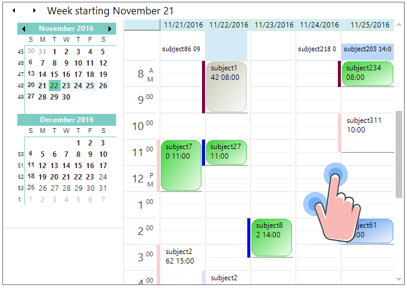

---
layout: post
title: Touch Support in Windows Forms Scheduler control | Syncfusion
description: Learn about Touch Support in Syncfusion® Windows Forms Scheduler (Schedule) control and more details.
platform: WindowsForms
control: Schedule
documentation: ug
--- 

# Touch Support in Windows Forms Scheduler (Schedule)

The ScheduleControl provides the swipe scrolling and zooming touch support like Outlook calendar. The touch support for schedule control can be enabled by setting the [EnableTouchMode](https://help.syncfusion.com/cr/windowsforms/Syncfusion.Windows.Forms.Schedule.ScheduleControl.html#Syncfusion_Windows_Forms_Schedule_ScheduleControl_EnableTouchMode) property to `true`. This will enable the grid to support the swiping, panning, and zooming. Default value of the `EnableTouchMode` property is `false`.



//Enable the touch mode
scheduleControl1.EnableTouchMode = true;


'Enable the touch mode
scheduleControl1.EnableTouchMode = True



## Touch swiping

The ScheduleControl allows you to perform the vertical swipe scrolling in Day, `WorkWeek`, and custom views. The previous or next value can be viewed by horizontal swipe scrolling in left to right or right to left direction like MS Outlook.

## Touch zooming

The ScheduleControl view can be changed when zooming like MS Outlook calendar. 

