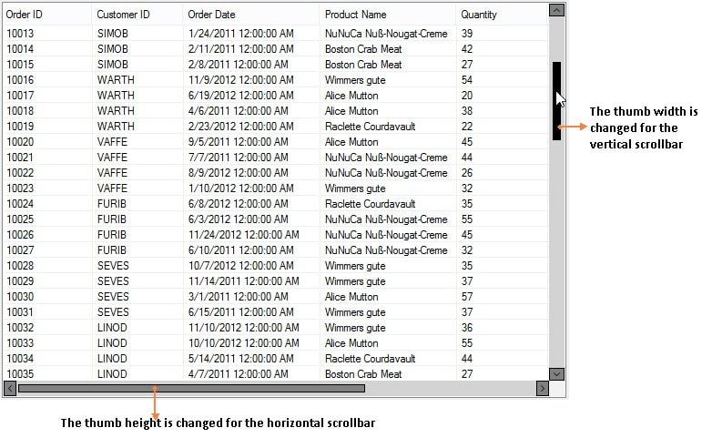
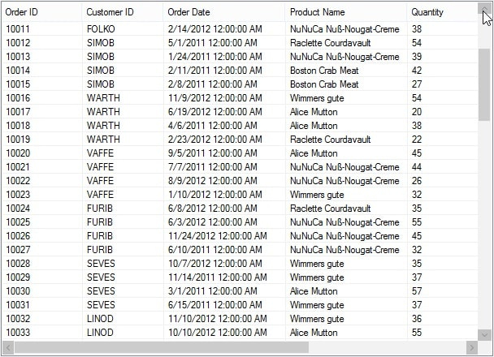
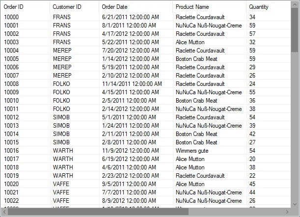
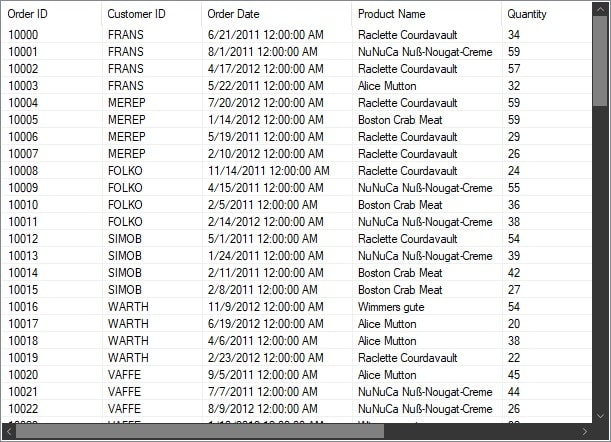
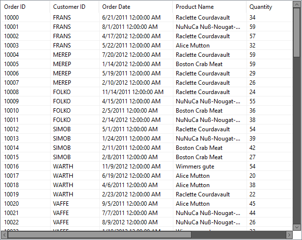
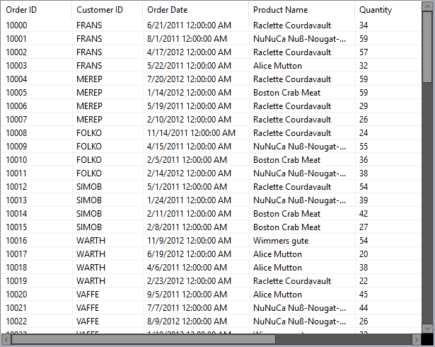

# Appearance in Windows Forms Scroll Frame (SfScrollFrame)

This section explains how to customize the default appearance of the scrollbars using the [style](https://help.syncfusion.com/cr/windowsforms/Syncfusion.WinForms.Controls.SfScrollFrame.html#Syncfusion_WinForms_Controls_SfScrollFrame_Style) properties. By default, the [SfScrollFrame](https://help.syncfusion.com/cr/windowsforms/Syncfusion.WinForms.Controls.SfScrollFrame.html) loads the scrollbars with default appearance. 

### Scrollbar appearance

The inner elements of the scrollbar can be customized by using the [ScrollBarStyleInfo](https://help.syncfusion.com/cr/windowsforms/Syncfusion.WinForms.Controls.Styles.ScrollBarStyleInfo.html) property, that allows changing the appearance of the horizontal and vertical scrollbars separately.

The horizontal scrollbar appearance can be customized by using the `HorizontalScrollBar.Style` property. The `ScrollBarStyleInfo` contains all the settings that controls the appearance of the scrollbar.



//Sets the back color of the horizontal scrollbar arrow button.
this.sfScrollFrame1.HorizontalScrollBar.Style.ArrowButtonBackColor = Color.Gray;
this.sfScrollFrame1.HorizontalScrollBar.Style.ArrowButtonHoverBackColor = Color.White;
this.sfScrollFrame1.HorizontalScrollBar.Style.ArrowButtonPressedBackColor = Color.Blue;

//Sets the fore color of the horizontal scrollbar arrow button.
this.sfScrollFrame1.HorizontalScrollBar.Style.ArrowButtonForeColor = Color.Black;
this.sfScrollFrame1.HorizontalScrollBar.Style.ArrowButtonHoverForeColor = Color.Black;
this.sfScrollFrame1.HorizontalScrollBar.Style.ArrowButtonPressedForeColor = Color.Gray;
this.sfScrollFrame1.HorizontalScrollBar.Style.ArrowButtonBorderColor = Color.Black;

// Specify the border style properties
this.sfScrollFrame1.HorizontalScrollBar.Style.ThumbColor = Color.Gray;
this.sfScrollFrame1.HorizontalScrollBar.Style.ThumbHoverColor = Color.Black;
this.sfScrollFrame1.HorizontalScrollBar.Style.ThumbPressedColor = Color.Blue;
this.sfScrollFrame1.HorizontalScrollBar.Style.ThumbBorderColor = Color.Black;

// Sets the back color of the horizontal scrollbar.
this.sfScrollFrame1.HorizontalScrollBar.Style.ScrollBarBackColor = Color.LightGray;



The vertical scroll bar appearance can be customized by using the `VerticalScrollBar.Style` property.



//Sets the back color of the vertical scrollbar arrow button.
this.sfScrollFrame1.VerticalScrollBar.Style.ArrowButtonBackColor = Color.Gray;
this.sfScrollFrame1.VerticalScrollBar.Style.ArrowButtonHoverBackColor = Color.White;
this.sfScrollFrame1.VerticalScrollBar.Style.ArrowButtonPressedBackColor = Color.Blue;

//Sets the fore color of the vertical scrollbar arrow button.
this.sfScrollFrame1.VerticalScrollBar.Style.ArrowButtonForeColor = Color.Black;
this.sfScrollFrame1.VerticalScrollBar.Style.ArrowButtonHoverForeColor = Color.Black;
this.sfScrollFrame1.VerticalScrollBar.Style.ArrowButtonPressedForeColor = Color.Gray;
this.sfScrollFrame1.VerticalScrollBar.Style.ArrowButtonBorderColor = Color.Black;

// Sets the style properties of the thumb.
this.sfScrollFrame1.VerticalScrollBar.Style.ThumbColor = Color.Gray;
this.sfScrollFrame1.VerticalScrollBar.Style.ThumbHoverColor = Color.Black;
this.sfScrollFrame1.VerticalScrollBar.Style.ThumbPressedColor = Color.Blue;
this.sfScrollFrame1.VerticalScrollBar.Style.ThumbBorderColor = Color.Black;

// Sets the back color of the vertical scrollbar.
this.sfScrollFrame1.VerticalScrollBar.Style.ScrollBarBackColor = Color.LightGray;



### Changing the Scrollbar thumb width

The size of the scrollbar thumb can be changed by using the [ThumbWidth](https://help.syncfusion.com/cr/windowsforms/Syncfusion.WinForms.Controls.Styles.ScrollBarStyleInfo.html#Syncfusion_WinForms_Controls_Styles_ScrollBarStyleInfo_ThumbWidth) property of the corresponding `Style` property.



// To set the height of the horizontal scrollbar thumb.
this.sfScrollFrame1.HorizontalScrollBar.Style.ThumbWidth = 8;

// To set the width of the vertical scrollbar thumb.
this.sfScrollFrame1.VerticalScrollBar.Style.ThumbWidth = 8;



N> This width can be set maximum to the width and height of the vertical and horizontal scrollbars respectively. 

## Disabling the maximum and minimum buttons

The minimum and maximum arrow buttons of the scrollbar can be disabled by setting the [EnableMaximumArrow](https://help.syncfusion.com/cr/windowsforms/Syncfusion.WinForms.Controls.ScrollBarBase.html#Syncfusion_WinForms_Controls_ScrollBarBase_EnableMaximumArrow) and [EnableMinimumArrow](https://help.syncfusion.com/cr/windowsforms/Syncfusion.WinForms.Controls.ScrollBarBase.html#Syncfusion_WinForms_Controls_ScrollBarBase_EnableMinimumArrow) properties to `false`. The default value is `true`. 

If you disable the max or min button, the scrollbar cannot be scrolled using those buttons.



//Disable the maximum and minimum arrows of the vertical scrollbar. 
this.sfScrollFrame1.VerticalScrollBar.EnableMaximumArrow = false;
this.sfScrollFrame1.VerticalScrollBar.EnableMinimumArrow = false;

//Disable the maximum and minimum arrows of the horizontal scrollbar. 
this.sfScrollFrame1.HorizontalScrollBar.EnableMaximumArrow = false;
this.sfScrollFrame1.HorizontalScrollBar.EnableMinimumArrow = false;



The color of the disabled arrow button can also be specified by using [ArrowButtonDisabledBackColor](https://help.syncfusion.com/cr/windowsforms/Syncfusion.WinForms.Controls.Styles.ScrollBarStyleInfo.html#Syncfusion_WinForms_Controls_Styles_ScrollBarStyleInfo_ArrowButtonDisabledBackColor) and [ArrowButtonDisabledForeColor](https://help.syncfusion.com/cr/windowsforms/Syncfusion.WinForms.Controls.Styles.ScrollBarStyleInfo.html#Syncfusion_WinForms_Controls_Styles_ScrollBarStyleInfo_ArrowButtonDisabledForeColor) of the corresponding scrollbar.



//Set the arrow button disabled back color
this.sfScrollFrame1.VerticalScrollBar.Style.ArrowButtonDisabledBackColor = Color.Silver;
this.sfScrollFrame1.HorizontalScrollBar.Style.ArrowButtonDisabledBackColor = Color.Silver;

//Sets the arrow button disabled fore color
this.sfScrollFrame1.VerticalScrollBar.Style.ArrowButtonDisabledForeColor = Color.Gray;
this.sfScrollFrame1.HorizontalScrollBar.Style.ArrowButtonDisabledForeColor = Color.Gray;



## Disabling the Scrollbar Thumb

The scrollbar thumb can be disabled by setting the [EnableThumb](https://help.syncfusion.com/cr/windowsforms/Syncfusion.WinForms.Controls.ScrollBarBase.html#Syncfusion_WinForms_Controls_ScrollBarBase_EnableThumb) property to `false`. The default value is `true`.



//Disables the thumb for vertical and horizontal scrollbar.
this.sfScrollFrame1.HorizontalScrollBar.EnableThumb = false;
this.sfScrollFrame1.VerticalScrollBar.EnableThumb = false;



The disabled state thumb color can also be specified by using the [ThumbDisabledColor](https://help.syncfusion.com/cr/windowsforms/Syncfusion.WinForms.Controls.Styles.ScrollBarStyleInfo.html#Syncfusion_WinForms_Controls_Styles_ScrollBarStyleInfo_ThumbDisabledColor) property of the corresponding scrollbar style info.



// Sets the disabled thumb color of the scrollbar.
this.sfScrollFrame1.VerticalScrollBar.Style.ThumbDisabledColor = Color.Indigo;
this.sfScrollFrame1.HorizontalScrollBar.Style.ThumbDisabledColor = Color.Indigo;



## Themes

The SfScrollFrame offers six built-in themes for professional representation as follows:

* Office2016Colorful
* Office2016White
* Office2016DarkGray
* Office2016Black
* Office2019Colorful
* HighContrastBlack

Themes can be applied to the SfScrollFrame by using the following steps:

1. [Load theme assembly](#load-theme-assembly)
2. [Apply theme](#apply-theme)

### Load theme assembly

To set theme to `SfScrollFrame`, the following assemblies should be added as reference in any application.

<table>
<tr>
<td>
{{'**Assemblies**'| markdownify }}
</td>
<td>
{{'        **Themes**'| markdownify }}
</td>
</tr>
<tr>
<td>
Syncfusion.Office2016Theme.WinForms       
</td>
<td>
Office2016Colorful 
Office2016White 
Office2016DarkGray 
Office2016Black
</td>
</tr>
<tr>
<td>
Syncfusion.Office2019Theme.WinForms
</td>
<td>
Office2019Colorful
</td>
</tr>
<tr>
<td>
Syncfusion.HighContrastTheme.WinForms
</td>
<td>
HighContrastBlack
</td>
</tr>
</table>

Before applying theme to `SfScrollFrame`, required theme assembly should be loaded. 





using Syncfusion.WinForms.Controls;

         static class Program
    {
        /// 

        /// The main entry point for the application.
        /// 

        
        static void Main()
        {
            Syncfusion.Licensing.SyncfusionLicenseProvider.RegisterLicense(DemoCommon.FindLicenseKey());
            SfSkinManager.LoadAssembly(typeof(Syncfusion.WinForms.Themes.Office2016Theme).Assembly);
            SfSkinManager.LoadAssembly(typeof(Syncfusion.WinForms.Themes.Office2019Theme).Assembly);
            SfSkinManager.LoadAssembly(typeof(Syncfusion.HighContrastTheme.WinForms.HighContrastTheme).Assembly);
            Application.EnableVisualStyles();
            Application.SetCompatibleTextRenderingDefault(false);
            Application.Run(new Form1());
        }
    }





Imports Syncfusion.WinForms.Controls

 Friend Module Program
        ''' 

        ''' The main entry point for the application.
        ''' 

        Sub Main()
            Syncfusion.Licensing.SyncfusionLicenseProvider.RegisterLicense(DemoCommon.FindLicenseKey())
            SfSkinManager.LoadAssembly(GetType(Syncfusion.WinForms.Themes.Office2016Theme).Assembly)
            SfSkinManager.LoadAssembly(GetType(Syncfusion.WinForms.Themes.Office2019Theme).Assembly)
            SfSkinManager.LoadAssembly(GetType(Syncfusion.HighContrastTheme.WinForms.HighContrastTheme).Assembly)
            Application.EnableVisualStyles()
            Application.SetCompatibleTextRenderingDefault(False)
            Application.Run(New Form1())
        End Sub
    End Module





### Apply theme

Appearance of the SfScrollFrame can be changed by using the `ThemeName`.

#### Office2016Colorful

This option helps to set the Office2016Colorful Theme.





// Office2016Colorful

 this.SfScrollFrame.ThemeName = "Office2016Colorful";





' Office2016Colorful 

Me.SfScrollFrame.ThemeName = "Office2016Colorful"





#### Office2016White

This option helps to set the Office2016White Theme.





// Office2016White

 this.SfScrollFrame.ThemeName = "Office2016White";





' Office2016White 

Me.SfScrollFrame.ThemeName = "Office2016White"





#### Office2016DarkGray

This option helps to set the Office2016DarkGray Theme.





// Office2016DarkGray

 this.SfScrollFrame.ThemeName = "Office2016DarkGray";





' Office2016DarkGray 

Me.SfScrollFrame.ThemeName = "Office2016DarkGray"





#### Office2016Black

This option helps to set the Office2016Black Theme.





// Office2016Black

 this.SfScrollFrame.ThemeName = "Office2016Black";





' Office2016Black 

Me.SfScrollFrame.ThemeName = "Office2016Black"





### Office2019Colorful

This option helps to set the Office2019Colorful Theme.





// Office2019Colorful

 this.SfScrollFrame.ThemeName = "Office2019Colorful";
 




' Office2019Colorful

 Me.SfScrollFrame.ThemeName = "Office2019Colorful"
 




### HighContrastBlack

This option helps to set the HighContrastBlack Theme.





// HighContrastBlack

 this.SfScrollFrame.ThemeName = "HighContrastBlack";
 




' HighContrastBlack

 Me.SfScrollFrame.ThemeName = "HighContrastBlack"
 




