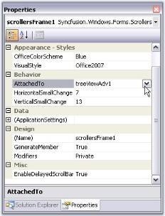
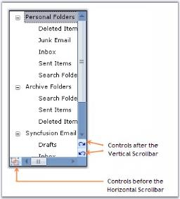
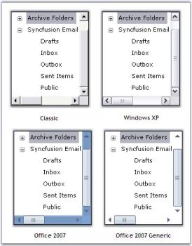
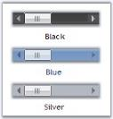
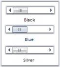
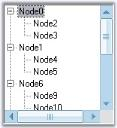

# Getting Started with Windows Forms ScrollersFrame

This section explains how to attach the ScrollersFrame to controls and use its basic functionalities.

## Prerequisites

Before using the ScrollersFrame, ensure the following are available:

* Visual Studio 2015 or later with the Windows Forms development workload.
* A Windows Forms application targeting .NET Framework 4.5+ or .NET 6.0+ (Windows).
* A valid [Syncfusion license](https://www.syncfusion.com/sales/communitylicense) registered in your project.
* A licensed Syncfusion WinForms installation, or the `Syncfusion.Shared.Base` [NuGet package](https://www.nuget.org/packages/Syncfusion.Shared.Base) added to the project.

## Table of contents

* [Assembly deployment](#assembly-deployment)
* [Attach ScrollersFrame to control](#attach-scrollersframe-to-control)
* [Adding controls to the scrollbars](#adding-controls-to-the-scrollbars)
* [Programmatic scrolling](#programmatic-scrolling)
* [Visual Styles](#visual-styles)
* [Custom colors](#custom-colors)
* [Troubleshooting](#troubleshooting)

## Assembly deployment

The following assembly should be referenced to use the ScrollersFrame in any application. Add it from the installed Syncfusion Essential Studio location, or install the corresponding NuGet package:

```
PM> Install-Package Syncfusion.Shared.Base
```

<table>
<tr>
<th>
Required assembly<br/><br/></th><th>
Description<br/><br/></th></tr>
<tr>
<td>
{{'[Syncfusion.Shared.Base](https://help.syncfusion.com/cr/windowsforms/Syncfusion.Windows.Forms.html)'| markdownify }}<br/><br/></td><td>
Contains the style-related properties and functionalities for the ScrollersFrame. The `Syncfusion.Core` assembly is referenced transitively.<br/><br/></td></tr>
</table>

## Attach ScrollersFrame to control

1. Drag the `ScrollersFrame` component from the **Syncfusion** tab of the **Toolbox** onto the form. This adds a `scrollersFrame1` instance to the form's component tray.
2. Add a scrollable control (for example, a `TreeViewAdv`) to the form if one is not already present.
3. Select the `scrollersFrame1` component and choose the target control from the [ScrollersFrame.AttachedTo](https://help.syncfusion.com/cr/windowsforms/Syncfusion.Windows.Forms.ScrollersFrame.html#Syncfusion_Windows_Forms_ScrollersFrame_AttachedTo) property in the **Properties** window.

The scrollable control's scrollbars are then replaced with the styled scrollbars of the selected visual style.





// Attaching ScrollersFrame to a control using the AttachedTo property
this.scrollersFrame1.AttachedTo = this.treeViewAdv1;


' Attaching ScrollersFrame to a control using the AttachedTo property
Me.scrollersFrame1.AttachedTo = Me.treeViewAdv1



N> The `AttachedTo` property lists all the scrollable controls added to the form. You can select any one of them to attach the ScrollersFrame.

## Adding controls to the scrollbars

The `ControlsAfter` and `ControlsBefore` collection properties, exposed by the [HorizontalScroller](https://help.syncfusion.com/cr/windowsforms/Syncfusion.Windows.Forms.ScrollersFrame.html#Syncfusion_Windows_Forms_ScrollersFrame_HorizontalScroller) and [VerticalScroller](https://help.syncfusion.com/cr/windowsforms/Syncfusion.Windows.Forms.ScrollersFrame.html#Syncfusion_Windows_Forms_ScrollersFrame_VerticalScroller) instances, let you add custom controls before or after the scrollbars. The collections accept any `System.Windows.Forms.Control` derivative (for example, `ButtonAdv`).

In the following sample, the `scrollersFrame2` component is attached to a control, and `buttonAdv1`, `buttonAdv2`, and `buttonAdv3` are `ButtonAdv` controls already added to the form.



// Adding controls to the scrollbars through ControlsAfter and ControlsBefore
this.scrollersFrame2.HorizontalScroller.ControlsBefore.Add(buttonAdv3);
this.scrollersFrame2.VerticalScroller.ControlsAfter.Add(buttonAdv1);
this.scrollersFrame2.VerticalScroller.ControlsAfter.Add(buttonAdv2);


' Adding controls to the scrollbars through ControlsAfter and ControlsBefore
Me.scrollersFrame2.HorizontalScroller.ControlsBefore.Add(buttonAdv3)
Me.scrollersFrame2.VerticalScroller.ControlsAfter.Add(buttonAdv1)
Me.scrollersFrame2.VerticalScroller.ControlsAfter.Add(buttonAdv2)





## Programmatic scrolling

The horizontal and vertical scrollers each expose a `Value` property that represents the current position of the scroll box at runtime. The `HorizontalSmallChange` and `VerticalSmallChange` properties control how much `Value` is incremented or decremented for each small scroll step. The `Value` is constrained by the `Minimum` and `Maximum` properties of the attached control.

<table>
<tr>
<th>
Property</th><th>
Description</th></tr>
<tr>
<td>
HorizontalSmallChange</td><td>
Gets or sets a value to be added to or subtracted from the <code>Value</code> property when the horizontal scroll box is moved a small distance. Default value is 1.</td></tr>
<tr>
<td>
VerticalSmallChange</td><td>
Gets or sets a value to be added to or subtracted from the <code>Value</code> property when the vertical scroll box is moved a small distance. Default value is 1.</td></tr>
</table>



// Set the small-change step for the scrollbar
this.scrollersFrame2.VerticalSmallChange = 25;
this.scrollersFrame2.HorizontalSmallChange = 25;


' Set the small-change step for the scrollbar
Me.scrollersFrame2.VerticalSmallChange = 25
Me.scrollersFrame2.HorizontalSmallChange = 25



## Visual Styles

Visual styles for the ScrollersFrame control can be edited through the `VisualStyle` property. The `OfficeColorScheme` and `Office2016ColorScheme` properties customize the color theme when the corresponding Office visual style is selected.

<table>
<tr>
<th>
Property</th><th>
Description</th></tr>
<tr>
<td>
VisualStyle</td><td>
Sets the visual style for the scrollbars. Supported values are <code>Classic</code>, <code>WindowsXP</code>, <code>Office2007</code>, <code>Office2007Generic</code>, and <code>Office2016</code>.</td></tr>
<tr>
<td>
OfficeColorScheme</td><td>
Sets the Office color scheme for the scrollbars when <code>VisualStyle</code> is set to <code>Office2007</code> or <code>Office2007Generic</code>. The available color schemes are <code>Blue</code>, <code>Silver</code>, <code>Black</code>, and <code>Managed</code>.</td></tr>
<tr>
<td>
Office2016ColorScheme</td><td>
Sets the Office 2016 color scheme for the scrollbars when <code>VisualStyle</code> is set to <code>Office2016</code>. The available color schemes are <code>Black</code>, <code>White</code>, <code>Colorful</code>, and <code>DarkGray</code>.</td></tr>
</table>



// Apply the Office2007 visual style
this.scrollersFrame1.VisualStyle = Syncfusion.Windows.Forms.ScrollBarCustomDrawStyles.Office2007;


' Apply the Office2007 visual style
Me.scrollersFrame1.VisualStyle = Syncfusion.Windows.Forms.ScrollBarCustomDrawStyles.Office2007







// Apply the Silver color scheme for the Office2007 visual style
this.scrollersFrame1.OfficeColorScheme = Syncfusion.Windows.Forms.Office2007ColorScheme.Silver;


' Apply the Silver color scheme for the Office2007 visual style
Me.scrollersFrame1.OfficeColorScheme = Syncfusion.Windows.Forms.Office2007ColorScheme.Silver







### Custom colors

You can also apply custom colors to the ScrollersFrame by setting the `OfficeColorScheme` to `Managed` and specifying the custom color through the [Office2007Colors.ApplyManagedColors](https://help.syncfusion.com/cr/windowsforms/Syncfusion.Windows.Forms.Office2007Colors.html#Syncfusion_Windows_Forms_Office2007Colors_ApplyManagedColors_System_Windows_Forms_Form_System_Drawing_Color_) method. The first argument must be the owner `Form`. This recolors the scrollbar background, thumb, and arrow elements based on the supplied color.



this.scrollersFrame1.OfficeColorScheme = Syncfusion.Windows.Forms.Office2007ColorScheme.Managed;
Office2007Colors.ApplyManagedColors(this, Color.LightSkyBlue);


Me.scrollersFrame1.OfficeColorScheme = Syncfusion.Windows.Forms.Office2007ColorScheme.Managed
Office2007Colors.ApplyManagedColors(Me, Color.LightSkyBlue)



N> The `Color` type referenced above is `System.Drawing.Color`. Add `using System.Drawing;` (C#) or `Imports System.Drawing` (VB) if it is not already imported.



## Troubleshooting

| Issue | Possible cause | Resolution |
|---|---|---|
| ScrollersFrame has no effect on the attached control. | The `AttachedTo` property is not set, or the target control is not scrollable. | Set `AttachedTo` to a control that exposes scrollbars (for example, `Panel`, `TreeView`, `ListBox`, or any Syncfusion scrollable control). |
| Visual style changes do not appear. | `OfficeColorScheme` was set without first setting the matching `VisualStyle`. | Set `VisualStyle` to `Office2007` or `Office2016` before assigning the color scheme. |
| `Office2007Colors.ApplyManagedColors` does not change colors. | The first argument passed is not a `Form` instance. | Pass the owner `Form` (typically `this` / `Me`) as the first argument. |
| `ApplyManagedColors` call throws `NullReferenceException` at design time. | The method is invoked before the form's handle is created. | Call the method from `Form_Load` or later, not from the constructor. |

## See also

* [About the ScrollersFrame control](Overview.md)
* [ScrollersFrame API reference](https://help.syncfusion.com/cr/windowsforms/Syncfusion.Windows.Forms.ScrollersFrame.html)
* [ScrollBarCustomDrawStyles enumeration](https://help.syncfusion.com/cr/windowsforms/Syncfusion.Windows.Forms.ScrollBarCustomDrawStyles.html)
