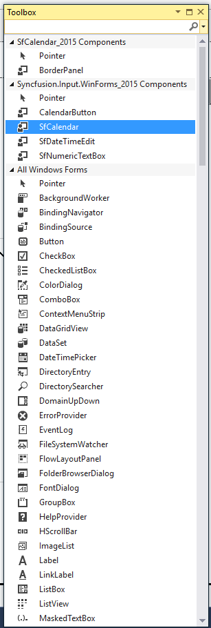
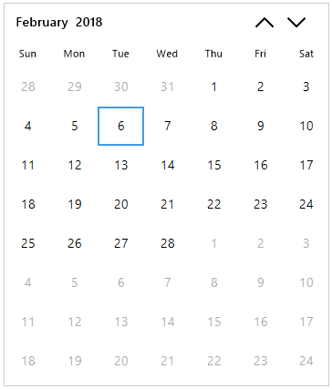

# Getting Started

This section briefly describes how to design a `SfCalendar` control in a Windows Forms Application.

* Adding SfCalendar control 
* Configuring SfCalendar

## Creating simple application with SfCalendar

In this walk through, you will create Windows Forms Application that contains SfCalendar control.

1. [Creating project](#creating-the-project)
2. [Adding control via Designer](#adding-control-via-designer)
3. [Adding control manually in code](#adding-control-manually-in-code)
4. [Configuring date range](#configuring-date-range)
5. [Configure BlackoutDates](#configure-blackoutdates)
6. [Configure SpecialDates](#configure-specialdates)
7. [Configure to allow multiple selection](#configure-to-allow-multiple-selection)
8. [Configure number of weeks in view](#configure-number-of-weeks-in-view)
9. [Configure first day of week](#configure-first-day-of-week)
10.[Configure to show week number](#configure-to-show-week-number)

### Creating the project

Create new Windows Forms Project in Visual Studio to display SfCalendar with date information.

### Adding control via Designer

SfCalendar control can be added to the application by dragging it from Toolbox and dropping it in designer view. The required assembly references will be added automatically.

 

### Adding control manually in code

In order to add control manually in C#, do the below steps,

1. Add the below required assembly references to the project,
	* Syncfusion.Core.WinForms.dll
	* Syncfusion.SfInput.WinForms.dll

2. Include the namespaces **Syncfusion.WinForms.Input**





using Syncfusion.WinForms.Input;





Imports Syncfusion.WinForms.Input



 

2. Create `SfCalendar` control instance and add it to the Form.





SfCalendar sfCalendar = new SfCalendar();

this.Controls.Add(sfCalendar);





Dim sfCalendar As SfCalendar = New SfCalendar

Me.Controls.Add(sfCalendar)





## Configure date range

`SfCalendar` prevent users from selecting dates within a specified minimum and maximum range. To specify the range, set start date and end date to `MinDate` and `MaxDate` properties respectively.





// Setting the Minimum and Maximum date

Syncfusion.WinForms.Input.SfCalendar calendar = new Syncfusion.WinForms.Input.SfCalendar();

this.Controls.Add(calendar);

calendar.Value = new DateTime(2018, 1, 12);

calendar.MinDate = new DateTime(2018, 1, 03);

calendar.MaxDate = new DateTime(2018, 1, 29);





' Setting the Minimum and Maximum date

Dim calendar As Syncfusion.WinForms.Input.SfCalendar = New Syncfusion.WinForms.Input.SfCalendar

Me.Controls.Add(calendar)

calendar.Value = New DateTime(2018, 1, 12)

calendar.MinDate = New DateTime(2018, 1, 3)

calendar.MaxDate = New DateTime(2018, 1, 29)



 

## Configure BlackoutDates

`BlackoutDates` refers the disabled dates that restrict the user from selecting it. A date collection can be provided to set the `BlackoutDates` for this control, use the following code example.





//Setting the Blackout Dates
    
DateTime date = new DateTime(2018, 01, 25);
    
DateTime date1 = new DateTime(2018, 01, 23);
    
DateTime date2 = new DateTime(2018, 01, 17);
    
DateTime date3 = new DateTime(2018, 01, 18);
    
DateTime date4 = new DateTime(2018, 01, 20);
    
DateTime date5 = new DateTime(2018, 01, 22);
    
this.SfCalendar1.BlackoutDates = new DateTime[]{ date, date1, date2, date3, date4, date5};





Dim date As DateTime = New DateTime(2018, 1, 25)

Dim date1 As DateTime = New DateTime(2018, 1, 23)

Dim date2 As DateTime = New DateTime(2018, 1, 17)

Dim date3 As DateTime = New DateTime(2018, 1, 18)

Dim date4 As DateTime = New DateTime(2018, 1, 20)

Dim date5 As DateTime = New DateTime(2018, 1, 22)

Me.SfCalendar1.BlackoutDates = New DateTime() {date, date1, date2, date3, date4, date5}



 

## Configure SpecialDates

`SfCalendar` allows to highlight special dates with icons and descriptions. Special dates to calendar can be added through `SpecialDates`collection.
Below code illustrates how to add the special dates in calendar.





private void InitializeComponent()
    {

        this.components = new System.ComponentModel.Container();
        
        SpecialDate specialDate1 = new SpecialDate();
        SpecialDate specialDate2 = new SpecialDate();
        SpecialDate specialDate3 = new SpecialDate();
        SpecialDate specialDate4 = new SpecialDate();
        SpecialDate specialDate5 = new SpecialDate();
        
        specialDate1.BackColor = System.Drawing.Color.White;
        specialDate1.Font = new System.Drawing.Font("Segoe UI", 11.25F, System.Drawing.FontStyle.Italic, System.Drawing.GraphicsUnit.Point, ((byte)(0)));
        specialDate1.ForeColor = System.Drawing.Color.Magenta;
        specialDate1.Image = Properties.Resources.Icon_National_Youth_day;
        specialDate1.ImageAlign = System.Drawing.ContentAlignment.MiddleCenter;
        specialDate1.IsDateVisible = false;
        specialDate1.TextAlign = System.Drawing.ContentAlignment.MiddleCenter;
        specialDate1.TextImageRelation = System.Windows.Forms.TextImageRelation.TextBeforeImage;
        specialDate1.Value = new System.DateTime(2018, 1, 12, 0, 0, 0, 0);
    
        specialDate2.BackColor = System.Drawing.Color.White;
        specialDate2.Font = new System.Drawing.Font("Segoe UI", 11.25F, System.Drawing.FontStyle.Italic, System.Drawing.GraphicsUnit.Point, ((byte)(0)));
        specialDate2.ForeColor = System.Drawing.Color.Magenta;
        specialDate2.Image = Properties.Resources.Icon_Army_day;
        specialDate2.ImageAlign = System.Drawing.ContentAlignment.MiddleCenter;
        specialDate2.IsDateVisible = false;
        specialDate2.TextAlign = System.Drawing.ContentAlignment.MiddleCenter;
        specialDate2.TextImageRelation = System.Windows.Forms.TextImageRelation.TextBeforeImage;
        specialDate2.Value = new System.DateTime(2018, 1, 15, 0, 0, 0, 0); specialDate1.BackColor = System.Drawing.Color.White;
        
        specialDate3.BackColor = System.Drawing.Color.White;
        specialDate3.Font = new System.Drawing.Font("Segoe UI", 11.25F, System.Drawing.FontStyle.Italic, System.Drawing.GraphicsUnit.Point, ((byte)(0)));
        specialDate3.ForeColor = System.Drawing.Color.Magenta;
        specialDate3.Image = Properties.Resources.Icon_Anti_tobacco;
        specialDate3.ImageAlign = System.Drawing.ContentAlignment.MiddleCenter;
        specialDate3.IsDateVisible = false;
        specialDate3.TextAlign = System.Drawing.ContentAlignment.MiddleCenter;
        specialDate3.TextImageRelation = System.Windows.Forms.TextImageRelation.TextBeforeImage;
        specialDate3.Value = new System.DateTime(2018, 2, 4, 0, 0, 0, 0);
            
        specialDate4.BackColor = System.Drawing.Color.White;
        specialDate4.Font = new System.Drawing.Font("Segoe UI", 11.25F, System.Drawing.FontStyle.Italic, System.Drawing.GraphicsUnit.Point, ((byte)(0)));
        specialDate4.ForeColor = System.Drawing.Color.Magenta;
        specialDate4.Image = Properties.Resources.Valentine_day;
        specialDate4.ImageAlign = System.Drawing.ContentAlignment.MiddleCenter;
        specialDate4.IsDateVisible = false;
        specialDate4.TextAlign = System.Drawing.ContentAlignment.MiddleCenter;
        specialDate4.TextImageRelation = System.Windows.Forms.TextImageRelation.TextBeforeImage;
        specialDate4.Value = new System.DateTime(2018, 2, 14, 0, 0, 0, 0);
            
        specialDate5.BackColor = System.Drawing.Color.White;
        specialDate5.Font = new System.Drawing.Font("Segoe UI", 11.25F, System.Drawing.FontStyle.Italic, System.Drawing.GraphicsUnit.Point, ((byte)(0)));
        specialDate5.ForeColor = System.Drawing.Color.Magenta;
        specialDate5.Image = Properties.Resources.Icon_Children_day;
        specialDate5.ImageAlign = System.Drawing.ContentAlignment.MiddleCenter;
        specialDate5.IsDateVisible = false;
        specialDate5.TextAlign = System.Drawing.ContentAlignment.MiddleCenter;
        specialDate5.TextImageRelation = System.Windows.Forms.TextImageRelation.TextBeforeImage;
        specialDate5.Value = new System.DateTime(2018, 7, 11, 0, 0, 0, 0);
        
        this.sfCalendar.SpecialDates = new SpecialDate[] {specialDate1, specialDate2, specialDate3, specialDate4, specialDate5};
    }





 Private Sub InitializeComponent()

        Me.components = New System.ComponentModel.Container
        Dim specialDate1 As SpecialDate = New SpecialDate
        Dim specialDate2 As SpecialDate = New SpecialDate
        Dim specialDate3 As SpecialDate = New SpecialDate
        Dim specialDate4 As SpecialDate = New SpecialDate
        Dim specialDate5 As SpecialDate = New SpecialDate

        specialDate1.BackColor = System.Drawing.Color.White
        specialDate1.Font = New System.Drawing.Font("Segoe UI", 11.25!, System.Drawing.FontStyle.Italic, System.Drawing.GraphicsUnit.Point, CType(0,Byte))
        specialDate1.ForeColor = System.Drawing.Color.Magenta
        specialDate1.Image = Properties.Resources.Icon_National_Youth_day
        specialDate1.ImageAlign = System.Drawing.ContentAlignment.MiddleCenter
        specialDate1.IsDateVisible = false
        specialDate1.TextAlign = System.Drawing.ContentAlignment.MiddleCenter
        specialDate1.TextImageRelation = System.Windows.Forms.TextImageRelation.TextBeforeImage
        specialDate1.Value = New Date(2018, 1, 15, 0, 0, 0, 0)

        specialDate2.BackColor = System.Drawing.Color.White
        specialDate2.Font = New System.Drawing.Font("Segoe UI", 11.25!, System.Drawing.FontStyle.Italic, System.Drawing.GraphicsUnit.Point, CType(0,Byte))
        specialDate2.ForeColor = System.Drawing.Color.Magenta
        specialDate2.Image = Properties.Resources.Icon_Army_day
        specialDate2.ImageAlign = System.Drawing.ContentAlignment.MiddleCenter
        specialDate2.IsDateVisible = false
        specialDate2.TextAlign = System.Drawing.ContentAlignment.MiddleCenter
        specialDate2.TextImageRelation = System.Windows.Forms.TextImageRelation.TextBeforeImage
        specialDate2.Value = New Date(2018, 4, 7, 0, 0, 0, 0)

        specialDate3.BackColor = System.Drawing.Color.White
        specialDate3.Font = New System.Drawing.Font("Segoe UI", 11.25!, System.Drawing.FontStyle.Italic, System.Drawing.GraphicsUnit.Point, CType(0,Byte))
        specialDate3.ForeColor = System.Drawing.Color.Magenta
        specialDate3.Image = Properties.Resources.Icon_Anti_tobacco
        specialDate3.ImageAlign = System.Drawing.ContentAlignment.MiddleCenter
        specialDate3.IsDateVisible = false
        specialDate3.TextAlign = System.Drawing.ContentAlignment.MiddleCenter
        specialDate3.TextImageRelation = System.Windows.Forms.TextImageRelation.TextBeforeImage
        specialDate3.Value = New Date(2018, 2, 24, 0, 0, 0, 0)

        specialDate4.BackColor = System.Drawing.Color.White
        specialDate4.Font = New System.Drawing.Font("Segoe UI", 11.25!, System.Drawing.FontStyle.Italic, System.Drawing.GraphicsUnit.Point, CType(0,Byte))
        specialDate4.ForeColor = System.Drawing.Color.Magenta
        specialDate4.Image = Properties.Resources.Valentine_day
        specialDate4.ImageAlign = System.Drawing.ContentAlignment.MiddleCenter
        specialDate4.IsDateVisible = false
        specialDate4.TextAlign = System.Drawing.ContentAlignment.MiddleCenter
        specialDate4.TextImageRelation = System.Windows.Forms.TextImageRelation.TextBeforeImage
        specialDate4.Value = New Date(2018, 2, 8, 0, 0, 0, 0)

        specialDate5.BackColor = System.Drawing.Color.White
        specialDate5.Font = New System.Drawing.Font("Segoe UI", 11.25!, System.Drawing.FontStyle.Italic, System.Drawing.GraphicsUnit.Point, CType(0,Byte))
        specialDate5.ForeColor = System.Drawing.Color.Magenta
        specialDate5.Image = Properties.Resources.Icon_Children_day
        specialDate5.ImageAlign = System.Drawing.ContentAlignment.MiddleCenter
        specialDate5.IsDateVisible = false
        specialDate5.TextAlign = System.Drawing.ContentAlignment.MiddleCenter
        specialDate5.TextImageRelation = System.Windows.Forms.TextImageRelation.TextBeforeImage
        specialDate5.Value = New Date(2018, 3, 21, 0, 0, 0, 0)
        
        Me.sfCalendar.SpecialDates = New SpecialDate() {specialDate1, specialDate2, specialDate3, specialDate4, specialDate5}
        
    End Sub



 

## Configure to allow multiple selection

SfCalendar control allows to select multiple dates by setting the `AllowMultipleSelection` property to true. The following code example illustrates the same.





// Setting to Allow Multiple Selection

this.SfCalendar1.AllowMultipleSelection = true;





' Setting to Allow Multiple Selection

Me.SfCalendar1.AllowMultipleSelection = true



 

## Configure number of weeks in view

The number of weeks shown in the month view can be changed by setting the `NumberOfWeeksInView` property as follows.





// Setting the Number of weeks in View

this.sfCalendar.NumberOfWeeksInView = 3;





' Setting the Number of weeks in View

Me.sfCalendar.NumberOfWeeksInView = 3



 

## Configure first day of week

The first day of a week can be changed by setting `FirstDayOfWeek` property. The following code example shows how to set `FirstDayofWeek` property.





//Setting the First Day Of Week

this.SfCalendar1.FirstDayOfWeek = DayOfWeek.Monday;





'Setting the First Day Of Week

Me.SfCalendar1.FirstDayOfWeek = DayOfWeek.Monday



 

## Configure to show week number

The week number of current week in a year can be shown in the calendar control by setting `ShowWeekNumber` property to true as follows.





// Setting the Minimum and Maximum date

this.SfCalendar1.ShowWeekNumber = true;





' Setting the Minimum and Maximum date

Me.SfCalendar1.ShowWeekNumber = true



 

