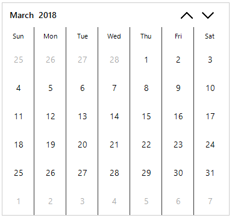

# Appearance

This section explains the appearance of header, footer and cells.

## Customize header appearance

Calendar control header can be customized by using the following properties.

* BackColor
* ForeColor
* DayNamesBackColor
* DayNamesForeColor
* DayFont

The following code example illustrates to customize the appearances. 





// Header customizations

// Setting header BackColor

this.sfCalendar.Style.Header.BackColor = Color.Red;

// Setting header BackColor

this.sfCalendar.Style.Header.ForeColor = Color.Yellow;

// Setting header BackColor

this.sfCalendar.Style.Header.DayNamesBackColor = Color.Green;

// Setting header BackColor

this.sfCalendar.Style.Header.DayNamesForeColor = Color.WhiteSmoke;





' Header customizations

' Setting header BackColor

Me.sfCalendar.Style.Header.BackColor = Color.Red

' Setting header ForeColor

Me.sfCalendar.Style.Header.ForeColor = Color.Yellow

' Setting header DayNamesBackColor

Me.sfCalendar.Style.Header.DayNamesBackColor = Color.Green

' Setting header DayNamesForeColor

Me.sfCalendar.Style.Header.DayNamesForeColor = Color.WhiteSmoke



 

## Customize footer appearance

Calendar control footer can be customized by using the following properties.

* BackColor
* ForeColor
* HoverBackColor
* HoverForeColor

The following code example illustrates the same.





// Footer customizations

// Setting Footer BackColor

this.sfCalendar.VisualStyle.Footer.BackColor = Color.Tomato;

// Setting Footer ForeColor

this.sfCalendar.Style.Footer.ForeColor = Color.WhiteSmoke;

// Setting Footer HoverBackColor

this.sfCalendar.Style.Footer.HoverBackColor = Color.Yellow;

// Setting Footer HoverForeColor

this.sfCalendar.Style.Footer.HoverForeColor = Color.SpringGreen;





' Footer customizations

' Setting Footer BackColor

Me.sfCalendar.Style.Footer.BackColor = Color.Tomato

' Setting Footer ForeColor

Me.sfCalendar.Style.Footer.ForeColor = Color.WhiteSmoke

' Setting Footer HoverBackColor

Me.sfCalendar.Style.Footer.HoverBackColor = Color.Yellow

' Setting Footer HoverForeColor

Me.sfCalendar.Style.Footer.HoverForeColor = Color.SpringGreen



 

## Customize cell appearance

Calendar control cells can be customized by using the following properties.

* CellBackColor
* CellForeColor
* CellHoverBackColor
* CellHoverForeColor
* CellFont 

### Customize trailing date appearance 

Calendar control Trailing(Next or Previous month) cells can be customized by the below properties.

* TrailingCellBackColor
* TrailingCellForeColor
* TrailingCellFont

### Customize selected date appearance

Calendar control Selected cells can be customized by the below properties.

* SelectedCellBackColor
* SelectedCellForeColor
* SelectedCellBorderColor
* SelectedCellHoverBorderColor

The following code example illustrates the customization of the Calendar cells.





// Footer customizations

// Setting CellBackColor

this.sfCalendar.Style.Cell.CellBackColor = Color.LightBlue;

// Setting CellForeColor

this.sfCalendar.Style.Cell.CellForeColor = Color.Red;

// Setting CellHoverBorderColor

this.sfCalendar.Style.Cell.CellHoverBorderColor = Color.LightCyan;

// Setting SelectedCellBackColor

this.sfCalendar.Style.Cell.SelectedCellBackColor = Color.Blue;

// Setting SelectedCellForeColor

this.sfCalendar.Style.Cell.SelectedCellForeColor = Color.White;

// Setting SelectedCellBorderColor

this.sfCalendar.Style.Cell.SelectedCellBorderColor = Color.Tomato;

// Setting SelectedCellHoverBorderColor

this.sfCalendar.Style.Cell.SelectedCellHoverBorderColor = Color.Yellow;

// Setting TrailingCellBackColor

this.sfCalendar.Style.Cell.TrailingCellBackColor = Color.LightGray;

// Setting TrailingCellForeColor

this.sfCalendar.Style.Cell.TrailingCellForeColor = Color.Black;

// Setting TrailingCellFont

this.sfCalendar.Style.Cell.TrailingCellFont = new System.Drawing.Font("Calibri", 11.25F, System.Drawing.FontStyle.Bold);

// Setting CellFont

this.sfCalendar.Style.Cell.CellFont = new System.Drawing.Font("Calibri", 11.25F, System.Drawing.FontStyle.Bold);





' Footer customizations

' Setting CellBackColor

Me.sfCalendar.Style.Cell.CellBackColor = Color.LightBlue

' Setting CellForeColor

Me.sfCalendar.Style.Cell.CellForeColor = Color.Red

' Setting CellHoverBorderColor

Me.sfCalendar.Style.Cell.CellHoverBorderColor = Color.LightCyan

' Setting SelectedCellBackColor

Me.sfCalendar.Style.Cell.SelectedCellBackColor = Color.Blue

' Setting SelectedCellForeColor

Me.sfCalendar.Style.Cell.SelectedCellForeColor = Color.White

' Setting SelectedCellBorderColor

Me.sfCalendar.Style.Cell.SelectedCellBorderColor = Color.Tomato

' Setting SelectedCellHoverBorderColor

Me.sfCalendar.Style.Cell.SelectedCellHoverBorderColor = Color.Yellow

' Setting TrailingCellBackColor

Me.sfCalendar.Style.Cell.TrailingCellBackColor = Color.LightGray

' Setting TrailingCellForeColor

Me.sfCalendar.Style.Cell.TrailingCellForeColor = Color.Black

' Setting TrailingCellFont

Me.sfCalendar.Style.Cell.TrailingCellFont = New System.Drawing.Font("Calibri", 11.25!, System.Drawing.FontStyle.Bold)

' Setting CellFont

Me.sfCalendar.Style.Cell.CellFont = New System.Drawing.Font("Calibri", 11.25!, System.Drawing.FontStyle.Bold)



 

## Settings the Days   

It is possible to hide the days of the next month and the previous month in the calendar, to enhance the appearance of the Calendar. This is done by disabling the `TrailingCellVisible` property.

For setting these properties, use the following code.





// Setting the Next and Previous Months Dates invisible

this.SfCalendar1.TrailingCellVisible = false;





' Setting the Next and Previous Months Dates invisible

this.SfCalendar1.TrailingCellVisible = False





## Abbreviating Day Names

By default, the day names are displayed in an abbreviated form in the Calendar control. They can also be displayed in an expanded form by setting `ShowAbbreviatedDayNames` property to false. This indicates whether the name of day is abbreviated or expanded. It returns the Boolean value.

To set this property, use the following code:





// Setting the Show Abbreviated Day Names

this.sfCalendar.ShowAbbreviatedDayNames = false;





' Setting the Show Abbreviated Day Names

Me.sfCalendar.ShowAbbreviatedDayNames = false





## Right-To-Left

`SfCalendar` control elements can be aligned in right-to-left layout. The `RightToLeftLayout` property is used for international applications where the language is written from right to left such as Hebrew or Arabic. `SfCalendar` control laid out from right to left when `RightToLeftLayout` is `true` and  `RightToLeft` value is `Yes`. The following code example illustrates the same.





//Enable the Right to Left 

this.sfCalendar.RightToLeft = RightToLeft.Yes;

this.sfCalendar.RightToLeftLayout = true;





'Enable the Right to Left 

Me.sfCalendar.RightToLeft = RightToLeft.Yes

Me.sfCalendar.RightToLeftLayout = true





## Highlight Today cell 

Today cell highlighted even selected date is different than Today in `SfCalendar`. The highlight of today cell can be customized by using `HighlightTodayCell` property. The following code snippets illustrates the same.





// Indicating whether Today cell highlighted even selected date is different than Today

this.sfCalendar.HighlightTodayCell = false;





' Indicating whether Today cell highlighted even selected date is different than Today

Me.sfCalendar.HighlightTodayCell = false





## Change visibility of Navigation Buttons

Navigation buttons used to move between views in SfCalendar. It visiblity can be customized by using `ShowNavigationButton` property. The following code example illustrates the same.





// Indicating whether show the navigation buttons which used to move between views. 

this.sfCalendar.ShowNavigationButton = false;





' Indicating whether  show the navigation buttons which used to move between views. 

Me.sfCalendar.ShowNavigationButton = false





## Navigation Buttons alignment

Navigation buttons should align relative to the Calendar Header. It alignment can be customized by using `NavigationButtonAlignment`. The following code example illustrates the same.





// Indicating how the navigation buttons should align relative to the Calendar Header. Setting Left alignment. 

this.sfCalendar.NavigationButtonAlignment = Syncfusion.WinForms.Input.Enums.NavigationButtonAlignment.Left;





' Indicating how the navigation buttons should align relative to the Calendar Header. Setting Left alignment. 

Me.sfCalendar.NavigationButtonAlignment = Syncfusion.WinForms.Input.Enums.NavigationButtonAlignment.Left









// Indicating how the navigation buttons should align relative to the Calendar Header. Setting Both alignment. 

this.sfCalendar.NavigationButtonAlignment = Syncfusion.WinForms.Input.Enums.NavigationButtonAlignment.Both;





' Indicating how the navigation buttons should align relative to the Calendar Header. Setting Both alignment. 

Me.sfCalendar.NavigationButtonAlignment = Syncfusion.WinForms.Input.Enums.NavigationButtonAlignment.Both





## Change the visibility of the Vertical splitter

Visibility of vertical splitter in calendar control can be customized by setting the `ShowVerticalSplitter`property. The following code example illustrates the same.





// Indicating whether the dates of each columns in the SfCalendar are separated with vertical splitter.

this.sfCalendar.ShowVerticalSplitter = true;





' Indicating whether the dates of each columns in the SfCalendar are separated with vertical splitter.

Me.sfCalendar.ShowVerticalSplitter = true





## Change the visibility of the footer Today or None Button

Visibility of the calendar footer Today/None button can be customized by using `ShowToday` and `ShowNone` properties. The following code example illustrates the same.





// Indicating the visibility of none button in footer 

this.sfCalendar.ShowFooter = true;

this.sfCalendar.ShowNone = false;





' Indicating the visibility of none button in footer 

Me.sfCalendar.ShowFooter = true

Me.sfCalendar.ShowNone = false









// Indicating the visibility of today button in footer 

this.sfCalendar.ShowFooter = true;

this.sfCalendar.ShowToday = false;





' Indicating the visibility of today button in footer 

Me.sfCalendar.ShowFooter = true

Me.sfCalendar.ShowToday = false





