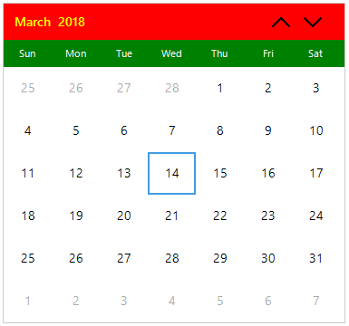
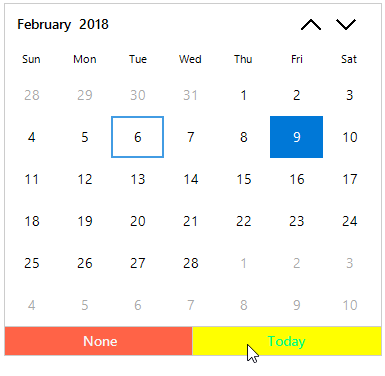
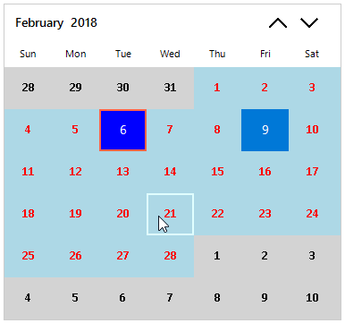
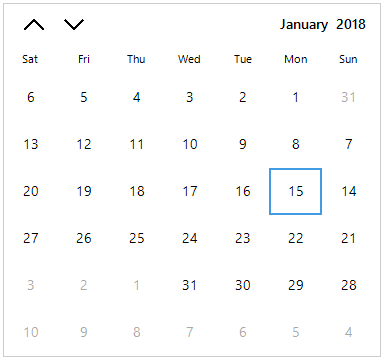
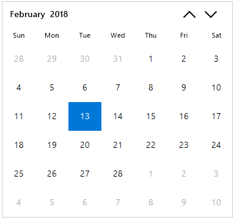
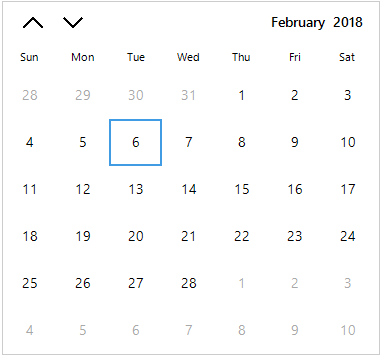
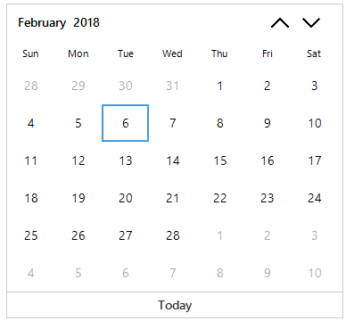
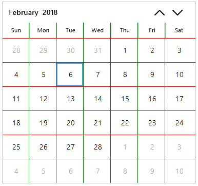

# Appearance

This section explains the customization of appearance for header, footer and cells in Calendar.

## Customize header appearance

Backcolor and Forecolor of each part in calendar header can customized. Calendar control header can be customized by using the following style properties.

* BackColor
* ForeColor
* DayNamesBackColor
* DayNamesForeColor
* DayFont

The following code example illustrates to customize the appearances of calendar header. 





// Header customizations

// Setting header BackColor

this.sfCalendar.Style.Header.BackColor = Color.Red;

// Setting header ForeColor

this.sfCalendar.Style.Header.ForeColor = Color.Yellow;

// Setting header DayNames BackColor

this.sfCalendar.Style.Header.DayNamesBackColor = Color.Green;

// Setting header DayNames ForeColor

this.sfCalendar.Style.Header.DayNamesForeColor = Color.WhiteSmoke;

// Setting header DayNames Font

this.sfCalendar.Style.Header.DayNamesFont = new System.Drawing.Font("Calibri", 11.25F, System.Drawing.FontStyle.Regular);





' Header customizations

' Setting header BackColor

Me.sfCalendar.Style.Header.BackColor = Color.Red

' Setting header ForeColor

Me.sfCalendar.Style.Header.ForeColor = Color.Yellow

' Setting header DayNamesBackColor

Me.sfCalendar.Style.Header.DayNamesBackColor = Color.Green

' Setting header DayNamesForeColor

Me.sfCalendar.Style.Header.DayNamesForeColor = Color.WhiteSmoke

' Setting header DayNames Font

Me.sfCalendar.Style.Header.DayNamesFont = New System.Drawing.Font("Calibri", 11.25!, System.Drawing.FontStyle.Regular)



 

## Customize footer appearance

Backcolor and Forecolor of each part in calendar footer can customized. Footer of the calendar control can be customized by the following style properties.

* BackColor
* ForeColor
* HoverBackColor
* HoverForeColor

The following code example illustrates the same.





// Footer customizations

// Setting Footer BackColor

this.sfCalendar.Style.Footer.BackColor = Color.Tomato;

// Setting Footer ForeColor

this.sfCalendar.Style.Footer.ForeColor = Color.WhiteSmoke;

// Setting Footer HoverBackColor

this.sfCalendar.Style.Footer.HoverBackColor = Color.Yellow;

// Setting Footer HoverForeColor

this.sfCalendar.Style.Footer.HoverForeColor = Color.SpringGreen;





' Footer customizations

' Setting Footer BackColor

Me.sfCalendar.Style.Footer.BackColor = Color.Tomato

' Setting Footer ForeColor

Me.sfCalendar.Style.Footer.ForeColor = Color.WhiteSmoke

' Setting Footer HoverBackColor

Me.sfCalendar.Style.Footer.HoverBackColor = Color.Yellow

' Setting Footer HoverForeColor

Me.sfCalendar.Style.Footer.HoverForeColor = Color.SpringGreen



 

## Customize cell appearance

Date cells in the calendar control can be customized by using the following style properties.

* CellBackColor
* CellForeColor
* CellHoverBackColor
* CellHoverForeColor
* CellFont 

### Customize trailing date appearance 

Calendar control trailing(Next or Previous month) cells can be customized by the below properties.

* TrailingCellBackColor
* TrailingCellForeColor
* TrailingCellFont

### Customize selected date appearance

Backcolor and Forecolor of selected date cell in calendar can customized. The following code illustrates how to customize the cell appearance.

* SelectedCellBackColor
* SelectedCellForeColor
* SelectedCellBorderColor
* SelectedCellHoverBorderColor
* SelectedCellFont

The following code example illustrates the customization of the Calendar cells.





// Setting CellBackColor

this.sfCalendar.Style.Cell.CellBackColor = Color.LightBlue;

// Setting CellForeColor

this.sfCalendar.Style.Cell.CellForeColor = Color.Red;

// Setting CellHoverBorderColor

this.sfCalendar.Style.Cell.CellHoverBorderColor = Color.LightCyan;

// Setting SelectedCellBackColor

this.sfCalendar.Style.Cell.SelectedCellBackColor = Color.Blue;

// Setting SelectedCellForeColor

this.sfCalendar.Style.Cell.SelectedCellForeColor = Color.White;

// Setting SelectedCellBorderColor

this.sfCalendar.Style.Cell.SelectedCellBorderColor = Color.Tomato;

// Setting SelectedCellHoverBorderColor

this.sfCalendar.Style.Cell.SelectedCellHoverBorderColor = Color.Yellow;

// Setting TrailingCellBackColor

this.sfCalendar.Style.Cell.TrailingCellBackColor = Color.LightGray;

// Setting TrailingCellForeColor

this.sfCalendar.Style.Cell.TrailingCellForeColor = Color.Black;

// Setting TrailingCellFont

this.sfCalendar.Style.Cell.TrailingCellFont = new System.Drawing.Font("Calibri", 11.25F, System.Drawing.FontStyle.Bold);

// Setting CellFont

this.sfCalendar.Style.Cell.CellFont = new System.Drawing.Font("Calibri", 11.25F, System.Drawing.FontStyle.Bold);

// Setting selected CellFont

this.sfCalendar.Style.Cell.SelectedCellFont = new System.Drawing.Font("Calibri", 11.25F, System.Drawing.FontStyle.Regular); 





' Setting CellBackColor

Me.sfCalendar.Style.Cell.CellBackColor = Color.LightBlue

' Setting CellForeColor

Me.sfCalendar.Style.Cell.CellForeColor = Color.Red

' Setting CellHoverBorderColor

Me.sfCalendar.Style.Cell.CellHoverBorderColor = Color.LightCyan

' Setting SelectedCellBackColor

Me.sfCalendar.Style.Cell.SelectedCellBackColor = Color.Blue

' Setting SelectedCellForeColor

Me.sfCalendar.Style.Cell.SelectedCellForeColor = Color.White

' Setting SelectedCellBorderColor

Me.sfCalendar.Style.Cell.SelectedCellBorderColor = Color.Tomato

' Setting SelectedCellHoverBorderColor

Me.sfCalendar.Style.Cell.SelectedCellHoverBorderColor = Color.Yellow

' Setting TrailingCellBackColor

Me.sfCalendar.Style.Cell.TrailingCellBackColor = Color.LightGray

' Setting TrailingCellForeColor

Me.sfCalendar.Style.Cell.TrailingCellForeColor = Color.Black

' Setting TrailingCellFont

Me.sfCalendar.Style.Cell.TrailingCellFont = New System.Drawing.Font("Calibri", 11.25!, System.Drawing.FontStyle.Bold)

' Setting CellFont

Me.sfCalendar.Style.Cell.CellFont = New System.Drawing.Font("Calibri", 11.25!, System.Drawing.FontStyle.Bold)

' Setting selected CellFont

Me.sfCalendar.Style.Cell.SelectedCellFont = New System.Drawing.Font("Calibri", 11.25!, System.Drawing.FontStyle.Regular)



 

## Hide trailing dates   

`SfCalendar` allows to hide the days of the next month and the previous month in the calendar to enhance the appearance of the calendar. This can be achieved by disabling the `TrailingDatesVisible` property.

For setting these properties, use the following code.





// Setting the Next and Previous Months Dates invisible

this.SfCalendar1.TrailingDatesVisible = false;





' Setting the Next and Previous Months Dates invisible

this.SfCalendar1.TrailingDatesVisible = False





## Abbreviating day names

By default, the day names are displayed in an abbreviated form in the Calendar control. They can also be displayed in an expanded form by setting `ShowAbbreviatedDayNames` property to false. This indicates whether the name of day is abbreviated or expanded.

To set this property, use the following code:





// Setting the Show Abbreviated Day Names

this.sfCalendar.ShowAbbreviatedDayNames = false;





' Setting the Show Abbreviated Day Names

Me.sfCalendar.ShowAbbreviatedDayNames = false





## Right-To-Left

`SfCalendar` control elements can be aligned in right-to-left layout. `SfCalendar` control laid out from right to left when `RightToLeft` value is `Yes`. The following code example illustrates the same.





//Enable the Right to Left 

this.sfCalendar.RightToLeft = RightToLeft.Yes;





'Enable the Right to Left 

Me.sfCalendar.RightToLeft = RightToLeft.Yes





## Highlight today cell 

Today cell highlighted even selected date is different than today in `SfCalendar`. The highlight of today cell can be customized by using `HighlightTodayCell` property. The following code snippets illustrates the same.





// Indicating whether Today cell highlighted even selected date is different than today

this.sfCalendar.HighlightTodayCell = true;





' Indicating whether Today cell highlighted even selected date is different than Today

Me.sfCalendar.HighlightTodayCell = true





## Change visibility of navigation buttons

Navigation buttons are used to move between views in `SfCalendar`. Visibility of navigation buttons can be customized by `ShowNavigationButton` property. The following code example illustrates the same.





// Indicating whether show the navigation buttons which used to move between views. 

this.sfCalendar.ShowNavigationButton = false;





' Indicating whether  show the navigation buttons which used to move between views. 

Me.sfCalendar.ShowNavigationButton = false





## Customize navigation buttons alignment

Navigation buttons can be aligned in different sides relative to the calendar header. Alignment of navigation buttons can be customized by `NavigationButtonAlignment`. The following code example illustrates the same.





// Indicating how the navigation buttons should align relative to the Calendar Header. Setting Left alignment. 

this.sfCalendar.NavigationButtonAlignment = Syncfusion.WinForms.Input.Enums.NavigationButtonAlignment.Left;





' Indicating how the navigation buttons should align relative to the Calendar Header. Setting Left alignment. 

Me.sfCalendar.NavigationButtonAlignment = Syncfusion.WinForms.Input.Enums.NavigationButtonAlignment.Left









// Indicating how the navigation buttons should align relative to the Calendar Header. Setting Both alignment. 

this.sfCalendar.NavigationButtonAlignment = Syncfusion.WinForms.Input.Enums.NavigationButtonAlignment.Both;





' Indicating how the navigation buttons should align relative to the Calendar Header. Setting Both alignment. 

Me.sfCalendar.NavigationButtonAlignment = Syncfusion.WinForms.Input.Enums.NavigationButtonAlignment.Both





## Change visibility of the footer

Visibility of the calendar footer can be customized by using `ShowFooter` property which contains Today and None buttons. Visibility of today and none button separately by `ShowToday` and `ShowNone` properties respectively. The following code example illustrates the same.





// Indicating the visibility of none button in footer 

this.sfCalendar.ShowFooter = true;

this.sfCalendar.ShowNone = false;





' Indicating the visibility of none button in footer 

Me.sfCalendar.ShowFooter = true

Me.sfCalendar.ShowNone = false









// Indicating the visibility of today button in footer 

this.sfCalendar.ShowFooter = true;

this.sfCalendar.ShowToday = false;





' Indicating the visibility of today button in footer 

Me.sfCalendar.ShowFooter = true

Me.sfCalendar.ShowToday = false





## Customize splitter appearance

Visibility of splitters in calendar control can be customized by setting the `ShowHorizontalSplitter` and `ShowVerticalSplitter` properties respectively. Also splitters color can be customized by `HorizontalSplitterColor` and `VerticalSplitterColor` for horizontal and vertical Splitters respectively. The following code example illustrates the same.





// Enable Horizontal splitter

 this.sfCalendar.ShowHorizontalSplitter = true;

// Enable Vertical splitter

this.sfCalendar.ShowVerticalSplitter = true;

//  color used draw the Horizontal splitter in cell view

this.sfCalendar.Style.HorizontalSplitterColor = Color.Red;

// color used draw the vertical splitter in cell view

this.sfCalendar.Style.VerticalSplitterColor = Color.Green;





' Enable Horizontal splitter

Me.sfCalendar.ShowHorizontalSplitter = true

' Enable Vertical splitter

Me.sfCalendar.ShowVerticalSplitter = true

'  color used draw the Horizontal splitter in cell view

Me.sfCalendar.Style.HorizontalSplitterColor = Color.Red

' color used draw the vertical splitter in cell view

Me.sfCalendar.Style.VerticalSplitterColor = Color.Green





