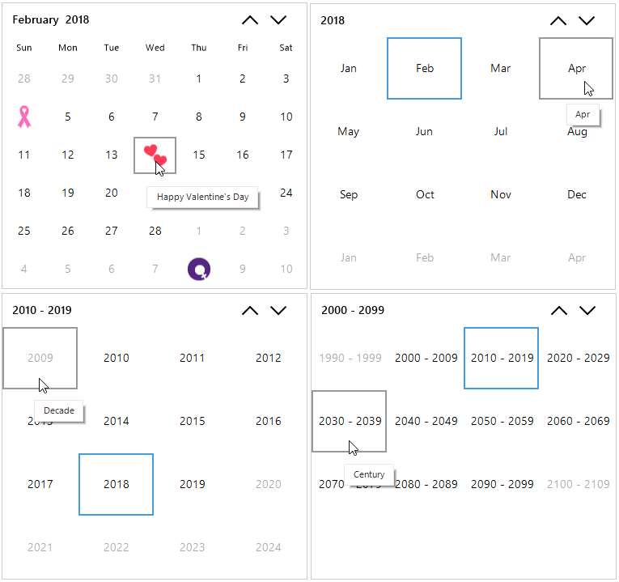
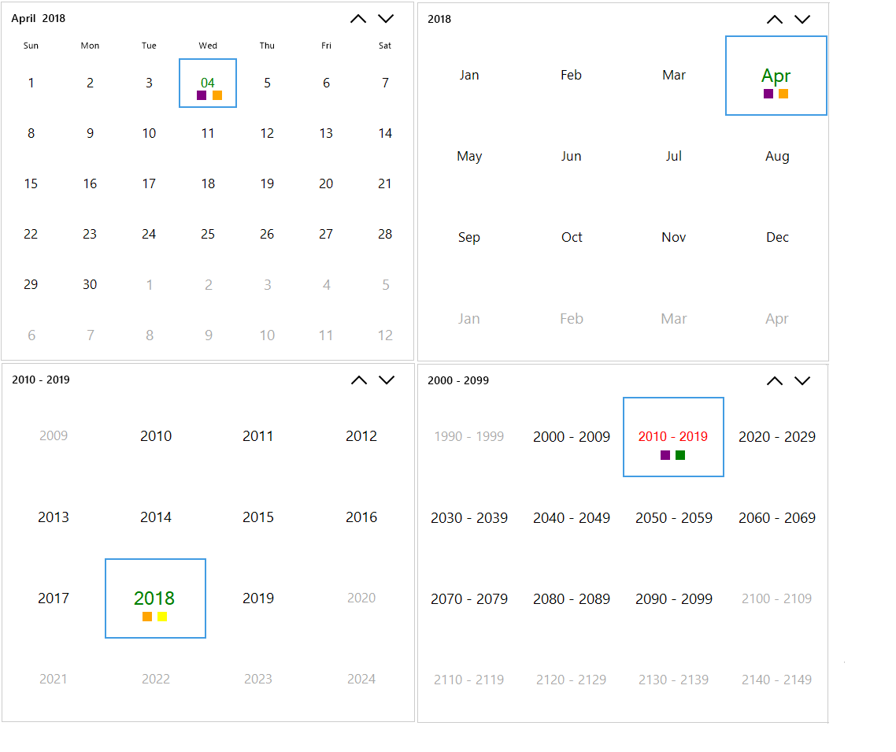

# Cell customization

`SfCalendar` cells can be customized for mentioning some special or important days. 

## Special dates

The `SpecialDates` helps you to hold the special dates collection with icon and description for dates which need to be highlighted. The `SpecialDates` contains the following properties to customize the cells:

* **BackColor**: The background color for the special date to fill the cell.
* **Value**: The value for the special date.
* **ForeColor**: The foreground color for the special date to draw the text.
* **Image**: Image to display on special date cell.
* **Font**: The font that is used to draw the special date.
* **IsDateVisible**: A value indicates whether the date text will be visible in the special date cell or not.
* **Description**: The description for special date.
* **ImageAlign**: Aligns an image in the special date. 
* **TextAlign**: Aligns the date text in the special date. 
* **TextImageRelation**: Aligns the date text and the image relative to each other in the special date.

To customize the dates, use the following code example:





        SpecialDate specialDate1 = new SpecialDate();

        SpecialDate specialDate2 = new SpecialDate();

        SpecialDate specialDate3 = new SpecialDate();

        SpecialDate specialDate4 = new SpecialDate();  

        List<SpecialDate> SpecialDates = new List<SpecialDate>();      
         
        specialDate1.BackColor = System.Drawing.Color.White;

        specialDate1.Font = new System.Drawing.Font("Segoe UI", 11.25F, System.Drawing.FontStyle.Italic, 
                                               System.Drawing.GraphicsUnit.Point, ((byte)(0)));

        specialDate1.ForeColor = System.Drawing.Color.Magenta;

        specialDate1.Image = Properties.Resources.icons_Womens_day;

        specialDate1.Description = "International Women’s Day";

        specialDate1.ImageAlign = System.Drawing.ContentAlignment.MiddleCenter;

        specialDate1.IsDateVisible = false;

        specialDate1.TextAlign = System.Drawing.ContentAlignment.MiddleCenter;

        specialDate1.TextImageRelation = System.Windows.Forms.TextImageRelation.TextBeforeImage;

        specialDate1.Value = new System.DateTime(2018, 3, 8, 0, 0, 0, 0);
            
        specialDate2.BackColor = System.Drawing.Color.White;

        specialDate2.Font = new System.Drawing.Font("Segoe UI", 11.25F, System.Drawing.FontStyle.Italic, 
                                               System.Drawing.GraphicsUnit.Point, ((byte)(0)));

        specialDate2.ForeColor = System.Drawing.Color.Magenta;

        specialDate2.Description = "World Forestry Day";

        specialDate2.Image = Properties.Resources.Icon_World_Forestry_Day;

        specialDate2.ImageAlign = System.Drawing.ContentAlignment.MiddleCenter;

        specialDate2.IsDateVisible = false;

        specialDate2.TextAlign = System.Drawing.ContentAlignment.MiddleCenter;

        specialDate2.TextImageRelation = System.Windows.Forms.TextImageRelation.TextBeforeImage;

        specialDate2.Value = new System.DateTime(2018, 3, 21, 0, 0, 0, 0);
            
        specialDate3.BackColor = System.Drawing.Color.White;

        specialDate3.Font = new System.Drawing.Font("Segoe UI", 11.25F, System.Drawing.FontStyle.Italic, 
                                               System.Drawing.GraphicsUnit.Point, ((byte)(0)));

        specialDate3.ForeColor = System.Drawing.Color.Magenta;

        specialDate3.Image = Properties.Resources.Icon_Water_day;

        specialDate3.Description = "World Day for Water";

        specialDate3.ImageAlign = System.Drawing.ContentAlignment.MiddleCenter;

        specialDate3.IsDateVisible = false;

        specialDate3.TextAlign = System.Drawing.ContentAlignment.MiddleCenter;

        specialDate3.TextImageRelation = System.Windows.Forms.TextImageRelation.TextBeforeImage;

        specialDate3.Value = new System.DateTime(2018, 3, 24, 0, 0, 0, 0);
        
        specialDate4.BackColor = System.Drawing.Color.White;

        specialDate4.Font = new System.Drawing.Font("Segoe UI", 11.25F, System.Drawing.FontStyle.Italic, 
                                               System.Drawing.GraphicsUnit.Point, ((byte)(0)));

        specialDate4.ForeColor = System.Drawing.Color.Magenta;

        specialDate4.Image = Properties.Resources.Icon_Healthy_day;

        specialDate4.Description = "World Health Day";

        specialDate4.ImageAlign = System.Drawing.ContentAlignment.MiddleCenter;

        specialDate4.IsDateVisible = false;

        specialDate4.TextAlign = System.Drawing.ContentAlignment.MiddleCenter;

        specialDate4.TextImageRelation = System.Windows.Forms.TextImageRelation.TextBeforeImage;

        specialDate4.Value = new System.DateTime(2018, 4, 7, 0, 0, 0, 0);

        SpecialDates.Add(specialDate1);

        SpecialDates.Add(specialDate2);

        SpecialDates.Add(specialDate3);

        SpecialDates.Add(specialDate4);

        this.sfCalendar.SpecialDates = SpecialDates;       
  




 Private Sub InitializeComponent()

        Me.components = New System.ComponentModel.Container
 
        Dim specialDate1 As SpecialDate = New SpecialDate

        Dim specialDate2 As SpecialDate = New SpecialDate

        Dim specialDate3 As SpecialDate = New SpecialDate

        Dim specialDate4 As SpecialDate = New SpecialDate

        Dim SpecialDates As List(Of SpecialDate) = New List(Of SpecialDate)

        
        specialDate1.BackColor = System.Drawing.Color.White

        specialDate1.Font = New System.Drawing.Font("Segoe UI", 11.25!, System.Drawing.FontStyle.Italic, 
                                               System.Drawing.GraphicsUnit.Point, CType(0,Byte))

        specialDate1.ForeColor = System.Drawing.Color.Magenta

        specialDate1.Image = Properties.Resources.icons_Womens_day

        specialDate1.Description = "International Womens Day"

        specialDate1.ImageAlign = System.Drawing.ContentAlignment.MiddleCenter

        specialDate1.IsDateVisible = false

        specialDate1.TextAlign = System.Drawing.ContentAlignment.MiddleCenter

        specialDate1.TextImageRelation = System.Windows.Forms.TextImageRelation.TextBeforeImage

        specialDate1.Value = New Date(2018, 3, 8, 0, 0, 0, 0)

        specialDate2.BackColor = System.Drawing.Color.White

        specialDate2.Font = New System.Drawing.Font("Segoe UI", 11.25!, System.Drawing.FontStyle.Italic, 
                                               System.Drawing.GraphicsUnit.Point, CType(0,Byte))

        specialDate2.ForeColor = System.Drawing.Color.Magenta

        specialDate2.Description = "World Forestry Day"

        specialDate2.Image = Properties.Resources.Icon_World_Forestry_Day

        specialDate2.ImageAlign = System.Drawing.ContentAlignment.MiddleCenter

        specialDate2.IsDateVisible = false

        specialDate2.TextAlign = System.Drawing.ContentAlignment.MiddleCenter

        specialDate2.TextImageRelation = System.Windows.Forms.TextImageRelation.TextBeforeImage

        specialDate2.Value = New Date(2018, 3, 21, 0, 0, 0, 0)

        specialDate3.BackColor = System.Drawing.Color.White

        specialDate3.Font = New System.Drawing.Font("Segoe UI", 11.25!, System.Drawing.FontStyle.Italic, 
                                               System.Drawing.GraphicsUnit.Point, CType(0,Byte))

        specialDate3.ForeColor = System.Drawing.Color.Magenta

        specialDate3.Image = Properties.Resources.Icon_Water_day

        specialDate3.Description = "World Day for Water"

        specialDate3.ImageAlign = System.Drawing.ContentAlignment.MiddleCenter

        specialDate3.IsDateVisible = false

        specialDate3.TextAlign = System.Drawing.ContentAlignment.MiddleCenter

        specialDate3.TextImageRelation = System.Windows.Forms.TextImageRelation.TextBeforeImage

        specialDate3.Value = New Date(2018, 3, 24, 0, 0, 0, 0)

        specialDate4.BackColor = System.Drawing.Color.White

        specialDate4.Font = New System.Drawing.Font("Segoe UI", 11.25!, System.Drawing.FontStyle.Italic, 
                                               System.Drawing.GraphicsUnit.Point, CType(0,Byte))

        specialDate4.ForeColor = System.Drawing.Color.Magenta

        specialDate4.Image = Properties.Resources.Icon_Healthy_day

        specialDate4.Description = "World Health Day"

        specialDate4.ImageAlign = System.Drawing.ContentAlignment.MiddleCenter

        specialDate4.IsDateVisible = false

        specialDate4.TextAlign = System.Drawing.ContentAlignment.MiddleCenter

        specialDate4.TextImageRelation = System.Windows.Forms.TextImageRelation.TextBeforeImage

        specialDate4.Value = New Date(2018, 4, 7, 0, 0, 0, 0)
        
        SpecialDates.Add(specialDate1)

        SpecialDates.Add(specialDate2)

        SpecialDates.Add(specialDate3)
        
        SpecialDates.Add(specialDate4)

        Me.sfCalendar.SpecialDates = SpecialDates

    End Sub



  

## ToolTip

This support is used to display additional information such as text or image about a cell in calendar in form of tooltip.The `ToolTipOpeningEventArgs` provides the following data for the `ToolTipOpening` event of the calendar. All the [customization with tooltip](/windowsforms/SfToolTip/Appearance) will be reflected in tooltip of cell in SfCalendar.

* ToolTipinfo: This option helps to set more information such as text or image about cell in calendar.

* Value: Identifies the date value of the cell to handle tooltip in the calendar.

* IsSpecialDate: Indicates whether the date of the cell is special date in the calendar.

* IsTrailingDate: Indicates whether the date of cell is trailing date for the current month.

* IsBlackoutDate: Indicates whether the date of cell is BlackoutDate.

* ColumnIndex: Gets the column index of cell to show tooltip in the calendar.

* RowIndex: Gets the row index of cell to show tooltip in the calendar.

* Handled: This option is used to handle the tooltip opening event. It will restrict to visibility of tooltip, and you can set own text or image as tooltip.

* ViewType: This option helps to represents the viewtype of calendar, whether it is month view or year view or decade view or century view.




  
  // Invoking the ToolTipOpening Event.

    this.SfCalendar1.DrawCell += SfCalendar_ToolTipOpening;

  //To show ToolTip

        private void SfCalendar_ToolTipOpening(SfCalendar sender, ToolTipOpeningEventArgs e)
        {
            if(e.ViewType == Syncfusion.WinForms.Input.Enums.CalendarViewType.Month && e.Value.Value.Date == new DateTime(2018,02,14))
            {
                e.ToolTipInfo.Items[0].Text = "Happy Valentine's Day";
            }
            if (e.ViewType == Syncfusion.WinForms.Input.Enums.CalendarViewType.Year && e.Value.Value.Month == DateTime.Now.Date.Month)
            {
                e.ToolTipInfo.Items[0].Text = e.Value.Value.Date.ToString("MMM");
            }
            if (e.ViewType == Syncfusion.WinForms.Input.Enums.CalendarViewType.Decade && e.RowIndex == 0)
            {
                e.ToolTipInfo.Items[0].Text = "Decade";
            }
            if (e.ViewType == Syncfusion.WinForms.Input.Enums.CalendarViewType.Century && e.ColumnIndex == 0)
            {
                e.ToolTipInfo.Items[0].Text = "Century";
            }
        }
        




  
   ' Invoking the ToolTipOpening Event.

	AddHandler Me.sfCalendar.ToolTipOpening, AddressOf SfCalendar_ToolTipOpening

    ' To show ToolTip

       Private Sub SfCalendar_ToolTipOpening(ByVal sender As SfCalendar, ByVal e As ToolTipOpeningEventArgs)

			If e.ViewType = Syncfusion.WinForms.Input.Enums.CalendarViewType.Month AndAlso e.Value.Value.Date = New Date(2018,02,14) Then
				e.ToolTipInfo.Items(0).Text = "Happy Valentine's Day"
			End If
			If e.ViewType = Syncfusion.WinForms.Input.Enums.CalendarViewType.Year AndAlso e.Value.Value.Month = Date.Now.Date.Month Then
				e.ToolTipInfo.Items(0).Text = e.Value.Value.Date.ToString("MMM")
			End If
			If e.ViewType = Syncfusion.WinForms.Input.Enums.CalendarViewType.Decade AndAlso e.RowIndex = 0 Then
				e.ToolTipInfo.Items(0).Text = "Decade"
			End If
			If e.ViewType = Syncfusion.WinForms.Input.Enums.CalendarViewType.Century AndAlso e.ColumnIndex = 0 Then
				e.ToolTipInfo.Items(0).Text = "Century"
			End If

		End Sub



 

* **Note**: This event fires only when ShowToolTip property value is true.

## Render cell on-demand

This support is used to highlight or customize dates to mention some special date on-demand. The `DrawCellEventArgs` provides the following data for the `DrawCell` event of the calendar.

* BackColor: Changes the background color of the date cell to draw in the calendar.

* ForeColor: Changes the foreground color of the date cell to draw in the calendar.

* Value: Identifies the date value of the cell to draw in the calendar.

* IsSpecialDate: Indicates whether the date of the cell is special date in the calendar.

* IsTrailingDate: Indicates whether the date of cell is trailing date for the current month.

* IsWeekNumber: Indicates whether the value of cell is week number in the SfCalendar.

* VerticalAlignment: Changes the vertical alignment of date text of the cell in the calendar.

* HorizontalAlignment: Changes the horizontal alignment of the date text of the cell in the calendar.

* ColumnIndex: Gets the column index of cell to draw in the calendar.

* RowIndex: Gets the row index of cell to draw in the calendar.

* CellBounds: Gets the cell bounds of the date cell to draw in the calendar.

* Image: Changes the image for the date cell to draw in the calendar.

* ImageBounds: Changes the image bounds of the date cell to draw in the calendar.

* Handled: This option is used to handle the draw cell event. It will restrict to draw default text, and you can draw own text within the bounds of the cell.

* ViewType: This option helps to represents the viewtype of calendar, whether it is month view or year view or decade view or century view.

The following code example illustrates how to customize the cell on-demand:




  
    // Invoking the DrawCell Event.

    this.SfCalendar1.DrawCell += SfCalendar1_DrawCell;

    // To Draw the Cell

     private void SfCalendar1_DrawCell(SfCalendar sender, DrawCellEventArgs args)

        {
           
            //Month View
            if (e.ViewType == Syncfusion.WinForms.Input.Enums.CalendarViewType.Month && e.Value.Value.Date == DateTime.Now.Date)
            {
             e.Handled = true;
                TextRenderer.DrawText(e.Graphics, e.Value.Value.ToString("dd"), new Font("Segoe UI Bold", this.sfCalendar1.Style.Cell.CellFont.Size), e.CellBounds, Color.Green, TextFormatFlags.VerticalCenter | TextFormatFlags.HorizontalCenter);
                e.Graphics.FillRectangle(new SolidBrush(Color.Purple), new Rectangle((e.CellBounds.X + (e.CellBounds.Width - e.CellBounds.Width / 2)) -15, (e.CellBounds.Y + (e.CellBounds.Height - 20)) - 2, 12, 12));
                e.Graphics.FillRectangle(new SolidBrush(Color.Orange), new Rectangle((e.CellBounds.X + (e.CellBounds.Width - e.CellBounds.Width / 2)) + 5, (e.CellBounds.Y + (e.CellBounds.Height - 20)) - 2, 12, 12));
            }
            //Year View
            if (e.ViewType == Syncfusion.WinForms.Input.Enums.CalendarViewType.Year && e.Value.Value.Date.Month == DateTime.Now.Date.Month && e.Value.Value.Date.Year == DateTime.Now.Date.Year)
            {
                e.Handled = true;
                TextRenderer.DrawText(e.Graphics, e.Value.Value.ToString("MMM"), new Font("Segoe UI Bold", this.sfCalendar1.Style.Cell.CellFont.Size + 5), e.CellBounds, Color.Green, TextFormatFlags.VerticalCenter | TextFormatFlags.HorizontalCenter);
                e.Graphics.FillRectangle(new SolidBrush(Color.Purple), new Rectangle((e.CellBounds.X + (e.CellBounds.Width - e.CellBounds.Width / 2)) - 17, (e.CellBounds.Y + (e.CellBounds.Height - 20)) - 14, 12, 12));
                e.Graphics.FillRectangle(new SolidBrush(Color.Orange), new Rectangle((e.CellBounds.X + (e.CellBounds.Width - e.CellBounds.Width / 2)) + 2, (e.CellBounds.Y + (e.CellBounds.Height - 20)) - 14, 12, 12));

            }
            //Decade View
            if (e.ViewType == Syncfusion.WinForms.Input.Enums.CalendarViewType.Decade && e.Value.Value.Date.Year == DateTime.Now.Date.Year)
            {
                e.Handled = true;
                TextRenderer.DrawText(e.Graphics, e.Value.Value.ToString("yyyy"), new Font("Segoe UI Bold", this.sfCalendar1.Style.Cell.CellFont.Size + 5), e.CellBounds, Color.Green, TextFormatFlags.VerticalCenter | TextFormatFlags.HorizontalCenter);
                e.Graphics.FillRectangle(new SolidBrush(Color.Orange), new Rectangle((e.CellBounds.X + (e.CellBounds.Width - e.CellBounds.Width / 2)) - 17, (e.CellBounds.Y + (e.CellBounds.Height - 20)) - 14, 12, 12));
                e.Graphics.FillRectangle(new SolidBrush(Color.Yellow), new Rectangle((e.CellBounds.X + (e.CellBounds.Width - e.CellBounds.Width / 2)) + 2, (e.CellBounds.Y + (e.CellBounds.Height - 20)) - 14, 12, 12));

            }
            //Century View
        
            if (e.ViewType == Syncfusion.WinForms.Input.Enums.CalendarViewType.Century && e.Value.Value.AddYears(-10).Year == Form1.RoundDown(DateTime.Now.Year))
            {
                e.Handled = true;
                TextRenderer.DrawText(e.Graphics, e.Text, new Font("Segoe UI Bold", this.sfCalendar1.Style.Cell.CellFont.Size), e.CellBounds, Color.Red, TextFormatFlags.VerticalCenter | TextFormatFlags.HorizontalCenter);
                e.Graphics.FillRectangle(new SolidBrush(Color.Purple), new Rectangle((e.CellBounds.X + (e.CellBounds.Width - e.CellBounds.Width / 2)) - 17, (e.CellBounds.Y + (e.CellBounds.Height - 20)) - 14, 12, 12));
                e.Graphics.FillRectangle(new SolidBrush(Color.Green), new Rectangle((e.CellBounds.X + (e.CellBounds.Width - e.CellBounds.Width / 2)) + 2, (e.CellBounds.Y + (e.CellBounds.Height - 20)) - 14, 12, 12));
            }
        }

        /// 

        /// Round up the value to the multiple of 10.
        /// 

        /// <param name="toRound">Value to be rounded off.</param>
        /// <returns>The below nearest value of 100.</returns>
        internal static int RoundDown(int toRound)
        {
            return toRound - (toRound % 100);
        }
        





InitializeComponent

' Invoking the DrawCell Event.

Me.SfCalendar1.DrawCell = (Me.SfCalendar1.DrawCell + SfCalendar1_DrawCell)
    
' To Draw the Cell
    
 Private Sub SfCalendar1_DrawCell(ByVal sender As SfCalendar, ByVal args As DrawCellEventArgs)

            'Month View
			If e.ViewType = Syncfusion.WinForms.Input.Enums.CalendarViewType.Month AndAlso e.Value.Value.Date= Date.Now.Date Then
				e.Handled = True
				TextRenderer.DrawText(e.Graphics, e.Value.Value.ToString("dd"), New Font("Segoe UI Bold", Me.sfCalendar1.Style.Cell.CellFont.Size), e.CellBounds, Color.Green, TextFormatFlags.VerticalCenter Or TextFormatFlags.HorizontalCenter)
				e.Graphics.FillRectangle(New SolidBrush(Color.Purple), New Rectangle((e.CellBounds.X + (e.CellBounds.Width - e.CellBounds.Width \ 2)) -15, (e.CellBounds.Y + (e.CellBounds.Height - 20)) - 2, 12, 12))
				e.Graphics.FillRectangle(New SolidBrush(Color.Orange), New Rectangle((e.CellBounds.X + (e.CellBounds.Width - e.CellBounds.Width \ 2)) + 5, (e.CellBounds.Y + (e.CellBounds.Height - 20)) - 2, 12, 12))
			End If

			'Year View
			If e.ViewType = Syncfusion.WinForms.Input.Enums.CalendarViewType.Year AndAlso e.Value.Value.Date.Month = Date.Now.Date.Month AndAlso e.Value.Value.Date.Year = Date.Now.Date.Year Then
				e.Handled = True
				TextRenderer.DrawText(e.Graphics, e.Value.Value.ToString("MMM"), New Font("Segoe UI Bold", Me.sfCalendar1.Style.Cell.CellFont.Size + 5), e.CellBounds, Color.Green, TextFormatFlags.VerticalCenter Or TextFormatFlags.HorizontalCenter)
				e.Graphics.FillRectangle(New SolidBrush(Color.Purple), New Rectangle((e.CellBounds.X + (e.CellBounds.Width - e.CellBounds.Width \ 2)) - 17, (e.CellBounds.Y + (e.CellBounds.Height - 20)) - 14, 12, 12))
				e.Graphics.FillRectangle(New SolidBrush(Color.Orange), New Rectangle((e.CellBounds.X + (e.CellBounds.Width - e.CellBounds.Width \ 2)) + 2, (e.CellBounds.Y + (e.CellBounds.Height - 20)) - 14, 12, 12))

			End If

			'Decade View
			If e.ViewType = Syncfusion.WinForms.Input.Enums.CalendarViewType.Decade AndAlso e.Value.Value.Date.Year = Date.Now.Date.Year Then
				e.Handled = True
				TextRenderer.DrawText(e.Graphics, e.Value.Value.ToString("yyyy"), New Font("Segoe UI Bold", Me.sfCalendar1.Style.Cell.CellFont.Size + 5), e.CellBounds, Color.Green, TextFormatFlags.VerticalCenter Or TextFormatFlags.HorizontalCenter)
				e.Graphics.FillRectangle(New SolidBrush(Color.Orange), New Rectangle((e.CellBounds.X + (e.CellBounds.Width - e.CellBounds.Width \ 2)) - 17, (e.CellBounds.Y + (e.CellBounds.Height - 20)) - 14, 12, 12))
				e.Graphics.FillRectangle(New SolidBrush(Color.Yellow), New Rectangle((e.CellBounds.X + (e.CellBounds.Width - e.CellBounds.Width \ 2)) + 2, (e.CellBounds.Y + (e.CellBounds.Height - 20)) - 14, 12, 12))

			End If

			'Century View
			If e.ViewType = Syncfusion.WinForms.Input.Enums.CalendarViewType.Century AndAlso e.Value.Value.AddYears(-10).Year = Form1.RoundDown(Date.Now.Year) Then
				e.Handled = True
				TextRenderer.DrawText(e.Graphics, e.Text, New Font("Segoe UI Bold", Me.sfCalendar1.Style.Cell.CellFont.Size), e.CellBounds, Color.Red, TextFormatFlags.VerticalCenter Or TextFormatFlags.HorizontalCenter)
				e.Graphics.FillRectangle(New SolidBrush(Color.Purple), New Rectangle((e.CellBounds.X + (e.CellBounds.Width - e.CellBounds.Width \ 2)) - 17, (e.CellBounds.Y + (e.CellBounds.Height - 20)) - 14, 12, 12))
				e.Graphics.FillRectangle(New SolidBrush(Color.Green), New Rectangle((e.CellBounds.X + (e.CellBounds.Width - e.CellBounds.Width \ 2)) + 2, (e.CellBounds.Y + (e.CellBounds.Height - 20)) - 14, 12, 12))
                
			End If

        End Sub

       ''' 

		''' Round up the value to the multiple of 10.
		''' 

		''' <param name="toRound">Value to be rounded off.</param>
		''' <returns>The below nearest value of 100.</returns>
		Friend Shared Function RoundDown(ByVal toRound As Integer) As Integer
			Return toRound - (toRound Mod 100)
		End Function



 

