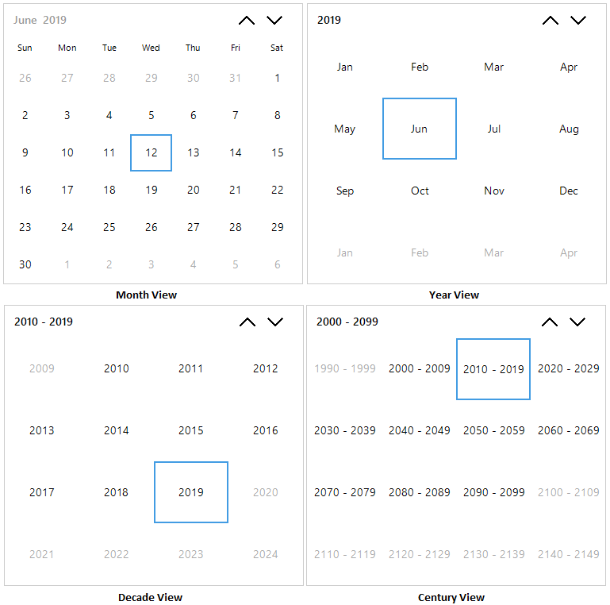

# Navigation

By default, Calendar displays the month view. Users can move from current month to previous or next month in the Calendar control by clicking navigation buttons in the header and also can move from month view to other views (Year, Decade, Century) to select the dates from other year or decade by click the header text of Calendar. 

## Different views 

Calendar supports month, year, decade, century views and provides intuitive interface through which user can navigate and quickly select dates.

User can choose the required view options in calendar by `ViewMode` property. the below code illustrates how to show only year and decade views in calendar.





// setting Year and decade mode to display year and decade view
    
this.sfCalendar.ViewMode = Syncfusion.WinForms.Input.Enums.CalendarViewType.Year | Syncfusion.WinForms.Input.Enums.CalendarViewType.Decade;





' setting Year and decade mode to display year and decade view

Me.sfCalendar.ViewMode = (Syncfusion.WinForms.Input.Enums.CalendarViewType.Year Or Syncfusion.WinForms.Input.Enums.CalendarViewType.Decade)





## Navigation through mouse

Navigation between next or previous range of dates for the current view in the calendar can be done by clicking up and down navigation buttons in calendar header. `SfCalendar` control allows to navigate from one view to other views through mouse which is done by clicking the header text of the calendar and selecting cell from the view navigate back to next available view in `ViewMode`.

## Navigation through keyboard

`SfCalendar` control allows to navigate from one view to other views through keyboard by pressing the `CTRL + UP` in backward direction or `CTRL + DOWN` keys in forward direction. SfCalendar allows to navigate between different cells in the same view by pressing navigation arrows. `CTRL + LEFT` and `CTRL + RIGHT` arrow keys to navigate to previous or next month of calendar.

## Navigation through touch

Navigation between next or previous range of dates for the current view in the calendar can be done by panning on the calendar view. `SfCalendar` control allows to navigate from one view to other view by tap the header of calendar. Tapping cell from the view navigate back to next available view in `ViewMode`. 

## Handle view change

`ViewChanging` event occurs when click on the Calendar Header text to change the view from one view to another view. Change of view can be restricted on-demand by handling the `ViewChanging` event. `ViewChangingEventArgs` provides the information about the old and new `ViewType`. This helps to restrict view change in specific scenarios only. The following code example illustrates the same.





// Invoked when the view changed.

 this.sfCalendar.ViewChanging += SfCalendar_ViewChanging;

  private void SfCalendar_ViewChanging(Syncfusion.WinForms.Input.SfCalendar sender, Syncfusion.WinForms.Input.Events.ViewChangingEventArgs args)
  
  {

      if(args.NewViewType == Syncfusion.WinForms.Input.Enums.CalendarViewType.Year)

      {

         args.Cancel = true;

      }

  }





' Invoked when the view changed.

Me.sfCalendar.ViewChanging = (Me.sfCalendar.ViewChanging + SfCalendar_ViewChanging)

    Private Sub SfCalendar_ViewChanging(ByVal sender As 
    Syncfusion.WinForms.Input.SfCalendar, ByVal args As Syncfusion.WinForms.Input.Events.ViewChangingEventArgs)
      
        If (args.NewViewType = Syncfusion.WinForms.Input.Enums.CalendarViewType.Year) Then
      
            args.Cancel = true
      
        End If
        
    End Sub





## Handle Navigation

`Navigating` event occurs when navigating between current range of dates to next or previous range of dates in calendar. Navigating between the same view can be restricted by handling the `Navigating` event. `NavigatingEventArgs` provides the information about the old and new range of dates. This helps to restrict navigation in specific scenarios only. The following code example illustrates the same.





// Invoked the Navigating event.

this.sfCalendar.Navigating += SfCalendar_Navigating;

private void SfCalendar_Navigating(SfCalendar sender, Syncfusion.WinForms.Input.Events.NavigatingEventArgs args)

{

    if (args.NewValue.Start <= new DateTime(2018, 04, 01) && args.NewValue.End >= new DateTime(2018, 04, 30))

    {

        args.Cancel = true;

    }

}





' Invoked the Navigating event.

Me.sfCalendar.Navigating = (Me.sfCalendar.Navigating + SfCalendar_Navigating)
    
    Private Sub SfCalendar_Navigating(ByVal sender As SfCalendar, ByVal args As Syncfusion.WinForms.Input.Events.NavigatingEventArgs)

        If ((args.NewValue.Start <= New DateTime(2018, 4, 1))  _

                    AndAlso (args.NewValue.End >= New DateTime(2018, 4, 30))) Then

            args.Cancel = true

        End If
        
End Sub





## Disable animation on navigation

SfCalendar animate the content while navigate between different set of date range or move from one view to another view. This animation can be disabled by `EnableAnimation` as false. The following code example illustrates the same.





// Disabling the animation

this.sfCalendar.EnableAnimation = false;





' Disabling the animation

Me.sfCalendar.EnableAnimation = false




