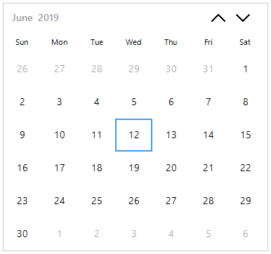
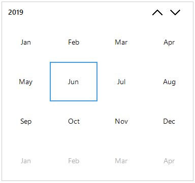
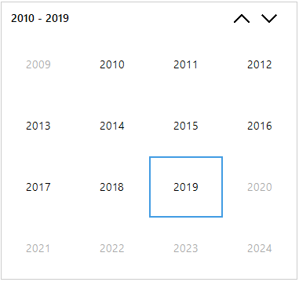
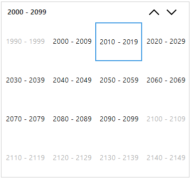

# Navigation

This section explains the views and navigations of the `SfCalendar`. 

## Different views 

This calendar support for month, year, decade, century views and provides intuitive interface through which user can navigate and quickly select dates. To set the View, set `ViewMode` property. 

The following codes illustrates the same.





// setting Year to display month view

    this.sfCalendar.ViewMode = Syncfusion.WinForms.Input.Enums.CalendarViewType.Month;

// setting Year to display year view
    
    this.sfCalendar.ViewMode = Syncfusion.WinForms.Input.Enums.CalendarViewType.Year;

// setting Year to display decade view
    
    this.sfCalendar.ViewMode = Syncfusion.WinForms.Input.Enums.CalendarViewType.Decade;

// setting Year to display Century view

    this.sfCalendar.ViewMode = Syncfusion.WinForms.Input.Enums.CalendarViewType.Century;
   
// setting Year display all the views. Its a default value of ViewMode

    this.sfCalendar.ViewMode = Syncfusion.WinForms.Input.Enums.CalendarViewType.All;





' setting Month to display month view

Me.sfCalendar.ViewMode = Syncfusion.WinForms.Input.Enums.CalendarViewType.Month

' setting Year to display year view

Me.sfCalendar.ViewMode = Syncfusion.WinForms.Input.Enums.CalendarViewType.Year

' setting Decade to display decade view

Me.sfCalendar.ViewMode = Syncfusion.WinForms.Input.Enums.CalendarViewType.Decade

' setting Century to display Century view

Me.sfCalendar.ViewMode = Syncfusion.WinForms.Input.Enums.CalendarViewType.Century

' setting All to display all the views

Me.sfCalendar.ViewMode = Syncfusion.WinForms.Input.Enums.CalendarViewType.All





## Handle view change

`ViewChanging` event occurs when click on the Calendar Header text to change the view from one view to another view. The following code example illustrates the same.





// Invoked when the view changed.

 this.sfCalendar.ViewChanging += SfCalendar_ViewChanging;

  private void SfCalendar_ViewChanging(Syncfusion.WinForms.Input.SfCalendar sender, Syncfusion.WinForms.Input.Events.ViewChangingEventArgs args)
        {
            if(args.NewViewType == Syncfusion.WinForms.Input.Enums.CalendarViewType.Year)
            {
                args.Cancel = true;
            }
        }





' Invoked when the view changed.

Me.sfCalendar.ViewChanging = (Me.sfCalendar.ViewChanging + SfCalendar_ViewChanging)

    Private Sub SfCalendar_ViewChanging(ByVal sender As 
    Syncfusion.WinForms.Input.SfCalendar, ByVal args As Syncfusion.WinForms.Input.Events.ViewChangingEventArgs)
      
        If (args.NewViewType = Syncfusion.WinForms.Input.Enums.CalendarViewType.Year) Then
      
            args.Cancel = true
      
        End If
        
    End Sub





## Navigation through mouse

It is possible to navigate from one view to other views by using the mouse which is done by clicking the header of the Calendar control in Backward direction. Also by selecting the month or year or decade cell to navigate from one to other views in Forward direction. 

## Navigation through keyboard

It is possible to navigate from one view to other views through keyboard. It can be navigate from one view to other views by pressing the `CTRL + Up Arrow` or `CTRL + Down Arrow` keys. 

## Navigation through touch

In Calendar control, navigate from one view to other views by tapping the header of the Calendar control. 

N> Can navigate multiple views through mouse when `ViewMode` property value as All. 

## Handle Navigation

`Navigating` event occurs when press navigation buttons to move next or previous month, year or decade in calendar. The following code example illustrates the same.





// Invoked the Navigating event.

this.sfCalendar.Navigating += SfCalendar_Navigating;

private void SfCalendar_Navigating(SfCalendar sender, Syncfusion.WinForms.Input.Events.NavigatingEventArgs args)
{
    if (args.NewValue.Start <= new DateTime(2018, 04, 01) && args.NewValue.End >= new DateTime(2018, 04, 30))
    {
        args.Cancel = true;
    }
}





' Invoked the Navigating event.

Me.sfCalendar.Navigating = (Me.sfCalendar.Navigating + SfCalendar_Navigating)
    
    Private Sub SfCalendar_Navigating(ByVal sender As SfCalendar, ByVal args As Syncfusion.WinForms.Input.Events.NavigatingEventArgs)

        If ((args.NewValue.Start <= New DateTime(2018, 4, 1))  _

                    AndAlso (args.NewValue.End >= New DateTime(2018, 4, 30))) Then

            args.Cancel = true

        End If
        
End Sub





