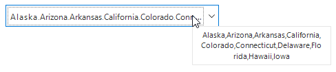
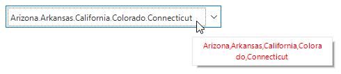

# Selection

The SfComboBox allows you to select single or multiple items in the drop-down list. The selection mode can be set by using the [ComboBoxMode](https://help.syncfusion.com/cr/windowsforms/Syncfusion.SfListView.WinForms~Syncfusion.WinForms.ListView.SfComboBox~ComboBoxMode.html) property. 

Combo box has two different modes:

* SingleSelection: Selects single item.
* MultiSelection: Selects multiple items.

## Single selection

### Getting the selected index

Index of the selected item can be retrieved by using the [SelectedIndex](https://help.syncfusion.com/cr/windowsforms/Syncfusion.SfListView.WinForms~Syncfusion.WinForms.ListView.SfComboBox~SelectedIndex.html) property.

### Getting the selected value

Value of the selected item can be retrieved by using the [SelectedValue](https://help.syncfusion.com/cr/windowsforms/Syncfusion.SfListView.WinForms~Syncfusion.WinForms.ListView.SfComboBox~SelectedValue.html) property. It returns the property value bind to the [ValueMember](https://help.syncfusion.com/cr/windowsforms/Syncfusion.SfListView.WinForms~Syncfusion.WinForms.ListView.SfComboBox~ValueMember.html) property. If the `ValueMember` is not initialized, it will return the value of the property bind to [DisplayMember](https://help.syncfusion.com/cr/windowsforms/Syncfusion.SfListView.WinForms~Syncfusion.WinForms.ListView.SfComboBox~DisplayMember.html).
### Getting the selected item of underlying data object

The selected item of the SfComboBox can be retrieved by using the [SelectedItem](https://help.syncfusion.com/cr/windowsforms/Syncfusion.SfListView.WinForms~Syncfusion.WinForms.ListView.SfComboBox~SelectedItem.html) property.

### Events

#### SelectedIndexChanged event

The [SelectedIndexChanged](https://help.syncfusion.com/cr/windowsforms/Syncfusion.SfListView.WinForms~Syncfusion.WinForms.ListView.SfComboBox~SelectedIndexChanged_EV.html) event is raised while selecting an item.



sfComboBox1.SelectedIndexChanged += new EventHandler(SfComboBox1_SelectedIndexChanged);
private void SfComboBox1_SelectedIndexChanged(object sender, EventArgs e)
{
}


sfComboBox1.SelectedValueChanged += new EventHandler(SfComboBox1_SelectedValueChanged);
private void SfComboBox1_SelectedValueChanged(object sender, EventArgs e)
{
}



#### SelectedValueChanged event

The [SelectedValueChanged](https://help.syncfusion.com/cr/windowsforms/Syncfusion.SfListView.WinForms~Syncfusion.WinForms.ListView.SfComboBox~SelectedValueChanged_EV.html) event is raised while selecting an item.



sfComboBox1.SelectedValueChanged += new EventHandler(SfComboBox1_SelectedValueChanged);
private void SfComboBox1_SelectedValueChanged(object sender, EventArgs e)
{
}


AddHandler sfComboBox1.SelectedValueChanged, AddressOf SfComboBox1_SelectedValueChanged
Private Sub SfComboBox1_SelectedValueChanged(ByVal sender As Object, ByVal e As EventArgs)
End Sub



## Multi-selection

The SfComboBox allows you to select multiple values from the drop-down list. The multi-select combo box mode can be enabled by setting the [ComboBoxMode](https://help.syncfusion.com/cr/windowsforms/Syncfusion.SfListView.WinForms~Syncfusion.WinForms.ListView.SfComboBox~ComboBoxMode.html) property as `MultiSelection`.



sfComboBox1.ComboBoxMode = ComboBoxMode.MultiSelection;


sfComboBox1.ComboBoxMode = ComboBoxMode.MultiSelection



### Select all

The SfComboBox support to choose all items in the drop-down list for multiselect combo box by setting the [AllowSelectAll](https://help.syncfusion.com/cr/windowsforms/Syncfusion.SfListView.WinForms~Syncfusion.WinForms.ListView.SfComboBox~AllowSelectAll.html) property to `true`.



sfComboBox1.AllowSelectAll = true;


sfComboBox1.AllowSelectAll = True



### Changing the delimiter character to separate selected items

The SfComboBox supports various delimiter characters to separate multiple selected items in the multi selected combo box. The delimiter character can be set by using the [DelimiterChar](https://help.syncfusion.com/cr/windowsforms/Syncfusion.SfListView.WinForms~Syncfusion.WinForms.ListView.SfComboBox~DelimiterChar.html) property. The default delimiter character is “,”.



sfComboBox1.DelimiterChar = "-";


sfComboBox1.DelimiterChar = "-"



### Hiding the buttons in the drop down

Buttons in the drop-down list can be hide by setting the [DropDownControl.ShowButtons](https://help.syncfusion.com/cr/windowsforms/Syncfusion.SfListView.WinForms~Syncfusion.WinForms.ListView.ComboBoxPopup~ShowButtons.html) property to `false`. 



sfComboBox1.DropDownControl.ShowButtons = false;


sfComboBox1.DropDownControl.ShowButtons = False



### Accessing the checked items

The checked items can be retrieved by using the `CheckedItems` property. The items can also be added programmatically by using the [CheckedItems](https://help.syncfusion.com/cr/windowsforms/Syncfusion.SfListView.WinForms~Syncfusion.WinForms.ListView.SfComboBox~CheckedItems.html) property.

### Tooltip

Multi-select combo box supports to show the whole text in the editor portion by using the tooltip when hovering the mouse on the editor portion of the control. Tooltip can be enabled by setting the `ShowToolTip` property to `true`.
 
N> The [SfToolTip](https://help.syncfusion.com/windowsforms/sftooltip/overview) control is used for the tooltip support.



sfComboBox1.ShowToolTip = true;


sfComboBox1.ShowToolTip = True



#### Tooltip options

##### Setting tooltip delay

Tooltip support you to set delay when showing the tooltip values by using the [ToolTipOption](https://help.syncfusion.com/cr/windowsforms/Syncfusion.SfListView.WinForms~Syncfusion.WinForms.ListView.SfComboBox~ToolTipOption.html) property.

The following properties can be used to set the tooltip delay time:

*	InitialDelay
*	AutoPopDelay.

###### InitialDelay

The [InitialDelay](https://help.syncfusion.com/cr/windowsforms/Syncfusion.Core.WinForms~Syncfusion.WinForms.Controls.SfToolTip~InitialDelay.html) property enables you to shorten or lengthen the time that the tooltip waits before displaying the tooltip values. The default value is 500 milliseconds.



sfComboBox1.ToolTipOption.InitialDelay = 3000;


sfComboBox1.ToolTipOption.InitialDelay = 3000



###### AutoPopDelay

The [AutoPopDelay](https://help.syncfusion.com/cr/windowsforms/Syncfusion.Core.WinForms~Syncfusion.WinForms.Controls.SfToolTip~AutoPopDelay.html) property enables you to shorten or lengthen the time duration that the tooltip is displayed when the mouse pointer is on a control. The default value is 5000 milliseconds.



sfComboBox1.ToolTipOption.AutoPopDelay = 2000;


sfComboBox1.ToolTipOption.AutoPopDelay = 2000



###### ToolTip shadow

Shadow of the tooltip can be enabled or disabled by setting the [ShadowVisible](https://help.syncfusion.com/cr/windowsforms/Syncfusion.SfListView.WinForms~Syncfusion.WinForms.ListView.ToolTipOptions~ShadowVisible.html) property. Default value is `true `.



sfComboBox1.ToolTipOption.ShadowVisible = false;


sfComboBox1.ToolTipOption.ShadowVisible = False



#### Styling

Appearance of the tooltip can be customized by using the [ToolTipStyle](https://help.syncfusion.com/cr/windowsforms/Syncfusion.Core.WinForms~Syncfusion.WinForms.Controls.ToolTipInfo~ToolTipStyle.html ) property.



sfComboBox1.Style.ToolTipStyle.BackColor = Color.Green;
sfComboBox1.Style.ToolTipStyle.ForeColor = Color.White;
sfComboBox1.Style.ToolTipStyle.BorderColor = Color.Red;
sfComboBox1.Style.ToolTipStyle.BorderThickness = 5;


sfComboBox1.Style.ToolTipStyle.BackColor = Color.Green
sfComboBox1.Style.ToolTipStyle.ForeColor = Color.White
sfComboBox1.Style.ToolTipStyle.BorderColor = Color.Red
sfComboBox1.Style.ToolTipStyle.BorderThickness = 5



##### Conditional styling

Appearance of the tooltip can be customized before showing the tooltip based on the control in which it is configured by using the [ToolTipOpening](https://help.syncfusion.com/cr/windowsforms/Syncfusion.SfListView.WinForms~Syncfusion.WinForms.ListView.SfComboBox~ToolTipOpening_EV.html) event.



sfComboBox1.ToolTipOpening += new EventHandler<ComboBoxToolTipOpeningEventArgs>(SfComboBox1_ToolTipOpening);
private void SfComboBox1_ToolTipOpening(object sender, ComboBoxToolTipOpeningEventArgs e)
{
  if (e.DisplayText.Contains("California"))
    {
       sfComboBox1.Style.ToolTipStyle.ForeColor = Color.Red;
    }
}


AddHandler sfComboBox1.ToolTipOpening, AddressOf SfComboBox1_ToolTipOpening
Private Sub SfComboBox1_ToolTipOpening(ByVal sender As Object, ByVal e As ComboBoxToolTipOpeningEventArgs)
  If e.DisplayText.Contains("California") Then
	   sfComboBox1.Style.ToolTipStyle.ForeColor = Color.Red
  End If
End Sub



#### Canceling tooltip opening

The [ToolTipOpening](https://help.syncfusion.com/cr/windowsforms/Syncfusion.SfListView.WinForms~Syncfusion.WinForms.ListView.SfComboBox~ToolTipOpening_EV.html) event can be used to cancel the tooltip opening by setting the `e.Cancel` to `true`.



sfComboBox1.ToolTipOpening += new EventHandler<ComboBoxToolTipOpeningEventArgs>(SfComboBox1_ToolTipOpening);
private void SfComboBox1_ToolTipOpening(object sender, ComboBoxToolTipOpeningEventArgs e)
{
   e.Cancel = true;
}


AddHandler sfComboBox1.ToolTipOpening, AddressOf SfComboBox1_ToolTipOpening
Private Sub SfComboBox1_ToolTipOpening(ByVal sender As Object, ByVal e As ComboBoxToolTipOpeningEventArgs)
   e.Cancel = True
End Sub

