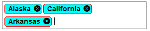

# Token

Token represents the selected item(s) in combo box. The selected items are displayed in rounded-polygon shape with close icon. This option also helps to select multiple items without using check box and remove the token at run time.  

The [EnableToken] property determines whether the selected item(s) in the combo box should be displayed as token.



sfComboBox1.EnableToken = true;


sfComboBox1.EnableToken = true;



The important characteristics of the token support are as follows.

{{'**Searching**'| markdownify }}- Items can be searched from the combo box by entering appropriate characters in the text area.

{{'**Adding**'| markdownify }}- When an item is selected from the combo box, the item will be added as token in text area and removed from the drop-down area. 

{{'**Removing**'| markdownify }}- By clicking the remove icon, the appropriate item will be removed from the text area, and it will be added automatically back to the drop-down area.

{{'**AutoSize**'| markdownify }}- Text area height will be increased automatically based on the placement of the selected items.

## Customizing the appearance of token

The appearance of token can be customized using the TokenStyle property. It includes the background color, border color, foreground color, close button color, and font.



sfComboBox1.Style.TokenStyle.BackColor = Color.Aqua;
sfComboBox1.Style.TokenStyle.BorderColor = Color.Red;
sfComboBox1.Style.TokenStyle.ForeColor = Color.Black;
sfComboBox1.Style.TokenStyle.CloseButtonBackColor = Color.Black;
sfComboBox1.Style.TokenStyle.Font = new Font(“Arial”, 10F, FontStyle.Bold);


sfComboBox1.Style.TokenStyle.BackColor = Color.Aqua;
sfComboBox1.Style.TokenStyle.BorderColor = Color.Red;
sfComboBox1.Style.TokenStyle.ForeColor = Color.Black;
sfComboBox1.Style.TokenStyle.CloseButtonBackColor = Color.Black;
sfComboBox1.Style.TokenStyle.Font = new Font(“Arial”, 10F, FontStyle.Bold);



## Keyboard access

* Using the Down Arrow, Up Arrow, and Enter keys, item can be selected from the combo box.
* Using the Backspace key, the last positioned token will be removed from the text area.
* When the Esc key is pressed, the drop-down area will be closed if it has been opened already. 