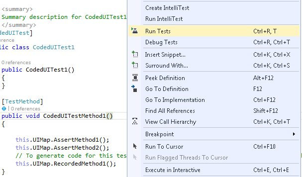

# UI Automation
Microsoft UI Automation is the new accessibility Framework for Microsoft Windows, available on all operating systems that support Windows Forms. UI Automation provides accessibility to most UI elements and it provides the information about UI element to the end user. You can interact with the UI by using automated test scripts. To know more about UI Automation, refer the [MSDN page](https://docs.microsoft.com/en-us/dotnet/framework/ui-automation/ui-automation-overview).

SfComboBox supports the following types of UI Automation,

1. Coded UI test

2. Quick Test Professional

## Coded UI test

Automated tests that drive your application through its user interface (UI) are known as Coded UI Tests (CUITs). These tests include functional testing of the UI controls. SfComboBox supports CUITs Coded UI automation that helps to create automated tests for inner elements and records the sequence of actions. While dragging the crosshair that is shown in CodedUITestBuilder, on UI elements, it shows the properties of the respective UI elements and the assertion can also add for each of the properties of SfComboBox.

SfComboBox supports below two levels of CUIT automation,

<table>
<tr>
<td>
{{ '**Levels**' | markdownify }}</td>
<td>
{{ '**Description**' | markdownify }}</td></tr>
<tr>
<td>
{{'**Level - 1**' | markdownify }}</td>
<td>
Record and playback: The recorder identifies elements involved in an action, and the playback is processed based on the generated code via Microsoft Active Accessibility.
</td>
</tr>
<tr>
<td>
{{ '**Level - 2**' | markdownify }}</td>
<td>
Property validation: A set of default properties are defined based on the MSAA control type for each control where users can add assertions.
</td>
</tr>
</table>

### Requirements and Configuration

Coded UI provides support only in Visual Studio Ultimate and Visual Studio Premium. For more information about the platforms and configurations that are supported by Coded UI tests, refer this [page](https://docs.microsoft.com/en-us/visualstudio/test/supported-configurations-and-platforms-for-coded-ui-tests-and-action-recordings?view=vs-2015).

### Enable assertion

The Coded UI support for SfComboBox can be enabled using `AccessibilityEnabled` property.



//To enable the accessibility.
 this.sfComboBox1.AccessibilityEnabled = true;


'To enable the accessibility.
Me.sfComboBox1.AccessibilityEnabled = true



### Getting started

Below are steps to create a `CodedUITest project` and test the `SfComboBox` application.

1) Create a new application or open an existing application with `SfComboBox`.

2) Create a Coded UI Test Project as shown in the following image.

3)For the new Coded UI project, a CUIT file is added automatically and Generate Code dialog box appears. In this, choose `Record actions, edit UI map or add assertions`.

4) Now the Coded UI project Visual Studio gets minimized and `CodedUITestBuilder` appears in the bottom right corner of the window. Record the actions by clicking Start Recording in `CodedUITestBuilder`.

5) Open the CodedUITestBuilder from existing Coded UI project by right clicking on the `CodedUITestMethod1` in CUIT file and clicking the Generate Code for Coded UI Test as shown in the following screenshot. The same CodedUITestBuilder appears in the bottom right corner of the window.

6) Drag the Crosshairs on to the UI elements in `SfComboBox` application and it shows the available properties of the inner UI elements in SfComboBox. 

7) Record actions made on UI elements by clicking `Record` button on the CodedUITest builder.

8) Once the record is completed, click the `GenerateCode` icon in CodedUITestBuilder for generate a test method. Then close the CodedUITestBuilder and see the generated code for ComboBox item changed action as follows.

9) Create an assertion to check the modified cell value. Drag the crosshair to the modified cell, and the `Assertion` window appears. The properties for control is now listed in the Assertion dialog box and add assertion by clicking the Generate Code button in `CodedUITestBuilder`.

10) After all tests and assertion are created, right-click on the Test method and click `Run Tests` to run the test as follows.

## QTP

Refer the [UFT/QTP](windowsforms-docs/blob/master/WindowsForms/Testing/UFT/Supported-Controls-and-Methods.md#SfComboBox) testing to test the UI with SfComboBox.