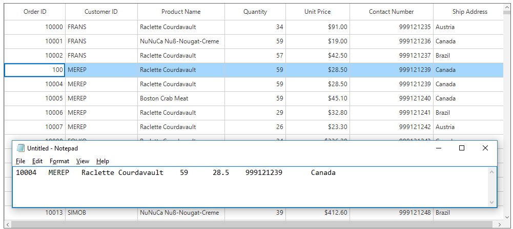

# Clipboard Operations

SfDataGrid provide support for the clipboard operations such as cut, copy and paste the data within control and between other applications such as Notepad, Excel. Clipboard operations copy and paste is enabled by default. The Selected records from SfDataGrid can be copied by pressing <kbd>Ctrl+C</kbd> and the content from Clipboard can be pasted to SfDataGrid by pressing <kbd>Ctrl+V</kbd>.

N> Clipboard operations are not supported for the summary rows, add new row and unbound rows.

## Copy

Copy operation works based on [CopyOption](https://help.syncfusion.com/cr/cref_files/windowsforms/sfdatagrid/Syncfusion.SfDataGrid.WinForms~Syncfusion.WinForms.DataGrid.SfDataGrid~CopyOption.html) property.

CopyOption provides the following options,

[None](https://help.syncfusion.com/cr/cref_files/windowsforms/sfdatagrid/Syncfusion.SfDataGrid.WinForms~Syncfusion.WinForms.DataGrid.SfDataGrid~CopyOption.html) – Disables copy in SfDataGrid.

[CopyData](https://help.syncfusion.com/cr/cref_files/windowsforms/sfdatagrid/Syncfusion.SfDataGrid.WinForms~Syncfusion.WinForms.DataGrid.SfDataGrid~CopyOption.html) – Enables copy in SfDataGrid.

[CutData](https://help.syncfusion.com/cr/cref_files/windowsforms/sfdatagrid/Syncfusion.SfDataGrid.WinForms~Syncfusion.WinForms.DataGrid.SfDataGrid~CopyOption.html) – Enables cut in SfDataGrid.

[IncludeHeaders](https://help.syncfusion.com/cr/cref_files/windowsforms/sfdatagrid/Syncfusion.SfDataGrid.WinForms~Syncfusion.WinForms.DataGrid.SfDataGrid~CopyOption.html) – Column header also copied along with data.

[IncludeFormat](https://help.syncfusion.com/cr/cref_files/windowsforms/sfdatagrid/Syncfusion.SfDataGrid.WinForms~Syncfusion.WinForms.DataGrid.SfDataGrid~CopyOption.html) – Copies the display text with format instead of actual value.

[IncludeHiddenColumn](https://help.syncfusion.com/cr/cref_files/windowsforms/sfdatagrid/Syncfusion.SfDataGrid.WinForms~Syncfusion.WinForms.DataGrid.SfDataGrid~CopyOption.html) – Hidden column also copied to clipboard.

`IncludeHeaders`, `IncludeFormat`, `IncludeHiddenColumn` options should be used along with `CopyData` option.



this.sfDataGrid1.CopyOption = CopyOptions.CopyData | CopyOptions.IncludeHeaders;



## Paste

Paste operation works based on [PasteOption](https://help.syncfusion.com/cr/cref_files/windowsforms/sfdatagrid/Syncfusion.SfDataGrid.WinForms~Syncfusion.WinForms.DataGrid.SfDataGrid~PasteOption.html) property.
PasteOption provides the following options,

[None](https://help.syncfusion.com/cr/cref_files/windowsforms/sfdatagrid/Syncfusion.SfDataGrid.WinForms~Syncfusion.WinForms.DataGrid.SfDataGrid~PasteOption.html) – Disables paste in SfDataGrid.

[PasteData](https://help.syncfusion.com/cr/cref_files/windowsforms/sfdatagrid/Syncfusion.SfDataGrid.WinForms~Syncfusion.WinForms.DataGrid.SfDataGrid~PasteOption.html) – Enables paste in SfDataGrid and when an incompatible value is pasted into a record, the pasting operation is skipped for that particular record.

[ExcludeFirstLine](https://help.syncfusion.com/cr/cref_files/windowsforms/sfdatagrid/Syncfusion.SfDataGrid.WinForms~Syncfusion.WinForms.DataGrid.SfDataGrid~PasteOption.html) – This can be used when pasting data copied with IncludeHeader copy option.

[IncludeHiddenColumn](https://help.syncfusion.com/cr/cref_files/windowsforms/sfdatagrid/Syncfusion.SfDataGrid.WinForms~Syncfusion.WinForms.DataGrid.SfDataGrid~PasteOption.html) – Paste the values in hidden columns also.

`ExcludeFirstLine`, `IncludeHiddenColumn` options should be used along with `PasteData` option.



this.sfDataGrid1.PasteOption = PasteOptions.PasteData | PasteOptions.ExcludeFirstLine;



## Cut

Cut operation works based on [CopyOption](https://help.syncfusion.com/cr/cref_files/windowsforms/sfdatagrid/Syncfusion.SfDataGrid.WinForms~Syncfusion.WinForms.DataGrid.SfDataGrid~CopyOption.html) property.

`CopyOption` provides the following options,

[None](https://help.syncfusion.com/cr/cref_files/windowsforms/sfdatagrid/Syncfusion.SfDataGrid.WinForms~Syncfusion.WinForms.DataGrid.SfDataGrid~CopyOption.html) – Disables cut in SfDataGrid.

[CutData](https://help.syncfusion.com/cr/cref_files/windowsforms/sfdatagrid/Syncfusion.SfDataGrid.WinForms~Syncfusion.WinForms.DataGrid.SfDataGrid~CopyOption.html) – Enabled cut in SfDataGrid.

[IncludeHeaders](https://help.syncfusion.com/cr/cref_files/windowsforms/sfdatagrid/Syncfusion.SfDataGrid.WinForms~Syncfusion.WinForms.DataGrid.SfDataGrid~CopyOption.html) – Column header also copied along with data.

[IncludeFormat](https://help.syncfusion.com/cr/cref_files/windowsforms/sfdatagrid/Syncfusion.SfDataGrid.WinForms~Syncfusion.WinForms.DataGrid.SfDataGrid~CopyOption.html) – Cut the display text with format instead of actual value.

[IncludeHiddenColumn](https://help.syncfusion.com/cr/cref_files/windowsforms/sfdatagrid/Syncfusion.SfDataGrid.WinForms~Syncfusion.WinForms.DataGrid.SfDataGrid~CopyOption.html) – Hidden column also cut to clipboard.

`IncludeHeaders`, `IncludeFormat`, `IncludeHiddenColumn` options should be used along with `CutData` option.



this.sfDataGrid1.CopyOption = CopyOptions.CutData | CopyOptions.IncludeHeaders;



## Cancel copy operation

### Rows

Copy operation for any particular row can be canceled by handling the [CopyContent](https://help.syncfusion.com/cr/cref_files/windowsforms/sfdatagrid/Syncfusion.SfDataGrid.WinForms~Syncfusion.WinForms.DataGrid.SfDataGrid~CopyContent_EV.html) event.



this.sfDataGrid1.CopyContent += SfDataGrid1_CopyContent;

void SfDataGrid1_CopyContent(object sender, CutCopyPasteEventArgs e)
{
    if (((e.OriginalSender as SfDataGrid).SelectedItem as OrderInfo).OrderID == 10004)
        e.Cancel = true;

}



### Columns

Copy operation for any particular column can be canceled by handling the [CopyCellContent](https://help.syncfusion.com/cr/cref_files/windowsforms/sfdatagrid/Syncfusion.SfDataGrid.WinForms~Syncfusion.WinForms.DataGrid.SfDataGrid~CopyCellContent_EV.html) event.



this.sfDataGrid1.CopyCellContent += SfDataGrid1_CopyCellContent;
void SfDataGrid1_CopyCellContent(object sender, CellCutCopyPasteEventArgs e)
{
    if (e.Column.MappingName == "CustomerID")
        e.Cancel = true;
}



## Cancel paste operation

### Rows

Paste operation for any particular row can be canceled by handling the [PasteContent](https://help.syncfusion.com/cr/cref_files/windowsforms/sfdatagrid/Syncfusion.SfDataGrid.WinForms~Syncfusion.WinForms.DataGrid.SfDataGrid~PasteContent_EV.html) event.



this.sfDataGrid1.PasteContent += SfDataGrid1_PasteContent;

void SfDataGrid1_PasteContent(object sender, CutCopyPasteEventArgs e)
{
    if (((e.OriginalSender as SfDataGrid).SelectedItem as OrderInfo).OrderID == 10004)
        e.Cancel = true;
}



### Columns

Paste operation for any particular column can be canceled by handling the [PasteCellContent](https://help.syncfusion.com/cr/cref_files/windowsforms/sfdatagrid/Syncfusion.SfDataGrid.WinForms~Syncfusion.WinForms.DataGrid.SfDataGrid~PasteCellContent_EV.html) event.



this.sfDataGrid1.PasteCellContent += SfDataGrid1_PasteCellContent;

void SfDataGrid1_PasteCellContent(object sender, CellCutCopyPasteEventArgs e)
{
    if (e.Column.MappingName == "CustomerID")
        e.Cancel = true;
}



## Change the clipboard text

### Copy

SfDataGrid allows to change the clipboard value while copying the values to the clipboard by handling the [CopyCellContent](https://help.syncfusion.com/cr/cref_files/windowsforms/sfdatagrid/Syncfusion.SfDataGrid.WinForms~Syncfusion.WinForms.DataGrid.SfDataGrid~CopyCellContent_EV.html) event.
The below code example changes the clipboard value as `100` instead of cell value `10003` in SfDataGrid while copying the record.



void SfDataGrid1_CopyCellContent(object sender, CellCutCopyPasteEventArgs e)
{
    if (e.Column.MappingName == "OrderID" && ((e.OriginalSender as SfDataGrid).SelectedItem as OrderInfo).OrderID == 10003)
    {
        e.ClipboardValue = "100";
    }
}



### Paste

SfDataGrid allows to change the clipboard value while pasting the values from the clipboard by handling the [PasteCellContent](https://help.syncfusion.com/cr/cref_files/windowsforms/sfdatagrid/Syncfusion.SfDataGrid.WinForms~Syncfusion.WinForms.DataGrid.SfDataGrid~PasteCellContent_EV.html) event.

The below code example changes the clipboard value as `100` instead of cell value `10003` in SfDataGrid while pasting the record to the SfDataGrid.



void SfDataGrid_PasteCellContent(object sender, CellCutCopyPasteEventArgs e)
{
    if (e.Column.MappingName == "OrderID" && ((e.OriginalSender as SfDataGrid).SelectedItem as OrderInfo).OrderID == 10003)
    {
        e.ClipboardValue = "100";
    }
}



## Handling programmatically

### Copy programmatically	 

Copy the selected records in SfDataGrid by using [Copy](https://help.syncfusion.com/cr/cref_files/windowsforms/sfdatagrid/Syncfusion.SfDataGrid.WinForms~Syncfusion.WinForms.DataGrid.Interactivity.IDataGridClipboardController~Copy.html) method in [ClipboardController](https://help.syncfusion.com/cr/cref_files/windowsforms/sfdatagrid/Syncfusion.SfDataGrid.WinForms~Syncfusion.WinForms.DataGrid.SfDataGrid~ClipboardController.html) of SfDataGrid.


this.sfDataGrid1.ClipboardController.Copy();



Copy a record by selecting the record using [MoveToCurrentCell](https://help.syncfusion.com/cr/cref_files/windowsforms/sfdatagrid/Syncfusion.SfDataGrid.WinForms~Syncfusion.WinForms.DataGrid.SfDataGrid~MoveToCurrentCell.html) method and `Copy` method in [ClipboardController](https://help.syncfusion.com/cr/cref_files/windowsforms/sfdatagrid/Syncfusion.SfDataGrid.WinForms~Syncfusion.WinForms.DataGrid.SfDataGrid~ClipboardController.html) of SfDataGrid.



RowColumnIndex rowColumnIndex = new RowColumnIndex();
rowColumnIndex.RowIndex = 2;
rowColumnIndex.ColumnIndex = 2;
this.sfDataGrid1.MoveToCurrentCell(rowColumnIndex);
this.sfDataGrid1.ClipboardController.Copy();



Copy the multiple records by selecting group of records using [SelectRows](https://help.syncfusion.com/cr/cref_files/windowsforms/sfdatagrid/Syncfusion.SfDataGrid.WinForms~Syncfusion.WinForms.DataGrid.SfDataGrid~SelectRows.html) method and `Copy`method in [ClipboardController](https://help.syncfusion.com/cr/cref_files/windowsforms/sfdatagrid/Syncfusion.SfDataGrid.WinForms~Syncfusion.WinForms.DataGrid.SfDataGrid~ClipboardController.html) of SfDataGrid.



this.sfDataGrid1.SelectRows(1, 3);
this.sfDataGrid1.ClipboardController.Copy();



### Copy rows without selecting

The records can be copied without selection by using [CopyRowsToClipboard](https://help.syncfusion.com/cr/cref_files/windowsforms/sfdatagrid/Syncfusion.SfDataGrid.WinForms~Syncfusion.WinForms.DataGrid.Interactivity.IDataGridClipboardController~CopyRowsToClipboard.html) method in [ClipboardController](https://help.syncfusion.com/cr/cref_files/windowsforms/sfdatagrid/Syncfusion.SfDataGrid.WinForms~Syncfusion.WinForms.DataGrid.SfDataGrid~ClipboardController.html) of SfDataGrid.



this.sfDataGrid1.ClipboardController.CopyRowsToClipboard(3,5);



### Cut programmatically

Cut the selected records in SfDataGrid by using [Cut](https://help.syncfusion.com/cr/cref_files/windowsforms/sfdatagrid/Syncfusion.SfDataGrid.WinForms~Syncfusion.WinForms.DataGrid.Interactivity.IDataGridClipboardController~Cut.html) method in [ClipboardController](https://help.syncfusion.com/cr/cref_files/windowsforms/sfdatagrid/Syncfusion.SfDataGrid.WinForms~Syncfusion.WinForms.DataGrid.SfDataGrid~ClipboardController.html) of SfDataGrid.



this.sfDataGrid1.ClipboardController.Cut();



Cut the entire record in SfDataGrid by selecting whole SfDataGrid using [SelectAll](https://help.syncfusion.com/cr/cref_files/windowsforms/sfdatagrid/Syncfusion.SfDataGrid.WinForms~Syncfusion.WinForms.DataGrid.SfDataGrid~SelectAll.html) method and `Cut` method in [ClipboardController](https://help.syncfusion.com/cr/cref_files/windowsforms/sfdatagrid/Syncfusion.SfDataGrid.WinForms~Syncfusion.WinForms.DataGrid.SfDataGrid~ClipboardController.html) of SfDataGrid.



this.sfDataGrid1.SelectAll();
this.sfDataGrid1.ClipboardController.Cut();



### Paste programmatically

Paste the clipboard value into SfDataGrid by using [Paste](https://help.syncfusion.com/cr/cref_files/windowsforms/sfdatagrid/Syncfusion.SfDataGrid.WinForms~Syncfusion.WinForms.DataGrid.Interactivity.IDataGridClipboardController~Paste.html) method in [ClipboardController](https://help.syncfusion.com/cr/cref_files/windowsforms/sfdatagrid/Syncfusion.SfDataGrid.WinForms~Syncfusion.WinForms.DataGrid.SfDataGrid~ClipboardController.html) of SfDataGrid.



this.sfDataGrid1.ClipboardController.Paste();



Paste the clipboard value into selected record by selecting the record using [MoveToCurrentCell](https://help.syncfusion.com/cr/cref_files/windowsforms/sfdatagrid/Syncfusion.SfDataGrid.WinForms~Syncfusion.WinForms.DataGrid.SfDataGrid~MoveToCurrentCell.html) method and `Paste` method in [ClipboardController](https://help.syncfusion.com/cr/cref_files/windowsforms/sfdatagrid/Syncfusion.SfDataGrid.WinForms~Syncfusion.WinForms.DataGrid.SfDataGrid~ClipboardController.html) of SfDataGrid.



RowColumnIndex rowColumnIndex = new RowColumnIndex();
rowColumnIndex.RowIndex = 2;
rowColumnIndex.ColumnIndex = 2;
this.sfDataGrid1.MoveToCurrentCell(rowColumnIndex);
this.sfDataGrid1.ClipboardController.Paste();



## Customizing Copy Paste behavior

SfDataGrid process the clipboard operations in `DataGridClipboardController` class. The default copy paste behaviors can be customized by overriding `DataGridClipboardController` class and set it to [ClipboardController](https://help.syncfusion.com/cr/cref_files/windowsforms/sfdatagrid/Syncfusion.SfDataGrid.WinForms~Syncfusion.WinForms.DataGrid.SfDataGrid~ClipboardController.html)  of SfDataGrid.



public class CustomClipboardController : DataGridClipboardController
{
    public CustomClipboardController(SfDataGrid dataGrid) : base(dataGrid)
    {
    }
}





this.sfDataGrid.ClipboardController = new CustomClipboardController(this.sfDataGrid);



### Paste a record into many rows

By default, one row can be copied and pasted into another row when selection is enabled in SfDataGrid. The below code shows how to copy one row and paste it into all selected rows by overriding the `PasteToRow` method in the `DataGridClipboardController` class.



public class CustomClipboardController : DataGridClipboardController
{
    SfDataGrid dataGrid;
    public CustomClipboardController(SfDataGrid dataGrid) : base(dataGrid)
    {
        this.dataGrid = dataGrid;
    }

    protected override void PasteToRow(object clipBoardContent, object selectedRecords)
    {
        var text = Clipboard.GetText();
        string[] clipBoardText = Regex.Split(text, @"\r\n");

        //Get the clipBoardText and check if the clipBoardText is more than one row

        //means call the base.

        if (clipBoardText.Count() > 1)
        {
            base.PasteToRow(clipBoardContent, selectedRecords);
            return;
        }

        var selectedRecord = this.dataGrid.SelectedItems;

        for (int i = 0; i < selectedRecord.Count; i++)
        {
            //Get the selected records for paste the copied row.
            selectedRecords = selectedRecord[i];

            //Call the PasteToRow method with clipBoardContent and selectedRecords
            base.PasteToRow(clipBoardContent, selectedRecords);
        }
    }
}



### Create new records while pasting

By default, while paste the clipboard value to SfDataGrid, it changes the values of the already existing records. The below code example shows how to add the copied records as new rows in SfDataGrid by overriding the `PasteToRows` method in `DataGridClipboardController` class.



public class CustomClipboardController : DataGridClipboardController
{
    SfDataGrid dataGrid;
    public CustomClipboardController(SfDataGrid dataGrid) : base(dataGrid)
    {
        this.dataGrid = dataGrid;
    }
    protected override void PasteToRows(object clipboardrows)
    {
        var copiedRecord = (string[])clipboardrows;
        int copiedrecordscount = copiedRecord.Count();
        //Based on the clipboard count added the new record to be pasted.
        if (copiedrecordscount > 0)
        {
            for (int i = 0; i < copiedrecordscount; i++)
            {
                // Creates new record.
                this.dataGrid.View.AddNew();
                for (int j = 0; j < this.dataGrid.Columns.Count; j++)
                {
                    var record = copiedRecord[i];
                    string[] splitRecord = Regex.Split(record, @"\t");
                    //Adds the new record by using the PasteToCell method, by passing       the created data, particular column, and clipboard value.
                    this.PasteToCell(this.dataGrid.View.CurrentAddItem, this.dataGrid.Columns[j], splitRecord[j]);
                }
                // Commits the pasted record.
                this.dataGrid.View.CommitNew();
            }
        }
    }
}




### Paste the copied data by custom column order

By default, SfDataGrid pastes the data only from the first column. The copied data can be pasted anywhere in the SfDataGrid by deriving a new class from `DataGridClipboardController` and overriding the `PasteToRow` virtual method.



public class CustomClipboardController : DataGridClipboardController
{
    SfDataGrid dataGrid;
    public CustomClipboardController(SfDataGrid dataGrid) : base(dataGrid)
    {
        this.dataGrid = dataGrid;
    }
    protected override void PasteToRow(object clipboardcontent, object selectedRecords)
    {
        //Splits the row into number of cells by using \t.
        clipboardcontent = Regex.Split(clipboardcontent.ToString(), @"\t");
        var copyValue = (string[])clipboardcontent;
        //For Row selection
        int columnindex = 0;
        //Gets the currentcell column index.
        var index = this.dataGrid.CurrentCell.ColumnIndex;
        foreach (var column in dataGrid.Columns)
        {
            if (index >= dataGrid.Columns.Count)
                return;
            if (copyValue.Count() <= this.dataGrid.Columns.IndexOf(column))
                break;
            // Calls the PasteToCell method and passes the copied data and pastes the column index.
            PasteToCell(selectedRecords, this.dataGrid.Columns[index], copyValue[columnindex]);
            index++;
            columnindex++;
        }
    }
}


