# Column Types 
SfDataGrid provides support for various built-in column types. Each column has its own properties and renderer to handle different types of data.
<table>
<tr>
<td>
{{'**Column Type**'| markdownify }}
</td>
<td>
{{'**Renderer**'| markdownify }}
</td>
<td>
{{'        **Description**'| markdownify }}
</td>
</tr>
<tr>
<td>
{{'[GridTextColumn](https://help.syncfusion.com/cr/cref_files/windowsforms/Syncfusion.SfDataGrid.WinForms~Syncfusion.WinForms.DataGrid.GridTextColumn.html#"")'| markdownify }}        
</td>
<td>
{{'[GridTextBoxCellRenderer](https://help.syncfusion.com/cr/cref_files/windowsforms/Syncfusion.SfDataGrid.WinForms~Syncfusion.WinForms.DataGrid.Renderers.GridTextBoxCellRenderer.html#"")'| markdownify }}
</td>
<td>
Use to display the string data
</td>
</tr>
<tr>
<td>
{{'[GridNumericColumn](https://help.syncfusion.com/cr/cref_files/windowsforms/Syncfusion.SfDataGrid.WinForms~Syncfusion.WinForms.DataGrid.GridNumericColumn.html#"")'| markdownify }}
</td>
<td>
{{'[GridNumericCellRenderer](https://help.syncfusion.com/cr/cref_files/windowsforms/Syncfusion.SfDataGrid.WinForms~Syncfusion.WinForms.DataGrid.Renderers.GridNumericCellRenderer.html#"")'| markdownify }}
</td>
<td>
Use to display the numeric data
</td>
</tr>
<tr>
<td>
{{'[GridDateTimeColumn](https://help.syncfusion.com/cr/cref_files/windowsforms/Syncfusion.SfDataGrid.WinForms~Syncfusion.WinForms.DataGrid.GridDateTimeColumn.html#"")'| markdownify }}
</td>
<td>
{{'[GridDateTimeCellRenderer](https://help.syncfusion.com/cr/cref_files/windowsforms/Syncfusion.SfDataGrid.WinForms~Syncfusion.WinForms.DataGrid.Renderers.GridDateTimeCellRenderer.html#"")'| markdownify }}
</td>
<td>
Use to display the date time value
</td>
</tr>
<tr>
<td>
{{'[GridCheckBoxColumn](https://help.syncfusion.com/cr/cref_files/windowsforms/Syncfusion.SfDataGrid.WinForms~Syncfusion.WinForms.DataGrid.GridCheckBoxColumn.html#"")'| markdownify }}        
</td>
<td>
{{'[GridCheckBoxCellRenderer](https://help.syncfusion.com/cr/cref_files/windowsforms/Syncfusion.SfDataGrid.WinForms~Syncfusion.WinForms.DataGrid.Renderers.GridCheckBoxCellRenderer.html#"")'| markdownify }}
</td>
<td>
Use to display the Boolean type data
</td>
</tr>
<tr>
<td>
{{'[GridComboBoxColumn](https://help.syncfusion.com/cr/cref_files/windowsforms/Syncfusion.SfDataGrid.WinForms~Syncfusion.WinForms.DataGrid.GridComboBoxColumn.html)'| markdownify }}
</td>
<td>
{{'[GridComboBoxCellRenderer](https://help.syncfusion.com/cr/cref_files/windowsforms/Syncfusion.SfDataGrid.WinForms~Syncfusion.WinForms.DataGrid.Renderers.GridComboBoxCellRenderer.html)'| markdownify }}
</td>
<td>
Use to display combobox in each row
</td>
</tr>
<tr>
<td>
{{'[GridImageColumn](https://help.syncfusion.com/cr/cref_files/windowsforms/Syncfusion.SfDataGrid.WinForms~Syncfusion.WinForms.DataGrid.GridImageColumn.html#"")'| markdownify }}
</td>
<td>
{{'[GridImageCellRenderer](https://help.syncfusion.com/cr/cref_files/windowsforms/Syncfusion.SfDataGrid.WinForms~Syncfusion.WinForms.DataGrid.Renderers.GridImageCellRenderer.html#"")'| markdownify }}
</td>
<td>
Use to display the image in each row
</td>
</tr>
<tr>
<td>
{{'[GridHyperlinkColumn](https://help.syncfusion.com/cr/cref_files/windowsforms/Syncfusion.SfDataGrid.WinForms~Syncfusion.WinForms.DataGrid.GridHyperlinkColumn.html#"")'| markdownify }}
</td>
<td>
{{'[GridHyperlinkCellRenderer](https://help.syncfusion.com/cr/cref_files/windowsforms/Syncfusion.SfDataGrid.WinForms~Syncfusion.WinForms.DataGrid.Renderers.GridHyperlinkCellRenderer.html#"")'| markdownify }}
</td>
<td>
Use to display the Uri data
</td>
</tr>
<tr>
<td>
{{'[GridButtonColumn](https://help.syncfusion.com/cr/cref_files/windowsforms/Syncfusion.SfDataGrid.WinForms~Syncfusion.WinForms.DataGrid.GridButtonColumn.html#"")'| markdownify }}
</td>
<td>
{{'[GridButtonCellRenderer](https://help.syncfusion.com/cr/cref_files/windowsforms/Syncfusion.SfDataGrid.WinForms~Syncfusion.WinForms.DataGrid.Renderers.GridButtonCellRenderer.html#"")'| markdownify }}
</td>
<td>
Use to display button in each row
</td>
</tr>
</table>

## GridColumn

[GridColumn](https://help.syncfusion.com/cr/cref_files/windowsforms/Syncfusion.SfDataGrid.WinForms~Syncfusion.WinForms.DataGrid.GridColumn.html) is a class that provides base functionalities for all the column types in SfDataGrid.

### Mapping Column to a Property

Column can be bound to a property in data object using [GridColumnBase.MappingName](https://help.syncfusion.com/cr/cref_files/windowsforms/Syncfusion.SfDataGrid.WinForms~Syncfusion.WinForms.DataGrid.GridColumnBase~MappingName.html) property.

### Formatting the Value

[GridColumnBase.Format](https://help.syncfusion.com/cr/cref_files/windowsforms/Syncfusion.SfDataGrid.WinForms~Syncfusion.WinForms.DataGrid.GridColumnBase~Format.html) property can be used to set format for the data in the column.



this.sfDataGrid1.Columns["OrderDate"].Format = "yyyy/mm/dd";


Me.sfDataGrid1.Columns("OrderDate").Format = "yyyy/mm/dd"



N> This property works only for `GridDateTimeColumn`, `GridNumericColumn` and `GridButtonColumn`.

### Custom formatting

The SfDataGrid allows creating and assigning custom format for the columns through the [IDataGridFormatProvider](https://help.syncfusion.com/cr/cref_files/windowsforms/Syncfusion.SfDataGrid.WinForms~Syncfusion.WinForms.DataGrid.IDataGridFormatProvider.html) interface.
The [GridColumnBase.FormatProvider](https://help.syncfusion.com/cr/cref_files/windowsforms/Syncfusion.SfDataGrid.WinForms~Syncfusion.WinForms.DataGrid.GridColumnBase~FormatProvider.html) property can be used to set custom format for the columns.



public Form1()
{
    InitializeComponent();
    var data = new OrderInfoCollection();
    sfDataGrid.DataSource = data.OrdersListDetails;
    
    sfDataGrid.Columns["OrderDate"].Format = "dd/mm/yyyy";
    sfDataGrid.Columns["OrderDate"].FormatProvider = new CustomFormatter();
}

public class CustomFormatter : IDataGridFormatProvider
 {
     public object Format(string format, GridColumnBase gridColumn, object record, object value)
     {
         if (value == null)
         {
             throw new ArgumentNullException((value == null) ? "format" : "args");
         }

         if (gridColumn is GridColumn && (gridColumn as GridColumn).MappingName == "OrderDate")
         {
             var orderInfo = record as OrderInfo;

             if (orderInfo.OrderDate.Month == 1)
                 return "January " + orderInfo.OrderDate.Day + ", " + orderInfo.OrderDate.Year;  
         }

         return value.ToString();
     }

     public object GetFormat(Type formatType)
     {
         return this;
     }

     public string Format(string format, object arg, IFormatProvider formatProvider)
     {
         throw new NotImplementedException();
     }
 }


Public Sub New()
	InitializeComponent()
	Dim data = New OrderInfoCollection()
	sfDataGrid.DataSource = data.OrdersListDetails

	sfDataGrid.Columns("OrderDate").Format = "dd/mm/yyyy"
	sfDataGrid.Columns("OrderDate").FormatProvider = New CustomFormatter()
End Sub

Public Class CustomFormatter
	Implements IDataGridFormatProvider
		Public Function Format(ByVal _format As String, ByVal gridColumn As GridColumnBase, ByVal record As Object, ByVal value As Object) As Object
			If value Is Nothing Then
				Throw New ArgumentNullException(If((value Is Nothing), "format", "args"))
			End If

			If TypeOf gridColumn Is GridColumn AndAlso (TryCast(gridColumn, GridColumn)).MappingName = "OrderDate" Then
				Dim orderInfo = TryCast(record, OrderInfo)

				If orderInfo.OrderDate.Month = 1 Then
					Return "January " & orderInfo.OrderDate.Day & ", " & orderInfo.OrderDate.Year
				End If
			End If

			Return value.ToString()
		End Function

		Public Function GetFormat(ByVal formatType As Type) As Object
			Return Me
		End Function

		Public Function Format(ByVal _format As String, ByVal arg As Object, ByVal formatProvider As IFormatProvider) As String
			Throw New NotImplementedException()
		End Function
End Class



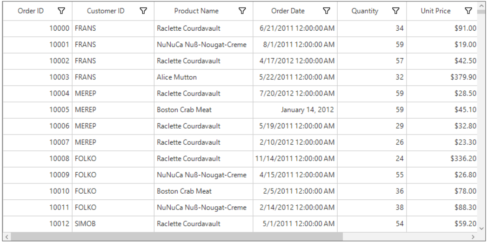

N> The custom format will be applied, only when the [GridColumnBase.Format](https://help.syncfusion.com/cr/cref_files/windowsforms/Syncfusion.SfDataGrid.WinForms~Syncfusion.WinForms.DataGrid.GridColumnBase~Format.html) property is set for the corresponding column.

### Styling GridColumn

[GridColumn](https://help.syncfusion.com/cr/cref_files/windowsforms/Syncfusion.SfDataGrid.WinForms~Syncfusion.WinForms.DataGrid.GridColumn.html) support to customize the style of particular column using [GridColumnBase.CellStyle](https://help.syncfusion.com/cr/cref_files/windowsforms/Syncfusion.SfDataGrid.WinForms~Syncfusion.WinForms.DataGrid.GridColumnBase~CellStyle.html) and [GridColumnBase.HeaderStyle](https://help.syncfusion.com/cr/cref_files/windowsforms/Syncfusion.SfDataGrid.WinForms~Syncfusion.WinForms.DataGrid.GridColumnBase~HeaderStyle.html) properties. For more information, refer Styling section.



//Change the record cell back color for product name column.
this.sfDataGrid.Columns["ProductName"].CellStyle.BackColor = Color.SlateGray;

//Change the record cell text color for product name column.
this.sfDataGrid.Columns["ProductName"].CellStyle.TextColor = Color.White

//Change the header cell back color for product name column.
this.sfDataGrid.Columns["ProductName"].HeaderStyle.BackColor = Color.MediumSlateBlue;

//Change the header cell text color for product name column.
this.sfDataGrid.Columns["ProductName"].HeaderStyle.TextColor = Color.White;


'Change the record cell back color for product name column.
Me.sfDataGrid.Columns("ProductName").CellStyle.BackColor = Color.SlateGray

'Change the record cell text color for product name column.
'Change the header cell back color for product name column.
Color.White Me.sfDataGrid.Columns("ProductName").HeaderStyle.BackColor = Color.MediumSlateBlue
Me.sfDataGrid.Columns("ProductName").CellStyle.TextColor = Color.White Me.sfDataGrid.Columns("ProductName").HeaderStyle.BackColor

'Change the header cell text color for product name column.
Me.sfDataGrid.Columns("ProductName").HeaderStyle.TextColor = Color.White



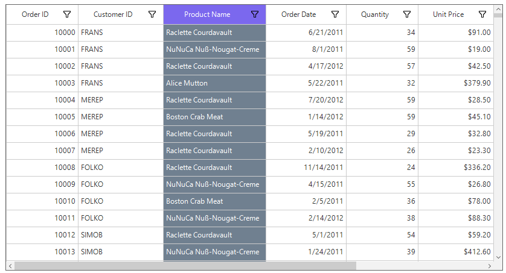

### Disable Column

A column can be disabled by setting the [AllowFocus](https://help.syncfusion.com/cr/cref_files/windowsforms/Syncfusion.SfDataGrid.WinForms~Syncfusion.WinForms.DataGrid.GridColumnBase~AllowFocus.html) property. Therefore, that column cannot be selected or edited.

## GridTextColumn

[GridTextColumn](https://help.syncfusion.com/cr/cref_files/windowsforms/Syncfusion.SfDataGrid.WinForms~Syncfusion.WinForms.DataGrid.GridTextColumn.html) provides support to display column data as text, which hosts TextBox in edit mode.



this.sfDataGrid1.Columns.Add(new GridTextColumn() 
{ 
    MappingName = "ProductName", 
    HeaderText = "Product Name" 
});


Me.sfDataGrid1.Columns.Add(New GridTextColumn() With {.MappingName = "ProductName", .HeaderText = "Product Name"})



### Multiline Support

SfDataGrid allows to edit multiline text in `GridTextColumn` by setting [GridTextColumn.AllowMultiline](https://help.syncfusion.com/cr/cref_files/windowsforms/Syncfusion.SfDataGrid.WinForms~Syncfusion.WinForms.DataGrid.GridTextColumn~AllowMultiline.html) property to `true`.



(this.sfDataGrid1.Columns["ProductName"] as GridTextColumn).AllowMultiline= true;


TryCast(Me.sfDataGrid1.Columns("ProductName"), GridTextColumn).AllowMultiline= True



### Vertical Scroll Bar 
Vertical scroll bar can be enabled for multiline textbox cell while editing by setting the [GridTextColumn.AllowVerticalScrollBar](https://help.syncfusion.com/cr/cref_files/windowsforms/Syncfusion.SfDataGrid.WinForms~Syncfusion.WinForms.DataGrid.GridTextColumn~AllowVerticalScrollbar.html) to `true`.



(this.sfDataGrid1.Columns["ProductName"] as GridTextColumn).AllowVerticalScrollbar = true;


TryCast(Me.sfDataGrid1.Columns("ProductName"), GridTextColumn).AllowVerticalScrollbar = True



## GridNumericColumn

[GridNumericColumn](https://help.syncfusion.com/cr/cref_files/windowsforms/Syncfusion.SfDataGrid.WinForms~Syncfusion.WinForms.DataGrid.GridNumericColumn.html) provides support to display columns data as numeric values.



this.sfDataGrid1.Columns.Add(new GridNumericColumn() 
{ 
    MappingName = "UnitPrice", 
    HeaderText = "Unit Price" 
});


Me.sfDataGrid1.Columns.Add(New GridNumericColumn() With {.MappingName = "UnitPrice", .HeaderText = "Unit Price"})



### Format Mode

SfDataGrid allows to set the below format modes for the numeric columns by using the [GridNumericColumn.FormatMode](https://help.syncfusion.com/cr/cref_files/windowsforms/Syncfusion.SfDataGrid.WinForms~Syncfusion.WinForms.DataGrid.GridNumericColumn~FormatMode.html) property.

#### Numeric
`Numeric` format can be used to display numeric value.

#### Percent
`Percent` format can be used to display percentage values with percentage symbol.



this.sfDataGrid1.Columns.Add(new GridNumericColumn() 
{ 
    MappingName = "Discount", 
    HeaderText = "Discount", 
    FormatMode = FormatMode.Percent 
});


Me.sfDataGrid1.Columns.Add(New GridNumericColumn() With {.MappingName = "Discount", .HeaderText = "Discount", .FormatMode = FormatMode.Percent})



#### Currency

`Currency` format can be used to display values in currency format with currency symbol.



this.sfDataGrid1.Columns.Add(new GridNumericColumn()
{
MappingName = "UnitPrice",
HeaderText = "Unit Price",
FormatMode = FormatMode.Currency,
});


Me.sfDataGrid1.Columns.Add(New GridNumericColumn() With {.MappingName = "UnitPrice", .HeaderText = "Unit Price", .FormatMode = FormatMode.Currency})



N> By default, `GridNumericColumn` displays the record with `Numeric` format.

### Data Formatting

[GridNumericColumn](https://help.syncfusion.com/cr/cref_files/windowsforms/Syncfusion.SfDataGrid.WinForms~Syncfusion.WinForms.DataGrid.GridNumericColumn.html) allows to format the numeric data with culture-specific information by using the [GridNumericColumn.NumberFormatInfo](https://help.syncfusion.com/cr/cref_files/windowsforms/Syncfusion.SfDataGrid.WinForms~Syncfusion.WinForms.DataGrid.GridNumericColumn~NumberFormatInfo.html) property.

#### NumberFormatInfo for Numeric Formatted Column

The below properties of `NumberFormatInfo` can be used to specify the format for the numeric values.

* `NumberDecimalDigits` - The Number of decimal digits to be displayed after the decimal point can be changed by using `NumberDecimalDigits` property.

* `NumberDecimalSeparator` - By default, the dot (.) operator separates the decimal part of numeric value. Any operator can be used as decimal separator through `NumberDecimalSeparator` property.

* `NumberGroupSeparator` - By default, the comma (,) separates group of digits before the decimal point. Any operator can be used as group separator through `NumberGroupSeparator` property.

* `NumberGroupSizes` - The number of digits in each group before the decimal point on numeric values can be changed by using `NumberGroupSizes` property.

* `Formatting negative pattern` - The pattern of negative numeric values can be formatted by using `NumberNegativePattern`.



NumberFormatInfo numberFormat = Application.CurrentCulture.NumberFormat.Clone() as NumberFormatInfo;
numberFormat.NumberDecimalDigits = 2;
numberFormat.NumberDecimalSeparator = "*";
numberFormat.NumberGroupSizes = new int[] { };
this.sfDataGrid1.Columns.Add(new GridNumericColumn()
{
    HeaderText = "Quantity",
    MappingName = "Quantity",
    FormatMode = FormatMode.Numeric,
    NumberFormatInfo = numberFormat
});


Dim numberFormat As NumberFormatInfo = TryCast(Application.CurrentCulture.NumberFormat.Clone(), NumberFormatInfo)
numberFormat.NumberDecimalDigits = 2
numberFormat.NumberDecimalSeparator = "*"
numberFormat.NumberGroupSizes = New Integer() { }
Me.sfDataGrid1.Columns.Add(New GridNumericColumn() With {.HeaderText = "Quantity", .MappingName = "Quantity", .FormatMode = FormatMode.Numeric, .NumberFormatInfo = numberFormat})



#### NumberFormatInfo for Percent Formatted Column

The below properties of `NumberFormatInfo` can be used to specify the format for the percentage values.

* `PercentSymbol` - By default, the percent operator (%) will be loaded with the value. The symbol can be changed by using `PercentSymbol` property.

* `PercentDecimalDigits` - The number of decimal digits to be displayed after the decimal point on percent value can be specified using `PercentDecimalDigits` property.

* `PercentDecimalSeparator` - By default, the dot (.) operator separates the decimal part of percent value. Any operator can be used as decimal separator through `PercentDecimalSeparator` property.

* `PercentGroupSeparator` - By default, the comma (,) operator separates the group of digits left to the decimal point on currency value. Any operator can be used as group separator through `PercentGroupSeparator` property.

* `PercentGroupSizes` - The number of digits in each group before the decimal point can be changed through `PercentGroupSizes` property.

* `Pattern` - The pattern for both positive and negative percent values can be formatted through `PercentPositivePattern` and `PercentNegativePattern`.



NumberFormatInfo numberFormat = Application.CurrentCulture.NumberFormat.Clone() as NumberFormatInfo;
numberFormat.PercentDecimalDigits = 2;
numberFormat.PercentDecimalSeparator = "*";
numberFormat.PercentSymbol = "/-";
this.sfDataGrid1.Columns.Add(new GridNumericColumn() 
{ 
    MappingName = "Discount", 
    HeaderText = "Discount", 
    FormatMode = FormatMode.Percent , 
    NumberFormatInfo = numberFormat
});


Dim numberFormat As NumberFormatInfo = TryCast(Application.CurrentCulture.NumberFormat.Clone(), NumberFormatInfo)
numberFormat.PercentDecimalDigits = 2
numberFormat.PercentDecimalSeparator = "*"
numberFormat.PercentSymbol = "/-"
Me.sfDataGrid1.Columns.Add(New GridNumericColumn() With {.MappingName = "Discount", .HeaderText = "Discount", .FormatMode = FormatMode.Percent, .NumberFormatInfo = numberFormat})



#### NumberFormatInfo for Currency Formatted Column

The below properties of `NumberFormatInfo` can be used to specify the format for the currency values.

* `CurrencySymbol` - By default, the currency symbol will be displayed based on culture. The symbol can be changed by using `CurrencySymbol` property.

* `CurrencyDecimalDigits` - The number of decimal digits to be displayed after the decimal point on currency values can be changed using `CurrencyDecimalDigits` property.

* `CurrencyDecimalSeparator` - By default, the dot (.) operator separates the decimal part of currency value. Any operator can be used as decimal separator through `CurrencyDecimalSeparator` property.

* `CurrencyGroupSeparator` - By default, the comma (,) separates the group of digits before the decimal point on currency value. Any operator can be used as group separator through `CurrencyGroupSeparator` property.

* `CurrencyGroupSizes` - The number of digits in each group before the decimal point on currency value can be changed by using `CurrencyGroupSizes` property.

* `Pattern` - The pattern for both positive and negative currency values can be formatted through `CurrencyPositivePattern` and `CurrencyNegativePattern`.



NumberFormatInfo numberFormat = Application.CurrentCulture.NumberFormat.Clone() as NumberFormatInfo;
numberFormat.CurrencyDecimalDigits = 2;
numberFormat.CurrencyDecimalSeparator = "*"
numberFormat.CurrencySymbol = "#";
this.sfDataGrid1.Columns.Add(new GridNumericColumn()
{
MappingName = "UnitPrice",
HeaderText = "Unit Price",
FormatMode = FormatMode.Currency,
NumberFormatInfo = numberFormat
});


Dim numberFormat As NumberFormatInfo = TryCast(Application.CurrentCulture.NumberFormat.Clone(), NumberFormatInfo)
numberFormat.CurrencyDecimalDigits = 2
"*" numberFormat.CurrencySymbol = "#"
numberFormat.CurrencyDecimalSeparator = "*" numberFormat.CurrencySymbol
Me.sfDataGrid1.Columns.Add(New GridNumericColumn() With {.MappingName = "UnitPrice", .HeaderText = "Unit Price", .FormatMode = FormatMode.Currency, .NumberFormatInfo = numberFormat})



### Displaying Null Value

[GridNumericColumn](https://help.syncfusion.com/cr/cref_files/windowsforms/Syncfusion.SfDataGrid.WinForms~Syncfusion.WinForms.DataGrid.GridNumericColumn.html) provides support to restrict or allow null value in columns based on [GridNumericColumn.AllowNull](https://help.syncfusion.com/cr/cref_files/windowsforms/Syncfusion.SfDataGrid.WinForms~Syncfusion.WinForms.DataGrid.GridNumericColumn~AllowNull.html) property.

### Auto Increment

[GridNumericColumn](https://help.syncfusion.com/cr/cref_files/windowsforms/Syncfusion.SfDataGrid.WinForms~Syncfusion.WinForms.DataGrid.GridNumericColumn.html) allows end-user to increment or decrement the value by pressing up and down arrow keys. This can be enabled by setting [GridNumericColumn.InterceptArrowKeys](https://help.syncfusion.com/cr/cref_files/windowsforms/Syncfusion.SfDataGrid.WinForms~Syncfusion.WinForms.DataGrid.GridNumericColumn~InterceptArrowKeys.html) property to `true`.

## GridDateTimeColumn

[GridDateTimeColumn](https://help.syncfusion.com/cr/cref_files/windowsforms/Syncfusion.SfDataGrid.WinForms~Syncfusion.WinForms.DataGrid.GridDateTimeColumn.html) provides support to display and edit the date time values on the cell.



this.sfDataGrid1.Columns.Add(new GridDateTimeColumn() 
{ 
  MappingName = "OrderDate", 
  HeaderText = "Order Date" 
});


Me.sfDataGrid1.Columns.Add(New GridDateTimeColumn() With {.MappingName = "OrderDate", .HeaderText = "Order Date"})



### Change the Pattern of Date Time Value

The date time value can be formatted by using [GridDateTimeColumn.Pattern](https://help.syncfusion.com/cr/cref_files/windowsforms/Syncfusion.SfDataGrid.WinForms~Syncfusion.WinForms.DataGrid.GridDateTimeColumn~Pattern.html) property, which contains the set of predefined date time patterns.

<table>
<tr>
<td>
{{'**Pattern**'| markdownify }}
</td>
<td>
{{'**Expected**'| markdownify }}
</td>
</tr>
<tr>
<td>
LongDate
</td>
<td>
Monday, June 15, 2016
</td>
</tr>
<tr>
<td>
LongTime
</td>
<td>
1:45:30 PM
</td>
</tr>
<tr>
<td>
ShortDate
</td>
<td>
6/15/2016
</td>
</tr>
<tr>
<td>
ShortTime
</td>
<td>
1:45 PM
</td>
</tr>
<tr>
<td>
FullDateTime
</td>
<td>
Monday, June 15, 2016 1:45 PM
</td>
</tr>
<tr>
<td>
MonthDay
</td>
<td>
June 15
</td>
</tr>
<tr>
<td>
RFC1123
</td>
<td>
Mon, 15 Jun 2016 20:45:30 GMT
</td>
</tr>
<tr>
<td>
SortableDateTime
</td>
<td>
2016-06-15T13:45:30
</td>
</tr>
<tr>
<td>
UniversalSortableDateTime
</td>
<td>
2016-06-15 13:45:30Z
</td>
</tr>
<tr>
<td>
YearMonth        
</td>
<td>
June, 2016
</td>
</tr>
<tr>
<td>
Custom
</td>
<td>
Sets the custom pattern for date and time value.
</td>
</tr>
</table>

### Displaying Null Value

[GridDateTimeColumn](https://help.syncfusion.com/cr/cref_files/windowsforms/Syncfusion.SfDataGrid.WinForms~Syncfusion.WinForms.DataGrid.GridDateTimeColumn.html) provides support to restrict or allow null value in columns based on [AllowNull](https://help.syncfusion.com/cr/cref_files/windowsforms/Syncfusion.SfDataGrid.WinForms~Syncfusion.WinForms.DataGrid.GridDateTimeColumn~AllowNull.html) property. Instead of displaying null values, any default date time value can be displayed by using[NullValue](https://help.syncfusion.com/cr/cref_files/windowsforms/Syncfusion.SfDataGrid.WinForms~Syncfusion.WinForms.DataGrid.GridDateTimeColumn~NullValue.html) property.
The `NullValue` property won’t work, when the `AllowNull` property is false.

### Auto Increment

[GridDateTimeColumn](https://help.syncfusion.com/cr/cref_files/windowsforms/Syncfusion.SfDataGrid.WinForms~Syncfusion.WinForms.DataGrid.GridDateTimeColumn.html) allows end-user to increment or decrement the value when `MouseWheel`  by setting the [AllowValueChangeOnMouseWheel](https://help.syncfusion.com/cr/cref_files/windowsforms/Syncfusion.SfDataGrid.WinForms~Syncfusion.WinForms.DataGrid.GridDateTimeColumn~AllowValueChangeOnMouseWheel.html) property to true. 
The value can also be changed by pressing up and down arrow keys when the [InterceptArrowKeys](https://help.syncfusion.com/cr/cref_files/windowsforms/Syncfusion.SfDataGrid.WinForms~Syncfusion.WinForms.DataGrid.GridDateTimeColumn~InterceptArrowKeys.html) property is true.

### Setting Date Time Value Range

Displaying the input value can be restricted within the range by using [MinDateTime](https://help.syncfusion.com/cr/cref_files/windowsforms/Syncfusion.SfDataGrid.WinForms~Syncfusion.WinForms.DataGrid.GridDateTimeColumn~MinDateTime.html) and [MaxDateTime](https://help.syncfusion.com/cr/cref_files/windowsforms/Syncfusion.SfDataGrid.WinForms~Syncfusion.WinForms.DataGrid.GridDateTimeColumn~MaxDateTime.html) properties.

## GridCheckBoxColumn

[GridCheckBoxColumn](https://help.syncfusion.com/cr/cref_files/windowsforms/Syncfusion.SfDataGrid.WinForms~Syncfusion.WinForms.DataGrid.GridCheckBoxColumn.html) provides support to display and edit Boolean type data.

### Three State Check Box
[GridCheckBoxColumn](https://help.syncfusion.com/cr/cref_files/windowsforms/Syncfusion.SfDataGrid.WinForms~Syncfusion.WinForms.DataGrid.GridCheckBoxColumn.html) provides support for the three check states rather than two. The states are `checked`, `unchecked` and an `intermediate` state. This can be enabled by setting [AllowThreeState](https://help.syncfusion.com/cr/cref_files/windowsforms/Syncfusion.SfDataGrid.WinForms~Syncfusion.WinForms.DataGrid.GridCheckBoxColumn~AllowThreeState.html) property to true.



this.sfDataGrid1.Columns.Add(new GridCheckBoxColumn() 
{ 
    MappingName = "PaidStatus", 
    HeaderText = "Paid Status",
    AllowThreeState = true 
});


Me.sfDataGrid1.Columns.Add(New GridCheckBoxColumn() With {.MappingName = "PaidStatus", .HeaderText = "Paid Status", .AllowThreeState = True})



### Text on the Check Box Column

[GridCheckBoxColumn](https://help.syncfusion.com/cr/cref_files/windowsforms/Syncfusion.SfDataGrid.WinForms~Syncfusion.WinForms.DataGrid.GridCheckBoxColumn.html) allows to display the text along with checkbox in the cell.  This can be enabled by setting the [AllowText](https://help.syncfusion.com/cr/cref_files/windowsforms/Syncfusion.SfDataGrid.WinForms~Syncfusion.WinForms.DataGrid.GridCheckBoxColumn~AllowText.html) property to true.



(this.sfDataGrid1.Columns["IsClosed"] as GridCheckBoxColumn).AllowText = true;


TryCast(Me.sfDataGrid1.Columns("IsClosed"), GridCheckBoxColumn).AllowText = True



### Check Box on Header

By default, CheckBox displays only in record cell. By enabling the [AllowCheckBoxOnHeader](https://help.syncfusion.com/cr/cref_files/windowsforms/Syncfusion.SfDataGrid.WinForms~Syncfusion.WinForms.DataGrid.GridCheckBoxColumn~AllowCheckBoxOnHeader.html) property, CheckBox can be displayed in header cell of `GridCheckBoxColumn`.



(this.sfDataGrid1.Columns["IsClosed"] as GridCheckBoxColumn).AllowCheckBoxOnHeader = true;


TryCast(Me.sfDataGrid1.Columns("IsClosed"), GridCheckBoxColumn).AllowCheckBoxOnHeader = True



All the checkboxes in a column will be checked/unchecked by clicking on the CheckBox in the header.

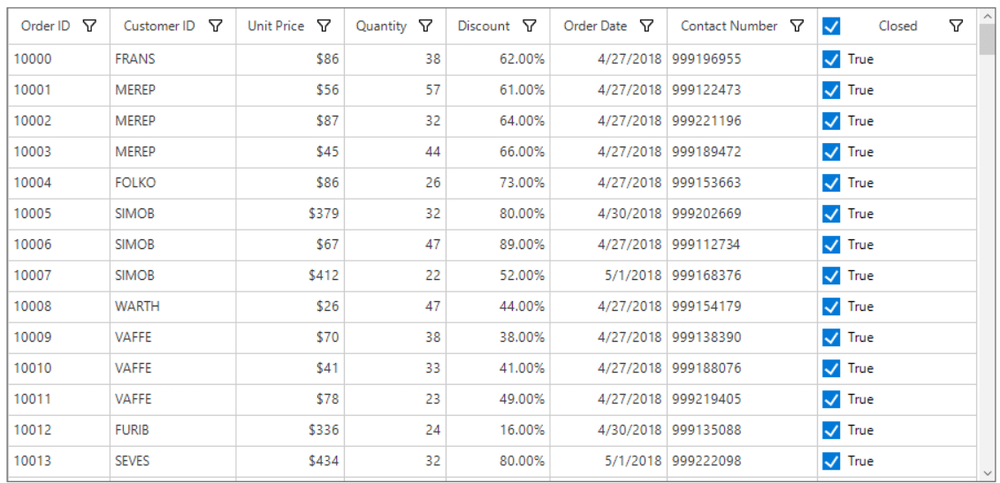

By default, enabling the [AllowCheckBoxOnHeader](https://help.syncfusion.com/cr/cref_files/windowsforms/Syncfusion.SfDataGrid.WinForms~Syncfusion.WinForms.DataGrid.GridCheckBoxColumn~AllowCheckBoxOnHeader.html) property will display the checkbox with text on the header cell of [GridCheckBoxColumn](https://help.syncfusion.com/cr/cref_files/windowsforms/Syncfusion.SfDataGrid.WinForms~Syncfusion.WinForms.DataGrid.GridCheckBoxColumn.html). The text in the header cell can be disabled by setting empty value for the [HeaderText](https://help.syncfusion.com/cr/cref_files/windowsforms/Syncfusion.SfDataGrid.WinForms~Syncfusion.WinForms.DataGrid.GridColumnBase~HeaderText.html) property of the column.



(this.sfDataGrid1.Columns["IsClosed"] as GridCheckBoxColumn).AllowCheckBoxOnHeader = true;
this.sfDataGrid1.Columns["IsClosed"].HeaderText = string.Empty;


TryCast(Me.sfDataGrid1.Columns("IsClosed"), GridCheckBoxColumn).AllowCheckBoxOnHeader = True
Me.sfDataGrid1.Columns("IsClosed").HeaderText = String.Empty



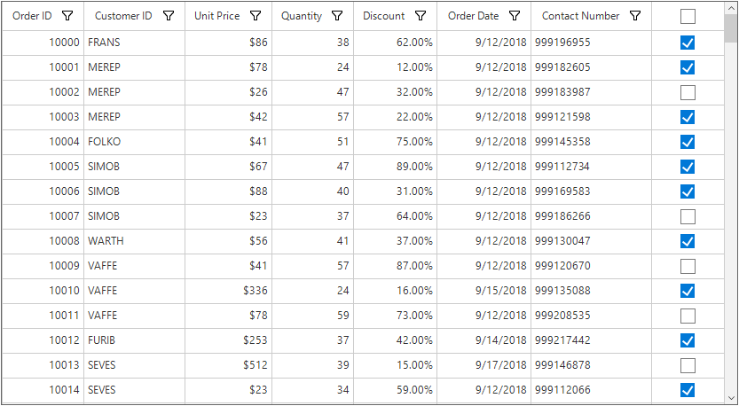

### Customizing the Check Box Value

[GridCheckBoxColumn](https://help.syncfusion.com/cr/cref_files/windowsforms/Syncfusion.SfDataGrid.WinForms~Syncfusion.WinForms.DataGrid.GridCheckBoxColumn.html) allows to display check box for enumeration type columns also. The corresponding underlying value for the checked, unchecked and intermediate state can be specified by the below properties.

1. [TrueValue](https://help.syncfusion.com/cr/cref_files/windowsforms/Syncfusion.SfDataGrid.WinForms~Syncfusion.WinForms.DataGrid.GridCheckBoxColumn~TrueValue.html) – Specifies the underlying value corresponding 
to a cell value of true, which appears as a checked box.

2. [FalseValue](https://help.syncfusion.com/cr/cref_files/windowsforms/Syncfusion.SfDataGrid.WinForms~Syncfusion.WinForms.DataGrid.GridCheckBoxColumn~FalseValue.html) – Specifies the underlying value corresponding to a cell value of false, which appears as an unchecked box.

3. [IntermediateValue](https://help.syncfusion.com/cr/cref_files/windowsforms/Syncfusion.SfDataGrid.WinForms~Syncfusion.WinForms.DataGrid.GridCheckBoxColumn~IndeterminateValue.html) – Specifies the underlying value corresponding to an indeterminate or null cell value, which appears as a disabled checkbox.



this.sfDataGrid1.Columns.Add(new GridCheckBoxColumn()
{ 
    MappingName = "PaidStatus", 
    HeaderText = "Paid Status", 
    TrueValue = PaidStatus.Paid, 
    FalseValue = PaidStatus.NotPaid, 
    IndeterminateValue = PaidStatus.UnKnown, 
    AllowThreeState = true,
    AllowText = true
});


Me.sfDataGrid1.Columns.Add(New GridCheckBoxColumn() With {.MappingName = "PaidStatus", .HeaderText = "Paid Status", .TrueValue = PaidStatus.Paid, .FalseValue = PaidStatus.NotPaid, .IndeterminateValue = PaidStatus.UnKnown, .AllowThreeState = True, .AllowText = True})



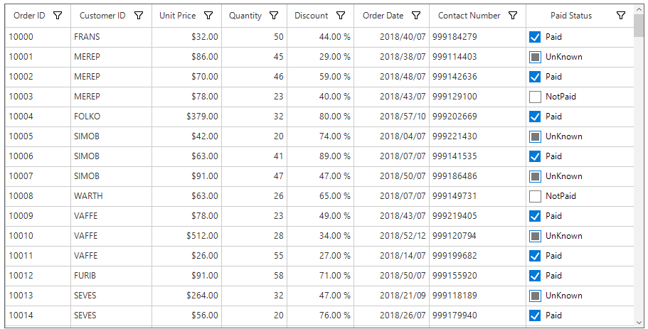

### Appearance

#### Styling

SfDataGrid allows to customize the appearance of the check box column through [SfDataGrid.Style.CheckBoxStyle](https://help.syncfusion.com/cr/cref_files/windowsforms/Syncfusion.SfDataGrid.WinForms~Syncfusion.WinForms.DataGrid.Styles.DataGridStyle~CheckBoxStyle.html) property.



//Change the appearance of the checked box.
this.sfDataGrid1.Style.CheckBoxStyle.CheckedBackColor = Color.LawnGreen;
this.sfDataGrid1.Style.CheckBoxStyle.CheckedBorderColor = Color.DarkViolet;
this.sfDataGrid1.Style.CheckBoxStyle.CheckedTickColor = Color.Red;

//Change the appearance of the intermediate state checkbox
this.sfDataGrid1.Style.CheckBoxStyle.IndeterminateBorderColor = Color.DarkSlateGray;
this.sfDataGrid1.Style.CheckBoxStyle.IndeterminateColor = Color.Brown;

//Change the appearance of the unchecked box
this.sfDataGrid1.Style.CheckBoxStyle.UncheckedBackColor = Color.Moccasin;
this.sfDataGrid1.Style.CheckBoxStyle.UncheckedBorderColor = Color.DarkSlateGray;


'Change the appearance of the checked box.
Me.sfDataGrid1.Style.CheckBoxStyle.CheckedBackColor = Color.LawnGreen
Me.sfDataGrid1.Style.CheckBoxStyle.CheckedBorderColor = Color.DarkViolet
Me.sfDataGrid1.Style.CheckBoxStyle.CheckedTickColor = Color.Red

'Change the appearance of the intermediate state checkbox
Me.sfDataGrid1.Style.CheckBoxStyle.IndeterminateBorderColor = Color.DarkSlateGray
Me.sfDataGrid1.Style.CheckBoxStyle.IndeterminateColor = Color.Brown

'Change the appearance of the unchecked box
Me.sfDataGrid1.Style.CheckBoxStyle.UncheckedBackColor = Color.Moccasin
Me.sfDataGrid1.Style.CheckBoxStyle.UncheckedBorderColor = Color.DarkSlateGray



#### Conditional Styling

SfDataGrid allows to customize the appearance of the check box column based on conditions through [QueryCheckBoxCellStyle](https://help.syncfusion.com/cr/cref_files/windowsforms/Syncfusion.SfDataGrid.WinForms~Syncfusion.WinForms.DataGrid.SfDataGrid~QueryCheckBoxCellStyle_EV.html) event.



this.sfDataGrid1.QueryCheckBoxCellStyle += SfDataGrid1_QueryCheckBoxCellStyle;

void SfDataGrid1_QueryCheckBoxCellStyle(object sender, QueryCheckBoxCellStyleEventArgs e)
{
    if (e.RowIndex % 2 == 0)
    {
        e.Style.CheckedBackColor = Color.LawnGreen;
        e.Style.CheckedBorderColor = Color.DarkViolet;
        e.Style.CheckedTickColor = Color.Red;
    }
}


AddHandler sfDataGrid1.QueryCheckBoxCellStyle, AddressOf SfDataGrid1_QueryCheckBoxCellStyle

Private Sub SfDataGrid1_QueryCheckBoxCellStyle(ByVal sender As Object, ByVal e As QueryCheckBoxCellStyleEventArgs)
	If e.RowIndex Mod 2 = 0 Then
		e.Style.CheckedBackColor = Color.LawnGreen
		e.Style.CheckedBorderColor = Color.DarkViolet
		e.Style.CheckedTickColor = Color.Red
	End If
End Sub



### Canceling the check box state change

Changing the check box state can be canceled by setting the [CellCheckBoxClickEventArgs.Cancel](https://help.syncfusion.com/cr/cref_files/windowsforms/Syncfusion.SfDataGrid.WinForms~Syncfusion.WinForms.DataGrid.Events.CellCheckBoxClickEventArgs_members.html) to true in the [SfDataGrid.CellCheckBoxClick](https://help.syncfusion.com/cr/cref_files/windowsforms/Syncfusion.SfDataGrid.WinForms~Syncfusion.WinForms.DataGrid.SfDataGrid~CellCheckBoxClick_EV.html) event.



this.sfDataGrid1.CellCheckBoxClick += sfDataGrid1_CellCheckBoxClick;

void sfDataGrid1_CellCheckBoxClick(object sender, CellCheckBoxClickEventArgs e)
{
    if (e.RowIndex == 1)
        e.Cancel = true;
}


AddHandler sfDataGrid1.CellCheckBoxClick, AddressOf SfDataGrid1_CellCheckBoxClick
	
Private Sub sfDataGrid1_CellCheckBoxClick(ByVal sender As Object, ByVal e As CellCheckBoxClickEventArgs)
	If e.RowIndex = 1 Then
		e.Cancel = True
	End If
End Sub



## GridComboBoxColumn
[GridComboBoxColumn](https://help.syncfusion.com/cr/cref_files/windowsforms/Syncfusion.SfDataGrid.WinForms~Syncfusion.WinForms.DataGrid.GridComboBoxColumn.html) is derived from the GridColumn which hosts SfComboBox as edit element. Data source to the combo box can be set by using the [GridComboBoxColumn.DataSource](https://help.syncfusion.com/cr/cref_files/windowsforms/Syncfusion.SfDataGrid.WinForms~Syncfusion.WinForms.DataGrid.GridComboBoxColumn~DataSource.html) property.

By default, GridComboBoxColumn displays the value by using the [MappingName](https://help.syncfusion.com/cr/cref_files/windowsforms/Syncfusion.SfDataGrid.WinForms~Syncfusion.WinForms.DataGrid.GridColumnBase~MappingName.html) property. You can set [DisplayMember](https://help.syncfusion.com/cr/cref_files/windowsforms/Syncfusion.SfDataGrid.WinForms~Syncfusion.WinForms.DataGrid.GridComboBoxColumn~DisplayMember.html) that denotes the string to be displayed in the cell (to serve as visual representation of object). You can set [ValueMember](https://help.syncfusion.com/cr/cref_files/windowsforms/Syncfusion.SfDataGrid.WinForms~Syncfusion.WinForms.DataGrid.GridComboBoxColumn~ValueMember.html) that denotes string from the object data source that acts as a value for that cell or to get the SelectedValue from the SelectedItem.



this.sfDataGrid.Columns.Add( new GridComboBoxColumn() { MappingName = "ShipCity",HeaderText="Ship City" }); 
(this.sfDataGrid.Columns["ShipCity"] as GridComboBoxColumn).DataSource = orderInfo.ComboBoxItemsSource; 


Me.sfDataGrid.Columns.Add(New GridComboBoxColumn() With {.MappingName = "ShipCity", .HeaderText="Ship City"})
TryCast(Me.sfDataGrid.Columns("ShipCity"), GridComboBoxColumn).DataSource = orderInfo.ComboBoxItemsSource



The SfDataGrid triggers the [CellComboBoxSelectionChanged](https://help.syncfusion.com/cr/cref_files/windowsforms/Syncfusion.SfDataGrid.WinForms~Syncfusion.WinForms.DataGrid.SfDataGrid~CellComboBoxSelectionChanged_EV.html) event when the `SelectedValue` is changed. The [CellComboBoxSelectionChangedEventArgs](https://help.syncfusion.com/cr/cref_files/windowsforms/Syncfusion.SfDataGrid.WinForms~Syncfusion.WinForms.DataGrid.Events.CellComboBoxSelectionChangedEventArgs.html) of CellComboBoxSelectionChanged event provides the information of the changed cell value. Properties to get the selected item and index are as follows:

*	[SelectedIndex](https://help.syncfusion.com/cr/cref_files/windowsforms/Syncfusion.SfDataGrid.WinForms~Syncfusion.WinForms.DataGrid.Events.CellComboBoxSelectionChangedEventArgs~SelectedIndex.html) : Returns the index of selected item.
*	[SelectedItem](https://help.syncfusion.com/cr/cref_files/windowsforms/Syncfusion.SfDataGrid.WinForms~Syncfusion.WinForms.DataGrid.Events.CellComboBoxSelectionChangedEventArgs~SelectedItem.html)	: Returns the selected item from drop-down list.

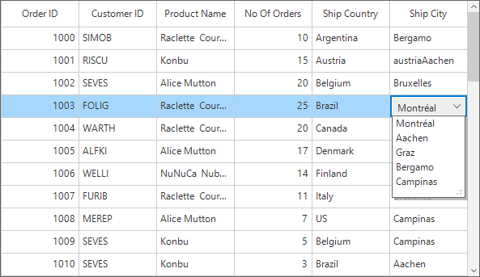

### Opening drop-down popup on single-click
Drop-down of the combo-box column can be shown on single click by using the custom combo-box renderer. 
In the following code, the `GridComboBoxCellRendererExt` is created to call the `ShowDropDown` method to open the drop-down on the initialization. 
Replace the default renderer with created renderer in the SfDataGrid.CellRenderers collection.



this.sfDataGrid.CellRenderers.Remove("ComboBox");
this.sfDataGrid.CellRenderers.Add("ComboBox", new GridComboBoxCellRendererExt());

public class GridComboBoxCellRendererExt : GridComboBoxCellRenderer
{
    protected override void OnInitializeEditElement(DataColumnBase column, RowColumnIndex rowColumnIndex, SfComboBox uiElement)
    {
        base.OnInitializeEditElement(column, rowColumnIndex, uiElement);
        uiElement.ShowDropDown();          
    }     
}


Me.sfDataGrid.CellRenderers.Remove("ComboBox")
Me.sfDataGrid.CellRenderers.Add("ComboBox", New GridComboBoxCellRendererExt())

Public Class GridComboBoxCellRendererExt
	Inherits GridComboBoxCellRenderer
	Protected Overrides Sub OnInitializeEditElement(ByVal column As DataColumnBase, ByVal rowColumnIndex As RowColumnIndex, ByVal uiElement As SfComboBox)
		MyBase.OnInitializeEditElement(column, rowColumnIndex, uiElement)
		uiElement.ShowDropDown()
	End Sub
End Class



### Customizing GroupCaptionText based on DisplayMemberPath
By default, the group caption text will be displayed based on the [MappingName](https://help.syncfusion.com/cr/cref_files/windowsforms/Syncfusion.SfDataGrid.WinForms~Syncfusion.WinForms.DataGrid.GridColumnBase~MappingName.html) of combo-box column. This can be changed to display the [DisplayMember](https://help.syncfusion.com/cr/cref_files/windowsforms/Syncfusion.SfDataGrid.WinForms~Syncfusion.WinForms.DataGrid.GridComboBoxColumn~DisplayMember.html) by using the [GroupMode](https://help.syncfusion.com/cr/cref_files/windowsforms/Syncfusion.SfDataGrid.WinForms~Syncfusion.WinForms.DataGrid.GridColumnBase~GroupMode.html) property of the column.



sfDataGrid.Columns.Add(new GridComboBoxColumn() { MappingName = "ShipCityID", HeaderText = "Ship City", ValueMember = "ShipCityID", DisplayMember = "ShipCityName", IDataSourceSelector = new CustomSelector(), GroupMode = Syncfusion.Data.DataReflectionMode.Display });


sfDataGrid.Columns.Add(New GridComboBoxColumn() With {.MappingName = "ShipCityID", .HeaderText = "Ship City", .ValueMember = "ShipCityID", .DisplayMember = "ShipCityName", .IDataSourceSelector = New CustomSelector(), .GroupMode = Syncfusion.Data.DataReflectionMode.Display})



### Loading different DataSources for each row of GridComboBoxColumn
Different data sources can be loaded for each row of the [GridComboBoxColumn](https://help.syncfusion.com/cr/cref_files/windowsforms/Syncfusion.SfDataGrid.WinForms~Syncfusion.WinForms.DataGrid.GridComboBoxColumn.html) by using the [DataSourceSelector](https://help.syncfusion.com/cr/cref_files/windowsforms/Syncfusion.SfDataGrid.WinForms~Syncfusion.WinForms.DataGrid.GridComboBoxColumn~IDataSourceSelector.html) property.

### Implementing IDataSourceSelector
DataSourceSelector needs to implement IDataSourceSelector interface to implement the GetDataSource method that receives the following parameters,

* record – data object associated with row.
* dataSource – Data context of data grid.

In the following code, DataSource of the `Ship City` column is returned based on `ShipCountry` column value by using the record and the data context of SfDataGrid passed to the `GetDataSource` method.



sfDataGrid.Columns.Add(new GridComboBoxColumn() { MappingName = "ShipCityID", HeaderText = "Ship City", ValueMember = "ShipCityID", DisplayMember = "ShipCityName", IDataSourceSelector = new DataSourceSelector()});

public class DataSourceSelector : IDataSourceSelector
{
    public IEnumerable GetDataSource(object record, object dataSource)
    {
        if (record == null)
            return null;

        var orderInfo = record as OrderDetails;
        var countryName = orderInfo.ShipCountry;

        var countryDetails = new CountryInfoRepository();

        //Returns ShipCity collection based on ShipCountry.
        if (countryDetails.ShipCities.ContainsKey(countryName))
        {
            ObservableCollection<ShipCityDetails> shipCities = null;
            countryDetails.ShipCities.TryGetValue(countryName, out shipCities);
            return shipCities.ToList();
        }
        return null;
    }
}


sfDataGrid.Columns.Add(New GridComboBoxColumn() With {.MappingName = "ShipCityID", .HeaderText = "Ship City", .ValueMember = "ShipCityID", .DisplayMember = "ShipCityName", .IDataSourceSelector = New DataSourceSelector()})

Public Class DataSourceSelector
	Implements IDataSourceSelector
	Public Function GetDataSource(ByVal record As Object, ByVal dataSource As Object) As IEnumerable
		If record Is Nothing Then
			Return Nothing
		End If

		Dim orderInfo = TryCast(record, OrderDetails)
		Dim countryName = orderInfo.ShipCountry

		Dim countryDetails = New CountryInfoRepository()

		'Returns ShipCity collection based on ShipCountry.
		If countryDetails.ShipCities.ContainsKey(countryName) Then
			Dim shipCities As ObservableCollection(Of ShipCityDetails) = Nothing
			countryDetails.ShipCities.TryGetValue(countryName, shipCities)
			Return shipCities.ToList()
		End If
		Return Nothing
	End Function
End Class



Following screenshot illustrates the different `Ship City` DataSource bound to each row of the ComboBox column based on the `Ship Country` Name.

### Editing the combo box
By default, the combo-box column is not allowed to edit the values. This can be changed by setting the [GridComboBoxColumn.DropDownStyle](https://help.syncfusion.com/cr/cref_files/windowsforms/Syncfusion.SfDataGrid.WinForms~Syncfusion.WinForms.DataGrid.GridComboBoxColumn~DropDownStyle.html) as `DropDown` to edit the values by using the text box.



sfDataGrid.Columns.Add(new GridComboBoxColumn() { MappingName = "ShipCityID", HeaderText = "Ship City", ValueMember = "ShipCityID", DisplayMember = "ShipCityName", DropDownStyle = DropDownStyle.DropDown, IDataSourceSelector = new DataSourceSelector()});


sfDataGrid.Columns.Add(New GridComboBoxColumn() With {.MappingName = "ShipCityID", .HeaderText = "Ship City", .ValueMember = "ShipCityID", .DisplayMember = "ShipCityName", .DropDownStyle = DropDownStyle.DropDown, .IDataSourceSelector = New DataSourceSelector()})



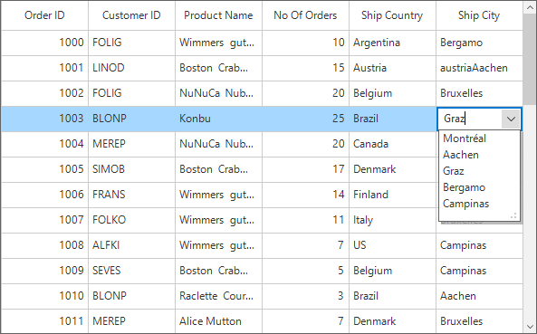

### Auto completing on edit mode
The auto completion on the edit mode can be enabled by using the [GridComboBoxColumn.AutoCompleteMode](https://help.syncfusion.com/cr/cref_files/windowsforms/Syncfusion.SfDataGrid.WinForms~Syncfusion.WinForms.DataGrid.GridComboBoxColumn~AutoCompleteMode.html) property. Default value is `None`. Following types of auto complete modes are available,

* None
* Append
* Suggest
* SuggestAppend



GridComboBoxColumn comboBoxColumn = sfDataGrid.Columns["ShipCityID"] as GridComboBoxColumn;
comboBoxColumn.DropDownStyle = DropDownStyle.DropDown;
comboBoxColumn.AutoCompleteMode = AutoCompleteMode.Suggest;


Dim comboBoxColumn As GridComboBoxColumn = TryCast(sfDataGrid.Columns("ShipCityID"), GridComboBoxColumn)
comboBoxColumn.DropDownStyle = DropDownStyle.DropDown
comboBoxColumn.AutoCompleteMode = AutoCompleteMode.Suggest



### Auto suggesting on edit mode
By default, auto suggestion in the dropdown will display the value based on the `Starts with` filter condition. This can be changed to retrieve the matches with the Contains condition by using the [AutoSuggestionMode](https://help.syncfusion.com/cr/cref_files/windowsforms/Syncfusion.SfDataGrid.WinForms~Syncfusion.WinForms.DataGrid.GridComboBoxColumn~AutoSuggestMode.html) property. You can also set delay for auto suggestion by using the [AutoSuggestDelay](https://help.syncfusion.com/cr/cref_files/windowsforms/Syncfusion.SfDataGrid.WinForms~Syncfusion.WinForms.DataGrid.GridComboBoxColumn~AutoSuggestDelay.html) property.



GridComboBoxColumn comboBoxColumn = sfDataGrid.Columns["ShipCityID"] as GridComboBoxColumn;
comboBoxColumn.DropDownStyle = DropDownStyle.DropDown;
comboBoxColumn.AutoCompleteMode = AutoCompleteMode.Suggest;
comboBoxColumn.AutoSuggestMode = AutoCompleteSuggestMode.Contains;
comboBoxColumn.AutoSuggestDelay = 1000;


Dim comboBoxColumn As GridComboBoxColumn = TryCast(sfDataGrid.Columns("ShipCityID"), GridComboBoxColumn)
comboBoxColumn.DropDownStyle = DropDownStyle.DropDown
comboBoxColumn.AutoCompleteMode = AutoCompleteMode.Suggest
comboBoxColumn.AutoSuggestMode = AutoCompleteSuggestMode.Contains
comboBoxColumn.AutoSuggestDelay = 1000



## GridButtonColumn

[GridButtonColumn](https://help.syncfusion.com/cr/cref_files/windowsforms/Syncfusion.SfDataGrid.WinForms~Syncfusion.WinForms.DataGrid.GridButtonColumn.html) provides support to display columns data as buttons.



this.sfDataGrid1.Columns.Add(new GridButtonColumn() 
{ 
    MappingName = "ProductName ", 
    HeaderText = "Product Name"
});


Me.sfDataGrid1.Columns.Add(New GridButtonColumn() With {.MappingName = "ProductName ", .HeaderText = "Product Name"})



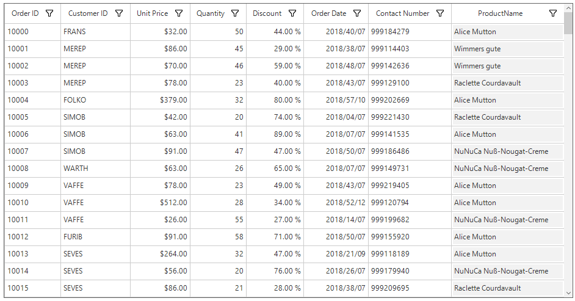

### Default Text for the Buttons

By default, [GridButtonColumn](https://help.syncfusion.com/cr/cref_files/windowsforms/Syncfusion.SfDataGrid.WinForms~Syncfusion.WinForms.DataGrid.GridButtonColumn.html) displays the button with underlying value as button text. The default text for the buttons can be changed by setting value for [DefaultButtonText](https://help.syncfusion.com/cr/cref_files/windowsforms/Syncfusion.SfDataGrid.WinForms~Syncfusion.WinForms.DataGrid.GridButtonColumn~DefaultButtonText.html) property. The `DefaultButtonText` property will work only when the[AllowDefaultButtonText](https://help.syncfusion.com/cr/cref_files/windowsforms/Syncfusion.SfDataGrid.WinForms~Syncfusion.WinForms.DataGrid.GridButtonColumn~AllowDefaultButtonText.html) property value is true.



(this.sfDataGrid1.Columns["ProductName"] as GridButtonColumn).AllowDefaultButtonText = true;
(this.sfDataGrid1.Columns["ProductName"] as GridButtonColumn).DefaultButtonText = "Submit";


TryCast(Me.sfDataGrid1.Columns("ProductName"), GridButtonColumn).AllowDefaultButtonText = True
TryCast(Me.sfDataGrid1.Columns("ProductName"), GridButtonColumn).DefaultButtonText = "Submit"



### Adding Image for the Button Column

SfDataGrid allows to display image within the button by using the [GridButtonColumn.Image](https://help.syncfusion.com/cr/cref_files/windowsforms/Syncfusion.SfDataGrid.WinForms~Syncfusion.WinForms.DataGrid.GridButtonColumn~Image.html) property.



  this.sfDataGrid1.Columns.Add(new GridButtonColumn()
            {
                MappingName = "ProductName",
                HeaderText = "Product Name",
                Image = SystemIcons.Information.ToBitmap(),
            });


  Me.sfDataGrid1.Columns.Add(New GridButtonColumn() With {.MappingName = "ProductName", .HeaderText = "Product Name", .Image = SystemIcons.Information.ToBitmap()})



#### Positioning the Text and Image 

The text and image within the [GridButtonColumn](https://help.syncfusion.com/cr/cref_files/windowsforms/Syncfusion.SfDataGrid.WinForms~Syncfusion.WinForms.DataGrid.GridButtonColumn.html) can be positioned relative to each other by using the [TextImageRelation](https://help.syncfusion.com/cr/cref_files/windowsforms/Syncfusion.SfDataGrid.WinForms~Syncfusion.WinForms.DataGrid.GridButtonColumn~TextImageRelation.html) property.



  this.sfDataGrid1.Columns.Add(new GridButtonColumn()
            {
                MappingName = "ProductName",
                HeaderText = "Product Name",
                Image = SystemIcons.Information.ToBitmap(),
                ImageSize = new Size(16, 16),
                TextImageRelation = TextImageRelation.ImageBeforeText,
            });


  Me.sfDataGrid1.Columns.Add(New GridButtonColumn() With {.MappingName = "ProductName", .HeaderText = "Product Name", .Image = SystemIcons.Information.ToBitmap(), .ImageSize = New Size(16, 16), .TextImageRelation = TextImageRelation.ImageBeforeText})


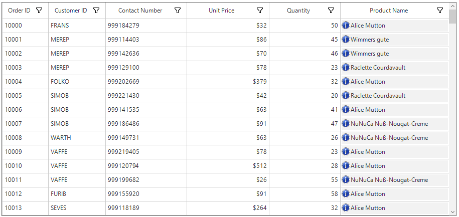

### Appearance

SfDataGrid allows to customize the appearance of the button column through [SfDataGrid.Style.ButtonStyle](https://help.syncfusion.com/cr/cref_files/windowsforms/Syncfusion.SfDataGrid.WinForms~Syncfusion.WinForms.DataGrid.Styles.DataGridStyle~ButtonStyle.html) property.



//Change the appearance of the button column
this.sfDataGrid1.Style.ButtonStyle.BackColor = Color.LightPink;
this.sfDataGrid1.Style.ButtonStyle.TextColor = Color.DarkBlue;
this.sfDataGrid1.Style.ButtonStyle.BorderColor = Pens.DarkRed;


'Change the appearance of the button column
Me.sfDataGrid1.Style.ButtonStyle.BackColor = Color.LightPink
Me.sfDataGrid1.Style.ButtonStyle.TextColor = Color.DarkBlue
Me.sfDataGrid1.Style.ButtonStyle.BorderColor = Pens.DarkRed



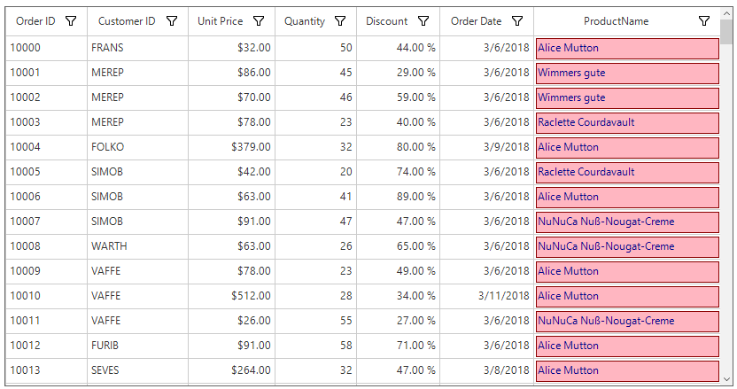

### Deleting the selected records by button click

The selected records can be deleted when clicking the cell button by using the [DeleteSelectedRecords](https://help.syncfusion.com/cr/cref_files/windowsforms/Syncfusion.SfDataGrid.WinForms~Syncfusion.WinForms.DataGrid.SfDataGrid~DeleteSelectedRecords.html) method in the [SfDataGrid.CellButtonClick](https://help.syncfusion.com/cr/cref_files/windowsforms/Syncfusion.SfDataGrid.WinForms~Syncfusion.WinForms.DataGrid.SfDataGrid~CellButtonClick_EV.html) event.



this.sfDataGrid1.CellButtonClick += sfDataGrid1_CellButtonClick;   

private void sfDataGrid1_CellButtonClick(object sender, CellButtonClickEventArgs e)
{
    sfDataGrid1.DeleteSelectedRecords();          
}


AddHandler sfDataGrid1.CellButtonClick, AddressOf SfDataGrid1_ CellButtonClick

Private Sub sfDataGrid1_CellButtonClick(ByVal sender As Object, ByVal e As CellButtonClickEventArgs)
	sfDataGrid1.DeleteSelectedRecords()
End Sub



## GridHyperlinkColumn

[GridHyperlinkColumn](https://help.syncfusion.com/cr/cref_files/windowsforms/Syncfusion.SfDataGrid.WinForms~Syncfusion.WinForms.DataGrid.GridHyperlinkColumn.html) provides support to display columns data as `HyperLink` and allows to open hyperlinks as well as to run executable files. 



this.sfDataGrid1.Columns.Add(new GridHyperlinkColumn() 
{ 
   MappingName = " OrderURI ", 
   HeaderText = "Order URI" 
});


Me.sfDataGrid1.Columns.Add(New GridHyperlinkColumn() With {.MappingName = " OrderURI ", .HeaderText = "Order URI"})



### Behavior Customization

SfDataGrid provide support to open the hyperlink either by single click or double click. This can be specified by the [HyperlinkOpenBehavior](https://help.syncfusion.com/cr/cref_files/windowsforms/Syncfusion.SfDataGrid.WinForms~Syncfusion.WinForms.DataGrid.GridHyperlinkColumn~HyperlinkOpenBehavior.html) property.
The [HyperlinkOpenArea](https://help.syncfusion.com/cr/cref_files/windowsforms/Syncfusion.SfDataGrid.WinForms~Syncfusion.WinForms.DataGrid.GridHyperlinkColumn~HyperlinkOpenArea.html) property decides whether to open the hyperlink by clicking anywhere on the cell or by clicking only on the text inside the cell.



(this.sfDataGrid1.Columns["OrderURI"] as GridHyperlinkColumn).HyperlinkOpenArea = HyperlinkOpenArea.Cell;
(this.sfDataGrid1.Columns["OrderURI"] as GridHyperlinkColumn).HyperlinkOpenBehavior = HyperlinkOpenBehavior.DoubleClick;


TryCast(Me.sfDataGrid1.Columns("OrderURI"), GridHyperlinkColumn).HyperlinkOpenArea = HyperlinkOpenArea.Cell
TryCast(Me.sfDataGrid1.Columns("OrderURI"), GridHyperlinkColumn).HyperlinkOpenBehavior = HyperlinkOpenBehavior.DoubleClick



N> `GridHyperlinkColumn` allows to open hyperlink by pressing space key.

### Appearance

SfDataGrid allows to customize the appearance of the hyperlink column through [SfDataGrid.Style.HyperlinkStyle](https://help.syncfusion.com/cr/cref_files/windowsforms/Syncfusion.SfDataGrid.WinForms~Syncfusion.WinForms.DataGrid.Styles.DataGridStyle~HyperlinkStyle.html#) property.



//Change the appearance of the hyperlink.
this.sfDataGrid1.Style.HyperlinkStyle.DefaultLinkColor = Color.DarkGreen;
this.sfDataGrid1.Style.HyperlinkStyle.HoveredLinkColor = Color.Red;


'Change the appearance of the hyperlink.
Me.sfDataGrid1.Style.HyperlinkStyle.DefaultLinkColor = Color.DarkGreen
Me.sfDataGrid1.Style.HyperlinkStyle.HoveredLinkColor = Color.Red



### Canceling the Navigation

Navigation to the hyperlinks can be canceled within the [HyperlinkOpening](https://help.syncfusion.com/cr/cref_files/windowsforms/Syncfusion.SfDataGrid.WinForms~Syncfusion.WinForms.DataGrid.SfDataGrid~HyperlinkOpening_EV.html) event by setting the `CellHyperlinkOpeningEventArgs.Cancel` to true.



this.sfDataGrid1.HyperlinkOpening += SfDataGrid1_HyperlinkOpening;

void SfDataGrid1_HyperlinkOpening(object sender, CellHyperlinkOpeningEventArgs e)
{
    if (e.NavigateText == "https://www.google.com/")
        e.Cancel = true;
}


AddHandler sfDataGrid1.HyperlinkOpening, AddressOf SfDataGrid1_HyperlinkOpening

Private Sub SfDataGrid1_HyperlinkOpening(ByVal sender As Object, ByVal e As CellHyperlinkOpeningEventArgs)
	If e.NavigateText = "https://www.google.com/" Then
		e.Cancel = True
	End If
End Sub



[HyperlinkOpened](https://help.syncfusion.com/cr/cref_files/windowsforms/Syncfusion.SfDataGrid.WinForms~Syncfusion.WinForms.DataGrid.SfDataGrid~HyperlinkOpened_EV.html) event occurs after the hyperlink is opened. It does not occur if the `HyperlinkOpening` event is canceled.

### Changing the Browser to Open the Hyperlink

By default, [GridHyperlinkColumn](https://help.syncfusion.com/cr/cref_files/windowsforms/Syncfusion.SfDataGrid.WinForms~Syncfusion.WinForms.DataGrid.GridHyperlinkColumn.html) opens the hyperlink in system default browser. This can be changed by handling the [HyperlinkOpening](https://help.syncfusion.com/cr/cref_files/windowsforms/Syncfusion.SfDataGrid.WinForms~Syncfusion.WinForms.DataGrid.SfDataGrid~HyperlinkOpening_EV.html) event.

The below code shows how to open the hyperlink in Internet Explorer.



this.sfDataGrid1.HyperlinkOpening += SfDataGrid1_HyperlinkOpening;

void SfDataGrid1_HyperlinkOpening(object sender, CellHyperlinkOpeningEventArgs e)
{
    e.Cancel = true;
    System.Diagnostics.Process process = new System.Diagnostics.Process();
    process.StartInfo.FileName = "iexplore";
    process.StartInfo.Arguments = e.NavigateText;
    process.Start();
}


AddHandler sfDataGrid1.HyperlinkOpening, AddressOf SfDataGrid1_HyperlinkOpening

Private Sub SfDataGrid1_HyperlinkOpening(ByVal sender As Object, ByVal e As CellHyperlinkOpeningEventArgs)
	e.Cancel = True
	Dim process As New System.Diagnostics.Process()
	process.StartInfo.FileName = "iexplore"
	process.StartInfo.Arguments = e.NavigateText
	process.Start()
End Sub



## GridImageColumn

[GridImageColumn](https://help.syncfusion.com/cr/cref_files/windowsforms/Syncfusion.SfDataGrid.WinForms~Syncfusion.WinForms.DataGrid.GridImageColumn.html) provides support to display columns data as Image.
`GridImageColumn` can be created and images can be added to it as given below.



this.sfDataGrid1.Columns.Add(new GridImageColumn() 
{ 
    MappingName = "Images", 
    HeaderText = "Country" 
});


Me.sfDataGrid1.Columns.Add(New GridImageColumn() With {.MappingName = "Images", .HeaderText = "Country"})



The image will be added to the column be adding the image to the underlying data as below.


public class OrderInfo : INotifyPropertyChanged
{
    public byte[] Images { get; set; }
}
public class OrderInfoCollection :  IDisposable
{
    public OrderInfoCollection()
    {
        OrdersListDetails = new OrderInfoRepository().GetListOrdersDetails(200);            
    }
    public BindingList<OrderInfo> GetListOrdersDetails(int count)
    {
        BindingList<OrderInfo> ordersDetails = new BindingList<OrderInfo>();
        for (int i = 10000; i < count + 10000; i++)
        {
            ordersDetails.Add(GetOrder(i));
        }
        return ordersDetails;
    }
    private OrderInfo GetOrder(int i)
    {
        if (order.OrderID % 2 == 0 )
            order.Images = ImageToByteArray(Image.FromFile(@"..\..\Images\US.jpg"));
        else if (order.OrderID % 3 == 0 )
            order.Images = ImageToByteArray(Image.FromFile(@"..\..\Images\Japan.jpg"));
        else
            order.Images = ImageToByteArray(Image.FromFile(@"..\..\Images\UK.jpg"));
            return order;
    }
    public byte[] ImageToByteArray(System.Drawing.Image imageIn)
    {
        MemoryStream ms = new MemoryStream();
        imageIn.Save(ms, System.Drawing.Imaging.ImageFormat.Bmp);
        return ms.ToArray();
    }
}


Public Class OrderInfo
	Implements INotifyPropertyChanged
		Public Property Images() As Byte()
End Class
  Public Class OrderInfoCollection
	  Implements IDisposable
		Public Sub New()
			OrdersListDetails = New OrderInfoRepository().GetListOrdersDetails(200)
		End Sub
  Public Function GetListOrdersDetails(ByVal count As Integer) As BindingList(Of OrderInfo)
			Dim ordersDetails As New BindingList(Of OrderInfo)()
			For i As Integer = 10000 To count + 10000 - 1
				ordersDetails.Add(GetOrder(i))
			Next i
			Return ordersDetails
  End Function
  Private Function GetOrder(ByVal i As Integer) As OrderInfo
			If order.OrderID Mod 2 = 0 Then
				order.Images = ImageToByteArray(Image.FromFile("..\..\Images\US.jpg"))
			ElseIf order.OrderID Mod 3 = 0 Then
				order.Images = ImageToByteArray(Image.FromFile("..\..\Images\Japan.jpg"))
			Else
				order.Images = ImageToByteArray(Image.FromFile("..\..\Images\UK.jpg"))
			End If
			Return order
  End Function
  Public Function ImageToByteArray(ByVal imageIn As System.Drawing.Image) As Byte()
			Dim ms As New MemoryStream()
			imageIn.Save(ms, System.Drawing.Imaging.ImageFormat.Bmp)
			Return ms.ToArray()
  End Function
  End Class



### Positioning Text and Image

The text and image within the [GridImageColumn](https://help.syncfusion.com/cr/cref_files/windowsforms/Syncfusion.SfDataGrid.WinForms~Syncfusion.WinForms.DataGrid.GridImageColumn.html) can be positioned relative to each other by using the [TextImageRelation](https://help.syncfusion.com/cr/cref_files/windowsforms/Syncfusion.SfDataGrid.WinForms~Syncfusion.WinForms.DataGrid.GridImageColumn~TextImageRelation.html) property.
The `TextImageRelation` property will not work if [ImageLayout](https://help.syncfusion.com/cr/cref_files/windowsforms/Syncfusion.SfDataGrid.WinForms~Syncfusion.WinForms.DataGrid.GridImageColumn~ImageLayout.html) property value is not equal to none.

### Appearance

SfDataGrid allows to customize the appearance of the image column based on conditions through [QueryImageCellStyle](https://help.syncfusion.com/cr/cref_files/windowsforms/Syncfusion.SfDataGrid.WinForms~Syncfusion.WinForms.DataGrid.SfDataGrid~QueryImageCellStyle_EV.html) event.



this.sfDataGrid1.QueryImageCellStyle += SfDataGrid1_QueryImageCellStyle;
void SfDataGrid1_QueryImageCellStyle(object sender, QueryImageCellStyleEventArgs e)
{
	if (e.RowIndex == 3)
		e.ImageLayout = ImageLayout.Tile;
}


AddHandler sfDataGrid1.QueryImageCellStyle, AddressOf SfDataGrid1_QueryImageCellStyle

Private Sub SfDataGrid1_QueryImageCellStyle(ByVal sender As Object, ByVal e As QueryImageCellStyleEventArgs)
	If e.RowIndex = 3 Then
		e.ImageLayout = ImageLayout.Tile
	End If
End Sub



## GridProgressBarColumn

[GridProgressBarColumn](https://help.syncfusion.com/cr/windowsforms/Syncfusion.SfDataGrid.WinForms~Syncfusion.WinForms.DataGrid.GridProgressBarColumn.html) provides support to display and non-editable integer type data.

#### Changing boundary values of Progress

Changing the ProgressBar boundary values by using `Maximum` and `Minimum` property.

Maximum - Specifies the maximum value of the progress bar.

Minimum - Specifies the minimum value of the progress bar.



this.sfDataGrid.Columns.Add(new GridProgressBarColumn() { MappingName = "SoftwareProficiency", HeaderText = "Software Proficiency", Maximum = 100, Minimum = 0, ValueMode = ProgressBarValueMode.Percentage });


Me.sfDataGrid.Columns.Add(New GridProgressBarColumn() With {.MappingName = "SoftwareProficiency", .HeaderText = "Software Proficiency", .Maximum = 100, .Minimum = 0, .ValueMode = ProgressBarValueMode.Percentage})



#### Changing progress value mode

Changing the ProgressBar `ValueMode` as Value by using property in given below.



this.sfDataGrid.Columns.Add(new GridProgressBarColumn() { MappingName = "SoftwareProficiency", HeaderText = "Software Proficiency", Maximum = 100, Minimum = 0, ValueMode = ProgressBarValueMode.Value });


Me.sfDataGrid.Columns.Add(New GridProgressBarColumn() With {.MappingName = "SoftwareProficiency", .HeaderText = "Software Proficiency", .Maximum = 100, .Minimum = 0, .ValueMode = ProgressBarValueMode.Value })



### Appearance

#### BackgroundColor

The background color can be set by using the `BackgroundColor` property.



this.sfDataGrid.Style.ProgressBarStyle.BackgroundColor = Color.DarkGray;


Me.sfDataGrid.Style.ProgressBarStyle.BackgroundColor = Color.DarkGray



#### ForegroundColor

The font color and the foreground color can be set by using the `ForegroundColor` property.

ForegroundColor - Specifies the color used to draw the foreground in segment mode and constant mode.

TextColor - Specifies the color of the font used to draw the text of the ProgressBar.



this.sfDataGrid.Style.ProgressBarStyle.TextColor = Color.Red;
this.sfDataGrid.Style.ProgressBarStyle.ForegroundColor = Color.LightGoldenrodYellow;


Me.sfDataGrid.Style.ProgressBarStyle.TextColor = Color.Red
Me.sfDataGrid.Style.ProgressBarStyle.ForegroundColor = Color.LightGoldenrodYellow



### Gradient appearance

#### Gradient BackgroundColor

The color of the background gradient can be changed using the properties given below,

GradientBackgroundStartColor - Specifies the start color of the background gradient.The `BackgroundStyle` property should be set to 'Gradient'.

GradientBackgroundEndColor - Specifies the end color of the background gradient.The `BackgroundStyle` property should be set to 'Gradient' .



this.sfDataGrid.Style.ProgressBarStyle.BackgroundStyle =  GridProgressBarStyle.Gradient;
this.sfDataGrid.Style.ProgressBarStyle.GradientBackgroundStartColor = Color.GreenYellow;
this.sfDataGrid.Style.ProgressBarStyle.GradientForegroundEndColor = Color.DarkGray;


Me.sfDataGrid.Style.ProgressBarStyle.BackgroundStyle = GridProgressBarStyle.Gradient
Me.sfDataGrid.Style.ProgressBarStyle.GradientBackgroundStartColor = Color.GreenYellow
Me.sfDataGrid.Style.ProgressBarStyle.GradientForegroundEndColor = Color.DarkGray



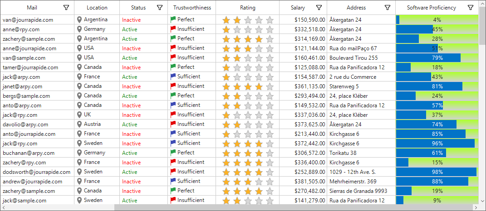

#### Gradient ForegroundColor

The color of the foreground gradient can be changed by using the properties given below.

GradientForegroundStartColor - Specifies the start color of the foreground gradient.The `ForegroundStyle` property should be set to `Gradient`.

GradientForegroundEndColor - Specifies the end color of the foreground gradient.The `ForegroundStyle` property should be set to `Gradient`.



this.sfDataGrid.Style.ProgressBarStyle.ForegroundStyle = GridProgressBarStyle.Gradient;
this.sfDataGrid.Style.ProgressBarStyle.GradientForegroundStartColor = Color.Yellow;
this.sfDataGrid.Style.ProgressBarStyle.GradientForegroundEndColor = Color.Blue;


Me.sfDataGrid.Style.ProgressBarStyle.ForegroundStyle = GridProgressBarStyle.Gradient
Me.sfDataGrid.Style.ProgressBarStyle.GradientForegroundStartColor = Color.Yellow
Me.sfDataGrid.Style.ProgressBarStyle.GradientForegroundEndColor = Color.Blue



### Tube appearance

Colors can be set for the background tube of the ProgressBar column.

#### Tube BackgroundColor

TubeBackgroundStartColor - Specifies the start color of the background tube.The `BackgroundStyle` property should be set to `Tube`.

TubeBackgroundEndColor - Specifies the end color of the background tube.The `BackgroundStyle` property should be set to `Tube`.



this.sfDataGrid.Style.ProgressBarStyle.BackgroundStyle =  GridProgressBarStyle.Tube;
this.sfDataGrid.Style.ProgressBarStyle.TubeBackgroundStartColor = Color.YellowGreen;
this.sfDataGrid.Style.ProgressBarStyle.TubeBackgroundEndColor = Color.White;


Me.sfDataGrid.Style.ProgressBarStyle.BackgroundStyle = GridProgressBarStyle.Tube
Me.sfDataGrid.Style.ProgressBarStyle.TubeBackgroundStartColor = Color.YellowGreen
Me.sfDataGrid.Style.ProgressBarStyle.TubeBackgroundEndColor = Color.White



#### Tube ForegroundColor

Colors can be set for the foreground tube of the ProgressBar.

TubeForegroundStartColor - Specifies the start color of the foreground tube.The `ForegroundStyle` property should be set to `Tube`.

TubeForegroundEndColor - Specifies the end color of the foreground tube.The `ForegroundStyle` property should be set to `Tube`.



this.sfDataGrid.Style.ProgressBarStyle.ForegroundStyle = GridProgressBarStyle.Tube;
this.sfDataGrid.Style.ProgressBarStyle.TubeForegroundStartColor = Color.LightGray;
this.sfDataGrid.Style.ProgressBarStyle.TubeForegroundEndColor = Color.Turquoise;


Me.sfDataGrid.Style.ProgressBarStyle.ForegroundStyle = GridProgressBarStyle.Tube
Me.sfDataGrid.Style.ProgressBarStyle.TubeForegroundStartColor = Color.LightGray
Me.sfDataGrid.Style.ProgressBarStyle.TubeForegroundEndColor = Color.Turquoise



### Segment appearance

#### Background Segments

The background of the ProgressBar column can be displayed with a segmented appearance by using the property given below.



this.sfDataGrid.Style.ProgressBarStyle.AllowBackgroundSegments = true;


Me.sfDataGrid.Style.ProgressBarStyle.AllowBackgroundSegments = True



#### Foreground Segments

The foreground of the ProgressBar column can be displayed with a segmented appearance by using the property given below.



this.sfDataGrid.Style.ProgressBarStyle.AllowForegroundSegments =true;


Me.sfDataGrid.Style.ProgressBarStyle.AllowForegroundSegments =True



### Changing TextAlignment

### Center Alignment

The text on the progress bar can be set to Center by using `TextAlignment` property. This is the default text alignment. The `ValueMode` property should be set to `Percentage` or `Value`.



this.sfDataGrid.Style.ProgressBarStyle.TextAlignment = Syncfusion.Windows.Forms.Tools.TextAlignment.Center;


Me.sfDataGrid.Style.ProgressBarStyle.TextAlignment = Syncfusion.Windows.Forms.Tools.TextAlignment.Center



#### Left Alignment

The text on the progress bar can be set to left by using `TextAlignment` property. The `ValueMode` property should be set to `Percentage` or `Value`.



this.sfDataGrid.Style.ProgressBarStyle.TextAlignment = Syncfusion.Windows.Forms.Tools.TextAlignment.Left;


Me.sfDataGrid.Style.ProgressBarStyle.TextAlignment = Syncfusion.Windows.Forms.Tools.TextAlignment.Left



#### Right Alignment

The text on the progress bar can be set to right by using `TextAlignment` property. The `ValueMode` property should be set to `Percentage` or `Value`.



this.sfDataGrid.Style.ProgressBarStyle.TextAlignment = Syncfusion.Windows.Forms.Tools.TextAlignment.Right;


Me.sfDataGrid.Style.ProgressBarStyle.TextAlignment = Syncfusion.Windows.Forms.Tools.TextAlignment.Right



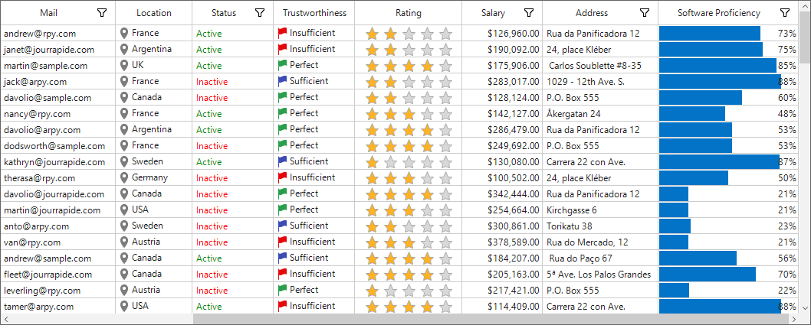

### Changing orientation

#### Horizontal orientation

The direction of display of the ProgressBar can be changed as `Horizontal` by using the property given below.In this case,direction of the text also changed.



this.sfDataGrid.Style.ProgressBarStyle.Orientation = Orientation.Horizontal;
this.sfDataGrid.RowHeight = 50;


Me.sfDataGrid.Style.ProgressBarStyle.Orientation = Orientation.Horizontal
Me.sfDataGrid.RowHeight = 50



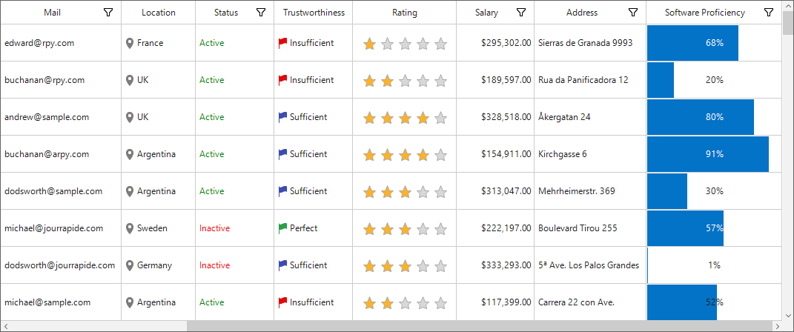

#### Vertical orientation

The direction of display of the ProgressBar can be changed as `Vertical` by using the property given below. In this case Direction of the text also changed.



this.sfDataGrid.Style.ProgressBarStyle.Orientation = Orientation.Vertical;
this.sfDataGrid.RowHeight = 50;


Me.sfDataGrid.Style.ProgressBarStyle.Orientation = Orientation.Vertical
Me.sfDataGrid.RowHeight = 50



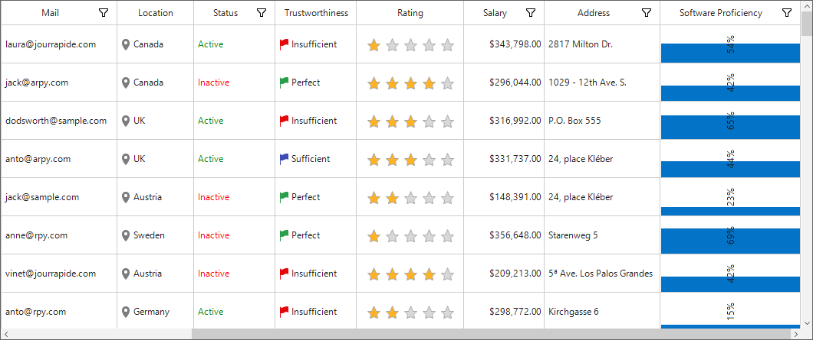

### Add image in progress bar

The ForegroundStyle are set to the `Image` style, then the foreground image can be specified by using the below given property.



this.sfDataGrid.RowHeight = 50;
this.sfDataGrid.Style.ProgressBarStyle.ForegroundStyle = GridProgressBarStyle.Image;
this.sfDataGrid.Style.ProgressBarStyle.ForegroundImage = (Bitmap)Image.FromFile(@"cloud.jpg");
this.sfDataGrid.Style.ProgressBarStyle.FitImageToProgressBar = false;


Me.sfDataGrid.RowHeight = 50
Me.sfDataGrid.Style.ProgressBarStyle.ForegroundStyle = GridProgressBarStyle.Image
Me.sfDataGrid.Style.ProgressBarStyle.ForegroundImage = CType(Image.FromFile("cloud.jpg"), Bitmap)
Me.sfDataGrid.Style.ProgressBarStyle.FitImageToProgressBar = false



#### Enabling Fit image to ProgressBar

Image can be fit in the ForegroundStyle to enable the FitImageToProgressBar property.



this.sfDataGrid.RowHeight = 50;
this.sfDataGrid.Style.ProgressBarStyle.ForegroundStyle = GridProgressBarStyle.Image;
this.sfDataGrid.Style.ProgressBarStyle.ForegroundImage = (Bitmap)Image.FromFile(@"cloud.jpg");
this.sfDataGrid.Style.ProgressBarStyle.FitImageToProgressBar = true;


Me.sfDataGrid.RowHeight = 50
Me.sfDataGrid.Style.ProgressBarStyle.ForegroundStyle = GridProgressBarStyle.Image
Me.sfDataGrid.Style.ProgressBarStyle.ForegroundImage = CType(Image.FromFile("cloud.jpg"), Bitmap)
Me.sfDataGrid.Style.ProgressBarStyle.FitImageToProgressBar = true



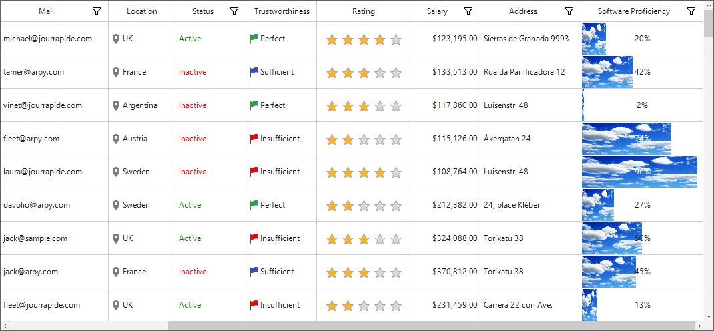

### Conditional styling

SfDataGrid allows to customize the appearance of the ProgressBar column based on conditions through [QueryProgressBarCellStyle](https://help.syncfusion.com/cr/windowsforms/Syncfusion.SfDataGrid.WinForms~Syncfusion.WinForms.DataGrid.SfDataGrid~QueryProgressBarCellStyle_EV.html) event.



sfDataGrid.QueryProgressBarCellStyle += SfDataGrid_QueryProgressBarCellStyle;

private void SfDataGrid_QueryProgressBarCellStyle(object sender, QueryProgressBarCellStyleEventArgs e)
{
if (e.ColumnIndex == 10 && e.RowIndex % 2 == 0)
{
e.Style.TextColor = Color.Blue;
e.Style.ForegroundColor = Color.Yellow;
e.Style.TextAlignment = Syncfusion.Windows.Forms.Tools.TextAlignment.Left;
}
}


AddHandler sfDataGrid.QueryProgressBarCellStyle += AddressOf SfDataGrid_QueryProgressBarCellStyle

Private Sub SfDataGrid_QueryProgressBarCellStyle(ByVal sender As Object, ByVal e As QueryProgressBarCellStyleEventArgs)
If e.ColumnIndex = 10 AndAlso e.RowIndex Mod 2 = 0 Then
e.Style.TextColor = Color.Blue
e.Style.ForegroundColor = Color.Yellow
e.Style.TextAlignment = Syncfusion.Windows.Forms.Tools.TextAlignment.Left
End If
End Sub



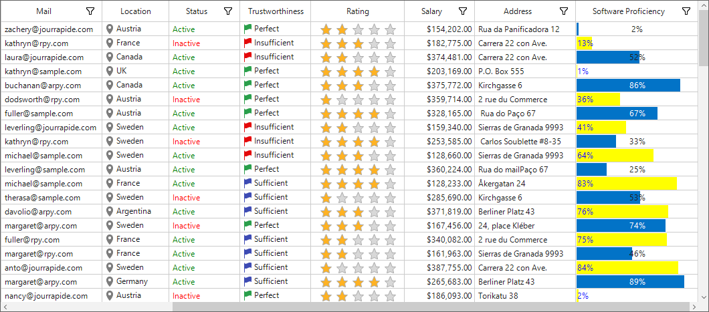

## Custom Column Support

SfDataGrid allows to create own column by overriding predefined column type and to customize existing column renderer.

### Creating Column from Existing Column

New column type can be created by overriding the predefined column types in SfDataGrid.
In the below code snippet, `GridCurrencyColumn` column created from `GridNumericColumn`.



public class GridCurrencyColumn : GridNumericColumn
{
    protected override object GetFormattedValue(object record, object value)
    {
        var formatInfo = this.NumberFormatInfo ?? CultureInfo.CurrentUICulture.NumberFormat;
        if (value == null || DBNull.Value.Equals(value))
        {
            if (AllowNull)
                return value;
            value = (double)this.MinValue;
        }
        double originalValue;
        if (double.TryParse(value.ToString(), out originalValue))
        {
            if (originalValue < MinValue)
                originalValue = MinValue;
            if (originalValue > MaxValue)
                originalValue = MaxValue;
            return string.Format(formatInfo, "{0:c}", originalValue);
        }
        return value;
    }
}


Public Class GridCurrencyColumn
	Inherits GridNumericColumn
		Protected Overrides Function GetFormattedValue(ByVal record As Object, ByVal value As Object) As Object
			Dim formatInfo = If(Me.NumberFormatInfo, CultureInfo.CurrentUICulture.NumberFormat)

			If value Is Nothing OrElse DBNull.Value.Equals(value) Then
				If AllowNull Then
					Return value
				End If
				value = CDbl(Me.MinValue)
			End If

			Dim originalValue As Double
			If Double.TryParse(value.ToString(), originalValue) Then
				If originalValue < MinValue Then
					originalValue = MinValue
				End If

				If originalValue > MaxValue Then
					originalValue = MaxValue
				End If

				Return String.Format(formatInfo, "{0:c}", originalValue)
			End If

			Return value
		End Function
End Class



In the below code snippet, created `GridCurrencyColumn` added to [SfDataGrid.Columns](https://help.syncfusion.com/cr/cref_files/windowsforms/Syncfusion.SfDataGrid.WinForms~Syncfusion.WinForms.DataGrid.SfDataGrid~Columns.html) collection to specify the value as currency without setting the format mode.



this.sfDataGrid1.Columns.Add(new GridCurrencyColumn()
{
    MappingName = "UnitPrice",
    HeaderText = "Unit Price",
});


Me.sfDataGrid1.Columns.Add(New GridCurrencyColumn() With {.MappingName = "UnitPrice", .HeaderText = "Unit Price"})



### Customize Column Renderer

SfDataGrid allows to customize the column related operations like key navigation and UI related interactions by overriding the corresponding renderer associated with the column. Each column has its own renderer with set of virtual methods for handling the column level operations.
Below table lists the available cell types for columns and its renderers.

<table>
<tr>
<td>
{{'**Column Name**'| markdownify }}
</td>
<td>
{{'**Renderer**'| markdownify }}
</td>
<td>
{{'**Cell Type**'| markdownify }}
</td>
</tr>
<tr>
<td>
{{'[GridTextColumn](https://help.syncfusion.com/cr/cref_files/windowsforms/Syncfusion.SfDataGrid.WinForms~Syncfusion.WinForms.DataGrid.GridTextColumn.html#"")'| markdownify }}        
</td>
<td>
{{'[GridTextBoxCellRenderer](https://help.syncfusion.com/cr/cref_files/windowsforms/Syncfusion.SfDataGrid.WinForms~Syncfusion.WinForms.DataGrid.Renderers.GridTextBoxCellRenderer.html#"")'| markdownify }}
</td>
<td>
TextBox
</td>
</tr>
<tr>
<td>
{{'[GridNumericColumn](https://help.syncfusion.com/cr/cref_files/windowsforms/Syncfusion.SfDataGrid.WinForms~Syncfusion.WinForms.DataGrid.GridNumericColumn.html#"")'| markdownify }}
</td>
<td>
{{'[GridNumericCellRenderer](https://help.syncfusion.com/cr/cref_files/windowsforms/Syncfusion.SfDataGrid.WinForms~Syncfusion.WinForms.DataGrid.Renderers.GridNumericCellRenderer.html#"")'| markdownify }}
</td>
<td>
Numeric
</td>
</tr>
<tr>
<td>
{{'[GridDateTimeColumn](https://help.syncfusion.com/cr/cref_files/windowsforms/Syncfusion.SfDataGrid.WinForms~Syncfusion.WinForms.DataGrid.GridDateTimeColumn.html#"")'| markdownify }}
</td>
<td>
{{'[GridDateTimeCellRenderer](https://help.syncfusion.com/cr/cref_files/windowsforms/Syncfusion.SfDataGrid.WinForms~Syncfusion.WinForms.DataGrid.Renderers.GridDateTimeCellRenderer.html#"")'| markdownify }}
</td>
<td>
DataTime
</td>
</tr>
<tr>
<td>
{{'[GridCheckBoxColumn](https://help.syncfusion.com/cr/cref_files/windowsforms/Syncfusion.SfDataGrid.WinForms~Syncfusion.WinForms.DataGrid.GridCheckBoxColumn.html#"")'| markdownify }}        
</td>
<td>
{{'[GridCheckBoxCellRenderer](https://help.syncfusion.com/cr/cref_files/windowsforms/Syncfusion.SfDataGrid.WinForms~Syncfusion.WinForms.DataGrid.Renderers.GridCheckBoxCellRenderer.html#"")'| markdownify }}
</td>
<td>
CheckBox
</td>
</tr>
<tr>
<td>
{{'[GridImageColumn](https://help.syncfusion.com/cr/cref_files/windowsforms/Syncfusion.SfDataGrid.WinForms~Syncfusion.WinForms.DataGrid.GridImageColumn.html#"")'| markdownify }}
</td>
<td>
{{'[GridImageCellRenderer](https://help.syncfusion.com/cr/cref_files/windowsforms/Syncfusion.SfDataGrid.WinForms~Syncfusion.WinForms.DataGrid.Renderers.GridImageCellRenderer.html#"")'| markdownify }}
</td>
<td>
Image
</td>
</tr>
<tr>
<td>
{{'[GridHyperlinkColumn](https://help.syncfusion.com/cr/cref_files/windowsforms/Syncfusion.SfDataGrid.WinForms~Syncfusion.WinForms.DataGrid.GridHyperlinkColumn.html#"")'| markdownify }}
</td>
<td>
{{'[GridHyperlinkCellRenderer](https://help.syncfusion.com/cr/cref_files/windowsforms/Syncfusion.SfDataGrid.WinForms~Syncfusion.WinForms.DataGrid.Renderers.GridHyperlinkCellRenderer.html#"")'| markdownify }}
</td>
<td>
Hyperlink
</td>
</tr>
<tr>
<td>
{{'[GridButtonColumn](https://help.syncfusion.com/cr/cref_files/windowsforms/Syncfusion.SfDataGrid.WinForms~Syncfusion.WinForms.DataGrid.GridButtonColumn.html#"")'| markdownify }}
</td>
<td>
{{'[GridButtonCellRenderer](https://help.syncfusion.com/cr/cref_files/windowsforms/Syncfusion.SfDataGrid.WinForms~Syncfusion.WinForms.DataGrid.Renderers.GridButtonCellRenderer.html#"")'| markdownify }}
</td>
<td>
Button
</td>
</tr>
</table>

Below code, creates the `GridTextBoxCellRendererExt` to change the fore ground of CustomerID column and replacing created renderer to `CellRenderers`.



this.sfDataGrid1.CellRenderers.Remove("TextBox");
this.sfDataGrid1.CellRenderers.Add("TextBox", new GridTextBoxCellRendererExt());
public class GridTextBoxCellRendererExt : GridTextBoxCellRenderer
{
	protected override void OnRender(Graphics paint, Rectangle cellRect, string cellValue, CellStyleInfo style, DataColumnBase column, RowColumnIndex rowColumnIndex)
	{
		if (column.GridColumn.MappingName == "CustomerID")
			style.TextColor = Color.DarkBlue;
		base.OnRender(paint, cellRect, cellValue, style, column, rowColumnIndex);
	}
}



Me.sfDataGrid1.CellRenderers.Remove("TextBox")
Me.sfDataGrid1.CellRenderers.Add("TextBox", New GridTextBoxCellRendererExt())

public class GridTextBoxCellRendererExt : GridTextBoxCellRenderer
	protected override void OnRender(Graphics paint, Rectangle cellRect, String cellValue, CellStyleInfo style, DataColumnBase column, RowColumnIndex rowColumnIndex)
		If column.GridColumn.MappingName = "CustomerID" Then
			style.TextColor = Color.DarkBlue
		End If
		MyBase.OnRender(paint, cellRect, cellValue, style, column, rowColumnIndex)



