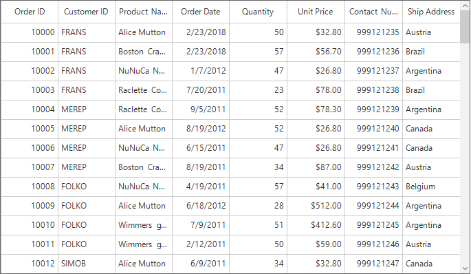

# Columns
SfDataGrid allows to add or remove columns using [SfDataGrid.Columns](https://help.syncfusion.com/cr/cref_files/windowsforms/sfdatagrid/Syncfusion.SfDataGrid.WinForms~Syncfusion.WinForms.DataGrid.SfDataGrid~Columns.html) property. The columns to be added can be chosen from built-in column types or own column can be created and add to the `SfDataGrid.Columns`.
Below are the built-in column types supported in SfDataGrid. Each column has its own properties to handle different types of data.
<table>
<tr>
<td>
{{'**Column Type**'| markdownify }}
</td>
<td>
{{'        **Description**'| markdownify }}
</td>
</tr>
<tr>
<td>
{{'[GridTextColumn](https://help.syncfusion.com/cr/cref_files/windowsforms/sfdatagrid/Syncfusion.SfDataGrid.WinForms~Syncfusion.WinForms.DataGrid.GridTextColumn.html)'| markdownify }}        
</td>
<td>
Use to display the string data
</td>
</tr>
<tr>
<td>
{{'[GridNumericColumn](https://help.syncfusion.com/cr/cref_files/windowsforms/sfdatagrid/Syncfusion.SfDataGrid.WinForms~Syncfusion.WinForms.DataGrid.GridNumericColumn.html)'| markdownify }}
</td>
<td>
Use to display the numeric data
</td>
</tr>
<tr>
<td>
{{'[GridDateTimeColumn](https://help.syncfusion.com/cr/cref_files/windowsforms/sfdatagrid/Syncfusion.SfDataGrid.WinForms~Syncfusion.WinForms.DataGrid.GridDateTimeColumn.html)'| markdownify }}
</td>
<td>
Use to display the date time value
</td>
</tr>
<tr>
<td>
{{'[GridCheckBoxColumn](https://help.syncfusion.com/cr/cref_files/windowsforms/sfdatagrid/Syncfusion.SfDataGrid.WinForms~Syncfusion.WinForms.DataGrid.GridCheckBoxColumn.html)'| markdownify }}        
</td>
<td>
Use to display the Boolean type data
</td>
</tr>
<tr>
<td>
{{'[GridImageColumn](https://help.syncfusion.com/cr/cref_files/windowsforms/sfdatagrid/Syncfusion.SfDataGrid.WinForms~Syncfusion.WinForms.DataGrid.GridImageColumn.html)'| markdownify }}
</td>
<td>
Use to display the image in each row
</td>
</tr>
<tr>
<td>
{{'[GridHyperlinkColumn](https://help.syncfusion.com/cr/cref_files/windowsforms/sfdatagrid/Syncfusion.SfDataGrid.WinForms~Syncfusion.WinForms.DataGrid.GridHyperlinkColumn.html)'| markdownify }}
</td>
<td>
Use to display the Uri data
</td>
</tr>
<tr>
<td>
{{'[GridButtonColumn](https://help.syncfusion.com/cr/cref_files/windowsforms/sfdatagrid/Syncfusion.SfDataGrid.WinForms~Syncfusion.WinForms.DataGrid.GridButtonColumn.html)'| markdownify }}
</td>
<td>
Use to display button in each row
</td>
</tr>
</table>

## Defining Columns

SfDataGrid provides support for creating columns automatically or manually. Below sections explains both the ways,
SfDataGrid provides support for generating 

1. Automatically generating columns
2. Manually defining columns

### Automatically generating columns

The automatic column generation based on properties of data object can be enabled or disabled by setting [SfDataGrid.AutoGenerateColumns](https://help.syncfusion.com/cr/cref_files/windowsforms/sfdatagrid/Syncfusion.SfDataGrid.WinForms~Syncfusion.WinForms.DataGrid.SfDataGrid~AutoGenerateColumns.html). Default value is `true`. The columns will be automatically generated based on its column type from the underlying data source.
<table>
<tr>
<td>
{{'**Data Type**'| markdownify }}
</td>
<td>
{{'        **Column**'| markdownify }}
</td>
</tr>
<tr>
<td>
string, object, dynamic
</td>
<td>
GridTextColumn
</td>
</tr>
<tr>
<td>
int, float, double, decimal and also it’s nullable        
</td>
<td>
GridNumericColumn
</td>
</tr>
<tr>
<td>
DateTime, DateTimeOffset and also it’s nullable
</td>
<td>
GridDateTimeColumn
</td>
</tr>
<tr>
<td>
Uri, Uri?        
</td>
<td>
GridHyperLinkColumn
</td>
</tr>
<tr>
<td>
bool, bool?        
</td>
<td>
GridCheckBoxColumn
</td>
</tr>
</table>

N> The order of columns in the collection will determine the order of that they will appear in SfDataGrid.

#### AutoGenerateColumns with different modes

The column auto generation is controlled using the [SfDataGrid.AutoGenerateColumnsMode](https://help.syncfusion.com/cr/cref_files/windowsforms/sfdatagrid/Syncfusion.SfDataGrid.WinForms~Syncfusion.WinForms.DataGrid.SfDataGrid~AutoGenerateColumnsMode.html) property. Default value is `AutoGenerateColumnsMode.Reset`.
The `SfDataGrid.AutoGenerateColumnsMode` includes the following modes.
<table>
<tr>
<td>
{{'**Mode**'| markdownify }}
</td>
<td>
{{'**Behavior**'| markdownify }}
</td>
<td>
{{'**When DataSource changed**'| markdownify }}
</td>
</tr>
<tr>
<td>
None
</td>
<td>
Generates the columns based on the explicit column definition.
</td>
<td>
Keeps old columns in DataGrid.Columns collection.
</td>
</tr>
<tr>
<td>
Reset
</td>
<td>
Generates the columns based on the properties defined in the underlying data object and explicit column definition.
</td>
<td>
Keeps the columns added manually. Clears the columns which are auto generated before and creates new columns based on new DataSource.
</td>
</tr>
<tr>
<td>
ResetAll
</td>
<td>
Generates the columns based on the properties defined in the underlying data object.
</td>
<td>
Clear all the columns including the columns defined manually and creates new columns based on new DataSource.
</td>
</tr>
<tr>
<td>
RetainOld
</td>
<td>
Generates the columns based on the properties defined in the underlying data object, when the SfDataGrid doesn’t have an explicit column definition.
</td>
<td>
The same columns will be maintained when changing DataSource also. So sorting and grouping settings will be maintained.
</td>
</tr>
<tr>
<td>
SmartReset
</td>
<td>
Generates the columns and retains data operation based on the properties defined in underlying data object.
</td>
<td>
Keeps the columns which matches in the current data source and the data operation performed in it.
</td>
</tr>
</table>

#### Customize auto-generated columns

The auto generated column can be customized by handling the [AutoGeneratingColumn](https://help.syncfusion.com/cr/cref_files/windowsforms/sfdatagrid/Syncfusion.SfDataGrid.WinForms~Syncfusion.WinForms.DataGrid.SfDataGrid~AutoGeneratingColumn_EV.html) event. `AutoGeneratingColumn` event occurs when the column is auto generated.
[AutoGeneratingColumnArgs](https://help.syncfusion.com/cr/cref_files/windowsforms/sfdatagrid/Syncfusion.SfDataGrid.WinForms~Syncfusion.WinForms.DataGrid.Events.AutoGeneratingColumnArgs.html) provides the information about the auto-generated column to the `AutoGeneratingColumn` event. [AutoGeneratingColumnArgs.Column](https://help.syncfusion.com/cr/cref_files/windowsforms/sfdatagrid/Syncfusion.SfDataGrid.WinForms~Syncfusion.WinForms.DataGrid.Events.AutoGeneratingColumnArgs~Column.html) property returns the auto-generated column.


this.sfDataGrid1.AutoGeneratingColumn += SfDataGrid1_AutoGeneratingColumn;

private void SfDataGrid1_AutoGeneratingColumn(object sender, AutoGeneratingColumnArgs e)
{
    e.Column.HeaderText = "AutoGenerated";
    e.Column.HeaderStyle.BackColor = Color.LightSkyBlue;
}




#### Cancel column generation for particular property

The auto generation of the specific column can be canceled by handling the [AutoGeneratingColumn](https://help.syncfusion.com/cr/cref_files/windowsforms/sfdatagrid/Syncfusion.SfDataGrid.WinForms~Syncfusion.WinForms.DataGrid.SfDataGrid~AutoGeneratingColumn_EV.html) event. The column generation can be canceled by setting the `Cancel` property to `true`.


this.sfDataGrid1.AutoGeneratingColumn += SfDataGrid1_AutoGeneratingColumn;
private void SfDataGrid1_AutoGeneratingColumn(object sender, AutoGeneratingColumnArgs e)
{
     if (e.Column.MappingName == "OrderID")
        e.Cancel = true;
}



#### Changing column type

The type of column adding to SfDataGrid can be changed by setting the instance of column you want to add in [AutoGeneratingColumn](https://help.syncfusion.com/cr/cref_files/windowsforms/sfdatagrid/Syncfusion.SfDataGrid.WinForms~Syncfusion.WinForms.DataGrid.SfDataGrid~AutoGeneratingColumn_EV.html) event.
In the below code, column type for `UnitPrice` property is changed to `GridTextColumn` by setting instance of GridTextColumn to `Column` property.


this.sfDataGrid1.AutoGeneratingColumn += SfDataGrid1_AutoGeneratingColumn;

private void SfDataGrid1_AutoGeneratingColumn(object sender, AutoGeneratingColumnArgs e)
        {
            if (e.Column.MappingName == "UnitPrice")
            {

                if (e.Column is GridNumericColumn)
                {
                    e.Column = new GridTextColumn() { MappingName = "UnitPrice", HeaderText = "Unit    Price" };
                }
            }
        }



#### Changing property settings

The properties of the auto generating column can be changed by handling the [AutoGeneratingColumn](https://help.syncfusion.com/cr/cref_files/windowsforms/sfdatagrid/Syncfusion.SfDataGrid.WinForms~Syncfusion.WinForms.DataGrid.SfDataGrid~AutoGeneratingColumn_EV.html) event.


this.sfDataGrid1.AutoGeneratingColumn += SfDataGrid1_AutoGeneratingColumn;

private void SfDataGrid1_AutoGeneratingColumn(object sender, AutoGeneratingColumnArgs e)
{
    if (e.Column.MappingName == "OrderID")
    {
        e.Column.AllowSorting = true;
        e.Column.AllowGrouping = false;
        e.Column.HeaderStyle.BackColor = Color.LightSkyBlue;
        e.Column.CellStyle.BackColor = Color.MediumBlue;
    }
}



#### Data Annotations with AutoGenerateColumns

SfDataGrid support to generate the columns based on built-in [Data Annotation Attributes](https://msdn.microsoft.com/en-us/library/system.componentmodel.dataannotations(v=vs.95).aspx). Data Annotations ignored, when the [AutoGenerateColumns](https://help.syncfusion.com/cr/cref_files/windowsforms/sfdatagrid/Syncfusion.SfDataGrid.WinForms~Syncfusion.WinForms.DataGrid.SfDataGrid~AutoGenerateColumns.html) is set to `false`.

#### Exclude column

The column generation can be skipped by using `AutoGenerateField` property or by setting the `Bindable` attribute to `false`.



[Display(AutoGenerateField = false, Description = "OrderID field is not generated in UI")]

public int OrderID
{
    get { return orderID; }
    set { orderID = value; }
}



#### Filtering

Filtering can be enabled automatically for the field by using `Display.AutoGenerateFilter` property


[Display(AutoGenerateFilter = true, Description = "Filter enabled for CustomerID column")]

public string CustomerID
{
    get { return customerId; }
    set { customerId = value; }
}



#### Editing

The value of the property can be changed by using `Editable` attribute.


[Editable(true)]

public string Country
{
    get { return country; }
    set { country = value; }
}



#### Change the HeaderText of column

The Header text of column can be customized by using `Display.Name` property.


[Display(Name="Name of the Customer",Description="CustomerName is necessary for identification ")]

public string CustomerName
{
    get { return customerName; }
    set { customerName = value; }
}



#### Change the order of the columns

The columns order can be changed by using `DisplayAttribute.Order` property.


[Display(Order=0)]

public int OrderID
{
    get { return orderID; }
    set { orderID = value; }
}

[Display(Order=-1)]

public string CustomerID
{
    get { return customerId; }
    set { customerId = value; }
}


The OrderID and CustomerID column rearranged based on specified order.

#### Customizing data format

The data format can  be customized using `DataTypeAttribute.DataType` property.


[DataType(DataType.Currency)]        

public double  UnitPrice
{
    get { return unitPrice; }
    set { unitPrice = value; }
}



#### Setting read-only column

The editing for a column can be disabled by using `ReadOnly` attribute..


[ReadOnly(true)]

public string Country
{
    get { return country; }
    set { country = value; }
}



### Manually defining columns

The SfDataGrid allows to define the columns manually by adding the desired column to the [SfDataGrid.Columns](https://help.syncfusion.com/cr/cref_files/windowsforms/sfdatagrid/Syncfusion.SfDataGrid.WinForms~Syncfusion.WinForms.DataGrid.SfDataGrid~Columns.html) collection.


this.sfDataGrid1.AutoGenerateColumns = false;
this.sfDataGrid1.DataSource = collection.OrdersListDetails;

this.sfDataGrid1.Columns.Add(new GridTextColumn() { MappingName = "OrderID", HeaderText = "Order ID" });
this.sfDataGrid1.Columns.Add(new GridTextColumn() { MappingName = "CustomerID", HeaderText = "Customer ID" });
this.sfDataGrid1.Columns.Add(new GridTextColumn() { MappingName = "CustomerName", HeaderText = "Customer Name" });
this.sfDataGrid1.Columns.Add(new GridTextColumn() { MappingName = "Country", HeaderText = "Country" });
this.sfDataGrid1.Columns.Add(new GridTextColumn() { MappingName = "ProductName", HeaderText = "Product Name" });



## Column manipulation

The columns (added or auto-generated) can be retrieved from [SfDataGrid.Columns](https://help.syncfusion.com/cr/cref_files/windowsforms/sfdatagrid/Syncfusion.SfDataGrid.WinForms~Syncfusion.WinForms.DataGrid.SfDataGrid~Columns.html) property.

### Adding column

The column can be added to the `SfDataGrid` by adding the instance of the column to `SfDataGrid.Columns` property.



this.sfDataGrid1.Columns.Add(new GridTextColumn() { MappingName = "OrderID", HeaderText = "Order ID" });



### Accessing column

The column can be accessed through its column index or [GridColumnBase.MappingName](https://help.syncfusion.com/cr/cref_files/windowsforms/sfdatagrid/Syncfusion.SfDataGrid.WinForms~Syncfusion.WinForms.DataGrid.GridColumnBase~MappingName.html) property from the `SfDataGrid.Columns` collection.


GridColumn column = this.sfDataGrid1.Columns[1];
// Or
GridColumn column = this.sfDataGrid1.Columns["OrderID"];



### Clearing or Removing column

All the columns can be removed by clearing the `SfDataGrid.Columns` collection.


this.sfDataGrid1.Columns.Clear();


A column can be removed using the Remove and RemoveAt methods.


this.sfDataGrid1.Columns.Remove(gridColumn);
// Or
this.sfDataGrid1.Columns.RemoveAt(1);


Column under a stacked column can be removed from StackedHeaderRow.


var childColumns = this.sfDataGrid1.StackedHeaderRows[0].StackedColumns[0].ChildColumns.Split(',');
foreach(var name in childColumns)
{
    var column = this.sfDataGrid1.Columns[name];
    this.sfDataGrid1.Columns.Remove(column);
}



## Stacked Headers
SfDataGrid supports additional unbound header rows known as `stacked header rows` that span across the DataGrid columns using [StackedHeaderRows](https://help.syncfusion.com/cr/cref_files/windowsforms/sfdatagrid/Syncfusion.SfDataGrid.WinForms~Syncfusion.WinForms.DataGrid.StackedHeaderRows.html). SfDataGrid allows to group one or more columns under each stacked header. Each StackedHeaderRow contains the StackedColumns where each StackedColumn contains a number of child columns.
StackedColumn.ChildColumns property returns the columns which are grouped under the stacked header row. StackedColumn.HeaderText returns the text that displays in stacked header row.

### Adding Stacked header
The stacked headers can be added by using the below steps,

1. Create an object of `StackedHeaderRow` for adding stacked columns.

2. Add the columns using `ChildColumns` property of `StackedColumn`.

3. Add the `StackedColumn` to `StackedColumns` collection.

4. Finally add the `StackedHeaderRow` to `StackedHeaderRows` collection of the grid. 



//Creating object for a stacked header row.
var stackedHeaderRow1 = new StackedHeaderRow();

//Adding stacked column to stacked columns collection available in stacked header row object.
stackedHeaderRow1.StackedColumns.Add(new StackedColumn() { ChildColumns = "OrderID,OrderDate", HeaderText = "Order Details" });
stackedHeaderRow1.StackedColumns.Add(new StackedColumn() { ChildColumns = "CustomerID,ContactNumber,", HeaderText = "Customer Details" });
stackedHeaderRow1.StackedColumns.Add(new StackedColumn() { ChildColumns = "ProductName,Quantity,UnitPrice,ShipCountry", HeaderText = "Product Details" });

//Adding stacked header row object to stacked header row collection available in SfDataGrid.
sfDataGrid.StackedHeaderRows.Add(stackedHeaderRow1);



### Adding child columns	
SfDataGrid allows to add the child columns in a particular stacked header directly.



//Previous Child columns.
string previousChild = this.sfDataGrid.StackedHeaderRows[0].StackedColumns[0].ChildColumns;

//Adding ChildColumns to stacked header rows with additional child column. 
this.sfDataGrid.StackedHeaderRows[0].StackedColumns[0].ChildColumns = previousChild + ",CustomerID";



### Removing child columns
SfDataGrid allows to remove the child columns from particular stacked header directly.



//Removing ChildColumns from the stacked header row.
 var removingColumns = this.sfDataGrid.StackedHeaderRows[0].StackedColumns[0].ChildColumns.Split(',').ToList<string>();
string childColumns = string.Empty;
foreach (var stackedColumnName in removingColumns.ToList())
{
    if (stackedColumnName.Equals("OrderID"))
    {
        removingColumns.Remove(stackedColumnName);
    }
    else
        childColumns = childColumns + stackedColumnName + ",";
}
this.sfDataGrid.StackedHeaderRows[0].StackedColumns[0].ChildColumns = childColumns;



### Multi stacked headers
Multiple stacked headers can be added to `SfDataGrid` by adding the required number of `StackedHeaderRow` to `SfDataGrid.StackedHeaderRows`property.



//Creating instance for StackedHeaderRow
StackedHeaderRow stackedHeaderRow1 = new StackedHeaderRow();
StackedHeaderRow stackedHeaderRow2 = new StackedHeaderRow();

//Adding columns to StackedColumns collection to StackedHeaderRow object.
stackedHeaderRow1.StackedColumns.Add(new StackedColumn() { ChildColumns = "OrderID,CustomerID,ContactNumber,OrderDate,ProductName,Quantity", HeaderText = "Sales Details" });

stackedHeaderRow2.StackedColumns.Add(new StackedColumn() { ChildColumns = "OrderID", HeaderText = "Order Details" });
stackedHeaderRow2.StackedColumns.Add(new StackedColumn() { ChildColumns = "CustomerID,ContactNumber", HeaderText = "Customer Details" });
stackedHeaderRow2.StackedColumns.Add(new StackedColumn() { ChildColumns = "OrderDate,ProductName,Quantity", HeaderText = "Product Details" });

//Adding StackedHeaderRow object to StackedHeaderRows collection of SfDatagrid.
this.sfDataGrid.StackedHeaderRows.Add(stackedHeaderRow1);
this.sfDataGrid.StackedHeaderRows.Add(stackedHeaderRow2);



### Appearance 

### Stacked header row appearance

The appearance of stacked header row can be customized by setting property. The [StackedHeaderStyle](https://help.syncfusion.com/cr/cref_files/windowsforms/sfdatagrid/Syncfusion.SfDataGrid.WinForms~Syncfusion.WinForms.DataGrid.Styles.DataGridStyle~StackedHeaderStyle.html"") property contains all the settings that are needed for the stacked header row appearance customization. 


this.sfDataGrid.Style.StackedHeaderStyle.BackColor = Color.DarkCyan;
this.sfDataGrid.Style.StackedHeaderStyle.TextColor = Color.White;



### Changing the stacked header appearance based on column
An appearance of the stacked header row can be customized by using [DrawCell](https://help.syncfusion.com/cr/cref_files/windowsforms/sfdatagrid/Syncfusion.SfDataGrid.WinForms~Syncfusion.WinForms.DataGrid.SfDataGrid~DrawCell_EV.html) event. SfDataGrid allow to check the row type for stacked header row by getting the property from `(e.DataRow as DataRowBase).RowType` of[DrawCellEventArgs](https://help.syncfusion.com/cr/cref_files/windowsforms/sfdatagrid/Syncfusion.SfDataGrid.WinForms~Syncfusion.WinForms.DataGrid.Events.DrawCellEventArgs.html). 
 SfDataGrid allows to check the stacked column by its cell value which is available in `DrawCellEventArgs `​and apply styling using ‘e.Style’ property of `DrawCellEventArgs` 


this.sfDataGrid.DrawCell += SfDataGrid_DrawCell;

private void SfDataGrid_DrawCell(object sender, DrawCellEventArgs e)
{
    if ((e.DataRow as DataRowBase).RowType == RowType.StackedHeaderRow)
    {
        if (e.CellValue == "Order Details")
        {
            e.Style.BackColor = Color.DarkCyan;
            e.Style.TextColor = Color.White;
        }
        if (e.CellValue == "Customer Details")
        {
            e.Style.BackColor = Color.LightCyan;
        }
        if (e.CellValue == "Product Details")
        {
            e.Style.BackColor = Color.DarkGray;
            e.Style.TextColor = Color.White;
        }
    }
}



## Column Sizing
SfDataGrid allows to set the column widths based on certain logic using [SfDataGrid.AutoSizeColumnsMode](https://help.syncfusion.com/cr/cref_files/windowsforms/sfdatagrid/Syncfusion.SfDataGrid.WinForms~Syncfusion.WinForms.DataGrid.SfDataGrid~AutoSizeColumnsMode.html) or [GridColumnBase.AutoSizeColumnsMode](https://help.syncfusion.com/cr/cref_files/windowsforms/sfdatagrid/Syncfusion.SfDataGrid.WinForms~Syncfusion.WinForms.DataGrid.GridColumnBase~AutoSizeColumnsMode.html) property. Below is the list of predefined column sizing options available.

<table>
<tr>
<th>
Name
</th>
<th>
Description
</th>
</tr>
<tr>
<td>
AllCells
</td>
<td>
Calculates the width of column based on header and cell contents. So, header and cell contents are not truncated.
</td>
</tr>
<tr>
<td>
AllCellsExceptHeader
</td>
<td>
Calculates the width of column based on cell contents. So, cell contents are not truncated.
</td>
</tr>
<tr>
<td>
AllCellsWithLastColumnFill
</td>
<td>
Applies `AutoSizeColumnsMode.AllCells` width to all the columns except last column which is visible and sets the maximum between last column auto spacing width and remaining width to last column.
</td>
</tr>
<tr>
<td>
ColumnHeader
</td>
<td>
Calculates the width of column based on header content. So, header content is not truncated.
</td>
</tr>
<tr>
<td>
Fill
</td>
<td>
Divides the total width equally for columns.
</td>
</tr>
<tr>
<td>
LastColumnFill
</td>
<td>
Applies `AutoSizeColumnsMode.AllCells` width to all the columns except last column which is visible and the remaining width from total width of SfDataGrid is set to last column.
</td>
</tr>
<tr>
<td>
None
</td>
<td>
No sizing. Default column width or defined width set to column.
</td>
</tr>
</table>

N> `AutoSizeColumnsMode` will not work when the column width defined explicitly. AutoSizeCalculationMode calculates column width based on [MinimumWidth ](https://help.syncfusion.com/cr/cref_files/windowsforms/sfdatagrid/Syncfusion.SfDataGrid.WinForms~Syncfusion.WinForms.DataGrid.GridColumnBase~MinimumWidth.html)and [MaximumWidth ](https://help.syncfusion.com/cr/cref_files/windowsforms/sfdatagrid/Syncfusion.SfDataGrid.WinForms~Syncfusion.WinForms.DataGrid.GridColumnBase~MaximumWidth.html) properties of the column.

Below code, applies `AutoSizeColumnsMode.Fill` to equally set width for [SfDataGrid.Columns](https://help.syncfusion.com/cr/cref_files/windowsforms/sfdatagrid/Syncfusion.SfDataGrid.WinForms~Syncfusion.WinForms.DataGrid.SfDataGrid~Columns.html).



OrderInfoCollection collection = new OrderInfoCollection();
sfDataGrid.DataSource = collection.OrdersListDetails;
sfDataGrid.AutoSizeColumnsMode = AutoSizeColumnsMode.Fill;


Dim collection As New OrderInfoCollection()
sfDataGrid.DataSource = collection.OrdersListDetails
sfDataGrid.AutoSizeColumnsMode = AutoSizeColumnsMode.Fill



N> The `GridColumnBase.AutoSizeColumnsMode` takes higher priority than the `SfDataGrid.AutoSizeColumnsMode`.

### Fill remaining width for any column
While setting [SfDataGrid.AutoSizeColumnsMode](https://help.syncfusion.com/cr/cref_files/windowsforms/sfdatagrid/Syncfusion.SfDataGrid.WinForms~Syncfusion.WinForms.DataGrid.SfDataGrid~AutoSizeColumnsMode.html) as `LastColumnFill` or `AllCellsWithLastColumnFill` remaining width is applied to last column. You can apply the remaining width to specific column by setting `GridColumnBase.AutoSizeColumnsMode` property as like below,



this.sfDataGrid.AutoSizeColumnsMode = AutoSizeColumnsMode.LastColumnFill;
this.sfDataGrid.Columns["ProductName"].AutoSizeColumnsMode = AutoSizeColumnsMode.LastColumnFill;


Me.sfDataGrid.AutoSizeColumnsMode = AutoSizeColumnsMode.LastColumnFill
Me.sfDataGrid.Columns("ProductName").AutoSizeColumnsMode = AutoSizeColumnsMode.LastColumnFill



### Auto size based on string length
By default, the auto size of the column is calculated based on the string width. To improve the performance of the column auto sizing, the column auto size calculation logic can be calculated based on the length of the values by using [SfDataGrid.AutoSizeController.AutoSizeCalculationMode](https://help.syncfusion.com/cr/cref_files/windowsforms/sfdatagrid/Syncfusion.SfDataGrid.WinForms~Syncfusion.WinForms.DataGrid.AutoSizeController~AutoSizeCalculationMode.html) property.
The default is `AutoSizeCalculationMode.Default` which calculates size for all the cell’s formatted text. The columns can also be auto sized based on string length of the cell using the `AutoSizeCalculationMode.SmartFit` which calculates the size for the cell which has longest string.



this.sfDataGrid. AutoSizeController.AutoSizeCalculationMode = AutoSizeCalculationMode.SmartFit;
this.sfDataGrid.AutoSizeColumnsMode = AutoSizeColumnsMode.AllCells;


Me.sfDataGrid.AutoSizeController.AutoSizeCalculationMode = AutoSizeCalculationMode.SmartFit
Me.sfDataGrid.AutoSizeColumnsMode = AutoSizeColumnsMode.AllCells



### Column auto sizing for visible rows
By default, the column auto size is calculated for the whole rows. The column auto size can be calculated for the visible rows only by using the  [AutoSizeController.AutoSizeRange](https://help.syncfusion.com/cr/cref_files/windowsforms/sfdatagrid/Syncfusion.SfDataGrid.WinForms~Syncfusion.WinForms.DataGrid.AutoSizeController~AutoSizeRange.html) property.
The default is `AutoSizeRange.Table` which considers all the records in the table for auto sizing. The columns can be auto sized considering only the visible rows using the `AutoSizeRange.VisibleRows` mode as like below.



this.sfDataGrid.AutoSizeController.AutoSizeRange = AutoSizeRange.VisibleRows;


Me.sfDataGrid.AutoSizeController.AutoSizeRange = AutoSizeRange.VisibleRows



### Refreshing ColumnSizer at runtime
The auto column sizing can be refreshed at by calling [SfDataGrid.AutoSizeController.Refresh](https://help.syncfusion.com/cr/cref_files/windowsforms/sfdatagrid/Syncfusion.SfDataGrid.WinForms~Syncfusion.WinForms.DataGrid.AutoSizeController~Refresh.html) method. The column auto width can be recalculated by calling the reset methods of `AutoSizeController`. The[ResetAutoSizeWidthforAllColumns](https://help.syncfusion.com/cr/cref_files/windowsforms/sfdatagrid/Syncfusion.SfDataGrid.WinForms~Syncfusion.WinForms.DataGrid.AutoSizeController~ResetAutoSizeWidthForAllColumns.html) method reset widths to all columns. [ResetAutoSizeWidth](https://help.syncfusion.com/cr/cref_files/windowsforms/sfdatagrid/Syncfusion.SfDataGrid.WinForms~Syncfusion.WinForms.DataGrid.AutoSizeController~ResetAutoSizeWidth.html) method reset the width to specific column.

N> The column does not auto size its width automatically when the data of that column get changed. 
For example, you can refresh all the column’s width based on the cell contents of newly added records at runtime.



var orderInfoCollection = this.sfDataGrid.DataSource as OrderInfoCollection;
orderInfoCollection.Orders.Add(new OrderInfo() { OrderID = 11, CustomerID = "BLFKI", ProductName = "Boston Crab Meat" });

this.sfDataGrid1.ColumnSizer.ResetAutoSizeWidthforAllColumns();
this.sfDataGrid1.ColumnSizer.Refresh();


Dim orderInfoCollection = TryCast(Me.sfDataGrid.DataSource, OrderInfoCollection)
orderInfoCollection.Orders.Add(New OrderInfo() With {.OrderID = 11, .CustomerID = "BLFKI", .ProductName = "Boston Crab Meat"})

Me.sfDataGrid1.ColumnSizer.ResetAutoSizeWidthforAllColumns()
Me.sfDataGrid1.ColumnSizer.Refresh()



### Resetting column width to apply AutoSizeColumnsMode
When the width of the column is explicitly defined or column is resized, column width is not changed based on `AutoSizeColumnsMode`. You can reset [GridColumnBase.Width](http://172.16.0.145:8093/Syncfusion.DataGrid.WinForms/api/Syncfusion.WinForms.DataGrid.GridColumnBase.html#Syncfusion_WinForms_DataGrid_GridColumnBase_Width) by setting 0 to apply column width based on column sizer.



foreach (var column in this.sfDataGrid.Columns)
{
    if (column.Width != 0)
        column.Width = 0;
}
this.sfDataGrid1.ColumnSizer.Refresh();


For Each column In Me.sfDataGrid.Columns
	If column.Width <> 0 Then
		column.Width = 0
	End If
Next column
Me.sfDataGrid1.ColumnSizer.Refresh()



### Customizing built-in column sizing logic
The column auto sizing operations of the SfDataGrid is processed in the [AutoSizeController](https://help.syncfusion.com/cr/cref_files/windowsforms/sfdatagrid/Syncfusion.SfDataGrid.WinForms~Syncfusion.WinForms.DataGrid.AutoSizeController.html) class. The column sizing operations can be customized by overriding  `AutoSizeController` and set it to `SfDataGrid.AutoSizeController` property.



this.sfDataGrid.AutoSizeController = new CustomGridColumnSizer(this.sfDataGrid);

public class CustomGridColumnSizer : AutoSizeController
{
    public CustomGridColumnSizer(SfDataGrid sfDataGrid)
        : base(sfDataGrid)
    { }

    // Calculate width for column when AutoSizeColumnsMode is AllCells.     
    protected override double CalculateAllCellsWidth(GridColumn column, bool isAllCells = false)
    {
        return base.CalculateAllCellsWidth(column, isAllCells);
    }

    // Calculate width for column when AutoSizeColumnsMode is ColumnHeader.     
    protected override int CalculateColumnHeaderWidth(GridColumn column, bool setWidth = true)
    {
        return base.CalculateColumnHeaderWidth(column, setWidth);
    }

    // Calculate width for column when AutoSizeColumnsMode is AllCellsExceptHeaderWidth.     
    protected override double CalculateAllCellsExceptHeaderWidth(GridColumn column, bool setWidth = true)
    {
        return base.CalculateAllCellsExceptHeaderWidth(column, setWidth);
    }
}



### Custom column sizer with ratio support

The `AutoSizeColumnsMode.Fill` width calculation logic can be customized by overriding [SetFillWidth](https://help.syncfusion.com/cr/cref_files/windowsforms/sfdatagrid/Syncfusion.SfDataGrid.WinForms~Syncfusion.WinForms.DataGrid.AutoSizeController~SetFillWidth.html) method of `AutoSizeController`.
For example, you can calculate the column width with specified ratios instead of dividing equal width for all columns in `AutoSizeColumnsMode.Fill` calculation using the logic in below `FillRatio` class.



public static class FillRatio
{
    // Returns the fill ratio for the column.
    public static int GetColumnRatio(GridColumn column)
    {
        int i = 0;
        switch (column.MappingName)
        {
            case "OrderID":
            case "CustomerID":
            case "Quantity":
            case "ShipCountry":
                i = 1;
                break;

            case "ProductName":
                i = 3;
                break;

            case "OrderDate":
                i = 2;
                break;
        }

        return i;
    }
}


Public NotInheritable Class FillRatio
	' Returns the fill ratio for the column.
	Private Sub New()
	End Sub
	Public Shared Function GetColumnRatio(ByVal column As GridColumn) As Integer
		Dim i As Integer = 0
		Select Case column.MappingName
			Case "OrderID", "CustomerID", "Quantity", "ShipCountry"
				i = 1

			Case "ProductName"
				i = 3

			Case "OrderDate"
				i = 2
		End Select

		Return i
	End Function
End Class



Below code to define the fill width calculation based on the `FillRatio`.



public class CustomGridColumnSizer : AutoSizeController
{
    public CustomGridColumnSizer(SfDataGrid sfDataGrid)
        : base(sfDataGrid)
    {    }

    // Overridden to customize the AutoSizeColumnsMode.Fill logic.
    protected override void SetFillWidth(double remainingColumnWidth, IEnumerable<GridColumn> remainingColumns)
    {
        var removedColumn = new List<GridColumn>();
        var columns = remainingColumns.ToList();
        var totalRemainingFillValue = remainingColumnWidth;
        double removedWidth = 0;
        bool isRemoved;

        while (columns.Count > 0)
        {
            isRemoved = false;
            removedWidth = 0;
            var columnsCount = 0;

            columns.ForEach((col) =>
            {
                columnsCount += FillRatio.GetColumnRatio(col);
            });

            double fillWidth = Math.Floor((totalRemainingFillValue / columnsCount));
            var column = columns.First();
            fillWidth *= FillRatio.GetColumnRatio(column);
            double computedWidth = SetColumnWidth(column, (int)fillWidth);

            if (fillWidth != computedWidth && fillWidth > 0)
            {
                isRemoved = true;
                columns.Remove(column);
                foreach (var remColumn in removedColumn)
                {
                    if (!columns.Contains(remColumn))
                    {
                        removedWidth += remColumn.ActualWidth;
                        columns.Add(remColumn);
                    }
                }
                removedColumn.Clear();
                totalRemainingFillValue += removedWidth;
            }

            totalRemainingFillValue = totalRemainingFillValue - computedWidth;

            if (!isRemoved)
            {
                columns.Remove(column);
                if (!removedColumn.Contains(column))
                    removedColumn.Add(column);
            }
        }
    }
}



Below code to set the `SfDataGrid.AutoSizeContoller` to apply the custom logic for fill mode.


this.sfDataGrid.AutoGenerateColumns = false;
OrderInfoCollection orderInfoCollection = new OrderInfoCollection();
this.sfDataGrid.DataSource = orderInfoCollection.OrdersListDetails;

this.sfDataGrid.Columns.Add(new GridTextColumn() { MappingName = "OrderID" });
this.sfDataGrid.Columns.Add(new GridTextColumn() { MappingName = "CustomerID" });
this.sfDataGrid.Columns.Add(new GridTextColumn() { MappingName = "ProductName" });
this.sfDataGrid.Columns.Add(new GridDateTimeColumn() { MappingName = "OrderDate" });
this.sfDataGrid.Columns.Add(new GridNumericColumn() { MappingName = "Quantity" });
this.sfDataGrid.Columns.Add(new GridTextColumn() { MappingName = "ShipCountry" });

// Assigns the CustomGridColumnSizer to SfDataGrid.
this.sfDataGrid.AutoSizeController = new CustomGridColumnSizer(this.sfDataGrid);

this.sfDataGrid.AutoSizeColumnsMode = AutoSizeColumnsMode.Fill;


Me.sfDataGrid.AutoGenerateColumns = False
Dim orderInfoCollection As New OrderInfoCollection()
Me.sfDataGrid.DataSource = orderInfoCollection.OrdersListDetails

Me.sfDataGrid.Columns.Add(New GridTextColumn() With {.MappingName = "OrderID"})
Me.sfDataGrid.Columns.Add(New GridTextColumn() With {.MappingName = "CustomerID"})
Me.sfDataGrid.Columns.Add(New GridTextColumn() With {.MappingName = "ProductName"})
Me.sfDataGrid.Columns.Add(New GridDateTimeColumn() With {.MappingName = "OrderDate"})
Me.sfDataGrid.Columns.Add(New GridNumericColumn() With {.MappingName = "Quantity"})
Me.sfDataGrid.Columns.Add(New GridTextColumn() With {.MappingName = "ShipCountry"})

' Assigns the CustomGridColumnSizer to SfDataGrid.
Me.sfDataGrid.AutoSizeController = New CustomGridColumnSizer(Me.sfDataGrid)

Me.sfDataGrid.AutoSizeColumnsMode = AutoSizeColumnsMode.Fill



