# Columns

## Defining Columns
You can let the `SfDataGrid` to create columns or you can manually define columns to be displayed or manually define columns. Below sections explains both ways,

1) Automatically generating columns

2) Manually defining columns

### Automatically generating columns
The automatic column generation based on properties of data object can be enabled or disabled by setting [SfDataGrid.AutoGenerateColumns](http://172.16.0.145:8093/Syncfusion.DataGrid.WinForms/api/Syncfusion.WinForms.DataGrid.SfDataGrid.html#Syncfusion_WinForms_DataGrid_SfDataGrid_AutoGenerateColumns). Default value is `true`. The columns will be automatically generated based on its column type from the underlying data source.

N> The order of columns in the collection will determine the order of that they will appear in SfDataGrid.

### AutoGenerateColumns with different modes
The column auto generation is controlled using the [SfDataGrid.AutoGenerateColumnsMode](http://172.16.0.145:8093/Syncfusion.DataGrid.WinForms/api/Syncfusion.WinForms.DataGrid.SfDataGrid.html#Syncfusion_WinForms_DataGrid_SfDataGrid_AutoGenerateColumnsMode) property. Default value is `AutoGenerateColumnsMode.Reset`.
The `SfDataGrid.AutoGenerateColumnsMode` includes the following modes.

<table>
<tr>
<td>
{{'**Mode**'| markdownify }}
</td>
<td>
{{'**Behavior**'| markdownify }}
</td>
<td>
{{'**When DataSource changed**'| markdownify }}
</td>
</tr>
<tr>
<td>
None
</td>
<td>
Generates the columns based on the explicit column definition.
</td>
<td>
Keeps old columns in DataGrid.Columns collection.
</td>
</tr>
<tr>
<td>
Reset
</td>
<td>
Generates the columns based on the properties defined in the underlying data object and explicit column definition.
</td>
<td>
Keeps the columns added manually. Clears the columns which are auto generated before and creates new columns based on new DataSource.
</td>
</tr>
<tr>
<td>
ResetAll
</td>
<td>
Generates the columns based on the properties defined in the underlying data object.
</td>
<td>
Clear all the columns including the columns defined manually and creates new columns based on new DataSource.
</td>
</tr>
<tr>
<td>
RetainOld
</td>
<td>
Generates the columns based on the properties defined in the underlying data object, when the SfDataGrid doesn’t have an explicit column definition.
</td>
<td>
The same columns will be maintained when changing DataSource also. So sorting and grouping settings will be maintained.
</td>
</tr>
<tr>
<td>
SmartReset
</td>
<td>
Generates the columns and retains data operation based on the properties defined in underlying data object.
</td>
<td>
Keeps the columns which matches in the current data source and the data operation performed in it.
</td>
</tr>
</table>

### Customize auto-generated columns
The auto generated column can be customized by handling the [AutoGeneratingColumn](http://172.16.0.145:8093/Syncfusion.DataGrid.WinForms/api/Syncfusion.WinForms.DataGrid.SfDataGrid.html#Syncfusion_WinForms_DataGrid_SfDataGrid_AutoGeneratingColumn) event. `AutoGeneratingColumn` event occurs when the column is auto generated.
[AutoGeneratingColumnArgs](http://172.16.0.145:8093/Syncfusion.DataGrid.WinForms/api/Syncfusion.WinForms.DataGrid.AutoGeneratingColumnArgs.html) provides the information about the auto-generated column to the `AutoGeneratingColumn` event. [AutoGeneratingColumnArgs.Column](http://172.16.0.145:8093/Syncfusion.DataGrid.WinForms/api/Syncfusion.WinForms.DataGrid.AutoGeneratingColumnArgs.html#Syncfusion_WinForms_DataGrid_AutoGeneratingColumnArgs_Column) property returns the auto-generated column.



this.sfDataGrid1.AutoGeneratingColumn += SfDataGrid1_AutoGeneratingColumn;

private void SfDataGrid1_AutoGeneratingColumn(object sender, AutoGeneratingColumnArgs e)
{
    e.Column.HeaderText = "AutoGenerated";
    e.Column.HeaderStyle.BackColor = Color.LightSkyBlue;
}



#### Cancel column generation for particular property
The auto generation of the specific column can be canceled by handling the `AutoGeneratingColumn` event. The column generation can be cancelled by setting the `Cancel` property to `true`.



this.sfDataGrid1.AutoGeneratingColumn += SfDataGrid1_AutoGeneratingColumn;

private void SfDataGrid1_AutoGeneratingColumn(object sender, AutoGeneratingColumnArgs e)
{
    if (e.Column.MappingName == "OrderID")
        e.Cancel = true;
}



#### Changing property settings
The properties of the auto generating column can be changed by handling the `AutoGeneratingColumn` event.



this.sfDataGrid1.AutoGeneratingColumn += SfDataGrid1_AutoGeneratingColumn;

private void SfDataGrid1_AutoGeneratingColumn(object sender, AutoGeneratingColumnArgs e)
{
    if (e.Column.MappingName == "OrderID")
    {
        e.Column.AllowSorting = true;
        e.Column.AllowGrouping = false;
        e.Column.HeaderStyle.BackColor = Color.LightSkyBlue;
        e.Column.CellStyle.BackColor = Color.MediumBlue;
    }
}



### Manually defining columns
The `SfDataGrid` allows you to define the columns manually by adding the desired column to the [SfDataGrid.Columns](http://172.16.0.145:8093/Syncfusion.DataGrid.WinForms/api/Syncfusion.WinForms.DataGrid.SfDataGrid.html#Syncfusion_WinForms_DataGrid_SfDataGrid_Columns) collection.



this.sfDataGrid1.AutoGenerateColumns = false;
this.sfDataGrid1.DataSource = collection.OrdersListDetails;

this.sfDataGrid1.Columns.Add(new GridTextColumn() { MappingName = "OrderID", HeaderText = "Order ID" });
this.sfDataGrid1.Columns.Add(new GridTextColumn() { MappingName = "CustomerID", HeaderText = "Customer ID" });
this.sfDataGrid1.Columns.Add(new GridTextColumn() { MappingName = "CustomerName", HeaderText = "Customer Name" });
this.sfDataGrid1.Columns.Add(new GridTextColumn() { MappingName = "Country", HeaderText = "Country" });
this.sfDataGrid1.Columns.Add(new GridTextColumn() { MappingName = "ProductName", HeaderText = "Product Name" });



## Column manipulation
The columns (added or auto-generated) can be retrieved from [SfDataGrid.Columns](http://172.16.0.145:8093/Syncfusion.DataGrid.WinForms/api/Syncfusion.WinForms.DataGrid.SfDataGrid.html#Syncfusion_WinForms_DataGrid_SfDataGrid_Columns) property.

### Adding column
The column can be added to the `SfDataGrid` by adding the instance of the column to `SfDataGrid.Columns` property.



this.sfDataGrid1.Columns.Add(new GridTextColumn() { MappingName = "OrderID", HeaderText = "Order ID" });



### Accessing column
The column can be accessed through its column index or [GridColumnBase.MappingName](http://172.16.0.145:8093/Syncfusion.DataGrid.WinForms/api/Syncfusion.WinForms.DataGrid.GridColumnBase.html#Syncfusion_WinForms_DataGrid_GridColumnBase_MappingName) property from the `SfDataGrid.Columns` collection.


GridColumn column = this.sfDataGrid1.Columns[1];
// Or
GridColumn column = this.sfDataGrid1.Columns["OrderID"];



### Clearing or Removing column
All the columns can be removed by clearing the `SfDataGrid.Columns` collection.



this.sfDataGrid1.Columns.Clear();


The particular column can be removed using the Remove and RemoveAt methods.


this.sfDataGrid1.Columns.Remove(gridColumn);
// Or
this.sfDataGrid1.Columns.RemoveAt(1);



You can also remove the column under one stacked column from `StackedHeaderRow`.



var childColumns = this.sfDataGrid1.StackedHeaderRows[0].StackedColumns[0].ChildColumns.Split(',');
foreach(var name in childColumns)
{
    var column = this.sfDataGrid1.Columns[name];
    this.sfDataGrid1.Columns.Remove(column);
}



## Freezing Columns
You can freeze the columns in view at left and right like Excel by setting the `FrozenRowsCount` and `FooterRowsCount` properties.


// Freeze columns at left
this.sfDataGrid.FooterColumnCount = 2;

// Freeze columns at right
this.sfDataGrid.FrozenColumnCount = 2;



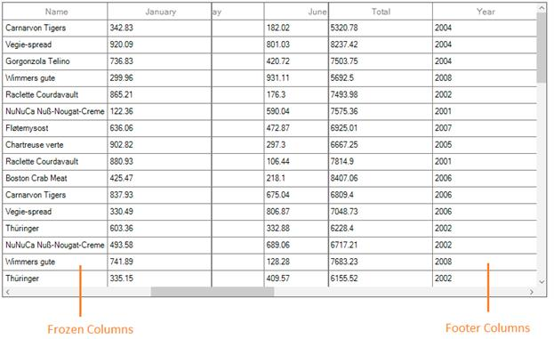

## Stacked Headers
SfDataGrid supports additional unbound header rows known as `stacked header rows` that spans across the SfDataGrid columns using [StackedHeaderRows](http://172.16.0.145:8093/Syncfusion.DataGrid.WinForms/api/Syncfusion.WinForms.DataGrid.SfDataGrid.html#Syncfusion_WinForms_DataGrid_SfDataGrid_StackedHeaderRows). You can group one or more columns under each stacked header. Each [StackedHeaderRow](http://172.16.0.145:8093/Syncfusion.DataGrid.WinForms/api/Syncfusion.WinForms.DataGrid.StackedHeaderRow.html) contains the [StackedColumns](http://172.16.0.145:8093/Syncfusion.DataGrid.WinForms/api/Syncfusion.WinForms.DataGrid.StackedColumns.html) where each [StackedColumn](http://172.16.0.145:8093/Syncfusion.DataGrid.WinForms/api/Syncfusion.WinForms.DataGrid.StackedColumn.html) contains a number of child columns.
[StackedColumn.ChildColumns](http://172.16.0.145:8093/Syncfusion.DataGrid.WinForms/api/Syncfusion.WinForms.DataGrid.StackedColumn.html#Syncfusion_WinForms_DataGrid_StackedColumn_ChildColumns) property returns the columns which are grouped under the stacked header row. [StackedColumn.HeaderText](http://172.16.0.145:8093/Syncfusion.DataGrid.WinForms/api/Syncfusion.WinForms.DataGrid.StackedColumn.html#Syncfusion_WinForms_DataGrid_StackedColumn_HeaderText) returns the text that displays in stacked header row.

### Adding Stacked header

#### Through designer
To add the stacked headers in SfDataGrid in designer mode, follow the below steps.

* Open StackedHeaderRow Collection Editor and add the stacked header rows by specifying attributes `Name` and `StackedColumns`. 

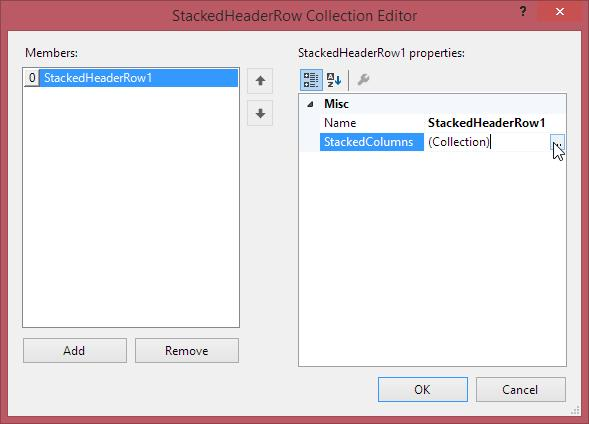

* Open StackedColumn Collection Editor and add StackedColumn by specifying attributes `ChildColumns` and `HeaderText`.

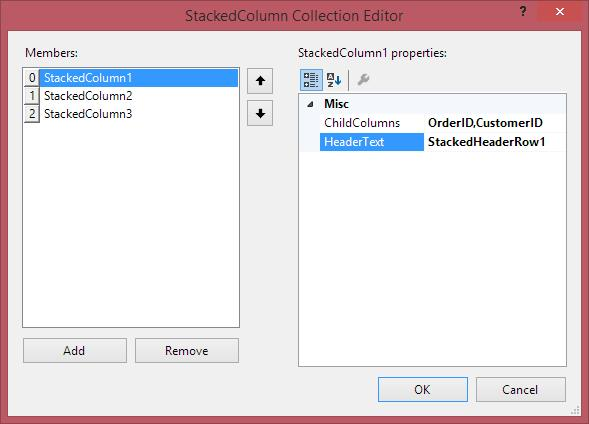



//Step 1: Creating StackedHeaderRow object.
Syncfusion.WinForms.DataGrid.StackedHeaderRow stackedHeaderRow1 = new Syncfusion.WinForms.DataGrid.StackedHeaderRow(); 

//Step 1: Creating StackedColumn to add columns.
Syncfusion.WinForms.DataGrid.StackedColumn stackedColumn1 = new Syncfusion.WinForms.DataGrid.StackedColumn();
Syncfusion.WinForms.DataGrid.StackedColumn stackedColumn2 = new Syncfusion.WinForms.DataGrid.StackedColumn(); 
Syncfusion.WinForms.DataGrid.StackedColumn stackedColumn3 = new Syncfusion.WinForms.DataGrid.StackedColumn(); 

//Adding columns to stacked column.
stackedColumn1.ChildColumns = "OrderID,CustomerID";
stackedColumn1.HeaderText = "StackedHederRow1";

stackedColumn2.ChildColumns = "OrderDate,ContactNumber";
stackedColumn2.HeaderText = "StackedHeaderRow2";

stackedColumn3.ChildColumns = "ProductName,Quantity";
stackedColumn3.HeaderText = "StackedHeaderRow3";	

//Adding Stacked column to StackedColumns collection.
stackedHeaderRow1.StackedColumns.Add(stackedColumn1);
stackedHeaderRow1.StackedColumns.Add(stackedColumn2);
stackedHeaderRow1.StackedColumns.Add(stackedColumn3);

//Step 1: Adding StackedHeaderRow to StackedHeaderRows.
this.sfDataGrid.StackedHeaderRows.Add(stackedHeaderRow1);




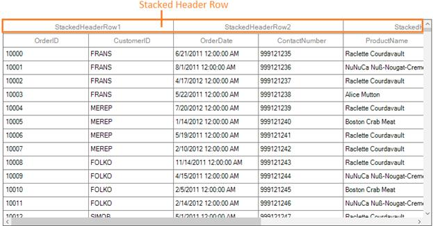

#### Through code
The stacked headers also can be added through code by using the below steps,

1. Create an object of `StackedHeaderRow` for adding stacked columns.

2. Add the columns using `ChildColumns` property of `StackedColumn`.

3. Add the `StackedColumn` to `StackedColumns` collection.

4. Finally add the `StackedHeaderRow` to `StackedHeaderRows` collection of the grid. 



//Creating object for a stacked header row.
StackedHeaderRow stackedHeaderRow1 = new StackedHeaderRow();

//Adding stacked column to stacked columns collection available in stacked header row object.
stackedHeaderRow1.StackedColumns.Add(new StackedColumn() { ChildColumns = "OrderID,CustomerID", HeaderText = "StackedHeaderRow1" });

stackedHeaderRow1.StackedColumns.Add(new StackedColumn() { ChildColumns = "OrderDate,ContactNumber", HeaderText = "StackedHeaderRow2" });

stackedHeaderRow1.StackedColumns.Add(new StackedColumn() { ChildColumns = "ProductName,Quantity", HeaderText = "StackedHeaderRow3" });

//Adding stacked header row object to stacked header row collection available in SfDataGrid.
this.sfDataGrid.StackedHeaderRows.Add(stackedHeaderRow1);



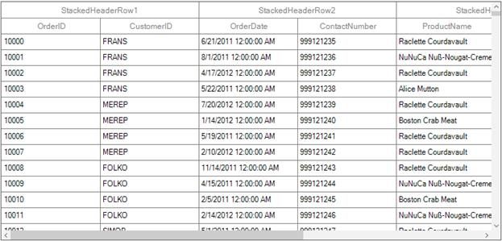

### Adding child columns	
You can add the child columns in particular stacked header directly.



//Previous Child columns.
 string previousChild = this.sfDataGrid.StackedHeaderRows[0].StackedColumns[0].ChildColumns;

//Adding ChildColumns to stacked header rows with additional child column.
this.sfDataGrid.StackedHeaderRows[0].StackedColumns[0].ChildColumns = previousChild + ",OrderDate";



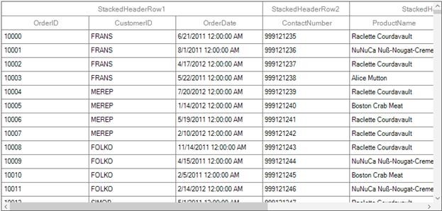

### Removing child columns
You can remove the child columns from particular stacked header directly.



//Removing ChildColumns from the stacked header row.
 var removingColumns = this.sfDataGrid.StackedHeaderRows[0].StackedColumns[0].ChildColumns.Split(',').ToList<string>();
string childColumns = string.Empty;
foreach (var stackedColumnName in removingColumns.ToList())
{
    if (stackedColumnName.Equals("OrderID"))
    {
        removingColumns.Remove(stackedColumnName);
    }
    else
        childColumns = childColumns + stackedColumnName + ",";
}
this.sfDataGrid.StackedHeaderRows[0].StackedColumns[0].ChildColumns = childColumns;



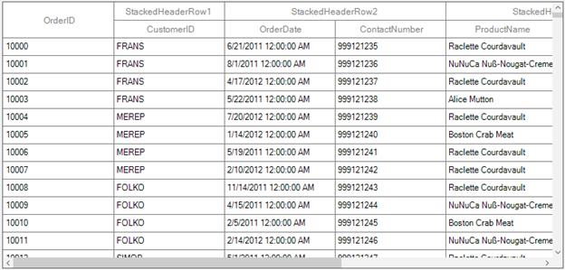

### Multi stacked headers
Multiple stacked headers can be added to `SfDataGrid` by adding the required number of `StackedHeaderRow` to `SfDataGrid.StackedHeaderRows`property.



//Creating instance for StackedHeaderRow
StackedHeaderRow stackedHeaderRow1 = new StackedHeaderRow();
StackedHeaderRow stackedHeaderRow2 = new StackedHeaderRow();

//Adding columns to StackedColumns collection to StackedHeaderRow object.
stackedHeaderRow1.StackedColumns.Add(new StackedColumn() { ChildColumns = "OrderID,CustomerID,ContactNumber,OrderDate,ProductName,Quantity", HeaderText = "Sales Details" });

stackedHeaderRow2.StackedColumns.Add(new StackedColumn() { ChildColumns = "OrderID", HeaderText = "Order Details" });
stackedHeaderRow2.StackedColumns.Add(new StackedColumn() { ChildColumns = "CustomerID,ContactNumber", HeaderText = "Customer Details" });
stackedHeaderRow2.StackedColumns.Add(new StackedColumn() { ChildColumns = "OrderDate,ProductName,Quantity", HeaderText = "Product Details" });

//Adding StackedHeaderRow object to StackedHeaderRows collection of SfDatagrid.
this.sfDataGrid.StackedHeaderRows.Add(stackedHeaderRow1);
this.sfDataGrid.StackedHeaderRows.Add(stackedHeaderRow2);


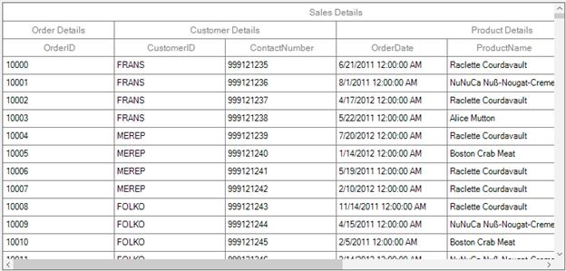

### Appearance

#### Stacked header row appearance
The appearance of stacked header row can be customized by setting [StackedHeaderStyle](http://172.16.0.145:8093/Syncfusion.DataGrid.WinForms/api/Syncfusion.WinForms.DataGrid.Styles.GridStyle.html#Syncfusion_WinForms_DataGrid_Styles_GridStyle_StackedHeaderStyle) property. The ` StackedHeaderStyle ` property contains all the settings that are needed for the stacked header row appearance customization.



this.sfDataGrid.Style.StackedHeaderStyle.BackColor = Color.DarkGreen;
this.sfDataGrid.Style.StackedHeaderStyle.TextColor = Color.White;



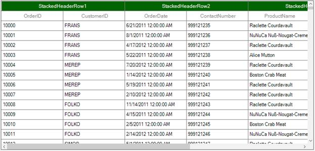

### Changing the stacked header appearance based on column
An appearance of the stacked header row can be customized by using [DrawCell](http://172.16.0.145:8093/Syncfusion.DataGrid.WinForms/api/Syncfusion.WinForms.DataGrid.SfDataGrid.html#Syncfusion_WinForms_DataGrid_SfDataGrid_DrawCell) event. You can check the row type for stacked header row by getting the [RowType](http://172.16.0.145:8093/Syncfusion.DataGrid.WinForms/api/Syncfusion.WinForms.DataGrid.RowType.html) property from `(e.DataRow as DataRowBase).RowType` of `GridDrawCellEventArgs`. 
You can check the stacked column by its cell value which is available in `GridDrawCellEventArgs` ​and apply styling using `e.Style` property of `GridDrawCellEventArgs` 



this.sfDataGrid.DrawCell += SfDataGrid_DrawCell;

private void SfDataGrid_DrawCell(object sender, Syncfusion.WinForms.DataGrid.Styles.GridDrawCellEventArgs e)
{
    if ((e.DataRow as DataRowBase).RowType == RowType.StackedHeaderRow)
    {
        if (e.CellValue == "StackedHeaderRow1")
        {
            e.Style.BackColor = Color.LightPink;
        }	
        if (e.CellValue == "StackedHeaderRow2")
        {
            e.Style.BackColor = Color.LightBlue;
        }
        if (e.CellValue == "StackedHeaderRow3")
        {
            e.Style.BackColor = Color.LightGreen;
        }
    }



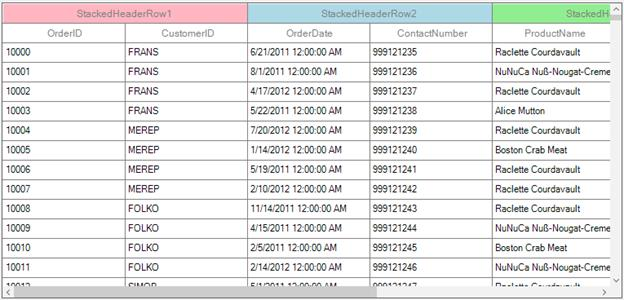

## Column Sizing
`SfDataGrid` allows you to set the column widths based on certain logic using [SfDataGrid.AutoSizeCalculationMode](http://172.16.0.145:8093/Syncfusion.DataGrid.WinForms/api/Syncfusion.WinForms.DataGrid.SfDataGrid.html#Syncfusion_WinForms_DataGrid_SfDataGrid_AutoSizeColumnsMode) or [GridColumnBase.AutoSizeCalculationMode](http://172.16.0.145:8093/Syncfusion.DataGrid.WinForms/api/Syncfusion.WinForms.DataGrid.GridColumnBase.html#Syncfusion_WinForms_DataGrid_GridColumnBase_AutoSizeColumnsMode) property. Below is the list of predefined column sizing options available.

<table>
<tr>
<td>
{{'**Name**'| markdownify }}
</td>
<td>
{{'**Description**'| markdownify }}
</td>
</tr>
<tr>
<td>
AllCells
</td>
<td>
Calculates the width of column based on header and cell contents. So, header and cell contents are not truncated.
</td>
</tr>
<tr>
<td>
AllCellsExceptHeader
</td>
<td>
Calculates the width of column based on cell contents. So, cell contents are not truncated.
</td>
</tr>
<tr>
<td>
AllCellsWithLastColumnFill
</td>
<td>
Applies AutoSizeColumnsMode.AllCells width to all the columns except last column which is visible and sets the maximum between last column auto spacing width and remaining width to last column.
</td>
</tr>
<tr>
<td>
ColumnHeader
</td>
<td>
Calculates the width of column based on header content. So, header content is not truncated.
</td>
</tr>
<tr>
<td>
Fill
</td>
<td>
Divides the total width equally for columns.
</td>
</tr>
<tr>
<td>
LastColumnFill
</td>
<td>
Applies AutoSizeColumnsMode.AllCells width to all the columns except last column which is visible and the remaining width from total width of SfDataGrid is set to last column.
</td>
</tr>
<tr>
<td>
None
</td>
<td>
No sizing. Default column width or defined width set to column.
</td>
</tr>
</table>

N> AutoSizeCalculationMode will not work when the column width defined explicitly. AutoSizeCalculationMode calculates column width based on `MinimumWidth` and `MaximumWidth` properties of the column.

Below code, applies `AutoSizeColumnsMode.Fill` to equally set width for `SfDataGrid.Columns`.



OrderInfoCollection collection = new OrderInfoCollection();
sfDataGrid1.DataSource = collection.OrdersListDetails;
sfDataGrid1.AutoSizeColumnsMode = AutoSizeColumnsMode.Fill;



N> The `GridColumnBase.AutoSizeColumnsMode` takes higher priority than the `SfDataGrid.AutoSizeColumnsMode`.

### Fill remaining width for any column
While setting `SfDataGrid.AutoSizeColumnsMode` as `LastColumnFill` or `AllCellsWithLastColumnFill` remaining width is applied to last column. You can apply the remaining width to specific column by setting `GridColumnBase.AutoSizeColumnsMode` property as like below,



this.sfDataGrid1.AutoSizeColumnsMode = AutoSizeColumnsMode.LastColumnFill;
this.sfDataGrid1.Columns["ProductName"].AutoSizeColumnsMode = AutoSizeColumnsMode.LastColumnFill;



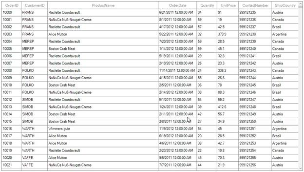

### Auto size based on string length
By default, the auto size of the column is calculated based on the string width. To improve the performance of the column auto sizing, the column auto size calculation logic can be calculated based on the length of the values by using  [SfDataGrid.ColumnSizer.AutoSizeCalculationMode](http://172.16.0.145:8093/Syncfusion.DataGrid.WinForms/api/Syncfusion.WinForms.DataGrid.GridColumnSizer.html#Syncfusion_WinForms_DataGrid_GridColumnSizer_AutoSizeCalculationMode) property.
The default is `AutoSizeCalculationMode.Default` which calculates size for all the cell’s formatted text. The columns can also be auto sized based on string length of the cell using the `AutoSizeCalculationMode.SmartFit` which calculates the size for the cell which has longest string.



this.sfDataGrid1.ColumnSizer.AutoSizeCalculationMode = AutoSizeCalculationMode.SmartFit;
this.sfDataGrid1.AutoSizeColumnsMode = AutoSizeColumnsMode.AllCells;



### Column auto sizing for visible rows
By default, the column auto size is calculated for the whole rows. The column auto size can be calculated for the visible rows only by using the [ColumnSizer.AutoSizeRange](http://172.16.0.145:8093/Syncfusion.DataGrid.WinForms/api/Syncfusion.WinForms.DataGrid.GridColumnSizer.html#Syncfusion_WinForms_DataGrid_GridColumnSizer_AutoSizeRange) property.
The default is `AutoSizeRange.Table` which considers all the records in the table for auto sizing. The columns can be auto sized considering only the visible rows using the `AutoSizeRange.VisibleRows` mode as like below.



this.sfDataGrid1.ColumnSizer.AutoSizeRange = AutoSizeRange.VisibleRows;



### Refreshing ColumnSizer at runtime
You can refresh the auto sizing at runtime by calling [SfDataGrid.ColumnSizer.Refresh](http://172.16.0.145:8093/Syncfusion.DataGrid.WinForms/api/Syncfusion.WinForms.DataGrid.GridColumnSizer.html#Syncfusion_WinForms_DataGrid_GridColumnSizer_Refresh) method. The column auto width can be recalculated by calling the reset methods of [GridColumnSizer](http://172.16.0.145:8093/Syncfusion.DataGrid.WinForms/api/Syncfusion.WinForms.DataGrid.GridColumnSizer.html). [GridColumnSizer.ResetAutoCalculationforAllColumns](http://172.16.0.145:8093/Syncfusion.DataGrid.WinForms/api/Syncfusion.WinForms.DataGrid.GridColumnSizer.html#Syncfusion_WinForms_DataGrid_GridColumnSizer_ResetAutoSizeWidthforAllColumns) method reset widths to all columns. [GridColumnSizer.ResetAutoCalculation](http://172.16.0.145:8093/Syncfusion.DataGrid.WinForms/api/Syncfusion.WinForms.DataGrid.GridColumnSizer.html#Syncfusion_WinForms_DataGrid_GridColumnSizer_ResetAutoSizeWidth_Syncfusion_WinForms_DataGrid_GridColumn_) method reset the width to specific column.

N> The column does not auto size its width automatically when the data of that column get changed. 

For example, you can refresh all the column’s width based on the cell contents of newly added records at runtime.



var orderInfoCollection = this.sfDataGrid1.DataSource as OrderInfoCollection;
orderInfoCollection.Orders.Add(new OrderInfo() { OrderID = 11, CustomerID = "BLFKI", ProductName = "Boston Crab Meat" });

this.sfDataGrid1.ColumnSizer.ResetAutoSizeWidthforAllColumns();
this.sfDataGrid1.ColumnSizer.Refresh();



### Resetting column width to apply AutoSizeColumnsMode
When the width of the column is explicitly defined or column is resized, column width is not changed based on `AutoSizeColumnsMode`. You can reset [GridColumnBase.Width](http://172.16.0.145:8093/Syncfusion.DataGrid.WinForms/api/Syncfusion.WinForms.DataGrid.GridColumnBase.html#Syncfusion_WinForms_DataGrid_GridColumnBase_Width) by setting 0 to apply column width based on column sizer.



foreach (var column in this.sfDataGrid1.Columns)
{
    if (column.Width != 0)
        column.Width = 0;
}
this.sfDataGrid1.ColumnSizer.Refresh();



### Customizing built-in column sizing logic
The column auto sizing operations of the `SfDataGrid` is processed in the [GridColumnSizer](http://172.16.0.145:8093/Syncfusion.DataGrid.WinForms/api/Syncfusion.WinForms.DataGrid.GridColumnSizer.html) class. You can customize the column sizing operations by overriding `GridColumnSizer` and set it to `SfDataGrid.ColumnSizer` property.



this.sfDataGrid1.ColumnSizer = new CustomGridColumnSizer(this.sfDataGrid1);
public class CustomGridColumnSizer : GridColumnSizer
{
    public CustomGridColumnSizer(SfDataGrid sfDataGrid)
        : base(sfDataGrid)
    {
    }
    // Calculate width for column when AutoSizeColumnsMode is AllCells.     
    protected override int CalculateAllCellsWidth(GridColumn column, bool isAllCells = false)
    {
        return base.CalculateAllCellsWidth(column, isAllCells);
    }
    // Calculate width for column when AutoSizeColumnsMode is ColumnHeader.     
    protected override int CalculateColumnHeaderWidth(GridColumn column, bool setWidth = true)
    {
        return base.CalculateColumnHeaderWidth(column, setWidth);
    }
    // Calculate width for column when AutoSizeColumnsMode is AllCellsExceptHeaderWidth.     
    protected override int CalculateAllCellsExceptHeaderWidth(GridColumn column, bool setWidth = true)
    {
        return base.CalculateAllCellsExceptHeaderWidth(column, setWidth);
    }
}



#### Custom column sizer with ratio support
You can customize the `AutoSizeColumnsMode.Fill` width calculation logic by overriding [SetFillWidth](http://172.16.0.145:8093/Syncfusion.DataGrid.WinForms/api/Syncfusion.WinForms.DataGrid.GridColumnSizer.html#Syncfusion_WinForms_DataGrid_GridColumnSizer_SetFillWidth_System_Double_System_Collections_Generic_IEnumerable_Syncfusion_WinForms_DataGrid_GridColumn__) method of `GridColumnSizer`.
For example, you can calculate the column width with specified ratios instead of dividing equal width for all columns in `AutoSizeColumnsMode.Fill` calculation using the logic in below `FillRatio` class.



public static class FillRatio
{
    // Returns the fill ratio for the column.
    public static int GetColumnRatio(GridColumn column)
    {
        int i = 0;
        switch (column.MappingName)
        {
            case "OrderID":
            case "CustomerID":
            case "Quantity":
            case "ShipCountry":
                i = 1;
                break;

            case "ProductName":
                i = 3;
                break;

            case "OrderDate":
                i = 2;
                break;
        }

        return i;
    }
}



Below code to define the fill width calculation based on the `FillRatio`.



public class CustomGridColumnSizer : GridColumnSizer
{
    public CustomGridColumnSizer(SfDataGrid sfDataGrid)
        : base(sfDataGrid)
    {

    }

    // Overridden to customize the AutoSizeColumnsMode.Fill logic.
    protected override void SetFillWidth(double remainingColumnWidth, IEnumerable<GridColumn> remainingColumns)
    {
        var removedColumn = new List<GridColumn>();
        var columns = remainingColumns.ToList();
        var totalRemainingFillValue = remainingColumnWidth;
        double removedWidth = 0;
        bool isRemoved;

        while (columns.Count > 0)
        {
            isRemoved = false;
            removedWidth = 0;
            var columnsCount = 0;

            columns.ForEach((col) =>
            {
                columnsCount += FillRatio.GetColumnRatio(col);
            });

            double fillWidth = Math.Floor((totalRemainingFillValue / columnsCount));
            var column = columns.First();
            fillWidth *= FillRatio.GetColumnRatio(column);
            double computedWidth = SetColumnWidth(column, (int)fillWidth);

            if (fillWidth != computedWidth && fillWidth > 0)
            {
                isRemoved = true;
                columns.Remove(column);
                foreach (var remColumn in removedColumn)
                {
                    if (!columns.Contains(remColumn))
                    {
                        removedWidth += remColumn.ActualWidth;
                        columns.Add(remColumn);
                    }
                }
                removedColumn.Clear();
                totalRemainingFillValue += removedWidth;
            }

            totalRemainingFillValue = totalRemainingFillValue - computedWidth;

            if (!isRemoved)
            {
                columns.Remove(column);
                if (!removedColumn.Contains(column))
                    removedColumn.Add(column);
            }
        }
    }
}



Below code to set the `SfDataGrid.ColumnSizer` to apply the custom logic for fill mode.



this.sfDataGrid1.AutoGenerateColumns = false;
OrderInfoCollection orderInfoCollection = new OrderInfoCollection();
this.sfDataGrid1.DataSource = orderInfoCollection.Orders;
this.sfDataGrid1.Columns.Add(new GridTextColumn() { MappingName = "OrderID" });
this.sfDataGrid1.Columns.Add(new GridTextColumn() { MappingName = "CustomerID" });
this.sfDataGrid1.Columns.Add(new GridTextColumn() { MappingName = "ProductName" });
this.sfDataGrid1.Columns.Add(new GridTextColumn() { MappingName = "OrderDate" });
this.sfDataGrid1.Columns.Add(new GridTextColumn() { MappingName = "Quantity" });
this.sfDataGrid1.Columns.Add(new GridTextColumn() { MappingName = "ShipCountry" });
// Assigns the CustomGridColumnSizer to SfDataGrid.ColumnSizer.
this.sfDataGrid1.ColumnSizer = new CustomGridColumnSizer(this.sfDataGrid1);
this.sfDataGrid1.AutoSizeColumnsMode = AutoSizeColumnsMode.Fill;



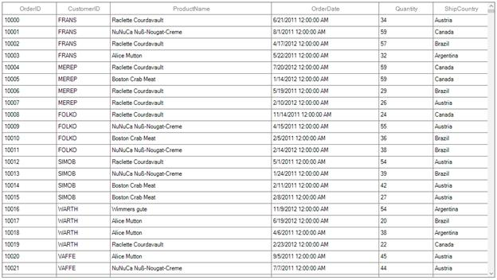

