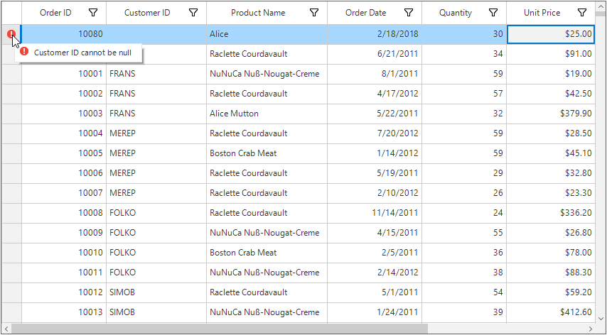

# Data Manipulation

SfDataGrid listens and responds to the manipulation operations such as add, delete and data update (property change) at runtime. DataGrid refresh the sorting, filtering, grouping and summaries based on [SfDataGrid.LiveDataUpdateMode](https://help.syncfusion.com/cr/windowsforms/Syncfusion.SfDataGrid.WinForms~Syncfusion.WinForms.DataGrid.SfDataGrid~LiveDataUpdateMode.html) property.



this.sfDataGrid1.LiveDataUpdateMode = LiveDataUpdateMode.AllowDataShaping;


Me.sfDataGrid1.LiveDataUpdateMode = LiveDataUpdateMode.AllowDataShaping



## LiveDataUpdateMode

### LiveDataUpdateMode – Default 

<table>
<tr>
<td>
{{'**Grid operations/ Data Manipulation operations**'| markdownify }}
</td>
<td>
{{'**Add**'| markdownify }}
</td>
<td>
{{'**Remove / delete**'| markdownify }}
</td>
<td>
{{'**Property change**'| markdownify }}
</td>
</tr>
<tr>
<td>
{{'**Sorting**'| markdownify }}
</td>
<td>
Record added at last
</td>
<td>
Updated
</td>
<td>
Sort order not updated
</td>
</tr>
<tr>
<td>
{{'**Grouping**'| markdownify }}
</td>
<td>
Updated
</td>
<td>
Updated
</td>
<td>
Groups not refreshed based on change
</td>
</tr>
<tr>
<td>
{{'**Filtering**'| markdownify }}
</td>
<td>
Updated
</td>
<td>
Updated
</td>
<td>
Filter not refreshed based on change
</td>
</tr>
<tr>
<td>
{{'**Summaries**'| markdownify }}
</td>
<td>
Not updated
</td>
<td>
Not updated
</td>
<td>
Not updated
</td>
</tr>
</table>

### LiveDataUpdateMode – AllowSummaryUpdate

<table>
<tr>
<td>
{{'**Grid operations/ Data Manipulation operations**'| markdownify }}
</td>
<td>
{{'**Add**'| markdownify }}
</td>
<td>
{{'**Remove / delete**'| markdownify }}
</td>
<td>
{{'**Property change**'| markdownify }}
</td>
</tr>
<tr>
<td>
{{'**Sorting**'| markdownify }}
</td>
<td>
Record added at last
</td>
<td>
Updated
</td>
<td>
Sort order not updated
</td>
</tr>
<tr>
<td>
{{'**Grouping**'| markdownify }}
</td>
<td>
Updated
</td>
<td>
Updated
</td>
<td>
Groups not refreshed based on change
</td>
</tr>
<tr>
<td>
{{'**Filtering**'| markdownify }}
</td>
<td>
Updated
</td>
<td>
Updated
</td>
<td>
Filter not refreshed based on change
</td>
</tr>
<tr>
<td>
{{'**Summaries**'| markdownify }}
</td>
<td>
Updated
</td>
<td>
Updated
</td>
<td>
Updated
</td>
</tr>
</table>

### LiveDataUpdateMode – AllowDataShaping

<table>
<tr>
<td>
{{'**Grid operations/ Data Manipulation operations**'| markdownify }}
</td>
<td>
{{'**Add**'| markdownify }}
</td>
<td>
{{'**Remove / delete**'| markdownify }}
</td>
<td>
{{'**Property change**'| markdownify }}
</td>
</tr>
<tr>
<td>
{{'**Sorting**'| markdownify }}
</td>
<td>
Updated
</td>
<td>
Updated
</td>
<td>
Updated 
</td>
</tr>
<tr>
<td>
{{'**Grouping**'| markdownify }}
</td>
<td>
Updated 
</td>
<td>
Updated
</td>
<td>
Updated
</td>
</tr>
<tr>
<td>
{{'**Filtering**'| markdownify }}
</td>
<td>
Updated
</td>
<td>
Updated
</td>
<td>
Updated
</td>
</tr>
<tr>
<td>
{{'**Summaries**'| markdownify }}
</td>
<td>
Updated
</td>
<td>
Updated
</td>
<td>
Updated
</td>
</tr>
</table>

### Limitations

* `AllowDataShaping` and `AllowSummaryUpdate` is not supported when you are binding with dynamic data objects.
* Complex and indexer properties doesn’t support `LiveDataUpdateMode`- `AllowDataShaping` and `AllowSummaryUpdate`.

## AddNewRow
SfDataGrid provides built-in row (called AddNewRow) to add new records to underlying collection. AddNewRow can be enabled by specifying the position where it should be displayed by setting [SfDataGrid.AddNewRowPosition](https://help.syncfusion.com/cr/cref_files/windowsforms/Syncfusion.SfDataGrid.WinForms~Syncfusion.WinForms.DataGrid.SfDataGrid~AddNewRowPosition.html) property.
When start editing in AddNewRow, the SfDataGrid control creates an instance for the underlying data object and adds it to underlying collection when editing completed.

N> The underlying data object must be defined with default constructor. Otherwise, create instance of data object by handling [AddNewRowInitiating](https://help.syncfusion.com/cr/cref_files/windowsforms/Syncfusion.SfDataGrid.WinForms~Syncfusion.WinForms.DataGrid.SfDataGrid~AddNewRowInitiating_EV.html) event.



 sfDataGrid.AddNewRowPosition = RowPosition.Top;


 sfDataGrid.AddNewRowPosition = RowPosition.Top



### Placing AddNewRow at Various Positions
SfDataGrid allows to add the AddNewRow at either top or fixed top or bottom or fixed bottom by setting the `AddNewRowPosition` property.


 sfDataGrid.AddNewRowPosition = RowPosition.FixedBottom;


 sfDataGrid.AddNewRowPosition = RowPosition.FixedBottom



SfDataGrid allows to check whether the specified row index is AddNewRow index, by using [SfDataGrid.IsAddNewRowIndex](https://help.syncfusion.com/cr/cref_files/windowsforms/Syncfusion.SfDataGrid.WinForms~Syncfusion.WinForms.DataGrid.DataGridIndexResolver~IsAddNewRowIndex.html)  helper method.


sfDataGrid.IsAddNewRowIndex(1);


sfDataGrid.IsAddNewRowIndex(1)



### Customize the Newly Added Row Position
SfDataGrid adds new data item from AddNewRow at the end of collection. When data operations (sorting, grouping) performed, the new item added based on data operations. The newly added data item position can be customized by setting [NewItemPlaceholderPosition](https://help.syncfusion.com/cr/cref_files/windowsforms/Syncfusion.SfDataGrid.WinForms~Syncfusion.WinForms.DataGrid.SfDataGrid~NewItemPlaceholderPosition.html) property.


sfDataGrid.NewItemPlaceholderPosition = Syncfusion.Data.NewItemPlaceholderPosition.AtBeginning;


sfDataGrid.NewItemPlaceholderPosition = Syncfusion.Data.NewItemPlaceholderPosition.AtBeginning



### Initializing Default Values for AddNewRow
SfDataGrid allows to set the default values for AddNewRow while initiating, through [AddNewRowInitiatingEventArgs.NewObject](https://help.syncfusion.com/cr/cref_files/windowsforms/Syncfusion.SfDataGrid.WinForms~Syncfusion.WinForms.DataGrid.Events.AddNewRowInitiatingEventArgs~NewObject.html) property in `AddNewRowInitiating` event.



this.sfDataGrid.AddNewRowInitiating += dataGrid_AddNewRowInitiating;

void dataGrid_AddNewRowInitiating(object sender, AddNewRowInitiatingEventArgs args)
{
    var data = args.NewObject as OrderInfo;
    data.OrderID = 101;
}


AddHandler sfDataGrid.AddNewRowInitiating, AddressOf dataGrid_AddNewRowInitiating

Private Sub dataGrid_AddNewRowInitiating(ByVal sender As Object, ByVal args As AddNewRowInitiatingEventArgs)
	Dim data = TryCast(args.NewObject, OrderInfo)
	data.OrderID = 101
End Sub



### Validating the AddNewRow
The data in AddNewRow can validate like other data rows through built-in validation or custom validation. Here, AddNewRow is validated using [RowValidating](https://help.syncfusion.com/cr/cref_files/windowsforms/Syncfusion.SfDataGrid.WinForms~Syncfusion.WinForms.DataGrid.SfDataGrid~RowValidating_EV.html) event by setting [RowValidatingEventArgs.IsValid](https://help.syncfusion.com/cr/cref_files/windowsforms/Syncfusion.SfDataGrid.WinForms~Syncfusion.WinForms.DataGrid.Events.RowValidatingEventArgs~IsValid.html) to false which doesn’t allow users to commit the AddNewRow until the validation gets succeeded.


this.sfDataGrid.RowValidating += dataGrid_RowValidating;

void dataGrid_RowValidating(object sender, RowValidatingEventArgs args)
{
    if (this.sfDataGrid.IsAddNewRowIndex(args.DataRow.RowIndex))
    {
        var data = args.DataRow.RowData as OrderInfo;
        if (data.OrderID < 10000)
        {
            args.IsValid = false;
            args.ErrorMessage = "OrderID should greater than 10000.";
        }
    }
}


AddHandler sfDataGrid.RowValidating, AddressOf dataGrid_RowValidating

Private Sub dataGrid_RowValidating(ByVal sender As Object, ByVal args As RowValidatingEventArgs)
	If Me.sfDataGrid.IsAddNewRowIndex(args.DataRow.RowIndex) Then
		Dim data = TryCast(args.DataRow.RowData, OrderInfo)

		If data.OrderID < 10000 Then
			args.IsValid = False
			args.ErrorMessage = "OrderID should greater than 10000."
		End If
	End If
End Sub



Similarly, the cells can validate in AddNewRow by using the[CurrentCellValidating](https://help.syncfusion.com/cr/cref_files/windowsforms/Syncfusion.SfDataGrid.WinForms~Syncfusion.WinForms.DataGrid.SfDataGrid~CurrentCellValidating_EV.html) event.

### Prevent adding empty records

Adding empty record using AddNewRow can be prevented by setting the [RowValidatingEventArgs.IsValid](https://help.syncfusion.com/cr/cref_files/windowsforms/Syncfusion.SfDataGrid.WinForms~Syncfusion.WinForms.DataGrid.Events.RowValidatingEventArgs~IsValid.html) property to false in [RowValidating](https://help.syncfusion.com/cr/cref_files/windowsforms/Syncfusion.SfDataGrid.WinForms~Syncfusion.WinForms.DataGrid.SfDataGrid~RowValidating_EV.html) event.



sfDataGrid.RowValidating += sfDataGrid_RowValidating;

void sfDataGrid_RowValidating(object sender, Syncfusion.WinForms.DataGrid.Events.RowValidatingEventArgs e)
{
    var data = e.DataRow.RowData as OrderInfo;

    if (string.IsNullOrEmpty(data.CustomerID) || string.IsNullOrEmpty(data.ProductName) || string.IsNullOrEmpty(data.ShipCountry))
    {
        e.ErrorMessage = "Records cannot be empty";
        e.IsValid = false;
    }
}


AddHandler sfDataGrid.RowValidating, AddressOf sfDataGrid_RowValidating 

Private Sub sfDataGrid_RowValidating(ByVal sender As Object, ByVal e As Syncfusion.WinForms.DataGrid.Events.RowValidatingEventArgs)
    Dim data = TryCast(e.DataRow.RowData, OrderInfo)

    If String.IsNullOrEmpty(data.CustomerID) OrElse String.IsNullOrEmpty(data.ProductName) OrElse String.IsNullOrEmpty(data.ShipCountry) Then
        e.ErrorMessage = "Records cannot be empty"
        e.IsValid = False
    End If
End Sub




### Update cell values based on selected value in the GridComboBoxCell

By default, changes made in the current record of add new row cell will be immediately reflected in the view. The following code shows how to change other cell value based on the selected value in the combo box cell of AddNewRow by using the [CellComboBoxSelectionChanged](https://help.syncfusion.com/cr/Syncfusion.SfDataGrid.WinForms~Syncfusion.WinForms.DataGrid.SfDataGrid~CellComboBoxSelectionChanged_EV.html/Syncfusion.SfDataGrid.WinForms~Syncfusion.WinForms.DataGrid.SfDataGrid~CellComboBoxSelectionChanged_EV.html) event.



this.sfDataGrid.CellComboBoxSelectionChanged += OnSfDataGridCellComboBoxSelectionChanged;

private void OnSfDataGridCellComboBoxSelectionChanged(object sender, Syncfusion.WinForms.DataGrid.Events.CellComboBoxSelectionChangedEventArgs e)
{
    if (e.GridColumn.MappingName == "ShipCityID")
    {
        var shipCityDetails = e.SelectedItem as ShipCityDetails;
        var row = e.Record as OrderDetails;
        row.OrderID = shipCityDetails.ShipCityID;
        if (e.RowIndex == this.sfDataGrid.GetAddNewRowIndex())
            this.sfDataGrid.TableControl.Invalidate(this.sfDataGrid.TableControl.GetRowRectangle(this.sfDataGrid.GetAddNewRowIndex(), false));
    }
}


AddHandler CellComboBoxSelectionChanged, AddressOf OnSfDataGridCellComboBoxSelectionChanged
Private Sub SfDataGridCellComboBoxSelectionChanged(ByVal sender As Object, ByVal e As Syncfusion.WinForms.DataGrid.Events.CellComboBoxSelectionChangedEventArgs)
	If e.GridColumn.MappingName = "ShipCityID" Then
		Dim shipCityDetails = TryCast(e.SelectedItem, ShipCityDetails)
		Dim row = TryCast(e.Record, OrderDetails)
		row.OrderID = shipCityDetails.ShipCityID
		If e.RowIndex = Me.sfDataGrid.GetAddNewRowIndex() Then
			Me.sfDataGrid.TableControl.Invalidate(Me.sfDataGrid.TableControl.GetRowRectangle(Me.sfDataGrid.GetAddNewRowIndex(), False))
		End If
	End If
End Sub



### Customizing AddNewRow text programmatically
You can change the add new row text programmatically using the [sfDataGrid.AddNewRowText](https://help.syncfusion.com/cr/cref_files/windowsforms/Syncfusion.SfDataGrid.WinForms~Syncfusion.WinForms.DataGrid.SfDataGrid~AddNewRowText.html) property.



this.sfDataGrid.AddNewRowText = "Click to add new row";


Me.sfDataGrid.AddNewRowText = "Click to add new row"



### Customizing AddNewRow Text using Default Resource File
SfDataGrid allows to customize the watermark text of AddNewRow by changing value of AddNewRowText in Resource Designer. To customize the AddNewRowText, add the default `Syncfusion.SfDataGrid.WinForms.resx` file in **Resources** folder and then customize the value of AddNewRowText.

### Appearance
The appearance of the AddNewRow can be customized by setting the [AddNewRowStyle](https://help.syncfusion.com/cr/cref_files/windowsforms/Syncfusion.SfDataGrid.WinForms~Syncfusion.WinForms.DataGrid.Styles.DataGridStyle~AddNewRowStyle.html).


this.sfDataGrid.Style.AddNewRowStyle.BackColor = Color.DarkCyan;
this.sfDataGrid.Style.AddNewRowStyle.TextColor = Color.White;


Me.sfDataGrid.Style.AddNewRowStyle.BackColor = Color.DarkCyan
Me.sfDataGrid.Style.AddNewRowStyle.TextColor = Color.White



### Adding a new row programmatically

Programmatically, a new row can be added to the SfDataGrid.



OrderInfoCollection orderInfoCollection = new OrderInfoCollection();
sfDataGrid.DataSource = orderInfoCollection.OrdersListDetails;

OrderInfo orderInfo = new OrderInfo() { OrderID = 10111, CustomerID = "FRANS", ProductName = "Alice Mutton", Quantity = 55, UnitPrice = 90, ContactNumber = 999789845, ShipCountry = "Brazil" };
orderInfoCollection.OrdersListDetails.Add(orderInfo);


Dim orderInfoCollection As New OrderInfoCollection()
sfDataGrid.DataSource = orderInfoCollection.OrdersListDetails

Dim orderInfo As New OrderInfo() With {.OrderID = 10111, .CustomerID = "FRANS", .ProductName = "Alice Mutton", .Quantity = 55, .UnitPrice = 90, .ContactNumber = 999789845, .ShipCountry = "Brazil"}
orderInfoCollection.OrdersListDetails.Add(orderInfo)



### AddNewRow support in Master-Details view
You can enable the AddNewRow in DetailsViewDataGrid using the [GridViewDefinition.DataGrid](https://help.syncfusion.com/cr/cref_files/windowsforms/Syncfusion.SfDataGrid.WinForms~Syncfusion.WinForms.DataGrid.GridViewDefinition~DataGrid.html) property.

#### Enabling AddNewRow when manually defining relations
For manually defined relations, the `AddNewRowPosition` can be directly initialized to the datagrid of the defined `GridViewDefinition`.



GridViewDefinition firstLevelGridViewDefinition = new GridViewDefinition();
firstLevelGridViewDefinition.RelationalColumn = "OrderDetails";
SfDataGrid firstLevelNestedGrid = new SfDataGrid(); 
firstLevelSourceDataGrid.AddNewRowPosition = RowPosition.Top;
firstLevelGridViewDefinition.DataGrid = firstLevelNestedGrid;
sfDataGrid.DetailsViewDefinitions.Add(firstLevelGridViewDefinition);


Dim firstLevelGridViewDefinition As New GridViewDefinition() 
firstLevelGridViewDefinition.RelationalColumn = "OrderDetails" 
Dim firstLevelNestedGrid As New SfDataGrid() 
firstLevelSourceDataGrid.AddNewRowPosition = RowPosition.Top
firstLevelGridViewDefinition.DataGrid = firstLevelNestedGrid 
sfDataGrid.DetailsViewDefinitions.Add(firstLevelGridViewDefinition)



#### Enabling AddNewRow when auto-generating relations
When relation is auto-generated, you can initialize the `AddNewRowPosition` for `GridViewDefinition.DataGrid` in the [AutoGeneratingRelations](https://help.syncfusion.com/cr/windowsforms/Syncfusion.SfDataGrid.WinForms~Syncfusion.WinForms.DataGrid.SfDataGrid~AutoGeneratingRelations_EV.html) event.



this.sfDataGrid1.AutoGeneratingRelations += sfDataGrid1_AutoGeneratingRelations;

private void sfDataGrid1_AutoGeneratingRelations(object sender, Syncfusion.WinForms.DataGrid.Events.AutoGeneratingRelationsEventArgs e)
{
   e.GridViewDefinition.DataGrid.AddNewRowPosition = RowPosition.Top;
}


AddHandler sfDataGrid1. AutoGeneratingRelations, AddressOf SfDataGrid_AutoGeneratingRelations 
Private Sub SfDataGrid_AutoGeneratingRelations(ByVal sender As Object, ByVal e As AutoGeneratingRelationsEventArgs) 
     e.GridViewDefinition.DataGrid.AddNewRowPosition = RowPosition.Top;
End Sub



## Delete Row
SfDataGrid provides built-in support to delete the selected records in user interface (UI) by pressing &lt;kbd&gt;Delete&lt;/kbd&gt; key. The deleting support can be enabled by setting the [SfDataGrid.AllowDeleting](https://help.syncfusion.com/cr/cref_files/windowsforms/Syncfusion.SfDataGrid.WinForms~Syncfusion.WinForms.DataGrid.SfDataGrid~AllowDeleting.html) property to true.


this.sfDataGrid.AllowDeleting = true;


Me.sfDataGrid.AllowDeleting = True



### Delete the Selected Records through Code
The selected records can be deleted by using the [DeleteSelectedRecords](https://help.syncfusion.com/cr/cref_files/windowsforms/Syncfusion.SfDataGrid.WinForms~Syncfusion.WinForms.DataGrid.SfDataGrid~DeleteSelectedRecords.html) method in SfDataGrid.


this.sfDataGrid.DeleteSelectedRecords();


Me.sfDataGrid.DeleteSelectedRecords()



### Customizing the Delete Operations

#### Conditionally Deleting Records
[RecordDeleting](https://help.syncfusion.com/cr/cref_files/windowsforms/Syncfusion.SfDataGrid.WinForms~Syncfusion.WinForms.DataGrid.SfDataGrid~RecordDeleting_EV.html) event occurs when the record is being deleted from SfDataGrid. The record deletion can be cancel by using the [RecordDeletingEventArgs.Cancel](https://msdn.microsoft.com/query/dev10.query?appId=Dev10IDEF1&l=EN-US&k=k(System.ComponentModel.CancelEventArgs.Cancel)&rd=true) of `RecordDeleting` event. The certain records can be skipped when deleting more than one record by removing items from [RecordDeletingEventArgs.Items](https://help.syncfusion.com/cr/cref_files/windowsforms/Syncfusion.SfDataGrid.WinForms~Syncfusion.WinForms.DataGrid.Events.RecordDeletingEventArgs~Items.html).


this.sfDataGrid.RecordDeleting += dataGrid_RecordDeleting;

void dataGrid_RecordDeleting(object sender, RecordDeletingEventArgs args)
{
    foreach (var item in args.Items)
    {
        if ((item as OrderInfo).OrderID == 10001)
        {
            args.Cancel = true;
        }
    }
}


AddHandler sfDataGrid.RecordDeleting, AddressOf dataGrid_RecordDeleting

Private Sub dataGrid_RecordDeleting(ByVal sender As Object, ByVal args As RecordDeletingEventArgs)
	For Each item In args.Items
		If (TryCast(item, OrderInfo)).OrderID = 10001 Then
			args.Cancel = True
		End If
	Next item
End Sub



#### Handling Selection after Deleting the Record

[RecordDeleted](https://help.syncfusion.com/cr/cref_files/windowsforms/Syncfusion.SfDataGrid.WinForms~Syncfusion.WinForms.DataGrid.SfDataGrid~RecordDeleted_EV.html) event occurs after the record is deleted. The selection can be changed after remove the records through [SelectedIndex](https://help.syncfusion.com/cr/cref_files/windowsforms/Syncfusion.SfDataGrid.WinForms~Syncfusion.WinForms.DataGrid.Events.RecordDeletedEventArgs~SelectedIndex.html) property of `RecordDeleted` event.


this.sfDataGrid.RecordDeleted += dataGrid_RecordDeleted;

void dataGrid_RecordDeleted(object sender, RecordDeletedEventArgs args)
{
    args.SelectedIndex = -1;
}


AddHandler sfDataGrid.RecordDeleted, AddressOf dataGrid_RecordDeleted

Private Sub dataGrid_RecordDeleted(ByVal sender As Object, ByVal args As RecordDeletedEventArgs)
	args.SelectedIndex = -1
End Sub



### Deleting a row programmatically

Programmatically, a row can be deleted from the SfDataGrid. The following code shows how to delete particular row based on the values.



var orderInfo = orderInfoCollection.OrdersListDetails.FirstOrDefault(order => order.OrderID == 10000);
orderInfoCollection.OrdersListDetails.Remove(orderInfo);


Dim orderInfo = orderInfoCollection.OrdersListDetails.FirstOrDefault(Function(order) order.OrderID = 10000)
orderInfoCollection.OrdersListDetails.Remove(orderInfo)



The following code shows how to delete a row using the index of the row.



orderInfoCollection.OrdersListDetails.RemoveAt(1);


orderInfoCollection.OrdersListDetails.RemoveAt(1)

