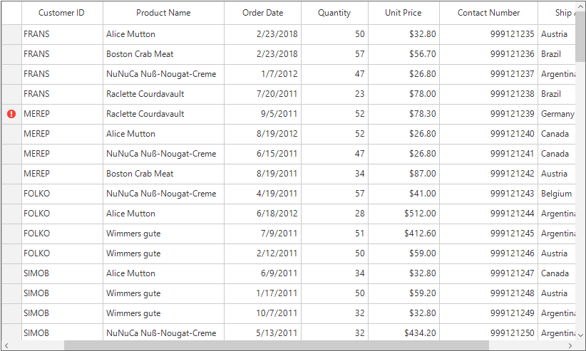
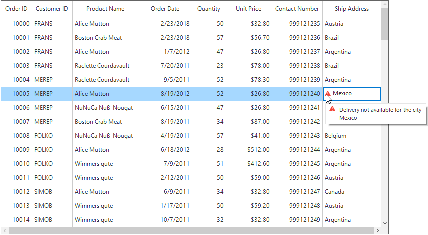
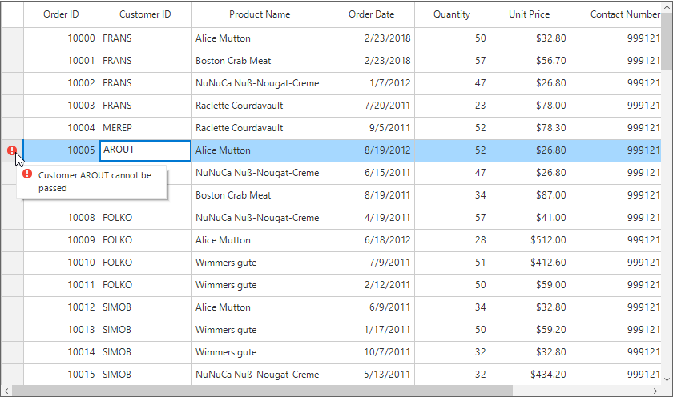

# Data Validation
SfDataGrid allows to validate the data and display hints in case of validation is not passed. In case of invalid data, error icon is displayed at the left corner of cell. When mouse hover the error icon, error information will be displayed in tooltip.

## Built-in Validations
Built-in validations through[IDataErrorInfo](https://msdn.microsoft.com/en-us/library/system.componentmodel.idataerrorinfo.aspx), [INotifyDataErrorInfo](https://msdn.microsoft.com/en-us/library/system.componentmodel.inotifydataerrorinfo.aspx) and Data annotation attributes, can be enabled by setting [SfDataGrid.GridValidationMode](https://help.syncfusion.com/cr/cref_files/windowsforms/sfdatagrid/Syncfusion.SfDataGrid.WinForms~Syncfusion.WinForms.DataGrid.SfDataGrid~ValidationMode.html) or [GridColumn.GridValidationMod](https://help.syncfusion.com/cr/cref_files/windowsforms/sfdatagrid/Syncfusion.SfDataGrid.WinForms~Syncfusion.WinForms.DataGrid.GridColumnBase~ValidationMode.html)e properties.
`GridColumn.GridValidationMode` takes priority than `SfDataGrid.GridValidationMode`.

* `GridValidation.InEdit` - display error icon & tips and also doesn’t allows the users to commit the invalid data without allowing users to edit other cells.
* `GridValidation.InView` - displays error icons and tips alone.
* `GridValidation.None` - disables built-in validation support.

### Using IDataErrorInfo

#### Cell Validation
SfDataGrid provides support to validate the data based on [IDataErrorInfo](https://msdn.microsoft.com/en-us/library/system.componentmodel.idataerrorinfo.aspx# ""). This can be enabled by setting the [SfDataGrid.ValidationMode](https://help.syncfusion.com/cr/cref_files/wpf/sfdatagrid/Syncfusion.SfGrid.WPF~Syncfusion.UI.Xaml.Grid.SfGridBase~GridValidationMode.html) or [GridColumn.ValidationMode](https://help.syncfusion.com/cr/cref_files/wpf/sfdatagrid/Syncfusion.SfGrid.WPF~Syncfusion.UI.Xaml.Grid.GridColumnBase~GridValidationMode.html) property to `InEdit` or `InView`.



public partial class OrderInfo : IDataErrorInfo
{
    /// 

    /// Initializes a new instance of the <see cref="OrderInfo"/> class.
    /// 

    public OrderInfo()
    { }

    /// 

    /// Gets or sets quantity
    /// 

    /// <value>the quantity</value>     
    public int Quantity {get; set;}

    public string Error
    {
        get { return string.Empty; }
    }

    public string this[string columnName]
    {
        get
        {
            if (columnName == "Quantity" && this.Quantity < 30)
                return "The quantity is less than minimum";

            return string.Empty;
        }
    }
}



Enable the validation for the SfDataGrid,



// Set the validation mode for the grid.
this.sfDataGrid.ValidationMode = GridValidationMode.InEdit;

//Or

// Set the validation mode only for the particular column.
this.sfDataGrid.Columns["Quantity"].ValidationMode = GridValidationMode.InEdit;



#### Row Validation
The error icon can be displayed in the row header by using the [IDataErrorInfo.Error](https://msdn.microsoft.com/en-us/library/system.componentmodel.idataerrorinfo.error.aspx) property. The `IDataErrorInfo.Error` text will be displayed in the error tool tip of the row header,



public partial class OrderInfo : IDataErrorInfo
{
    /// 

    /// Initializes a new instance of the <see cref="OrderInfo"/> class.
    /// 

    public OrderInfo()
    { }

          [Display(AutoGenerateField = false)]
          public string Error
          {
                  get
                  { 
                           if (this.Country.Contains("Germany") || this.Country.Contains("UK"))
                                    return "Delivery not available for the country " + this.Country;
                           return string.Empty;
                   }
           }

    public string this[string columnName]
    {
        get
        {
            return string.Empty;
        }
    }
}



### Using INotifyDataErrorInfo

#### Cell Validation
The data can be validated by inheriting the [INotifyDataErrorInfo](https://msdn.microsoft.com/en-us/library/system.componentmodel.inotifydataerrorinfo.aspx# "") interface in model class.



public class OrderInfo : INotifyDataErrorInfo
{
    private List<string> errors = new List<string>();    

    private string shipCountry;

    [Display(Name = "Ship Address")]
    public string ShipCountry
    {
        get { return shipCountry; }
        set { shipCountry = value; }
    }

    public System.Collections.IEnumerable GetErrors(string propertyName)
    {
        if (!propertyName.Equals("ShipCountry "))
            return null;

        if (this.ShipCity.Contains("Mexico"))
            errors.Add("Delivery not available for the city " + ShipCountry);

        return errors;
    }

    [Display(AutoGenerateField = false)]
    public bool HasErrors
    {
        get
        {
            return false;
        }
    }

    public event EventHandler<DataErrorsChangedEventArgs> ErrorsChanged;
}



#### Row Validation
The error message can be shown in a row header by setting [INotifyDataErrorInfo.HasErrors](https://msdn.microsoft.com/en-us/library/system.componentmodel.inotifydataerrorinfo.haserrors.aspx). By default error message “Row Containing Error” will be displayed as an error message. This can be modified by changing the `RowErrorMessage` in the resx file.



public class OrderInfo : INotifyDataErrorInfo
{
    private List&lt;string&gt; errors = new List&lt;string&gt;();    
    private string shipCountry;
    [Display(Name = "Ship Address")]
    public string ShipCountry
    {
        get { return shipCountry; }
        set { shipCountry = value; }
    }
    public System.Collections.IEnumerable GetErrors(string propertyName)
    {
        return null;
    }
    [Display(AutoGenerateField = false)]
    public bool HasErrors
    {
        get
        {
           if (this.ShipCountry.Contains("Mexico"))
               return true;
            return false;
        }
    }
    public event EventHandler&lt;DataErrorsChangedEventArgs&gt; ErrorsChanged;
}



N> The `INotifyDataErrorInfo` is available from the .net framework 4.5.

### Using Data Annotation
The SfDataGrid allows to validate the data using data annotation attributes by setting `SfDataGrid.ValidationMode` or `GridColumn.ValidationMode` property to `InEdit` or `InView`.

#### Numeric Validation
The numeric type like int, double, decimal properties can be validated using [Range attributes](https://msdn.microsoft.com/en-us/library/system.componentmodel.dataannotations.rangeattribute.aspx).



private int orderID;
[Range(10001, 10005, ErrorMessage = "OrderID between 10001 and 10005 alone processed")]        
public int OrderID
{
    get { return orderID; }
    set { orderID = value; }
}

private decimal price;
[Range(typeof(decimal),"12","20")]
public decimal Price
{
    get { return price; }
    set { price = value; }
}



#### String Validation
The string type property can be validated using [Required](https://msdn.microsoft.com/en-us/library/system.componentmodel.dataannotations.requiredattribute.aspx), [String Length attributes](https://msdn.microsoft.com/en-us/library/system.componentmodel.dataannotations.stringlengthattribute.aspx)



private string shippingCity;
[Required]
public string ShipCity
{
    get { return shippingCity; }
    set { shippingCity = value; }
}

private string productName;
[StringLength(17)]
public string ProductName
{
    get { return productName; }
    set { productName = value; }
}



#### RegularExpression validation
The data that has heterogeneous type (combination of number, special character) can be validated using RegularExpressions.



[RegularExpressionAttribute(@"^[a-zA-Z]{1,40}$", ErrorMessage = "Numbers and special characters not allowed")]
public string CustomerID
{
    get
    {
        return this.customerID;
    }
    set
    {
        this.customerID = value;
    }
}



## Custom Validations
The current cell and row validations can be customized by using the [CurrentCellValidating](https://help.syncfusion.com/cr/cref_files/windowsforms/sfdatagrid/Syncfusion.SfDataGrid.WinForms~Syncfusion.WinForms.DataGrid.SfDataGrid~CurrentCellValidating_EV.html) and [RowValidating](https://help.syncfusion.com/cr/cref_files/windowsforms/sfdatagrid/Syncfusion.SfDataGrid.WinForms~Syncfusion.WinForms.DataGrid.SfDataGrid~RowValidating_EV.html) events. SfDataGrid will not allow to edit other cell / row if validation failed.

### Cell Validation
The cell validation can be customized by using the `CurrentCellValidating` event. This event will be raised when the edited cells tries to commit the data or lose the focus.



this.sfDataGrid.CurrentCellValidating += sfDataGrid_CurrentCellValidating;
void sfDataGrid_CurrentCellValidating(object sender, CurrentCellValidatingEventArgs e)
{
    if (e.NewValue.ToString().Equals("10004"))
    {
        e.IsValid = false;
        e.ErrorMessage = "OrderID 10004 cannot be passed";
    }
}



The current cell will not end the editing until the CurrentCell validation is passed. To get pass the cell validation need to enter the valid input to the cell. 
The [SfDataGrid.CurrentCellValidated](https://help.syncfusion.com/cr/cref_files/windowsforms/sfdatagrid/Syncfusion.SfDataGrid.WinForms~Syncfusion.WinForms.DataGrid.SfDataGrid~CurrentCellValidated_EV.html) event triggered when the cell has finished validating with valid data.



this.sfDataGrid.CurrentCellValidated += sfDataGrid_CurrentCellValidated;

void sfDataGrid_CurrentCellValidated(object sender, CurrentCellValidatedEventArgs e)
{
    MessageBox.Show("Cell validation is passed.");
}



### Row Validation
The row can be validated by using the [RowValidating](https://help.syncfusion.com/cr/cref_files/windowsforms/sfdatagrid/Syncfusion.SfDataGrid.WinForms~Syncfusion.WinForms.DataGrid.SfDataGrid~RowValidating_EV.html) event when the cell is edited. This event occurs when the edited cells tries to commit the row data or lose the focus.



this.sfDataGrid.RowValidating += sfDataGrid_RowValidating;
void sfDataGrid_RowValidating(object sender, RowValidatingEventArgs e)
{
    var data = e.DataRow.RowData as OrderInfo;

    if (data.CustomerID.Equals("AROUT"))
    {
        e.IsValid = false;
        e.ErrorMessage ="Customer AROUT cannot be passed";
    }
}



[SfDataGrid.RowValidated](https://help.syncfusion.com/cr/cref_files/windowsforms/sfdatagrid/Syncfusion.SfDataGrid.WinForms~Syncfusion.WinForms.DataGrid.SfDataGrid~RowValidated_EV.html) event triggered when the row has finished validating with valid row data.



this.sfDataGrid1.RowValidated += sfDataGrid1_RowValidated;
void sfDataGrid1_RowValidated(object sender, RowValidatedEventArgs e)
{
    MessageBox.Show("Row validation is completed");
}



## Customization Using Events

### Error Icon Customization
The custom error icon can be set by using the [ErrorIcon](https://help.syncfusion.com/cr/cref_files/windowsforms/sfdatagrid/Syncfusion.SfDataGrid.WinForms~Syncfusion.WinForms.DataGrid.Styles.DataGridStyle~ErrorIcon.html) property.



//Setting the custom error icon
this.sfDataGrid.Style.ErrorIcon = SystemIcons.Error.ToBitmap();



The error icons displayed in the cell and row header can be disabled by setting the [ShowErrorIcon](https://help.syncfusion.com/cr/cref_files/windowsforms/sfdatagrid/Syncfusion.SfDataGrid.WinForms~Syncfusion.WinForms.DataGrid.SfDataGrid~ShowErrorIcon.html) and [ShowRowHeaderErrorIcon](https://help.syncfusion.com/cr/cref_files/windowsforms/sfdatagrid/Syncfusion.SfDataGrid.WinForms~Syncfusion.WinForms.DataGrid.SfDataGrid~ShowRowHeaderErrorIcon.html) properties to `false`. 



// Disable the Error Icon in Cell level
this.sfDataGrid.ShowErrorIcon = false;

// Disables the error icon in row header
this.sfDataGrid.ShowRowHeaderErrorIcon = false;



### Customizing the Error Tip 
The tool tip of the data validation can be customized by using the [ValidationErrorToolTipOpening](https://help.syncfusion.com/cr/cref_files/windowsforms/sfdatagrid/Syncfusion.SfDataGrid.WinForms~Syncfusion.WinForms.DataGrid.SfDataGrid~ValidationErrorToolTipOpening_EV.html) event. This event will be raised when the mouse is hovered on the error icon.



this.sfDataGrid.ValidationErrorToolTipOpening += sfDataGrid_ValidationErrorToolTipOpening;

void sfDataGrid_ValidationErrorToolTipOpening(object sender, ValidationErrorToolTipOpeningEventArgs e)
{
    if(e.Column != null && e.Column.MappingName == "OrderID")
    {              
        e.ToolTipInfo.Items[0].Style.BackColor = Color.Green;
        e.ToolTipInfo.Items[0].Style.ForeColor = Color.White;                
    }
}



The validation error tool tip can be disabled by setting the [ShowValidationErrorToolTip](https://help.syncfusion.com/cr/cref_files/windowsforms/sfdatagrid/Syncfusion.SfDataGrid.WinForms~Syncfusion.WinForms.DataGrid.SfDataGrid~ShowValidationErrorToolTip.html) property to `false`.



// Disable the validation tool tip.
this.sfDataGrid.ShowValidationErrorToolTip = false;



## Limitations
* Non editable columns will not support custom validation.
* CurrentCellValidating event will not triggered for the GridUnboundColumn, AddNewRow and FilterRow.
