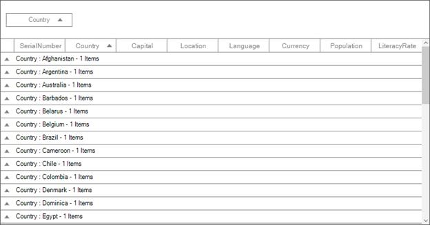
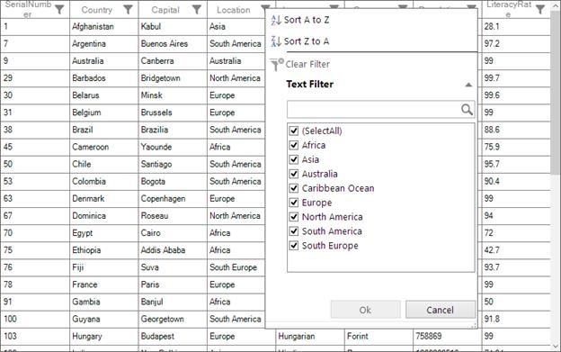
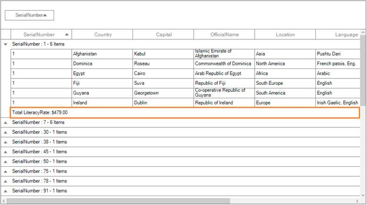
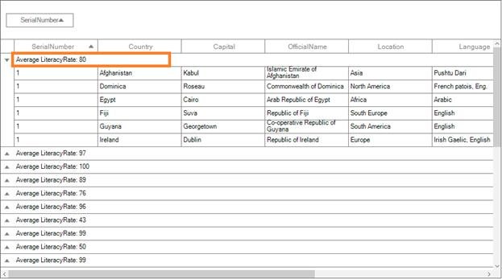

# Getting Started

## Assembly deployment

The following list of assemblies needs to be added as reference to use SfDataGrid control in any application,

<table>
<tr>
<td>
{{'**Required assemblies**'| markdownify }}
</td>
<td>
{{'**Description**'| markdownify }}
</td>
</tr>
<tr>
<td>
Syncfusion.Core.WinForms
</td>
<td>
Syncfusion.Core.WinForms assembly contains the theme related classes for the Syncfusion controls and basic components like SfScrollFrame, SfButton, SfForm, SfToolTip, SfScrollControl and SfSkinManager.
</td>
</tr>
<tr>
<td>
Syncfusion.GridCommon.WinForms
</td>
<td>
Syncfusion.GridCommon.WinForms assembly contains the base classes for Scrolling, FilterControl and Utilities.
</td>
</tr>
<tr>
<td>
Syncfusion.Data.WinForms
</td>
<td>
Syncfusion.Data.WinForms assembly contains fundamental and base classes for `CollectionViewAdv` which is responsible for data processing operations handled in SfDataGrid.
</td>
</tr>
<tr>
<td>
Syncfusion.DataGrid.WinForms
</td>
<td>
Syncfusion.DataGrid.WinForms assembly contains classes that handles all UI operations of SfDataGrid. SfDataGrid control present {{'**Syncfusion.WinForms.DataGrid** '| markdownify }}namespace.
</td>
</tr>
</table>

## Creating simple application with SfDataGrid
In this walk through, you will create WinForms application that contains SfDataGrid control.

### Creating the project
Create new **Windows Forms** Project in **Visual Studio** to display SfDataGrid with data objects.

### Adding control via Designer
SfDataGrid control can be added to the application by dragging it from Toolbox and dropping it in Designer. The required assembly references will be added automatically.

### Adding control manually
In order to add control manually, do the below steps,

1. Add the below required assembly references to the project,
   * Syncfusion.Core.WinForms
   * Syncfusion.GridCommon.WinForms
   * Syncfusion.Data.WinForms
   * Syncfusion.DataGrid.WinForms
2. Import SfDataGrid namespace **Syncfusion.WinForms.DataGrid**
3. Create SfDataGrid instance and add it to the Form.



using Syncfusion.WinForms.DataGrid;
namespace WFApplication1
{
    public class Form1 : Form
    {
        public Form1()
        {
            InitializeComponent();
            SfDataGrid dataGrid = new SfDataGrid();
            this.Controls.Add(dataGrid);
        }
    }
}



### Binding to Data
To bind the SfDataGrid to data, set the [SfDataGrid.DataSource](http://172.16.0.145:8093/Syncfusion.DataGrid.WinForms/api/Syncfusion.WinForms.DataGrid.SfDataGrid.html#Syncfusion_WinForms_DataGrid_SfDataGrid_DataSource) property to an IEnumerable implementation. Each row in SfDataGrid is bound to an object in data source and each column in SfDataGrid bound to a property in data object.



CountryInfoCollection data = new CountryInfoCollection();
this.sfDataGrid.DataSource = data.CountryDetails;


Now, run the application and you can expect the see the below output,

## Defining Columns
By default, the SfDataGrid control generates the columns automatically when value assigned to [SfDataGrid.DataSource](http://172.16.0.145:8093/Syncfusion.DataGrid.WinForms/api/Syncfusion.WinForms.DataGrid.SfDataGrid.html#Syncfusion_WinForms_DataGrid_SfDataGrid_DataSource) property. The type of the column generated depends on the type of data in the column and the attribute of the property the column bound with.

<table>
<tr>
<td>
{{'**Generated Column Type**'| markdownify }}
</td>
<td>
{{'**Data Type/Attribute**'| markdownify }}
</td>
</tr>
<tr>
<td>
GridTextColumn
</td>
<td>
Property of type String.
</td>
</tr>
</table>

When columns are auto-generated, you can handle the [SfDataGrid.AutoGeneratingColumn](http://172.16.0.145:8093/Syncfusion.DataGrid.WinForms/api/Syncfusion.WinForms.DataGrid.SfDataGrid.html#Syncfusion_WinForms_DataGrid_SfDataGrid_AutoGeneratingColumn) event to customize or cancel the columns before they are added to the SfDataGrid.
You can prevent the automatic column generation by setting [SfDataGrid.AutoGenerateColumns](http://172.16.0.145:8093/Syncfusion.DataGrid.WinForms/api/Syncfusion.WinForms.DataGrid.SfDataGrid.html#Syncfusion_WinForms_DataGrid_SfDataGrid_AutoGenerateColumns) property is false, you have to define the columns to be displayed as below,



sfDataGrid.AutoGenerateColumns = false;

CountryInfoCollection data = new CountryInfoCollection();
this.sfDataGrid.DataSource = data.CountryDetails;

this.sfDataGrid.Columns.Add(new GridTextColumn() { MappingName = "SerialNumber" });
this.sfDataGrid.Columns.Add(new GridTextColumn() { MappingName = "Country" });
this.sfDataGrid.Columns.Add(new GridTextColumn() { MappingName = "Capital" });
this.sfDataGrid.Columns.Add(new GridTextColumn() { MappingName = "Location" });



Below is the list of column types provided in SfDataGrid.

<table>
<tr>
<td>
{{'**Column Type**'| markdownify }}
</td>
<td>
{{'**Comments**'| markdownify }}
</td>
</tr>
<tr>
<td>
GridTextColumn
</td>
<td>
Represents SfDataGrid column that hosts textual content in its cells.
</td>
</tr>
</table>

## Selection
By default, the entire row is selected when a user clicks a cell in a SfDataGrid. You can set the [SfDataGrid.SelectionMode](http://172.16.0.145:8093/Syncfusion.DataGrid.WinForms/api/Syncfusion.WinForms.DataGrid.SfDataGrid.html#Syncfusion_WinForms_DataGrid_SfDataGrid_SelectionMode) property to specify whether a user can select single row or cell, or multiple rows or cells.



//Multiple items can be selected at the same time.
this.sfDataGrid.SelectionMode = GridSelectionMode.Multiple;



You can handle the selection operations with the help of [SfDataGrid.SelectionChanging](http://172.16.0.145:8093/Syncfusion.DataGrid.WinForms/api/Syncfusion.WinForms.DataGrid.SfDataGrid.html#Syncfusion_WinForms_DataGrid_SfDataGrid_SelectionChanging) and [SfDataGrid.SelectionChanged](http://172.16.0.145:8093/Syncfusion.DataGrid.WinForms/api/Syncfusion.WinForms.DataGrid.SfDataGrid.html#Syncfusion_WinForms_DataGrid_SfDataGrid_SelectionChanged) events of SfDataGrid.



//Event Triggering.
this.sfDataGrid.SelectionChanging += sfDataGrid_SelectionChanging;

//Event Handling.
void sfDataGrid_SelectionChanging(object sender, GridSelectionChangingEventArgs e)
{
    //To avoid the selection.
    e.Cancel = true;
}



## Sorting
By default, you can sort columns in a SfDataGrid by clicking the column header. You can configure the sorting by setting [SfDataGrid.SortColumnDescriptions](http://172.16.0.145:8093/Syncfusion.DataGrid.WinForms/api/Syncfusion.WinForms.DataGrid.SfDataGrid.html#Syncfusion_WinForms_DataGrid_SfDataGrid_SortColumnDescriptions) property as below,



CountryInfoCollection data = new CountryInfoCollection();
this.sfDataGrid.DataSource = data.CountryDetails;
this.sfDataGrid.SortColumnDescriptions.Add(new SortColumnDescription() { ColumnName = "SerialNumber" });



You can customize sorting by handling the [SfDataGrid.SortColumnsChanging](http://172.16.0.145:8093/Syncfusion.DataGrid.WinForms/api/Syncfusion.WinForms.DataGrid.SfDataGrid.html#Syncfusion_WinForms_DataGrid_SfDataGrid_SortColumnsChanging) and [SfDataGrid.SortColumnsChanged](http://172.16.0.145:8093/Syncfusion.DataGrid.WinForms/api/Syncfusion.WinForms.DataGrid.SfDataGrid.html#Syncfusion_WinForms_DataGrid_SfDataGrid_SortColumnsChanged) events. To cancel the default sort, set the `Cancel` property to `true` in ` SfDataGrid.SortColumnsChanging` event.



this.sfDataGrid.SortColumnsChanging += sfDataGrid_SortColumnsChanging;

void sfDataGrid_SortColumnsChanging(object sender, GridSortColumnsChangingEventArgs e)
{
    if (e.AddedItems[0].ColumnName == "SerialNumber")
        e.Cancel = true;
}



## Grouping
Grouping can be enabled by setting [SfDataGrid.ShowGroupDropArea](http://172.16.0.145:8093/Syncfusion.DataGrid.WinForms/api/Syncfusion.WinForms.DataGrid.SfDataGrid.html#Syncfusion_WinForms_DataGrid_SfDataGrid_ShowGroupDropArea) property, where you can group by dragging the column header and dropping it in the `GroupDropArea` over the column headers. You can configure the grouping by setting[SfDataGrid.GroupColumnDescriptions](http://172.16.0.145:8093/Syncfusion.DataGrid.WinForms/api/Syncfusion.WinForms.DataGrid.SfDataGrid.html#Syncfusion_WinForms_DataGrid_SfDataGrid_GroupColumnDescriptions) as below ,



CountryInfoCollection data = new CountryInfoCollection();
this.sfDataGrid.DataSource = data.CountryDetails;
this.sfDataGrid.ShowGroupDropArea = true;
this.sfDataGrid.GroupColumnDescriptions.Add(new GroupColumnDescription() { ColumnName = "Country" });



## Filtering
Filtering can be enabled by setting [SfDataGrid.AllowFiltering](http://172.16.0.145:8093/Syncfusion.DataGrid.WinForms/api/Syncfusion.WinForms.DataGrid.SfDataGrid.html#Syncfusion_WinForms_DataGrid_SfDataGrid_AllowFiltering) property `true` , where you can open advanced filter UI by clicking the Filter icon in column header and filter the SfDataGrid. You can customize the filtering operations by handling [SfDataGrid.FilterChanging](http://172.16.0.145:8093/Syncfusion.DataGrid.WinForms/api/Syncfusion.WinForms.DataGrid.SfDataGrid.html#Syncfusion_WinForms_DataGrid_SfDataGrid_FilterChanging) and [SfDataGrid.FilterChanged](http://172.16.0.145:8093/Syncfusion.DataGrid.WinForms/api/Syncfusion.WinForms.DataGrid.SfDataGrid.html#Syncfusion_WinForms_DataGrid_SfDataGrid_FilterChanged) events.

## Summaries
SfDataGrid provides support to display the concise information about the data objects using summaries. SfDataGrid provides below three different types of summary rows.

* **Table Summary** – Used to display summary information of table either at top or bottom of SfDataGrid.
* **Group Summary** – used to display summary information of data objects in each group.
* **Caption Summary** – used to display summary information in the caption of the group.

### TableSummary
Summary rows are represented by using [TableSummaryRows](http://172.16.0.145:8093/Syncfusion.DataGrid.WinForms/api/Syncfusion.WinForms.DataGrid.SfDataGrid.html#Syncfusion_WinForms_DataGrid_SfDataGrid_TableSummaryRows) and each `GridTableSummaryRow` hold summary information of columns in `SummaryColumns` property. The `SummaryColumns` contains the collection of [GridSummaryColumn](http://172.16.0.145:8093/Syncfusion.DataGrid.WinForms/api/Syncfusion.WinForms.DataGrid.GridSummaryColumn.html) which carries the name of column ,format and its summary aggregate type.



GridTableSummaryRow tableSummaryRow = new GridTableSummaryRow();
tableSummaryRow.Title = "Table_Summary : {SerialNumber}";
tableSummaryRow.Position = TableSummaryRowPosition.Top;
tableSummaryRow.ShowSummaryInRow = true;

ObservableCollection<ISummaryColumn> summaryColumns = new ObservableCollection<ISummaryColumn>();
GridSummaryColumn summaryColumn = new GridSummaryColumn();
summaryColumn.Name = "SerialNumber";
summaryColumn.MappingName = "SerialNumber";
summaryColumn.Format = "Count : {Count:d}";
summaryColumn.SummaryType = SummaryType.CountAggregate;

//Add the GridSummaryColumn to ObservableCollection
summaryColumns.Add(summaryColumn);

//Initialize the ObservableCollection to SummaryColumns collection.
tableSummaryRow.SummaryColumns = summaryColumns;

//Add the GridTableSummaryRow to TableSummaryRows collection.
this.sfDataGrid.TableSummaryRows.Add(tableSummaryRow);



### GroupSummary
Summary rows are represented by using [GroupSummaryRows](http://172.16.0.145:8093/Syncfusion.DataGrid.WinForms/api/Syncfusion.WinForms.DataGrid.SfDataGrid.html#Syncfusion_WinForms_DataGrid_SfDataGrid_GroupSummaryRows) and each [GridSummaryRow](http://172.16.0.145:8093/Syncfusion.DataGrid.WinForms/api/Syncfusion.WinForms.DataGrid.GridSummaryRow.html) hold summary information of columns in `SummaryColumns` property. The `SummaryColumns` contains the collection of [GridSummaryColumn](http://172.16.0.145:8093/Syncfusion.DataGrid.WinForms/api/Syncfusion.WinForms.DataGrid.GridSummaryColumn.html) which carries the name of column ,format and its summary aggregate type.



GridSummaryRow groupSummaryRow = new GridSummaryRow();
groupSummaryRow.Title = "Total LiteracyRate: {FirstColumn} ";
groupSummaryRow.ShowSummaryInRow = true;

ObservableCollection<ISummaryColumn> summaryColumns = new ObservableCollection<ISummaryColumn>();
GridSummaryColumn summaryColumn = new GridSummaryColumn();
summaryColumn.Name = "FirstColumn";
summaryColumn.MappingName = "LiteracyRate";
summaryColumn.Format = "{Sum:c}";
summaryColumn.SummaryType = SummaryType.Int32Aggregate;

//Add the GridSummaryColumn to ObservableCollection
summaryColumns.Add(summaryColumn);

//Initialize the ObservableCollection to SummaryColumns collection.
groupSummaryRow.SummaryColumns = summaryColumns;

this.sfDataGrid.GroupSummaryRows.Add(groupSummaryRow);



### CaptionSummary
Summary row is represented by using [CaptionSummaryRow](http://172.16.0.145:8093/Syncfusion.DataGrid.WinForms/api/Syncfusion.WinForms.DataGrid.SfDataGrid.html#Syncfusion_WinForms_DataGrid_SfDataGrid_CaptionSummaryRow) property and [GridSummaryRow](http://172.16.0.145:8093/Syncfusion.DataGrid.WinForms/api/Syncfusion.WinForms.DataGrid.GridSummaryRow.html) hold summary information of columns in `SummaryColumns` property. The `SummaryColumns` contains the collection of [GridSummaryColumn](http://172.16.0.145:8093/Syncfusion.DataGrid.WinForms/api/Syncfusion.WinForms.DataGrid.GridSummaryColumn.html) which carries the name of column ,format and its summary aggregate type.



GridSummaryRow captionSummaryRow = new GridSummaryRow();
captionSummaryRow.Title ="Average LiteracyRate: {FirstColumn}";
captionSummaryRow.ShowSummaryInRow = true;

ObservableCollection<ISummaryColumn> summaryColumnsCollection = new ObservableCollection<ISummaryColumn>();
GridSummaryColumn summaryColumn = new GridSummaryColumn();
summaryColumn.Name = "FirstColumn";
summaryColumn.MappingName = "LiteracyRate";
summaryColumn.Format = "{Average:d}";
summaryColumn.SummaryType = SummaryType.Int32Aggregate;

//Add the GridSummaryColumn to ObservableCollection
summaryColumnsCollection.Add(summaryColumn);

//Initialize the ObservableCollection to SummaryColumns collection.
captionSummaryRow.SummaryColumns = summaryColumnsCollection;

this.sfDataGrid.CaptionSummaryRow = captionSummaryRow;



