# Grouping
[SfDataGrid](http://172.16.0.145:8093/Syncfusion.DataGrid.WinForms/api/Syncfusion.WinForms.DataGrid.SfDataGrid.html) allows you to group the data against one or more columns. When grouping is applied, the data is organized into a hierarchical structure based on matching column values and it is sorted by ascending order.

## UI Grouping
You can allow end-user to group the data by setting [SfDataGrid.AllowGrouping](http://172.16.0.145:8093/Syncfusion.DataGrid.WinForms/api/Syncfusion.WinForms.DataGrid.SfDataGrid.html#Syncfusion_WinForms_DataGrid_SfDataGrid_AllowGrouping) property to `true`, where user can drag and drop the column into GroupDropArea to group based on that column.
When the column is grouped, records that have an identical value in the column are combined to form a group. The GroupDropArea can be enabled by setting the [SfDataGrid.ShowGroupDropArea](http://172.16.0.145:8093/Syncfusion.DataGrid.WinForms/api/Syncfusion.WinForms.DataGrid.SfDataGrid.html#Syncfusion_WinForms_DataGrid_SfDataGrid_ShowGroupDropArea) property to true.



this.sfDataGrid1.AllowGrouping = true;


You can enable or disable grouping on particular column by setting the [GridColumnBase.AllowGrouping](http://172.16.0.145:8093/Syncfusion.DataGrid.WinForms/api/Syncfusion.WinForms.DataGrid.GridColumnBase.html#Syncfusion_WinForms_DataGrid_GridColumnBase_AllowGrouping) property.


this.sfDataGrid1.Columns["OrderID"].AllowGrouping = true;
this.sfDataGrid1.Columns["CustomerID"].AllowGrouping = true;



N> GridColumn.AllowGrouping takes higher priority than SfDataGrid.AllowGrouping.

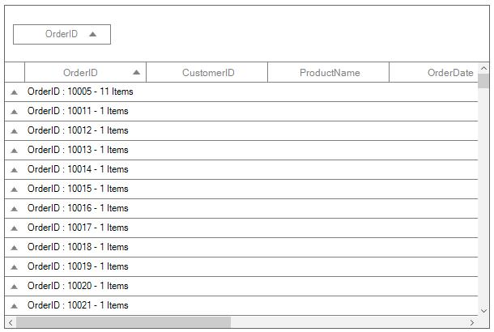

The data can be grouped by an unlimited number of columns. To group more than one columns, drag-and-drop the desired columns in to GroupDropArea.

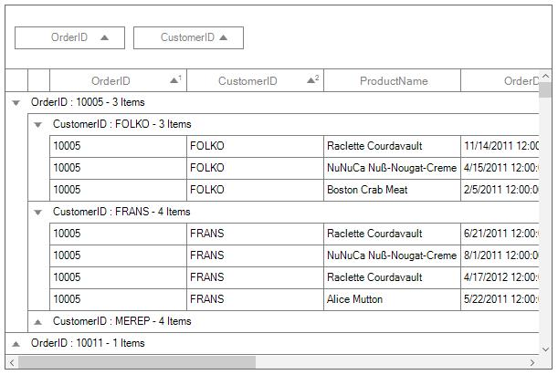

Each group is identified by its CaptionSummaryRows and it is used to organize the data into a hierarchical tree structure based on identical values of that column. The underlying records in each caption summary row can be expanded or collapsed by clicking its group caption.
Each [CaptionSummaryRow](http://172.16.0.145:8093/Syncfusion.DataGrid.WinForms/api/Syncfusion.WinForms.DataGrid.SfDataGrid.html#Syncfusion_WinForms_DataGrid_SfDataGrid_CaptionSummaryRow) carries information about a particular group like group name, number of items (records) in the group, etc. You can refer Caption Summaries section, for more information about `CaptionSummaryRow`.

## Adding groups

### Through designer
At design time, data can be grouped by accessing [GroupColumnDescriptions](http://172.16.0.145:8093/Syncfusion.DataGrid.WinForms/api/Syncfusion.WinForms.DataGrid.GroupColumnDescriptions.html) property of `SfDataGrid`. This will open [GroupColumnDescription](http://172.16.0.145:8093/Syncfusion.DataGrid.WinForms/api/Syncfusion.WinForms.DataGrid.GroupColumnDescription.html) collection editor. 
In that editor, clicking the Add button will add new `GroupColumnDescription` into the collection. The [ColumnName](http://172.16.0.145:8093/Syncfusion.DataGrid.WinForms/api/Syncfusion.WinForms.DataGrid.GroupColumnDescription.html#Syncfusion_WinForms_DataGrid_GroupColumnDescription_ColumnName) property of the `GroupColumnDescription` will allow user to specify the desired column to group.

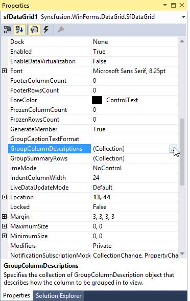

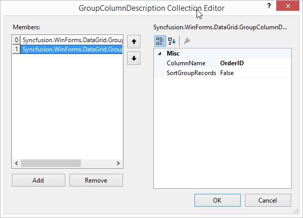

**Designer generated code**



GroupColumnDescription groupColumnDescription1 = new GroupColumnDescription();
GroupColumnDescription groupColumnDescription2 = new GroupColumnDescription();

groupColumnDescription1.ColumnName = "ProductName";
groupColumnDescription2.ColumnName = "OrderID";
this.sfDataGrid1.GroupColumnDescriptions.Add(groupColumnDescription1);
this.sfDataGrid1.GroupColumnDescriptions.Add(groupColumnDescription2);



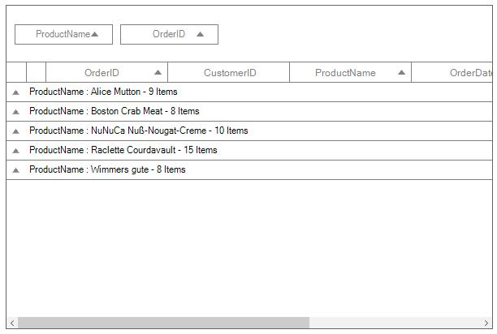

### Through code
`SfDataGrid` allows you to group the data programmatically by adding[GroupColumnDescription](http://172.16.0.145:8093/Syncfusion.DataGrid.WinForms/api/Syncfusion.WinForms.DataGrid.GroupColumnDescription.html) to [SfDataGrid.GroupColumnDescriptions](http://172.16.0.145:8093/Syncfusion.DataGrid.WinForms/api/Syncfusion.WinForms.DataGrid.SfDataGrid.html#Syncfusion_WinForms_DataGrid_SfDataGrid_GroupColumnDescriptions) collection.
If you want to group the OrderID column programmatically, define its [MappingName](http://172.16.0.145:8093/Syncfusion.DataGrid.WinForms/api/Syncfusion.WinForms.DataGrid.GridColumnBase.html#Syncfusion_WinForms_DataGrid_GridColumnBase_MappingName) to [ColumnName](http://172.16.0.145:8093/Syncfusion.DataGrid.WinForms/api/Syncfusion.WinForms.DataGrid.GroupColumnDescription.html#Syncfusion_WinForms_DataGrid_GroupColumnDescription_ColumnName) property of `GroupColumnDescription`. Then add the `GroupColumnDescription` to the `SfDataGrid.GroupColumnDescriptions` collection.



this.sfDataGrid1.GroupColumnDescriptions.Add(new GroupColumnDescription() { ColumnName = "OrderID" });



## Removing groups
The groups can be removed by removing `GroupColumnDescription` from `SfDataGrid.GroupColumnDescriptions` collection or by specifying the index using the `RemoveAt` method.



this.sfDataGrid1.GroupColumnDescriptions.Remove(new GroupColumnDescription() { ColumnName = "OrderID" });
// OR
this.sfDataGrid1.GroupColumnDescriptions.RemoveAt(1);



To ungroup the column in UI, click the close button on column header or drag the column header from the GroupDropArea and drop it on the header row.

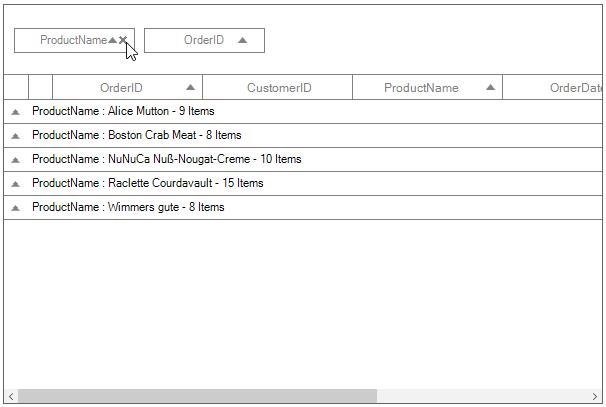

## Clearing groups
All the groups of the `SfDataGrid` can be removed by using `Clear` method.



this.sfDataGrid1.GroupColumnDescriptions.Clear();



## Disable grouping
The grouping of whole grid can be disabled by [SfDataGrid.AllowGrouping](http://172.16.0.145:8093/Syncfusion.DataGrid.WinForms/api/Syncfusion.WinForms.DataGrid.SfDataGrid.html#Syncfusion_WinForms_DataGrid_SfDataGrid_AllowGrouping) property and the grouping of the particular column can be disabled by [GridColumnBase.AllowGrouping](http://172.16.0.145:8093/Syncfusion.DataGrid.WinForms/api/Syncfusion.WinForms.DataGrid.GridColumnBase.html#Syncfusion_WinForms_DataGrid_GridColumnBase_AllowGrouping) property.



this.sfDataGrid1.AllowGrouping = false;
// Or
this.sfDataGrid1.Columns["OrderID"].AllowGrouping = false;
this.sfDataGrid1.Columns["CustomerID"].AllowGrouping = false;



N> GridColumn.AllowGrouping takes higher priority than SfDataGrid.AllowGrouping.

## Formatting built-in group caption
The group caption text can be formatted using the [SfDataGrid.GroupCaptionTextFormat](http://172.16.0.145:8093/Syncfusion.DataGrid.WinForms/api/Syncfusion.WinForms.DataGrid.SfDataGrid.html#Syncfusion_WinForms_DataGrid_SfDataGrid_GroupCaptionTextFormat) property.
The default group caption format is `{ColumnName}: {Key} - {ItemsCount} Items`.

* ColumnName - Displays the name of the column currently grouped.
* Key - Displays the key value of group.
* ItemsCount - Displays the number of items in group.

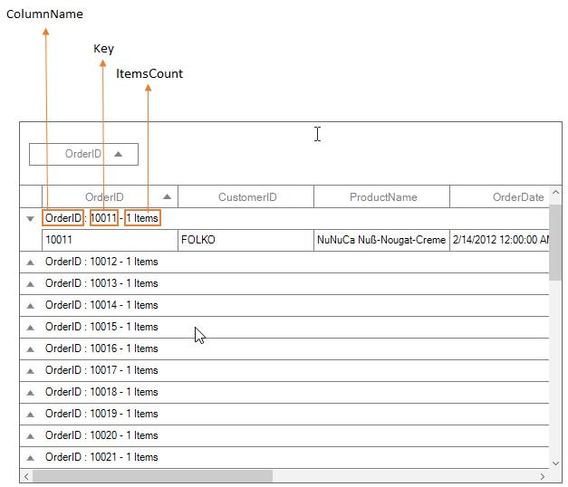

You can change group caption format to Key and ItemsCount alone by setting `GroupCaptionTextFormat` as below,



this.sfDataGrid1.GroupCaptionTextFormat = "{Key} : {ItemsCount}";



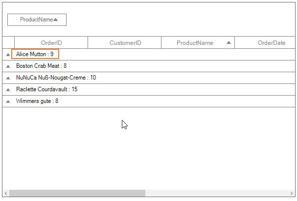

## Expanding or collapsing the groups
By default, you can view the records in each group by expanding its group caption. You can allow end-user to expand or collapse the groups programmatically at runtime.

### Expand groups while grouping
You can expand all the groups while grouping by setting [SfDataGrid.View.AutoExpandGroups](http://172.16.0.145:8099/Syncfusion.Data.WinForms_2015/api/Syncfusion.Data.CollectionViewAdv.html#Syncfusion_Data_CollectionViewAdv_AutoExpandGroups) to `true`. So, when user group any column, all groups will be in expanded state.



this.sfDataGrid1.View.AutoExpandGroups = true;



### Programmatically expanding or collapsing the groups

#### Expand or collapse all the groups
You can expand or collapse all the groups at programmatically at runtime by using [SfDataGrid.ExpandAllGroup](http://172.16.0.145:8093/Syncfusion.DataGrid.WinForms/api/Syncfusion.WinForms.DataGrid.SfDataGrid.html#Syncfusion_WinForms_DataGrid_SfDataGrid_ExpandAllGroup) and [SfDataGrid.CollapseAllGroup](http://172.16.0.145:8093/Syncfusion.DataGrid.WinForms/api/Syncfusion.WinForms.DataGrid.SfDataGrid.html#Syncfusion_WinForms_DataGrid_SfDataGrid_CollapseAllGroup) methods.



this.sfDataGrid1.ExpandAllGroup();
this.sfDataGrid1.CollapseAllGroup();



#### Expand or collapse the group based on its level
You can expand or collapse the group based on its level by using [SfDataGrid.ExpandGroupsAtLevel](http://172.16.0.145:8093/Syncfusion.DataGrid.WinForms/api/Syncfusion.WinForms.DataGrid.SfDataGrid.html#Syncfusion_WinForms_DataGrid_SfDataGrid_ExpandGroupsAtLevel_System_Int32_) and [SfDataGrid.CollapseGroupsAtLevel](http://172.16.0.145:8093/Syncfusion.DataGrid.WinForms/api/Syncfusion.WinForms.DataGrid.SfDataGrid.html#Syncfusion_WinForms_DataGrid_SfDataGrid_CollapseGroupsAtLevel_System_Int32_) methods.



this.sfDataGrid1.ExpandGroupsAtLevel(2);
this.sfDataGrid1.CollapseGroupsAtLevel(2);



#### Expand or collapse the specific group
You can expand or collapse specific group by using [SfDataGrid.ExpandGroup](http://172.16.0.145:8093/Syncfusion.DataGrid.WinForms/api/Syncfusion.WinForms.DataGrid.SfDataGrid.html#Syncfusion_WinForms_DataGrid_SfDataGrid_ExpandGroup_Group_) and [SfDataGrid.CollapseGroup](http://172.16.0.145:8093/Syncfusion.DataGrid.WinForms/api/Syncfusion.WinForms.DataGrid.SfDataGrid.html#Syncfusion_WinForms_DataGrid_SfDataGrid_CollapseGroup_Group_) methods.



this.sfDataGrid1.ExpandGroup(this.sfDataGrid1.View.TopLevelGroup);

this.sfDataGrid1.CollapseGroup(this.sfDataGrid1.View.TopLevelGroup);



## Changing the indent column width
You can customize the width of IndentColumn in `SfDataGrid` by using [IndentColumnWidth](http://172.16.0.145:8093/Syncfusion.DataGrid.WinForms/api/Syncfusion.WinForms.DataGrid.SfDataGrid.html#Syncfusion_WinForms_DataGrid_SfDataGrid_IndentColumnWidth) property as like below.



this.sfDataGrid1.IndentColumnWidth = 100;



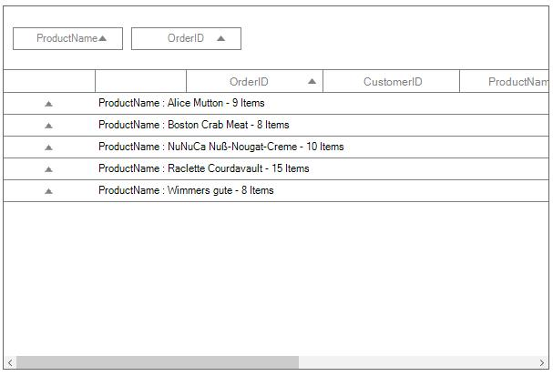

## GroupDropArea customization

### Customizing GroupDropArea text
You can change the GroupDropArea’ s text can by setting [SfDataGrid.GroupPanel.GroupDropAreaText](http://172.16.0.145:8093/Syncfusion.DataGrid.WinForms/api/Syncfusion.WinForms.DataGrid.GroupPanel.html#Syncfusion_WinForms_DataGrid_GroupPanel_GroupDropAreaText) property.



this.sfDataGrid1.GroupPanel.GroupDropAreaText = "Drag columns here";



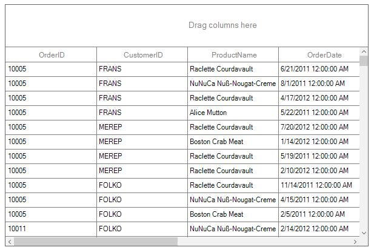

### Customizing GroupDropArea Height
`SfDataGrid` allows you to customize the appearance and height of GroupDropArea.
The height of the GroupDropArea can be customized by `GroupPanel.Height` property.



this.sfDataGrid1.GroupPanel.Height = 100;



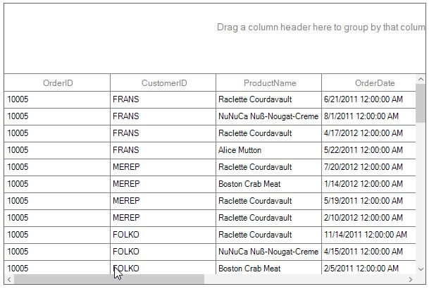

### Customizing GroupDropArea Appearance
The appearance of the GroupDropArea can be customized using the [GroupDropAreaStyle](http://172.16.0.145:8093/Syncfusion.DataGrid.WinForms/api/Syncfusion.WinForms.DataGrid.Styles.GridStyle.html#Syncfusion_WinForms_DataGrid_Styles_GridStyle_GroupDropAreaStyle) property.  The[GroupDropAreaStyleInfo](http://172.16.0.145:8093/Syncfusion.DataGrid.WinForms/api/Syncfusion.WinForms.DataGrid.GroupDropAreaStyleInfo.html) contains all the settings that are needed for the GroupDropArea appearance customization.



this.sfDataGrid1.Style.GroupDropAreaStyle.BackColor = Color.LightSkyBlue;
this.sfDataGrid1.Style.GroupDropAreaStyle.TextColor = Color.Black;



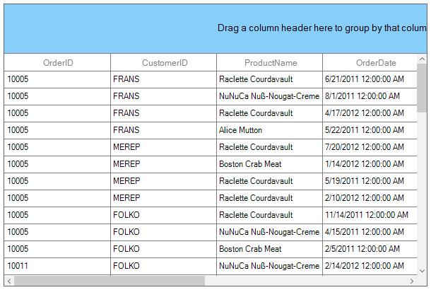

### Customizing GroupDropAreaItem Appearance
The appearance of the grouped items in the GroupDropArea can be customized using the [GroupDropAreaItemStyle](http://172.16.0.145:8093/Syncfusion.DataGrid.WinForms/api/Syncfusion.WinForms.DataGrid.Styles.GridStyle.html#Syncfusion_WinForms_DataGrid_Styles_GridStyle_GroupDropAreaItemStyle) property. The[GroupDropAreaItemStyleInfo](http://172.16.0.145:8093/Syncfusion.DataGrid.WinForms/api/Syncfusion.WinForms.DataGrid.GroupDropAreaItemStyleInfo.html) contains all the settings that are needed for the grouped items appearance customization.



this.sfDataGrid1.Style.GroupDropAreaItemStyle.TextColor = Color.Red;
this.sfDataGrid1.Style.GroupDropAreaItemStyle.BackColor = Color.Orange;



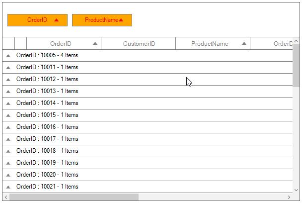

## Custom grouping
`SfDataGrid` allows you to group the data based on custom logic when the built-in grouping functionality doesn’t meet your requirement.
To perform custom grouping on a particular column, specify the custom logic through [GroupColumnDescription.KeySelector](http://172.16.0.145:8093/Syncfusion.DataGrid.WinForms/api/Syncfusion.WinForms.DataGrid.GroupColumnDescription.html#Syncfusion_WinForms_DataGrid_GroupColumnDescription_KeySelector) property and the column name to [GroupColumnDescription.ColumnName](http://172.16.0.145:8093/Syncfusion.DataGrid.WinForms/api/Syncfusion.WinForms.DataGrid.GroupColumnDescription.html#Syncfusion_WinForms_DataGrid_GroupColumnDescription_ColumnName) property.
For an example, the Date column is grouped based on the week basis in the following example.



//Apply the CustomGrouping for Date Column by using KeySelector.
this.sfDataGrid.GroupColumnDescriptions.Add(new GroupColumnDescription()
{
    ColumnName = "Date",
    KeySelector = (string ColumnName, object o) =>
        {
            var dt = DateTime.Now;
            var item = (o as SalesByDate).Date;
            var days = (int)Math.Floor((dt - item).TotalDays);
            var dayOfWeek = (int)dt.DayOfWeek;
            var difference = days - dayofWeek;
            if (days <= dayofweek)
            {
                if (days == 0)
                    return "TODAY";
                if (days == 1)
                    return "YESTERDAY";
                return item.Date.DayOfWeek.ToString().ToUpper();
            }
            if (difference > 0 && difference <= 7)
                return "LAST WEEK";
            if (difference > 7 && difference <= 14)
                return "TWO WEEKS AGO";
            if (difference > 14 && difference <= 21)
                return "THREE WEEKS AGO";
            if (dt.Year == item.Date.Year && dt.Month == item.Date.Month)
                return "EARLIER THIS MONTH";
            if (DateTime.Now.AddMonths(-1).Month == item.Date.Month)
                return "LAST MONTH";
            return "OLDER";
        }
       
});



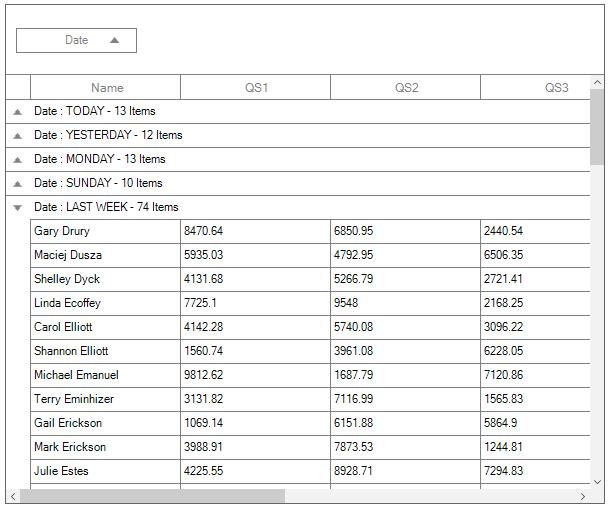

### Sorting inner records
In custom grouping, you can sort all the inner records of each group by setting [GroupColumnDescription.SortGroupRecords](http://172.16.0.145:8093/Syncfusion.DataGrid.WinForms/api/Syncfusion.WinForms.DataGrid.GroupColumnDescription.html#Syncfusion_WinForms_DataGrid_GroupColumnDescription_SortGroupRecords) sorted based on the column name described in `GroupColumnDescription`.



this.sfDataGrid.GroupColumnDescriptions.Add(new GroupColumnDescription()
{
    ColumnName = "Date",
    SortGroupRecords = true,
    KeySelector = (string ColumnName, object o) =>
        {
            var dt = DateTime.Now;
            var item = (o as SalesByDate).Date;
            var days = (int)Math.Floor((dt - item).TotalDays);
            var dayOfWeek = (int)dt.DayOfWeek;
            var difference = days - dayOfWeek;
            if (days <= dayOfWeek)
            {
                if (days == 0)
                    return "TODAY";
                if (days == 1)
                    return "YESTERDAY";
                return item.Date.DayOfWeek.ToString().ToUpper();
            }
            if (difference > 0 && difference <= 7)
                return "LAST WEEK";
            if (difference > 7 && difference <= 14)
                return "TWO WEEKS AGO";
            if (difference > 14 && difference <= 21)
                return "THREE WEEKS AGO";
            if (dt.Year == item.Date.Year && dt.Month == item.Date.Month)
                return "EARLIER THIS MONTH";
            if (DateTime.Now.AddMonths(-1).Month == item.Date.Month)
                return "LAST MONTH";
            return "OLDER";
        }

});



You can download sample from below location,
**Sample** - [Custom Grouping](http://www.syncfusion.com/downloads/support/directtrac/general/ze/Custom_Grouping1607904910)

## Cancel expanding of groups
The expanding of the groups can be canceled by setting `Cancel` property of the [GroupChangingEventArgs](http://172.16.0.145:8093/Syncfusion.DataGrid.WinForms/api/Syncfusion.WinForms.DataGrid.GroupChangingEventArgs.html) to `true` in the [GroupExpanding](http://172.16.0.145:8093/Syncfusion.DataGrid.WinForms/api/Syncfusion.WinForms.DataGrid.SfDataGrid.html#Syncfusion_WinForms_DataGrid_SfDataGrid_GroupExpanding) event.



this.sfDataGrid1.GroupExpanding += SfDataGrid1_GroupExpanding;

private void SfDataGrid1_GroupExpanding(object sender, GroupChangingEventArgs e)
{
    if (e.Group.Key.Equals(1001))
        e.Cancel = true;
}



## Cancel collapsing of groups
The collapsing of the groups can be canceled by setting the `Cancel` property of the [GroupChangingEventArgs](http://172.16.0.145:8093/Syncfusion.DataGrid.WinForms/api/Syncfusion.WinForms.DataGrid.GroupChangingEventArgs.html) to `true` in the [GroupCollapsing](http://172.16.0.145:8093/Syncfusion.DataGrid.WinForms/api/Syncfusion.WinForms.DataGrid.SfDataGrid.html#Syncfusion_WinForms_DataGrid_SfDataGrid_GroupCollapsing) event.



this.sfDataGrid1.GroupCollapsing += SfDataGrid1_GroupCollapsing;

private void SfDataGrid1_GroupCollapsing(object sender, GroupChangingEventArgs e)
{
    if (e.Group.Key.Equals(1001))
        e.Cancel = true;
}


