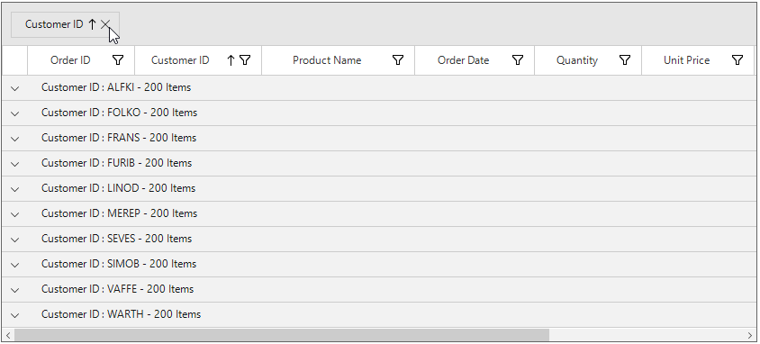
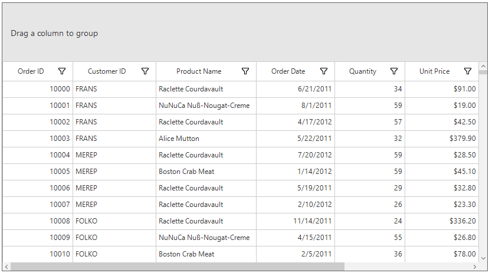
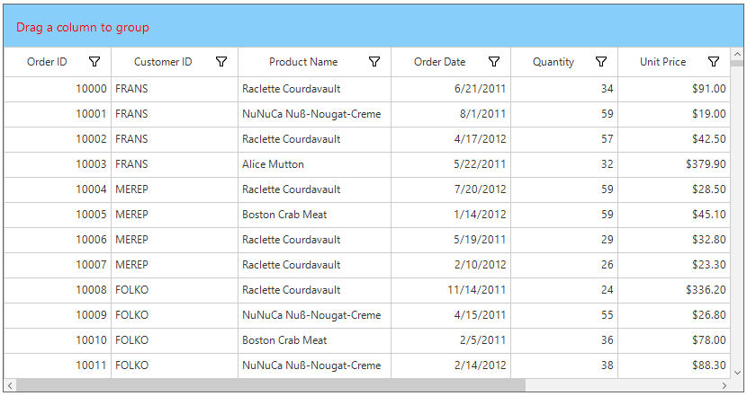

# Grouping
SfDataGrid allows to group the data against one or more columns. When grouping is applied, the data is organized into a hierarchical structure based on matching column values and it is sorted by ascending order.

## UI Grouping
End-user can group the data by setting [SfDataGrid.AllowGrouping](https://help.syncfusion.com/cr/cref_files/windowsforms/sfdatagrid/Syncfusion.SfDataGrid.WinForms~Syncfusion.WinForms.DataGrid.SfDataGrid~AllowGrouping.html# "") property to `true`, where user can drag and drop the column into `GroupDropArea` to group based on that column.
When the column is grouped, records that have an identical value in the column are combined to form a group. The GroupDropArea can be enabled by setting the [SfDataGrid.ShowGroupDropArea](https://help.syncfusion.com/cr/cref_files/windowsforms/sfdatagrid/Syncfusion.SfDataGrid.WinForms~Syncfusion.WinForms.DataGrid.SfDataGrid~ShowGroupDropArea.html# "") property to `true`.


this.sfDataGrid1.AllowGrouping = true;



Grouping for particular column can  be enables or disabled by setting the [GridColumnBase.AllowGrouping](https://help.syncfusion.com/cr/cref_files/windowsforms/sfdatagrid/Syncfusion.SfDataGrid.WinForms~Syncfusion.WinForms.DataGrid.GridColumnBase~AllowGrouping.html#) property.


this.sfDataGrid1.Columns["OrderID"].AllowGrouping = true;
this.sfDataGrid1.Columns["CustomerID"].AllowGrouping = true;



N> [GridColumn.AllowGrouping](https://help.syncfusion.com/cr/cref_files/windowsforms/sfdatagrid/Syncfusion.SfDataGrid.WinForms~Syncfusion.WinForms.DataGrid.GridColumnBase~AllowGrouping.html#) takes higher priority than [SfDataGrid.AllowGrouping.](https://help.syncfusion.com/cr/cref_files/windowsforms/sfdatagrid/Syncfusion.SfDataGrid.WinForms~Syncfusion.WinForms.DataGrid.SfDataGrid~AllowGrouping.html#)

The data can be grouped by an unlimited number of columns. To group more than one columns, drag-and-drop the desired columns in to `GroupDropArea`.

Each group is identified by its CaptionSummaryRows and it is used to organize the data into a hierarchical tree structure based on identical values of that column. The underlying records in each caption summary row can be expanded or collapsed by clicking its group caption.
Each `CaptionSummaryRow` carries information about a particular group like group name, number of items (records) in the group, etc. Refer the `Caption Summaries` section, for more information about `CaptionSummaryRow`.

## Programmatic Grouping

### Adding groups

SfDataGrid allows to group the data programmatically by adding or removing [GroupColumnDescription](https://help.syncfusion.com/cr/cref_files/windowsforms/sfdatagrid/Syncfusion.SfDataGrid.WinForms~Syncfusion.WinForms.DataGrid.GroupColumnDescription.html# "") to [SfDataGrid.GroupColumnDescriptions](https://help.syncfusion.com/cr/cref_files/windowsforms/sfdatagrid/Syncfusion.SfDataGrid.WinForms~Syncfusion.WinForms.DataGrid.SfDataGrid~GroupColumnDescriptions.html# "") collection.
If OrderID column need to be grouped programmatically, define its [MappingName](https://help.syncfusion.com/cr/cref_files/windowsforms/sfdatagrid/Syncfusion.SfDataGrid.WinForms~Syncfusion.WinForms.DataGrid.GridColumnBase~MappingName.html# "") to [ColumnName](https://help.syncfusion.com/cr/cref_files/windowsforms/sfdatagrid/Syncfusion.SfDataGrid.WinForms~Syncfusion.WinForms.DataGrid.GroupColumnDescription~ColumnName.html# "") property of `GroupColumnDescription`. Then add the `GroupColumnDescription` to the `SfDataGrid.GroupColumnDescriptions` collection.


this.sfDataGrid1.GroupColumnDescriptions.Add(new GroupColumnDescription() { ColumnName = "OrderID" });



### Removing groups

The groups can be removed by removing [GroupColumnDescription](https://help.syncfusion.com/cr/cref_files/windowsforms/sfdatagrid/Syncfusion.SfDataGrid.WinForms~Syncfusion.WinForms.DataGrid.GroupColumnDescription.html# "") from [SfDataGrid.GroupColumnDescriptions](https://help.syncfusion.com/cr/cref_files/windowsforms/sfdatagrid/Syncfusion.SfDataGrid.WinForms~Syncfusion.WinForms.DataGrid.SfDataGrid~GroupColumnDescriptions.html# "") collection or by specifying the index using the `RemoveAt` method.


this.sfDataGrid1.GroupColumnDescriptions.Remove(new GroupColumnDescription() { ColumnName = "OrderID" });
// OR
this.sfDataGrid1.GroupColumnDescriptions.RemoveAt(1);




To ungroup the column in UI, click the close button on column header or drag the column header from the GroupDropArea and drop it on the header row.

### Clearing groups
All the groups of the `SfDataGrid` can be removed by using `Clear` method.


this.sfDataGrid1.GroupColumnDescriptions.Clear();



## Formatting built-in group caption

The group caption text can be formatted using the [SfDataGrid.GroupCaptionTextFormat](https://help.syncfusion.com/cr/cref_files/windowsforms/sfdatagrid/Syncfusion.SfDataGrid.WinForms~Syncfusion.WinForms.DataGrid.SfDataGrid~GroupCaptionTextFormat.html#) property.
The default group caption format is `{ColumnName}: {Key} - {ItemsCount} Items`.

* ColumnName - Displays the name of the column currently grouped.
* Key - Displays the key value of group.
* ItemsCount - Displays the number of items in group.

The group caption format can be changed to Key and ItemsCount alone by setting [GroupCaptionTextFormat](https://help.syncfusion.com/cr/cref_files/windowsforms/sfdatagrid/Syncfusion.SfDataGrid.WinForms~Syncfusion.WinForms.DataGrid.SfDataGrid~GroupCaptionTextFormat.html#) as below,


this.sfDataGrid1.GroupCaptionTextFormat = "{Key} : {ItemsCount}";



## Expanding or collapsing the groups

By default, the records in each group can be viewed by expanding its group caption. 
The end-user can expand or collapse the groups programmatically at runtime.

### Expand groups while grouping

All the groups can be expanded while grouping by setting [SfDataGrid.View.AutoExpandGroups](https://help.syncfusion.com/cr/cref_files/windowsforms/sfdatagrid/Syncfusion.SfDataGrid.WinForms~Syncfusion.WinForms.DataGrid.SfDataGrid~AutoExpandGroups.html#) to `true`. So, when user group any column, all groups will be in expanded state.


this.sfDataGrid1.View.AutoExpandGroups = true;



### Programmatically expanding or collapsing the groups

#### Expand or collapse all the groups

All the groups can be expanded or collapsed programmatically at runtime by using [SfDataGrid.ExpandAllGroup](https://help.syncfusion.com/cr/cref_files/windowsforms/sfdatagrid/Syncfusion.SfDataGrid.WinForms~Syncfusion.WinForms.DataGrid.SfDataGrid~ExpandAllGroup.html# "") and [SfDataGrid.CollapseAllGroup](https://help.syncfusion.com/cr/cref_files/windowsforms/sfdatagrid/Syncfusion.SfDataGrid.WinForms~Syncfusion.WinForms.DataGrid.SfDataGrid~CollapseAllGroup.html# "") methods.


this.sfDataGrid1.ExpandAllGroup();
this.sfDataGrid1.CollapseAllGroup();



#### Expand or collapse the group based on its level
Groups can be expanded or collapsed based on its level by using [SfDataGrid.ExpandGroupsAtLevel](https://help.syncfusion.com/cr/cref_files/windowsforms/sfdatagrid/Syncfusion.SfDataGrid.WinForms~Syncfusion.WinForms.DataGrid.SfDataGrid~ExpandGroupsAtLevel.html# "") and [SfDataGrid.CollapseGroupsAtLevel](https://help.syncfusion.com/cr/cref_files/windowsforms/sfdatagrid/Syncfusion.SfDataGrid.WinForms~Syncfusion.WinForms.DataGrid.SfDataGrid~CollapseGroupsAtLevel.html# "") methods.


this.sfDataGrid1.ExpandGroupsAtLevel(2);
this.sfDataGrid1.CollapseGroupsAtLevel(2);



#### Expand or collapse the specific group
Specific group can be expanded or collapsed  by using [SfDataGrid.ExpandGroup](https://help.syncfusion.com/cr/cref_files/windowsforms/sfdatagrid/Syncfusion.SfDataGrid.WinForms~Syncfusion.WinForms.DataGrid.SfDataGrid~ExpandGroup.html# "") and [SfDataGrid.CollapseGroup](https://help.syncfusion.com/cr/cref_files/windowsforms/sfdatagrid/Syncfusion.SfDataGrid.WinForms~Syncfusion.WinForms.DataGrid.SfDataGrid~CollapseGroup.html# "") methods.


this.sfDataGrid1.ExpandGroup(this.sfDataGrid1.View.TopLevelGroup);
this.sfDataGrid1.CollapseGroup(this.sfDataGrid1.View.TopLevelGroup);



## Changing the indent column width
The width of IndentColumn in SfDataGrid can be customized by using [IndentColumnWidth](https://help.syncfusion.com/cr/cref_files/windowsforms/sfdatagrid/Syncfusion.SfDataGrid.WinForms~Syncfusion.WinForms.DataGrid.SfDataGrid~IndentColumnWidth.html#) property as like below.


this.sfDataGrid1.IndentColumnWidth = 100;



## GroupDropArea customization

### Customizing GroupDropArea text

The GroupDropArea’ s text can be changed by setting [SfDataGrid.GroupPanel.GroupDropAreaText](https://help.syncfusion.com/cr/cref_files/windowsforms/sfdatagrid/Syncfusion.SfDataGrid.WinForms~Syncfusion.WinForms.DataGrid.GroupPanel~GroupDropAreaText.html#) property.


this.sfDataGrid1.GroupPanel.GroupDropAreaText = "Drag columns here";



### Customizing GroupDropArea Height
SfDataGrid allows to customize the appearance and height of GroupDropArea.
The height of the GroupDropArea can be customized by `GroupPanel.Height` property.


this.sfDataGrid1.GroupPanel.Height = 100;



### Customizing GroupDropArea Appearance
The appearance of the GroupDropArea can be customized using the [GroupDropAreaStyle](https://help.syncfusion.com/cr/cref_files/windowsforms/sfdatagrid/Syncfusion.SfDataGrid.WinForms~Syncfusion.WinForms.DataGrid.Styles.DataGridStyle~GroupDropAreaStyle.html# "") property.  The[GroupDropAreaStyleInfo](https://help.syncfusion.com/cr/cref_files/windowsforms/sfdatagrid/Syncfusion.SfDataGrid.WinForms~Syncfusion.WinForms.DataGrid.Styles.GroupDropAreaStyleInfo.html# "") contains all the settings that are needed for the GroupDropArea appearance customization.


this.sfDataGrid1.Style.GroupDropAreaStyle.BackColor = Color.LightSkyBlue;
this.sfDataGrid1.Style.GroupDropAreaStyle.TextColor = Color.Red;



### Customizing GroupDropAreaItem Appearance
The appearance of the grouped items in the GroupDropArea can be customized using the [GroupDropAreaItemStyle](https://help.syncfusion.com/cr/cref_files/windowsforms/sfdatagrid/Syncfusion.SfDataGrid.WinForms~Syncfusion.WinForms.DataGrid.Styles.DataGridStyle~GroupDropAreaItemStyle.html# "") property. The[GroupDropAreaItemStyleInfo](https://help.syncfusion.com/cr/cref_files/windowsforms/sfdatagrid/Syncfusion.SfDataGrid.WinForms~Syncfusion.WinForms.DataGrid.Styles.GroupDropAreaItemStyleInfo.html# "") contains all the settings that are needed for the grouped items appearance customization.


this.sfDataGrid1.Style.GroupDropAreaItemStyle.TextColor = Color.DarkBlue;
this.sfDataGrid1.Style.GroupDropAreaItemStyle.BackColor = Color.LightSkyBlue;



## Custom grouping
SfDataGrid allows to group the data based on custom logic when the built-in grouping functionality doesn’t meet your requirement.
To perform custom grouping on a particular column, specify the custom logic through [GroupColumnDescription.KeySelector](https://help.syncfusion.com/cr/cref_files/windowsforms/sfdatagrid/Syncfusion.SfDataGrid.WinForms~Syncfusion.WinForms.DataGrid.GroupColumnDescription~KeySelector.html# "") property and the column name to [GroupColumnDescription.ColumnName](https://help.syncfusion.com/cr/cref_files/windowsforms/sfdatagrid/Syncfusion.SfDataGrid.WinForms~Syncfusion.WinForms.DataGrid.GroupColumnDescription~ColumnName.html# "") property.
For an example, the Date column is grouped based on the week basis in the following example.


//Apply the CustomGrouping for Date Column by using KeySelector.
this.sfDataGrid.GroupColumnDescriptions.Add(new GroupColumnDescription()
{
    ColumnName = "Date",
    KeySelector = (string ColumnName, object o) =>
        {
            var dt = DateTime.Now;
            var item = (o as SalesByDate).Date;
            var days = (int)Math.Floor((dt - item).TotalDays);
            var dayofweek = (int)dt.DayOfWeek;
            var diff = days - dayofweek;
            if (days <= dayofweek)
            {
                if (days == 0)
                    return "TODAY";
                if (days == 1)
                    return "YESTERDAY";
                return item.Date.DayOfWeek.ToString().ToUpper();
            }
            if (diff > 0 && diff <= 7)
                return "LAST WEEK";
            if (diff > 7 && diff <= 14)
                return "TWO WEEKS AGO";
            if (diff > 14 && diff <= 21)
                return "THREE WEEKS AGO";
            if (dt.Year == item.Date.Year && dt.Month == item.Date.Month)
                return "EARLIER THIS MONTH";
            if (DateTime.Now.AddMonths(-1).Month == item.Date.Month)
                return "LAST MONTH";
            return "OLDER";
        }

});



### Sorting inner records
In custom grouping, all the inner records of each group can be sort by setting [GroupColumnDescription.SortGroupRecords](https://help.syncfusion.com/cr/cref_files/windowsforms/sfdatagrid/Syncfusion.SfDataGrid.WinForms~Syncfusion.WinForms.DataGrid.GroupColumnDescription~SortGroupRecords.html#) sorted based on the column name described in `GroupColumnDescription`.


this.sfDataGrid.GroupColumnDescriptions.Add(new GroupColumnDescription()
{
    ColumnName = "Date",
    SortGroupRecords = true,
    KeySelector = (string ColumnName, object o) =>
        {
            var dt = DateTime.Now;
            var item = (o as SalesByDate).Date;
            var days = (int)Math.Floor((dt - item).TotalDays);
            var dayofweek = (int)dt.DayOfWeek;
            var diff = days - dayofweek;
            if (days <= dayofweek)
            {
                if (days == 0)
                    return "TODAY";
                if (days == 1)
                    return "YESTERDAY";
                return item.Date.DayOfWeek.ToString().ToUpper();
            }
            if (diff > 0 && diff <= 7)
                return "LAST WEEK";
            if (diff > 7 && diff <= 14)
                return "TWO WEEKS AGO";
            if (diff > 14 && diff <= 21)
                return "THREE WEEKS AGO";
            if (dt.Year == item.Date.Year && dt.Month == item.Date.Month)
                return "EARLIER THIS MONTH";
            if (DateTime.Now.AddMonths(-1).Month == item.Date.Month)
                return "LAST MONTH";
            return "OLDER";
        }

});



Download sample from below location,
**Sample** - [Custom Grouping](http://www.syncfusion.com/downloads/support/directtrac/general/ze/Custom_Grouping640245417.zip#)

### Cancel expanding of groups
The expanding of the groups can be canceled by setting `Cancel` property of the [GroupChangingEventArgs](https://help.syncfusion.com/cr/cref_files/windowsforms/sfdatagrid/Syncfusion.SfDataGrid.WinForms~Syncfusion.WinForms.DataGrid.Events.GroupChangingEventArgs.html# "") to `true` in the [GroupExpanding](https://help.syncfusion.com/cr/cref_files/windowsforms/sfdatagrid/Syncfusion.SfDataGrid.WinForms~Syncfusion.WinForms.DataGrid.SfDataGrid~GroupExpanding_EV.html# "") event.


this.sfDataGrid1.GroupExpanding += SfDataGrid1_GroupExpanding;

private void SfDataGrid1_GroupExpanding(object sender, GroupChangingEventArgs e)
{
    if (e.Group.Key.Equals(1001))
        e.Cancel = true;
}



### Cancel collapsing of groups
The collapsing of the groups can be canceled by setting the `Cancel` property of the [GroupChangingEventArgs](https://help.syncfusion.com/cr/cref_files/windowsforms/sfdatagrid/Syncfusion.SfDataGrid.WinForms~Syncfusion.WinForms.DataGrid.Events.GroupChangingEventArgs.html# "") to `true` in the [GroupCollapsing](https://help.syncfusion.com/cr/cref_files/windowsforms/sfdatagrid/Syncfusion.SfDataGrid.WinForms~Syncfusion.WinForms.DataGrid.SfDataGrid~GroupCollapsing_EV.html# "") event.


this.sfDataGrid1.GroupCollapsing += SfDataGrid1_GroupCollapsing;

private void SfDataGrid1_GroupCollapsing(object sender, GroupChangingEventArgs e)
{
    if (e.Group.Key.Equals(1001))
        e.Cancel = true;
}


