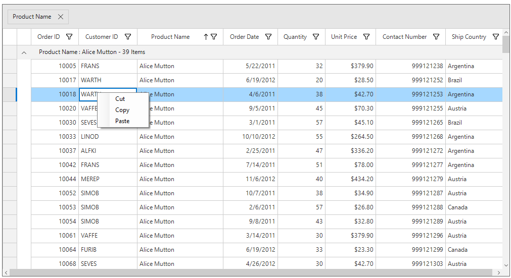
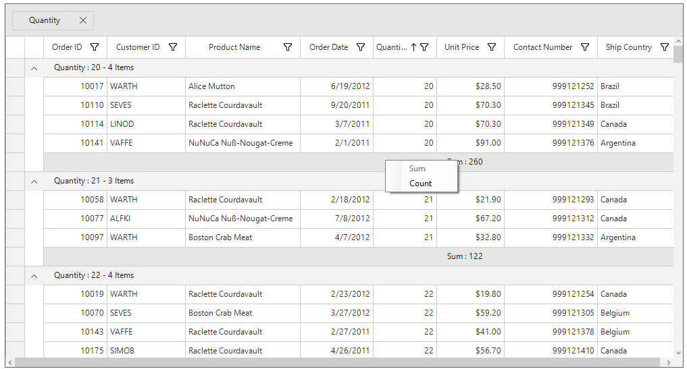
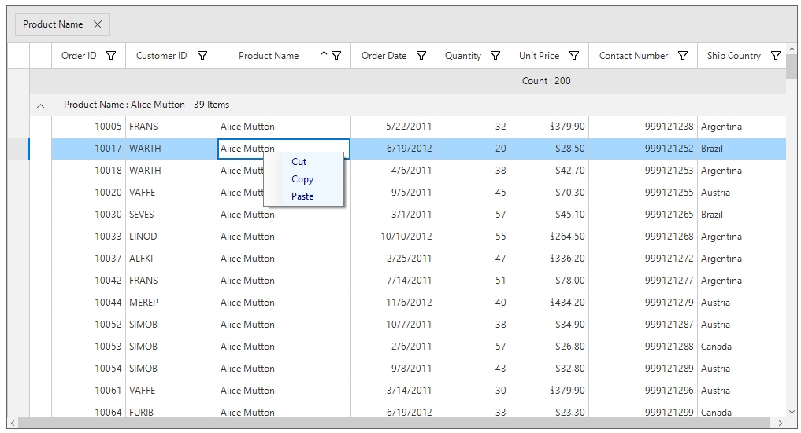
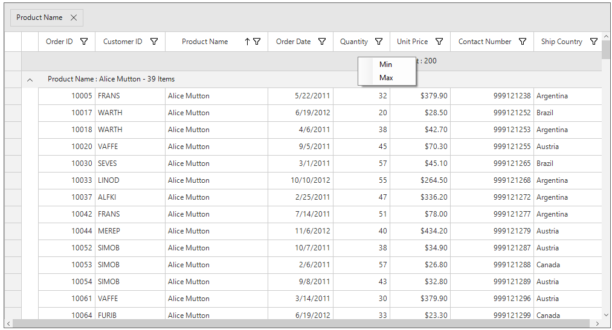
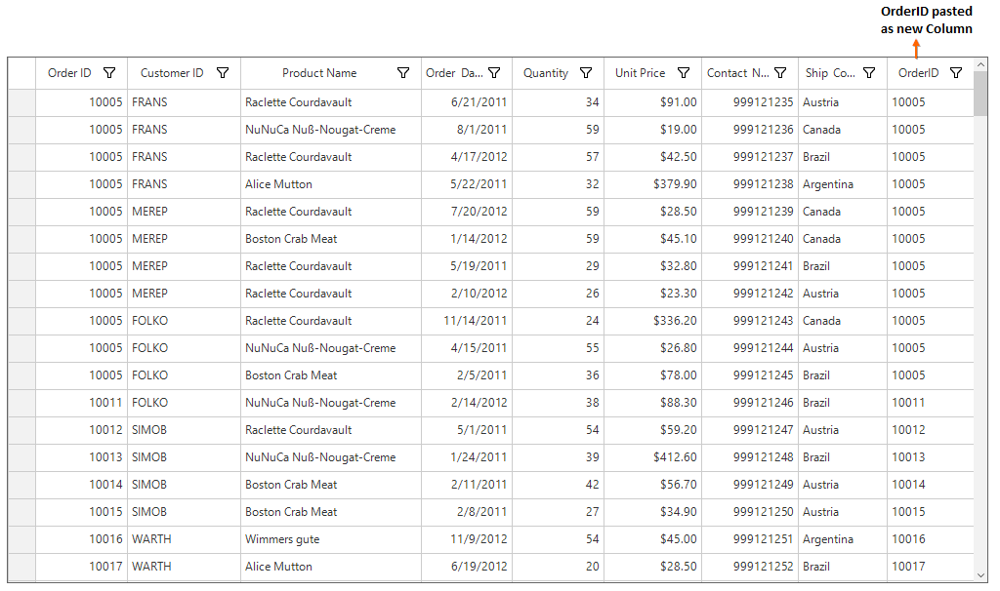
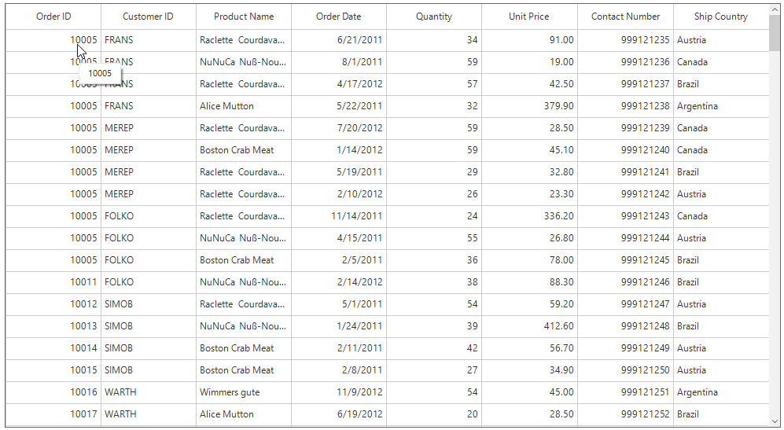
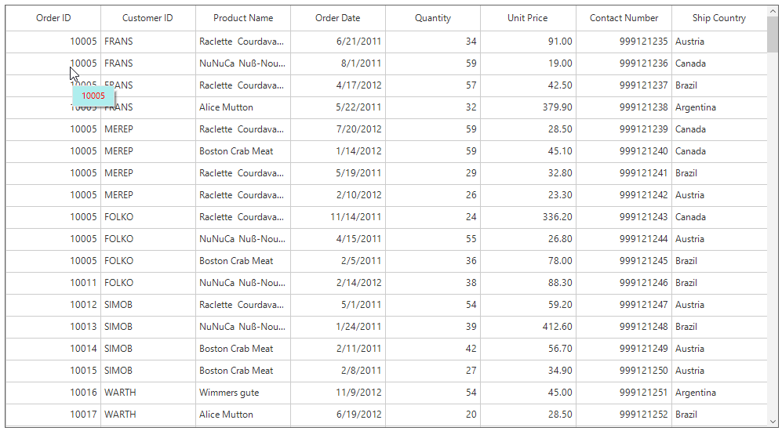
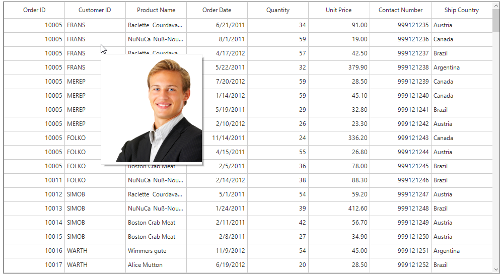
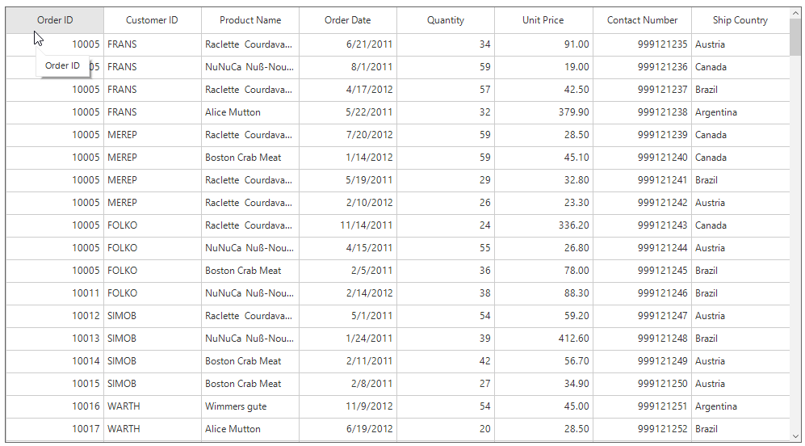

# Interactive Features

## Context Menu

SfDataGrid provides an entirely customizable menu to expose the functionality on user interface by using [ContextMenuStrip](https://msdn.microsoft.com/en-us/library/system.windows.forms.contextmenustrip(v=vs.110).aspx). It allows to create context menus for different rows in an efficient manner.

### ContextMenu for Records

The context menu for the data rows can be set by using [SfDataGrid.RecordContextMenu](https://help.syncfusion.com/cr/cref_files/windowsforms/sfdatagrid/Syncfusion.SfDataGrid.WinForms~Syncfusion.WinForms.DataGrid.SfDataGrid~RecordContextMenu.html) property.



this.sfDataGrid1.RecordContextMenu = new ContextMenuStrip();
this.sfDataGrid1.RecordContextMenu.Items.Add("Cut", null, OnCutClicked);
this.sfDataGrid1.RecordContextMenu.Items.Add("Copy", null, OnCopyClicked);
this.sfDataGrid1.RecordContextMenu.Items.Add("Paste", null, OnPasteClicked);	


Me.sfDataGrid1.RecordContextMenu = New ContextMenuStrip()
Me.sfDataGrid1.RecordContextMenu.Items.Add("Cut", Nothing, OnCutClicked)
Me.sfDataGrid1.RecordContextMenu.Items.Add("Copy", Nothing, OnCopyClicked)
Me.sfDataGrid1.RecordContextMenu.Items.Add("Paste", Nothing, OnPasteClicked)



### ContextMenu for Column Header

The context menu for the column header row can be set by using [SfDataGrid.ColumnHeaderContextMenu](https://help.syncfusion.com/cr/cref_files/windowsforms/sfdatagrid/Syncfusion.SfDataGrid.WinForms~Syncfusion.WinForms.DataGrid.SfDataGrid~ColumnHeaderContextMenu.html) property.



this.sfDataGrid1.ColumnHeaderContextMenu = new ContextMenuStrip();
this.sfDataGrid1.ColumnHeaderContextMenu.Items.Add("Sort Ascending", Image.FromFile("sortasc.png"), OnSortAscendingClicked);
this.sfDataGrid1.ColumnHeaderContextMenu.Items.Add("Sort Descending", Image.FromFile("sortdesc.png"), OnSortDescendingClicked);
this.sfDataGrid1.ColumnHeaderContextMenu.Items.Add("Clear Sorting", null, OnClearSortingClicked);
this.sfDataGrid1.ColumnHeaderContextMenu.Items.Add("Show GroupDropArea", null, OnShowGroupDropAreaClicked);


Me.sfDataGrid1.ColumnHeaderContextMenu = New ContextMenuStrip()
Me.sfDataGrid1.ColumnHeaderContextMenu.Items.Add("Sort Ascending", Image.FromFile("sortasc.png"), OnSortAscendingClicked)
Me.sfDataGrid1.ColumnHeaderContextMenu.Items.Add("Sort Descending", Image.FromFile("sortdesc.png"), OnSortDescendingClicked)
Me.sfDataGrid1.ColumnHeaderContextMenu.Items.Add("Clear Sorting", Nothing, OnClearSortingClicked)
Me.sfDataGrid1.ColumnHeaderContextMenu.Items.Add("Show GroupDropArea", Nothing, OnShowGroupDropAreaClicked)



### ContextMenu for RowHeader
The context menu for the row headers can be set by using [SfDataGrid.RowHeaderContextMenu](https://help.syncfusion.com/cr/cref_files/windowsforms/sfdatagrid/Syncfusion.SfDataGrid.WinForms~Syncfusion.WinForms.DataGrid.SfDataGrid~RowHeaderContextMenu.html) property.



this.sfDataGrid1.RowHeaderContextMenu = new ContextMenuStrip();
this.sfDataGrid1.RowHeaderContextMenu.Items.Add("Delete", null, OnDeleteClicked);


Me.sfDataGrid1.RowHeaderContextMenu = New ContextMenuStrip()
Me.sfDataGrid1.RowHeaderContextMenu.Items.Add("Delete", Nothing, OnDeleteClicked)



### ContextMenu for GroupDropArea

The context menu for the group drop area can be set by using [SfDataGrid.GroupDropAreaContextMenu](https://help.syncfusion.com/cr/cref_files/windowsforms/sfdatagrid/Syncfusion.SfDataGrid.WinForms~Syncfusion.WinForms.DataGrid.SfDataGrid~GroupDropAreaContextMenu.html) property.



this.sfDataGrid1.GroupDropAreaContextMenu = new ContextMenuStrip();
this.sfDataGrid1.GroupDropAreaContextMenu.Items.Add("Hide GroupDropArea", null, OnHideGroupDropAreaClicked);
this.sfDataGrid1.GroupDropAreaContextMenu.Items.Add("Expand All", null, OnExpandAllClicked);
this.sfDataGrid1.GroupDropAreaContextMenu.Items.Add("Collapse All", null, OnCollapseAllClicked);
this.sfDataGrid1.GroupDropAreaContextMenu.Items.Add("Clear Groups", null, OnClearGroupsClicked);


Me.sfDataGrid1.GroupDropAreaContextMenu = New ContextMenuStrip()
Me.sfDataGrid1.GroupDropAreaContextMenu.Items.Add("Hide GroupDropArea", Nothing, OnHideGroupDropAreaClicked)
Me.sfDataGrid1.GroupDropAreaContextMenu.Items.Add("Expand All", Nothing, OnExpandAllClicked)
Me.sfDataGrid1.GroupDropAreaContextMenu.Items.Add("Collapse All", Nothing, OnCollapseAllClicked)
Me.sfDataGrid1.GroupDropAreaContextMenu.Items.Add("Clear Groups", Nothing, OnClearGroupsClicked)



### ContextMenu for GroupDropAreaItem

The context menu for the group drop area items can be set by using [SfDataGrid.GroupDropAreaItemContextMenu](https://help.syncfusion.com/cr/cref_files/windowsforms/sfdatagrid/Syncfusion.SfDataGrid.WinForms~Syncfusion.WinForms.DataGrid.SfDataGrid~GroupDropAreaItemContextMenu.html) property.



this.sfDataGrid1.GroupDropAreaItemContextMenu = new ContextMenuStrip();
this.sfDataGrid1.GroupDropAreaItemContextMenu.Items.Add("Expand All", null, OnItemExpandAllClicked);
this.sfDataGrid1.GroupDropAreaItemContextMenu.Items.Add("Collapse All", null, OnItemCollapseAllClicked);
this.sfDataGrid1.GroupDropAreaItemContextMenu.Items.Add("Clear Group", null, OnGroupClearClicked);


Me.sfDataGrid1.GroupDropAreaItemContextMenu = New ContextMenuStrip()
Me.sfDataGrid1.GroupDropAreaItemContextMenu.Items.Add("Expand All", Nothing, OnItemExpandAllClicked)
Me.sfDataGrid1.GroupDropAreaItemContextMenu.Items.Add("Collapse All", Nothing, OnItemCollapseAllClicked)
Me.sfDataGrid1.GroupDropAreaItemContextMenu.Items.Add("Clear Group", Nothing, OnGroupClearClicked)



### ContextMenu for GroupCaptionSummaryRow

The context menu for the group caption can be set by using [SfDataGrid.GroupCaptionContextMenu](https://help.syncfusion.com/cr/cref_files/windowsforms/sfdatagrid/Syncfusion.SfDataGrid.WinForms~Syncfusion.WinForms.DataGrid.SfDataGrid~GroupCaptionContextMenu.html) property.


this.sfDataGrid1.GroupCaptionContextMenu = new ContextMenuStrip();
this.sfDataGrid1.GroupCaptionContextMenu.Items.Add("Expand", null, OnExpandClicked);
this.sfDataGrid1.GroupCaptionContextMenu.Items.Add("Collapse", null, OnCollapseClicked);


Me.sfDataGrid1.GroupCaptionContextMenu = New ContextMenuStrip()
Me.sfDataGrid1.GroupCaptionContextMenu.Items.Add("Expand", Nothing, OnExpandClicked)
Me.sfDataGrid1.GroupCaptionContextMenu.Items.Add("Collapse", Nothing, OnCollapseClicked)



### ContextMenu for GroupSummaryRow

The context menu for the group summary can be set by using [SfDataGrid.GroupSummaryContextMenu](https://help.syncfusion.com/cr/cref_files/windowsforms/sfdatagrid/Syncfusion.SfDataGrid.WinForms~Syncfusion.WinForms.DataGrid.SfDataGrid~GroupSummaryContextMenu.html) property.



this.sfDataGrid1.GroupSummaryContextMenu = new ContextMenuStrip();
this.sfDataGrid1.GroupSummaryContextMenu.Items.Add("Sum", null, OnSumClicked);
this.sfDataGrid1.GroupSummaryContextMenu.Items.Add("Count", null, OnCountClicked);


Me.sfDataGrid1.GroupSummaryContextMenu = New ContextMenuStrip()
Me.sfDataGrid1.GroupSummaryContextMenu.Items.Add("Sum", Nothing, OnSumClicked)
Me.sfDataGrid1.GroupSummaryContextMenu.Items.Add("Count", Nothing, OnCountClicked)



### ContextMenu for TableSummaryRow

The context menu for the table summary can be set by using [SfDataGrid.TableSummaryContextMenu](https://help.syncfusion.com/cr/cref_files/windowsforms/sfdatagrid/Syncfusion.SfDataGrid.WinForms~Syncfusion.WinForms.DataGrid.SfDataGrid~TableSummaryContextMenu.html) property.


this.sfDataGrid1.TableSummaryContextMenu = new ContextMenuStrip();
this.sfDataGrid1.TableSummaryContextMenu.Items.Add("Sum", null, OnSumClicked);
this.sfDataGrid1.TableSummaryContextMenu.Items.Add("Count", null, OnCountClicked);


Me.sfDataGrid1.TableSummaryContextMenu = New ContextMenuStrip()
Me.sfDataGrid1.TableSummaryContextMenu.Items.Add("Sum", Nothing, OnSumClicked)
Me.sfDataGrid1.TableSummaryContextMenu.Items.Add("Count", Nothing, OnCountClicked)



### Appearance

The appearance of the context menus can be customized as given below.



this.sfDataGrid1.RecordContextMenu.BackColor = Color.AliceBlue;
this.sfDataGrid1.RecordContextMenu.ForeColor = Color.DarkBlue;


Me.sfDataGrid1.RecordContextMenu.BackColor = Color.AliceBlue
Me.sfDataGrid1.RecordContextMenu.ForeColor = Color.DarkBlue



### Cancel ContextMenu Opening

The context menu opening can be canceled for any particular cell/row or column through [ContextMenuOpening](https://help.syncfusion.com/cr/cref_files/windowsforms/sfdatagrid/Syncfusion.SfDataGrid.WinForms~Syncfusion.WinForms.DataGrid.SfDataGrid~ContextMenuOpening_EV.html) event.



this.sfDataGrid1.ContextMenuOpening += SfDataGrid1_ContextMenuOpening;

private void SfDataGrid1_ContextMenuOpening(object obj, ContextMenuOpeningEventArgs e)
{
    if (e.ColumnIndex == 1 && e.RowIndex == 1)
        e.Cancel = true;
}


AddHandler sfDataGrid1.ContextMenuOpening, AddressOf SfDataGrid1_ContextMenuOpening

Private Sub SfDataGrid1_ContextMenuOpening(ByVal obj As Object, ByVal e As ContextMenuOpeningEventArgs)
	If e.ColumnIndex = 1 AndAlso e.RowIndex = 1 Then
		e.Cancel = True
	End If
End Sub



[ContextMenuOpened](https://help.syncfusion.com/cr/cref_files/windowsforms/sfdatagrid/Syncfusion.SfDataGrid.WinForms~Syncfusion.WinForms.DataGrid.SfDataGrid~ContextMenuOpened_EV.html) event occurs when any context menu is opened in SfDataGrid. This will not occur if `ContextMenuOpening` event is canceled.

### Customization of Context Menu

#### Change the Menu Items when Opening the Context Menu.

The menu items for  the context menu can be change when opening the context menu by handling the [ContextMenuOpening](https://help.syncfusion.com/cr/cref_files/windowsforms/sfdatagrid/Syncfusion.SfDataGrid.WinForms~Syncfusion.WinForms.DataGrid.SfDataGrid~ContextMenuOpening_EV.html) event.



this.sfDataGrid1.ContextMenuOpening += SfDataGrid1_ContextMenuOpening;

private void SfDataGrid1_ContextMenuOpening(object obj, ContextMenuOpeningEventArgs e)
{
    if (e.ContextMenutype == ContextMenuType.TableSummary)
    {
        e.ContextMenu.Items.Clear();
        e.ContextMenu.Items.Add("Min", null, OnMinClicked);
        e.ContextMenu.Items.Add("Max", null, OnMaxClicked);
    }
}


AddHandler sfDataGrid1.ContextMenuOpening, AddressOf SfDataGrid1_ContextMenuOpening

Private Sub SfDataGrid1_ContextMenuOpening(ByVal obj As Object, ByVal e As ContextMenuOpeningEventArgs)
	If e.ContextMenutype = ContextMenuType.TableSummary Then
		e.ContextMenu.Items.Clear()
		e.ContextMenu.Items.Add("Min", Nothing, OnMinClicked)
		e.ContextMenu.Items.Add("Max", Nothing, OnMaxClicked)
	End If
End Sub



#### Create a New Column by using ColumnHeaderContextMenu 

SfDataGrid allows to copy a column and paste it in a new column. `ColumnHeaderContextMenu` can be used to provide options for copy column and paste column. The below code example shows how to provide this support.



SfDataGrid grid = null;
GridColumn column = null;
GridColumn copiedColumn = null

public Form1()
{
    InitializeComponent();
    orderInfo = new OrderInfoCollection();
    this.sfDataGrid1.DataSource = orderInfo.OrdersListDetails;
    this.sfDataGrid1.ColumnHeaderContextMenu = new ContextMenuStrip();
    this.sfDataGrid1.ColumnHeaderContextMenu.Items.Add("Copy Column", null, OnCopyColumnClicked);
    this.sfDataGrid1.ColumnHeaderContextMenu.Items.Add("Paste Column", null, OnPasteColumnClicked);
    this.sfDataGrid1.ContextMenuOpening += SfDataGrid1_ContextMenuOpening;

}

private void SfDataGrid1_ContextMenuOpening(object obj, ContextMenuOpeningEventArgs e)
{
    if (e.ContextMenutype == ContextMenuType.ColumnHeader)
    {
        grid = (e.ContextMenuInfo as ColumnContextMenuInfo).DataGrid;
        column = (e.ContextMenuInfo as ColumnContextMenuInfo).Column;
    }
}

private void OnCopyColumnClicked(object sender, EventArgs e)
{
    //The selected column stored in to CopiedColumn
    copiedColumn = column;
}

private void OnPasteColumnClicked(object sender, EventArgs e)
{
    if (copiedColumn != null)
    {
        var index = grid.Columns.IndexOf(column);
        grid.Columns.Insert(index + 1, new GridTextColumn()
        {
            MappingName = copiedColumn.MappingName
        });
    }
}


Dim grid As SfDataGrid = Nothing
Dim column As GridColumn = Nothing
Dim copiedColumn As GridColumn = Nothing

Public Sub New()
	InitializeComponent()

	orderInfo = New OrderInfoCollection()
	Me.sfDataGrid1.DataSource = orderInfo.OrdersListDetails

	Me.sfDataGrid1.ColumnHeaderContextMenu = New ContextMenuStrip()
	Me.sfDataGrid1.ColumnHeaderContextMenu.Items.Add("Copy Column", Nothing, OnCopyColumnClicked)
	Me.sfDataGrid1.ColumnHeaderContextMenu.Items.Add("Paste Column", Nothing, OnPasteColumnClicked)
      AddHandler sfDataGrid1.ContextMenuOpening, AddressOf SfDataGrid1_ContextMenuOpening

End Sub

Private Sub SfDataGrid1_ContextMenuOpening(ByVal obj As Object, ByVal e As ContextMenuOpeningEventArgs)
	If e.ContextMenutype = ContextMenuType.ColumnHeader Then
		grid = (TryCast(e.ContextMenuInfo, ColumnContextMenuInfo)).DataGrid
		column = (TryCast(e.ContextMenuInfo, ColumnContextMenuInfo)).Column
	End If
End Sub

Private Sub OnCopyColumnClicked(ByVal sender As Object, ByVal e As EventArgs)
	'The selected column stored in to CopiedColumn
	copiedColumn = column
End Sub

Private Sub OnPasteColumnClicked(ByVal sender As Object, ByVal e As EventArgs)
	If copiedColumn IsNot Nothing Then
		Dim index = grid.Columns.IndexOf(column)
		grid.Columns.Insert(index + 1, New GridTextColumn() With {.MappingName = copiedColumn.MappingName})
	End If
End Sub




#### Clipboard Options by using RecordContextMenu

The below code example shows how to provide clipboard options for the SfDataGrid by using  `RecordContextMenu`.



this.sfDataGrid1.RecordContextMenu = new ContextMenuStrip();
this.sfDataGrid1.RecordContextMenu.Items.Add("Cut", null, OnCutClicked);
this.sfDataGrid1.RecordContextMenu.Items.Add("Copy", null, OnCopyClicked);
this.sfDataGrid1.RecordContextMenu.Items.Add("Paste", null, OnPasteClicked);

private void OnCutClicked(Object sender, EventArgs e)
{
    this.sfDataGrid1.ClipboardController.Cut();
}

private void OnCopyClicked(Object sender, EventArgs e)
{
    this.sfDataGrid1.ClipboardController.Copy();
}

private void OnPasteClicked(Object sender, EventArgs e)
{
    this.sfDataGrid1.ClipboardController.Paste();
}


Me.sfDataGrid1.RecordContextMenu = New ContextMenuStrip()
Me.sfDataGrid1.RecordContextMenu.Items.Add("Cut", Nothing, AddressOf OnCutClicked)
Me.sfDataGrid1.RecordContextMenu.Items.Add("Copy", Nothing, AddressOf OnCopyClicked)
Me.sfDataGrid1.RecordContextMenu.Items.Add("Paste", Nothing, AddressOf OnPasteClicked)

private void OnCutClicked(Object sender, EventArgs e)
	Me.sfDataGrid1.ClipboardController.Cut()

private void OnCopyClicked(Object sender, EventArgs e)
	Me.sfDataGrid1.ClipboardController.Copy()

private void OnPasteClicked(Object sender, EventArgs e)
	Me.sfDataGrid1.ClipboardController.Paste()



####  Clear Filtering by using ColumnHeaderContextMenu

The below code example shows how to provide option to clear filters in all the columns by using `ColumnHeaderContextMenu`.



this.sfDataGrid1.ColumnHeaderContextMenu = new ContextMenuStrip();
this.sfDataGrid1.ColumnHeaderContextMenu.Items.Add("Clear Filtering", null, OnClearFilteringClicked);

void OnClearFilteringClicked(object sender, EventArgs e)
{
    this.sfDataGrid1.ClearFilters();
}


Me.sfDataGrid1.ColumnHeaderContextMenu = New ContextMenuStrip()
Me.sfDataGrid1.ColumnHeaderContextMenu.Items.Add("Clear Filtering", Nothing, AddressOf OnClearFilteringClicked)

void OnClearFilteringClicked(Object sender, EventArgs e)
	Me.sfDataGrid1.ClearFilters()



## ToolTip

SfDataGrid provides the support to show the pop-up window that displays the information when the mouse hover on the cells by using [SfToolTip](https://help.syncfusion.com/windowsforms/sftooltip/overview). The ToolTip for the SfDataGrid can be enabled by setting the[SfDataGrid.ShowToolTip](https://help.syncfusion.com/cr/cref_files/windowsforms/sfdatagrid/Syncfusion.SfDataGrid.WinForms~Syncfusion.WinForms.DataGrid.SfDataGrid~ShowToolTip.html) property to true.



this.sfDataGrid1.ShowToolTip = true;


Me.sfDataGrid1.ShowToolTip = True



The ToolTip for any particular column can be enabled by setting [GridColumnBase.ShowToolTip](https://help.syncfusion.com/cr/cref_files/windowsforms/sfdatagrid/Syncfusion.SfDataGrid.WinForms~Syncfusion.WinForms.DataGrid.GridColumnBase~ShowToolTip.html) property to true.



this.sfDataGrid1.Columns["OrderID"].ShowToolTip = true;


Me.sfDataGrid1.Columns("OrderID").ShowToolTip = True



N>[GridColumnBase.ShowToolTip](https://help.syncfusion.com/cr/cref_files/windowsforms/sfdatagrid/Syncfusion.SfDataGrid.WinForms~Syncfusion.WinForms.DataGrid.GridColumnBase~ShowToolTip.html) takes higher priority than [SfDataGrid.ShowToolTip](https://help.syncfusion.com/cr/cref_files/windowsforms/sfdatagrid/Syncfusion.SfDataGrid.WinForms~Syncfusion.WinForms.DataGrid.SfDataGrid~ShowToolTip.html).

### Displaying ToolTip on Header

The ToolTip can be displayed for the header cells by setting the [SfDataGrid.ShowHeaderToolTip](https://help.syncfusion.com/cr/cref_files/windowsforms/sfdatagrid/Syncfusion.SfDataGrid.WinForms~Syncfusion.WinForms.DataGrid.SfDataGrid~ShowHeaderToolTip.html) property to true.



this.sfDataGrid1.ShowHeaderToolTip = true;


Me.sfDataGrid1.ShowHeaderToolTip = True



The header ToolTip for any particular column can be enabled by setting [GridColumnBase.ShowHeaderToolTip](https://help.syncfusion.com/cr/cref_files/windowsforms/sfdatagrid/Syncfusion.SfDataGrid.WinForms~Syncfusion.WinForms.DataGrid.GridColumnBase~ShowHeaderToolTip.html) property to true.



this.sfDataGrid1.Columns["OrderID"].ShowHeaderToolTip = true;


Me.sfDataGrid1.Columns("OrderID").ShowHeaderToolTip = True



N>[GridColumnBase.ShowHeaderToolTip](https://help.syncfusion.com/cr/cref_files/windowsforms/sfdatagrid/Syncfusion.SfDataGrid.WinForms~Syncfusion.WinForms.DataGrid.GridColumnBase~ShowHeaderToolTip.html) takes higher priority than [SfDataGrid.ShowHeaderToolTip](https://help.syncfusion.com/cr/cref_files/windowsforms/sfdatagrid/Syncfusion.SfDataGrid.WinForms~Syncfusion.WinForms.DataGrid.SfDataGrid~ShowHeaderToolTip.html).

### Displaying ToolTip Only for the Trimmed Cells

By default, ToolTip will be displayed for all the cells. SfDataGrid provides support to display ToolTip only for the cells that contains trimmed text by setting value for [SfDataGrid.ToolTipOption.ToolTipMode](https://help.syncfusion.com/cr/cref_files/windowsforms/sfdatagrid/Syncfusion.SfDataGrid.WinForms~Syncfusion.WinForms.DataGrid.Interactivity.ToolTipOptions~ToolTipMode.html) property as `TrimmedCells`.



this.sfDataGrid1.ToolTipOption.ToolTipMode = ToolTipMode.TrimmedCells;


Me.sfDataGrid1.ToolTipOption.ToolTipMode = ToolTipMode.TrimmedCells



### Setting ToolTip Delay	

#### Initial Delay

The [SfDataGrid.ToolTipOption.InitialDelay](https://help.syncfusion.com/cr/cref_files/windowsforms/sfdatagrid/Syncfusion.SfDataGrid.WinForms~Syncfusion.WinForms.DataGrid.Interactivity.ToolTipOptions~InitialDelay.html) property provides supports to shorten or lengthen the time before displaying a ToolTip.



this.sfDataGrid1.ToolTipOption.InitialDelay = 1000;


Me.sfDataGrid1.ToolTipOption.InitialDelay = 1000



#### Auto Pop Delay

The [SfDataGrid.ToolTipOption.AutoPopDelay](https://help.syncfusion.com/cr/cref_files/windowsforms/sfdatagrid/Syncfusion.SfDataGrid.WinForms~Syncfusion.WinForms.DataGrid.Interactivity.ToolTipOptions~ToolTipMode.html) property provides support to shorten or lengthen the time duration that the tooltip is displayed when the mouse pointer is on a cell.



this.sfDataGrid1.ToolTipOption.AutoPopDelay = 3000;


Me.sfDataGrid1.ToolTipOption.AutoPopDelay = 3000



### Appearance

#### Styling

SfDataGrid allows to customize the appearance of the ToolTip through [SfDataGrid.Style.ToolTipStyle](https://help.syncfusion.com/cr/cref_files/windowsforms/sfdatagrid/Syncfusion.SfDataGrid.WinForms~Syncfusion.WinForms.DataGrid.Styles.DataGridStyle~ToolTipStyle.html) property.



this.sfDataGrid1.Style.ToolTipStyle.BackColor = Color.AliceBlue;
this.sfDataGrid1.Style.ToolTipStyle.ForeColor = Color.Red;
this.sfDataGrid1.Style.ToolTipStyle.BorderThickness = 2;
this.sfDataGrid1.Style.ToolTipStyle.BorderColor = Color.DarkBlue;


Me.sfDataGrid1.Style.ToolTipStyle.BackColor = Color.AliceBlue
Me.sfDataGrid1.Style.ToolTipStyle.ForeColor = Color.Red
Me.sfDataGrid1.Style.ToolTipStyle.BorderThickness = 2
Me.sfDataGrid1.Style.ToolTipStyle.BorderColor = Color.DarkBlue



#### Conditional Styling

SfDataGrid allows to customize the appearance of the ToolTip based on conditions through [ToolTipOpening](https://help.syncfusion.com/cr/cref_files/windowsforms/sfdatagrid/Syncfusion.SfDataGrid.WinForms~Syncfusion.WinForms.DataGrid.SfDataGrid~ToolTipOpening_EV.html) event.



this.sfDataGrid1.ToolTipOpening += SfDataGrid1_ToolTipOpening1;

private void SfDataGrid1_ToolTipOpening1(object sender, ToolTipOpeningEventArgs e)
{
    if(e.RowIndex%2 == 0)
    {
        e.ToolTipInfo.Items[0].Style.BackColor = Color.PaleTurquoise;
        e.ToolTipInfo.Items[0].Style.ForeColor = Color.Red;
    }
}


AddHandler sfDataGrid1.ToolTipOpening, AddressOf SfDataGrid1_ToolTipOpening1

Private Sub SfDataGrid1_ToolTipOpening1(ByVal sender As Object, ByVal e As ToolTipOpeningEventArgs)
	If e.RowIndex Mod 2 = 0 Then
		e.ToolTipInfo.Items(0).Style.BackColor = Color.PaleTurquoise
		e.ToolTipInfo.Items(0).Style.ForeColor = Color.Red
	End If
End Sub



### Cancel ToolTip Opening

SfDataGrid allows to cancel displaying the ToolTip for any particular cell/row or column by handling the [ToolTipOpening](https://help.syncfusion.com/cr/cref_files/windowsforms/sfdatagrid/Syncfusion.SfDataGrid.WinForms~Syncfusion.WinForms.DataGrid.SfDataGrid~ToolTipOpening_EV.html) event.



this.sfDataGrid1.ToolTipOpening += SfDataGrid1_ToolTipOpening1;

private void SfDataGrid1_ToolTipOpening1(object sender, ToolTipOpeningEventArgs e)
{
    if (e.RowIndex == 1 && e.ColumnIndex == 3)
        e.Cancel = true;
}


AddHandler sfDataGrid1.ToolTipOpening, AddressOf SfDataGrid1_ToolTipOpening1

Private Sub SfDataGrid1_ToolTipOpening1(ByVal sender As Object, ByVal e As ToolTipOpeningEventArgs)
	If e.RowIndex = 1 AndAlso e.ColumnIndex = 3 Then
		e.Cancel = True
	End If
End Sub




[ToolTipOpened](https://help.syncfusion.com/cr/cref_files/windowsforms/sfdatagrid/Syncfusion.SfDataGrid.WinForms~Syncfusion.WinForms.DataGrid.SfDataGrid~ToolTipOpened_EV.html) event occurs when ToolTip for any cell is displayed. This will not occur if the `ToolTipOpening` event is canceled.

### Customization of ToolTip

#### Change the Display Text for a Cell

By default, SfDataGrid displays the ToolTip with the cell content as the ToolTip text. The ToolTip text for any particular cell can be changed by handling the [ToolTipOpening](https://help.syncfusion.com/cr/cref_files/windowsforms/sfdatagrid/Syncfusion.SfDataGrid.WinForms~Syncfusion.WinForms.DataGrid.SfDataGrid~ToolTipOpening_EV.html) event.



this.sfDataGrid1.ToolTipOpening += SfDataGrid1_ToolTipOpening1;

private void SfDataGrid1_ToolTipOpening1(object sender, ToolTipOpeningEventArgs e)
{
    if (e.DisplayText == "6/21/2011")
    {
        e.ToolTipInfo.Items[0].Text = "June 21, 2011";
    }
}


AddHandler sfDataGrid1.ToolTipOpening, AddressOf SfDataGrid1_ToolTipOpening1

Private Sub SfDataGrid1_ToolTipOpening1(ByVal sender As Object, ByVal e As ToolTipOpeningEventArgs)
	If e.DisplayText = "6/21/2011" Then
		e.ToolTipInfo.Items(0).Text = "June 21, 2011"
	End If
End Sub





this.sfDataGrid1.ToolTipOpening += SfDataGrid1_ToolTipOpening1;

private void SfDataGrid1_ToolTipOpening1(object sender, ToolTipOpeningEventArgs e)
{
    if (e.DisplayText == "Frans")
    {
        e.ToolTipInfo.Items[0].Text = String.Empty;
        e.ToolTipInfo.Items[0].Image = Image.FromFile(@"Images/FRANS.png");
    }
}


AddHandler sfDataGrid1.ToolTipOpening, AddressOf SfDataGrid1_ToolTipOpening1

Private Sub SfDataGrid1_ToolTipOpening1(ByVal sender As Object, ByVal e As ToolTipOpeningEventArgs)
	If e.DisplayText = "Frans" Then
		e.ToolTipInfo.Items(0).Text = String.Empty
		e.ToolTipInfo.Items(0).Image = Image.FromFile("Images/FRANS.png")
	End If
End Sub



#### Display ToolTip with Beak

ToolTip can be displayed with beak by handling the [ToolTipOpening](https://help.syncfusion.com/cr/cref_files/windowsforms/sfdatagrid/Syncfusion.SfDataGrid.WinForms~Syncfusion.WinForms.DataGrid.SfDataGrid~ToolTipOpening_EV.html) event.



this.sfDataGrid1.ToolTipOpening += SfDataGrid1_ToolTipOpening1;

private void SfDataGrid1_ToolTipOpening1(object sender, ToolTipOpeningEventArgs e)
{
    e.ToolTipInfo.ToolTipStyle = Syncfusion.WinForms.Controls.Enums.ToolTipStyle.Balloon;
    e.ToolTipInfo.ToolTipLocation = Syncfusion.WinForms.Controls.Enums.ToolTipLocation.BottomRight;
}


AddHandler sfDataGrid1.ToolTipOpening, AddressOf SfDataGrid1_ToolTipOpening1

Private Sub SfDataGrid1_ToolTipOpening1(ByVal sender As Object, ByVal e As ToolTipOpeningEventArgs)
	e.ToolTipInfo.ToolTipStyle = Syncfusion.WinForms.Controls.Enums.ToolTipStyle.Balloon
	e.ToolTipInfo.ToolTipLocation = Syncfusion.WinForms.Controls.Enums.ToolTipLocation.BottomRight
End Sub



N> SfToolTip has used for the ToolTip support in the SfDataGrid. Refer [user guide](https://help.syncfusion.com/windowsforms/sftooltip/overview) of SfToolTip for more customizations options.

