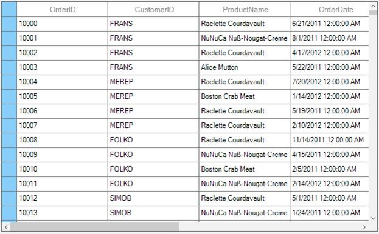
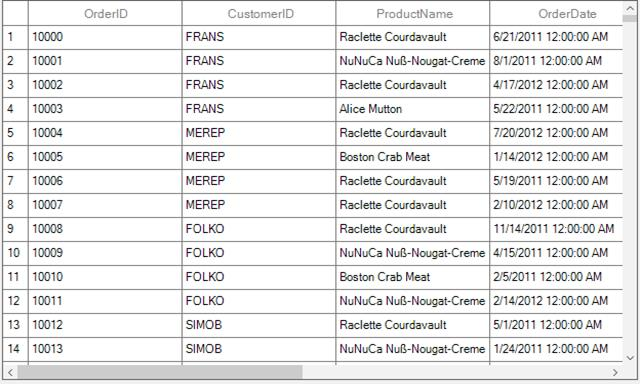
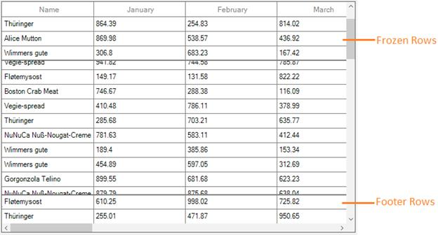
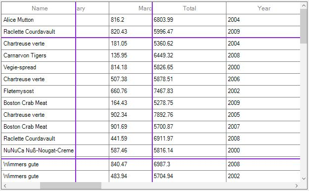
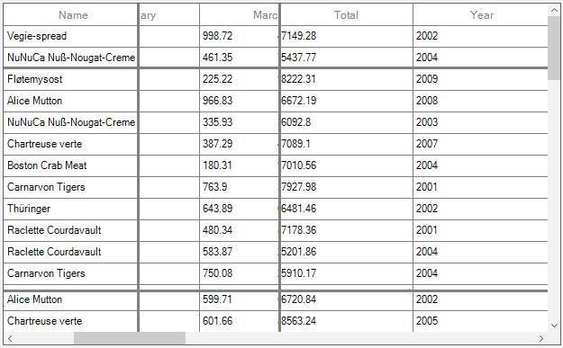
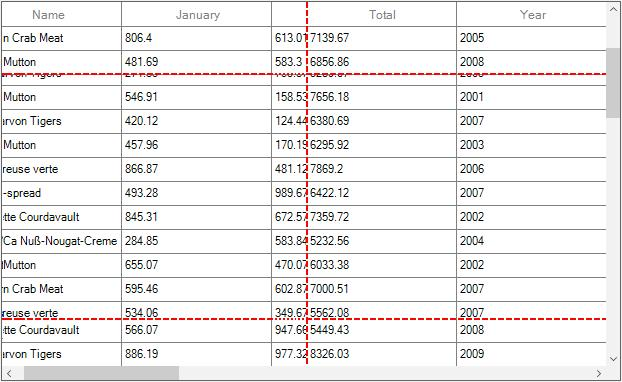
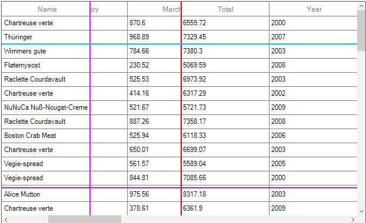

# Rows

## Row Header
RowHeader is a special column which is placed as first cell of each row. Row header can be shown or hidden by setting [ShowRowHeader](http://172.16.0.145:8093/Syncfusion.DataGrid.WinForms/api/Syncfusion.WinForms.DataGrid.SfDataGrid.html#Syncfusion_WinForms_DataGrid_SfDataGrid_ShowRowHeader) property.



this.sfDataGrid.ShowRowHeader = true;



### Appearance
The appearance of row header can be customized by setting the [RowHeaderStyle](http://172.16.0.145:8093/Syncfusion.DataGrid.WinForms/api/Syncfusion.WinForms.DataGrid.Styles.GridStyle.html#Syncfusion_WinForms_DataGrid_Styles_GridStyle_RowHeaderStyle) property. The **`RowHeaderStyle`** property contains all the settings that are needed for the row header appearance customization.



this.sfDataGrid.Style.RowHeaderStyle.BackColor = Color. LightSkyBlue;



### Showing the numbered row header
RowHeader cell can be customized by using [DrawCell](http://172.16.0.145:8093/Syncfusion.DataGrid.WinForms/api/Syncfusion.WinForms.DataGrid.SfDataGrid.html#Syncfusion_WinForms_DataGrid_SfDataGrid_DrawCell) event which is raised for each cell. The default column index of the row header cell is zero, you can apply style settings for a row header using column index when it is enabled in SfDataGrid. 
By default, the row header does not have the cell values. The numbers or any text can be set in the row header by setting the **`e.CellValue`** which is available in the [GridDrawCellEventArgs](http://172.16.0.145:8093/Syncfusion.DataGrid.WinForms/api/Syncfusion.WinForms.DataGrid.Styles.GridDrawCellEventArgs.html#constructors) of `DrawCell` event.



this.sfDataGrid.DrawCell += SfDataGrid_DrawCell;

private void SfDataGrid_DrawCell(object sender, GridDrawCellEventArgs e)
{
    if (sfDataGrid.ShowRowHeader && e.RowIndex != 0)
    {
        if (e.ColIndex == 0)
            e.CellValue = e.RowIndex.ToString();
    }
}



## Freeze Panes 
The rows and column can freeze in view like excel. You can freeze the rows and columns by setting following properties,

<table>
<tr>
<td>
Property Name
</td>
<td>
Description
</td>
</tr>
<tr>
<td>
{{'[FrozenRowsCount](http://172.16.0.145:8093/Syncfusion.DataGrid.WinForms/api/Syncfusion.WinForms.DataGrid.SfDataGrid.html#Syncfusion_WinForms_DataGrid_SfDataGrid_FrozenRowsCount"")'| markdownify }}
</td>
<td>
Set the frozen rows count at `top` of the SfDataGrid.
</td>
</tr>
<tr>
<td>
{{'[FooterRowsCount](http://172.16.0.145:8093/Syncfusion.DataGrid.WinForms/api/Syncfusion.WinForms.DataGrid.SfDataGrid.html#Syncfusion_WinForms_DataGrid_SfDataGrid_FooterRowsCount"")'| markdownify }}
</td>
<td>
Set the footer rows count at `bottom` of the SfDataGrid.
</td>
</tr>
<tr>
<td>
{{'[FrozenColumnCount](http://172.16.0.145:8093/Syncfusion.DataGrid.WinForms/api/Syncfusion.WinForms.DataGrid.SfDataGrid.html#Syncfusion_WinForms_DataGrid_SfDataGrid_FrozenColumnCount"")'| markdownify }}
</td>
<td>
Set the frozen columns count in `left side` of the SfDataGrid.
</td>
</tr>
<tr>
<td>
{{'[FooterColumnCount](http://172.16.0.145:8093/Syncfusion.DataGrid.WinForms/api/Syncfusion.WinForms.DataGrid.SfDataGrid.html#Syncfusion_WinForms_DataGrid_SfDataGrid_FooterColumnCount"")'| markdownify }}
</td>
<td>
Set the footer columns in `right side` of the SfDataGrid.
</td>
</tr>
</table>

### Freezing Rows
You can freeze the rows in view at top and bottom like Excel by setting the `FrozenRowsCount` and `FooterRowsCount` properties.



// Freeze rows at top
this.sfDataGrid.FrozenRowsCount = 3;

// Freeze rows at bottom
this.sfDataGrid.FooterRowsCount = 2;



### Appearance customization

#### Freeze line appearance
The appearance of freeze pane line can be customized by setting the [FreezePaneLineStyle](http://172.16.0.145:8093/Syncfusion.DataGrid.WinForms/api/Syncfusion.WinForms.DataGrid.Styles.GridStyle.html#Syncfusion_WinForms_DataGrid_Styles_GridStyle_FreezePaneLineStyle) property. The `FreezePaneLineStyle` property contains all the settings that are needed for the freeze pane line appearance customization.



this.sfDataGrid.Style.FreezePaneLineStyle.Color = System.Drawing.Color.BlueViolet;



#### Freeze line weight
Freeze line weight or thickness can be changed by setting the [`FreezePaneLineStyle.Weight](http://172.16.0.145:8093/Syncfusion.DataGrid.WinForms/api/Syncfusion.WinForms.DataGrid.Styles.FreezePaneLineStyleInfo.html#Syncfusion_WinForms_DataGrid_Styles_FreezePaneLineStyleInfo_Weight) property.


this.sfDataGrid.Style.FreezePaneLineStyle.Weight = 3;



#### Changing the freeze line style
An appearance of the freeze pane line can be customized by using [DrawFreezePaneLine](http://172.16.0.145:8093/Syncfusion.DataGrid.WinForms/api/Syncfusion.WinForms.DataGrid.SfDataGrid.html#Syncfusion_WinForms_DataGrid_SfDataGrid_DrawFreezePaneLine) event. You can check the freeze pane line type by using[LineType](http://172.16.0.145:8093/Syncfusion.DataGrid.WinForms/api/Syncfusion.WinForms.DataGrid.LineType.html#fields) property which indicates freeze pane line type such as `FrozenRow`, `FooterRow`, `FrozenColumn`, `FooterColumn`. The `e.Handled` property which is available in the [Draw​Freeze​Pane​Line​Args ](http://172.16.0.145:8093/Syncfusion.DataGrid.WinForms/api/Syncfusion.WinForms.DataGrid.Styles.DrawFreezePaneLineArgs.html#Syncfusion_WinForms_DataGrid_Styles_DrawFreezePaneLineArgs__ctor_System_Drawing_Graphics_System_Drawing_Point_System_Drawing_Point_Syncfusion_WinForms_DataGrid_LineType_System_Boolean_)should be enabled to draw the custom line.


this.sfDataGrid.DrawFreezePaneLine += SfDataGrid_DrawFreezePaneLine;

private void SfDataGrid_DrawFreezePaneLine(object sender, DrawFreezePaneLineArgs e)
{
    Pen pen=new Pen(Color.Red, 2);
    pen.DashStyle = DashStyle.Dash;

    if (e.LineType == LineType.FrozenRow || e.LineType == LineType.FooterRow || e.LineType == LineType.FooterColumn)
    {
        e.Graphics.DrawLine(pen, e.Point1, e.Point2);
        e.Handled = true;
    }
}



#### Changing the back color of freeze line based on freeze line LineType
By default, the back color of the freeze pane line cannot be changed based on the freeze pane line type. But it can be customized by drawing the line using the `DrawFreezePaneLine` event based on the freeze pane line type. The `e.Handled` property which is available in the `DrawFreezePane​Line​Args` should be enabled to draw the custom line.


this.sfDataGrid.DrawFreezePaneLine += SfDataGrid_DrawFreezePaneLine;

private void SfDataGrid_DrawFreezePaneLine(object sender, DrawFreezePaneLineArgs e)
{
    if (e.LineType == LineType.FrozenRow)
    {
        e.Graphics.DrawLine(new Pen(Color. DeepSkyBlue, 2), e.Point1, e.Point2);
        e.Handled = true;
    }
    if (e.LineType == LineType.FooterRow)
    {
        e.Graphics.DrawLine(new Pen(Color. BlueViolet, 2), e.Point1, e.Point2);
        e.Handled = true;
    }
    if (e.LineType == LineType.FrozenColumn)
    {
        e.Graphics.DrawLine(new Pen(Color.Magenta, 2), e.Point1, e.Point2);
        e.Handled = true;
    }
    if (e.LineType == LineType.FooterColumn)
    {
        e.Graphics.DrawLine(new Pen(Color.Red, 2), e.Point1, e.Point2);
        e.Handled = true;
    }
}



